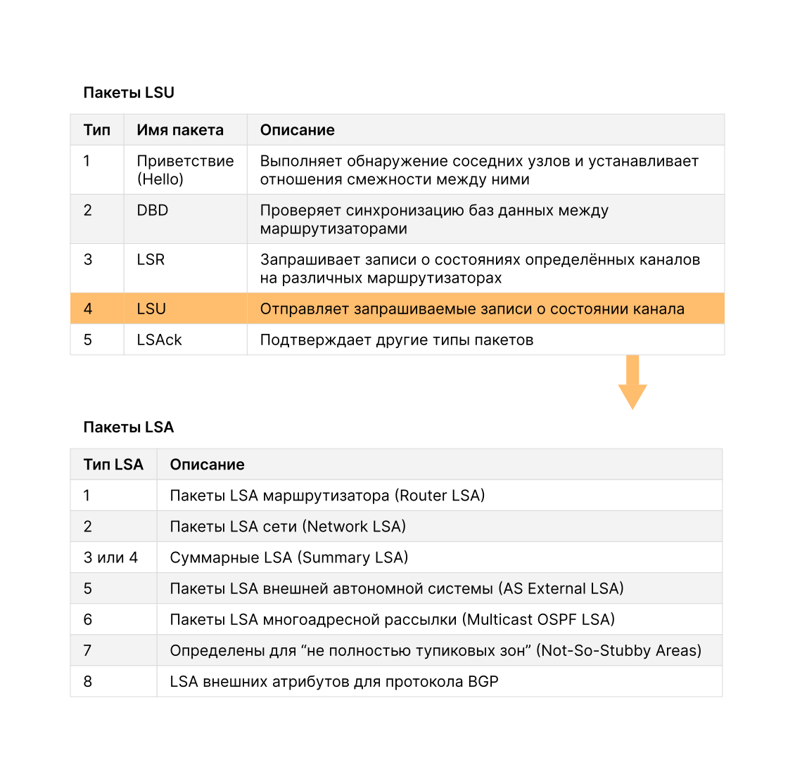
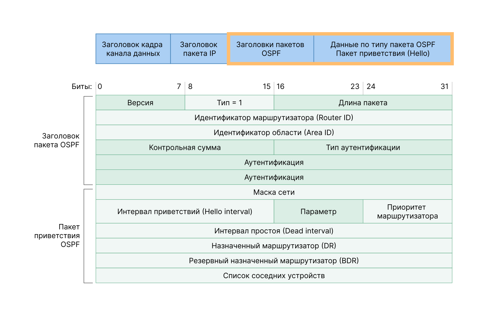

<!-- 1.2.1 -->
## Видео: пакеты OSPF

Нажмите «Воспроизвести» на рисунке, чтобы просмотреть видео о пакетах OSPF.

<!-- 1.2.2 -->
## Типы пакетов OSPF

**Пакеты состояния канала** — это инструменты, используемые OSPF для определения наиболее быстрого доступного маршрута для пакета. Протокол OSPF использует пакеты состояния канала для установления и поддержания отношений смежности и обмена обновлениями маршрутизации. Каждый тип пакета выполняет определённую задачу в процессе маршрутизации OSPF.

* **Тип 1: пакет приветствия (hello)** — используется для установления и поддержания отношений смежности с роутерами OSPF.
* **Тип 2: пакет описания базы данных (DBD)** — содержит сокращенный список базы данных состояний каналов отправляющего роутера. Используется принимающими рутерами для сверки с локальной базой данных о состоянии канала. Для построения точного дерева кратчайших путей SPF роуеры с маршрутизацией по состоянию канала в пределах области должны использовать идентичную базу данных состояний каналов.
* **Тип 3: пакет запроса состояния канала (LSR)** — принимающие роутеры могут запросить дополнительные данные о любой записи в DBD, отправив LSR.
* **Тип 4: пакет обновления состояния канала (LSU)** — используется для отправки отклика на LSR и объявления новых данных и содержат семь различных типов LSA.
* **Тип 5: пакет подтверждения состояния канала (LSAck)** — при получении LSU роутер отправляет LSAck для подтверждения приёма LSU. Поле данных LSAck является пустым.

В таблице показаны пять различных типов LSP, используемых в OSPFv2. OSPFv3 использует аналогичные типы пакетов.

| **Тип** | **Имя пакета** | **Описание** |
| --- | --- | --- |
| 1 | Приветствие | Выполняет обнаружение соседних узлов и устанавливает отношения смежности между ними |
| 2 | Дескриптор базы данных (DBD) | Проверяет синхронизацию баз данных между роутерами |
| 3 | Запрос состояния канала (LSR) | Запрашивает записи о состояниях определённых каналов на различных роутерах |
| 4 | Обновление состояния канала (LSU) | Отправляет запрашиваемые записи о состоянии канала |
| 5 | Подтверждение состояния канала (LSAck) | Подтверждает другие типы пакетов |

<!-- 1.2.3 -->
## Обновления состояния канала

Роутеры первоначально обмениваются пакетами типа 2 DBD, которые представляют собой сокращенный список LSDB отправляющего роутера. Он используется принимающими для сравнения с локальным LSDB.

LSR (пакет типа 3) используется принимающими роутерами для запроса дополнительных данных о записи в пакете DBD.

LSU (пакет типа 4) используется для отправки отклика на полученный пакет LSR.

LSAck (пакет типа 5) используется для подтверждения получения LSU типа 4.

Пакеты LSU также используются для пересылки обновлений маршрутизации OSPF, например данных об изменении канала. LSU может содержать 11 различных типов объявлений состояния канала (LSA) протокола OSPFv2, как показано на рисунке. Протокол OSPFv3 переименовал некоторые из этих пакетов и также содержит два дополнительных LSA.

**Примечание.** Разница между «LSU» и «LSA» не всегда очевидна, поскольку они нередко заменяют друг друга. Однако пакет LSU содержит один или несколько пакетов LSA.

**Пакеты LSU содержат пакеты LSA**

<!-- /courses/ensa-dl/ae8cded0-34fd-11eb-ba19-f1886492e0e4/aeb30470-34fd-11eb-ba19-f1886492e0e4/assets/c5809c10-1c46-11ea-af56-e368b99e9723.svg -->

* Пакет LSU может содержать один или несколько пакетов LSA.
* Пакеты LSA содержат сведения о маршруте для сетей назначения.

<!--
показывает, что OSPFv2 LSU может содержать один или несколько различных типов LSAs
-->

<!-- 1.2.4 -->
## Пакет приветствия

**Пакет протокола OSPF типа 1** — это пакет приветствия или hello-пакет, использующийся для выполнения следующих действий:

* обнаружение соседних устройств OSPF и установление отношений смежности с ними;
* объявление параметров, при которых два роутера обязаны установить отношения смежности;
* выбор выделенного роутера (DR) и резервного выделенного роутера (BDR) в сетях со множественным доступом (Ethernet и Frame Relay). Для каналов типа «точка-точка» наличие DR или BDR не требуется.

На рисунке показаны поля, содержащиеся в пакете приветствия OSPFv2 типа 1.

**Содержимое пакета приветствия OSPF**

<!-- /courses/ensa-dl/ae8cded0-34fd-11eb-ba19-f1886492e0e4/aeb30470-34fd-11eb-ba19-f1886492e0e4/assets/c5815f61-1c46-11ea-af56-e368b99e9723.svg -->

<!--
показывает диаграмму содержимой/полей пакета «Hello» OSPFv2
-->

<!-- 1.2.5 -->
<!-- quiz -->

