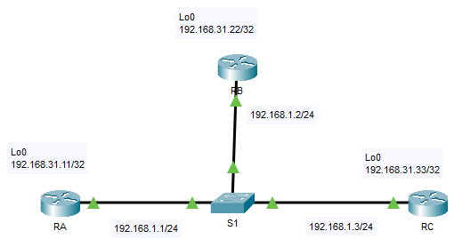

## Топология



## Таблица адресации

| Устройство | Интерфейс | IP-адрес      | Маска подсети   |
|------------|-----------|---------------|-----------------|
| RA         | G0/0      | 192.168.1.1   | 255.255.255.0   |
| RA         | Lo0       | 192.168.31.11 | 255.255.255.255 |
| RB         | G0/0      | 192.168.1.2   | 255.255.255.0   |
| RB         | Lo0       | 192.168.31.22 | 255.255.255.255 |
| RC         | G0/0      | 192.168.1.3   | 255.255.255.0   |
| RC         | Lo0       | 192.168.31.33 | 255.255.255.255 |

## Задачи

Часть 1. Изучение изменения ролей DR и BDR

Часть 2. Изменение приоритета OSPF и инициирование выбора

## Сценарий

В этом упражнении вы сможете изучить роли DR и BDR, а также проследить за изменением ролей при изменениях в сети. Затем вам предстоит изменить приоритет для контроля функций и инициировать новый выбор. Наконец, вам нужно будет проверить, выполняют ли маршрутизаторы свои функции.

## Инструкции

### Часть 1. Изучение процесса изменения ролей DR и BDR

**Шаг 1. Дождитесь, когда все желтые индикаторы канала загорятся зеленым.**

При первом открытии файла в Packet Tracer вы можете заметить, что индикаторы канала для коммутатора горят желтым цветом. Эти индикаторы канала должны гореть желтым цветом на протяжении 50 секунд, пока протокол STP на коммутаторе проверяет, не является ли один из маршрутизаторов еще одним коммутатором. Либо можно нажать **Fast Forward Time (Ускорить)**, чтобы пропустить этот процесс.

**Шаг 2. Проверьте текущие состояния соседних устройств OSPF.**

На каждом маршрутизаторе используйте соответствующую команду, чтобы просматривать текущие DR и BDR. Если маршрутизатор показывает FULL/DROTHER, это означает, что маршрутизатор не является DR или BDR.

```
RA# show ip ospf neighbor

Neighbor ID Pri State Dead Time Address Interface
192.168.31.33 2 FULL/DR 00:00:35 192.168.1.3 GigabitEthernet0/0
192.168.31.22 1 FULL/BDR 00:00:35 192.168.1.2 GigabitEthernet0/0

RB# show ip ospf neighbor

Neighbor ID Pri State Dead Time Address Interface
192.168.31.11 1 FULL/DROTHER 00:00:36 192.168.1.1 GigabitEthernet0/0
192.168.31.33 2 FULL/DR 00:00:36 192.168.1.3 GigabitEthernet0/0

RC# show ip ospf neighbor

Neighbor ID Pri State Dead Time Address Interface
192.168.31.11 1 FULL/DROTHER 00:00:39 192.168.1.1 GigabitEthernet0/0
192.168.31.22 1 FULL/BDR 00:00:38 192.168.1.2 GigabitEthernet0/0
```

Вопросы:

- ответьте на вопрос №1

- ответьте на вопрос №2

- ответьте на вопрос №3

**Шаг 3. Включите отладку отношений смежности OSPF IP.**

Вы можете отслеживать процесс выбора DR и BDR с помощью команды **debug**. На маршрутизаторах **RA** и **RB** введите следующую команду.

```
RA# debug ip ospf adj
RB# debug ip ospf adj
```

**Шаг 4. Отключите интерфейс Gigabit Ethernet 0/0 на маршрутизаторе RC.**

1.  Используйте команду **shutdown** , чтобы отключить связь между **RC** и коммутатором, чтобы вызвать изменение ролей.

2.  Подождите около 30 секунд, чтобы истекли таймеры простоя (dead) на маршрутизаторах **RA** и **RB**.

    - ответьте на вопрос №4

**Шаг 5. Восстановите интерфейс Gigabit Ethernet 0/0 на маршрутизаторе RC.**

1.  Снова включите канал между маршрутизатором **RC** и коммутатором.

2.  Дождитесь, когда будут выбраны новые DR и BDR.

    - ответьте на вопрос №5

3.  Проверьте назначения DR и BDR с помощью команды **show ip ospf neighbor** на маршрутизаторе **RC** .

    ```
    RC# show ip ospf neighbor

    Neighbor ID Pri State Dead Time Address Interface
    192.168.31.22 1 FULL/DR 00:00:34 192.168.1.2 GigabitEthernet0/0
    192.168.31.11 1 FULL/BDR 00:00:34 192.168.1.1 GigabitEthernet0/0
    ```

    Примечание. Если команда **show ip ospf neighbor** не возвращает RB в качестве DR и RA в качестве BDR, отключите отладку RA и RB с помощью команды undebug all и повторите шаги 4 и 5.

**Шаг 6. Отключите интерфейс Gigabit Ethernet 0/0 на RB.**

1.  Чтобы изменить роли устройств, отключите канал между маршрутизатором **RB** и коммутатором.

2.  Подождите около 30 секунд, чтобы истекли таймеры простоя (dead) на маршрутизаторах **RA** и **RС**.

    - ответьте на вопрос №6

**Шаг 7. Восстановите интерфейс Gigabit Ethernet 0/0 на маршрутизаторе RB.**

1.  Снова включите канал между маршрутизатором **RB** и коммутатором.

    - ответьте на вопрос №7

2.  Используйте команду **show ip ospf interface** на маршрутизаторе RC.

    - ответьте на вопрос №8

**Шаг 8. Отключите отладку.**

Чтобы отключить процесс отладки, введите команду **undebug all** на маршрутизаторах **RA** и **RB**.

### Часть 2. Изменение приоритета OSPF и инициирование выбора

**Шаг 1. Настройте приоритеты OSPF на каждом маршрутизаторе.**

1.  Чтобы изменить DR и BDR, используйте команду **ip ospf priority** для настройки порта GigabitEthernet 0/0 каждого маршрутизатора со следующими приоритетами интерфейса OSPF:

    -   **RA**: 200

    -   **RB**: 100

    -   **RC**: 1 (приоритет по умолчанию)

    ```
    RA(config)# interface g0/0
    RA(config-if)# ip ospf priority 200
    ```

2.  Установите приоритет на маршрутизаторах **RB** и **RC** .

**Шаг 2. Принудительные выборы путем сброса процесса OSPF на маршрутизаторах.**

Начиная с маршрутизатора **RA**, выполните **процесс clear ip ospf** на каждом маршрутизаторе, чтобы сбросить процесс OSPF.

**Шаг 3. Убедитесь, что выбор DR и BDR завершен успешно.**

Дождитесь схождения OSPF и окончания выбора DR и BDR. Это может занять несколько минут. Нажмите **Fast Forward Time (Ускорить)**, чтобы ускорить процесс.

- ответьте на вопрос №9

Примечание. Если маршрутизаторы не выбирают правильные DR и BDR после установки приоритетов OSPF, попробуйте перезапустить Packet Tracer.

[Скачать файл Packet Tracer для локального запуска](./assets/2.3.11-lab.pka)
