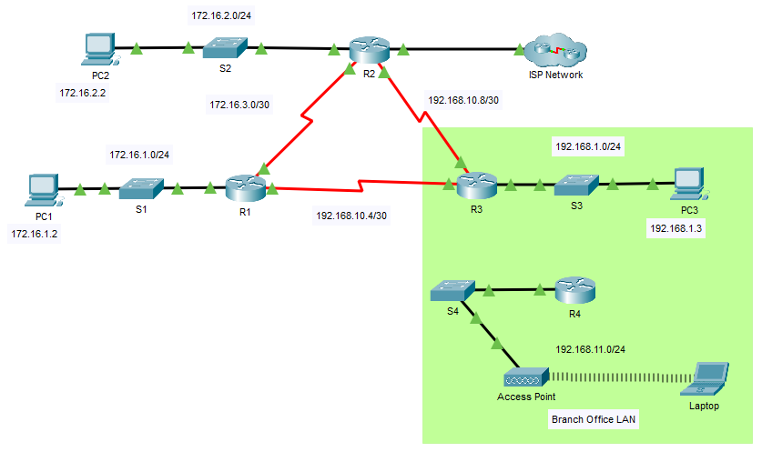

---

> **ВАЖНО**
> 
> Форма для ответов на вопросы будет доступна только при развертывании лабораторной работы 

---

## Топология



## Таблица адресации

| Устройство | Интерфейс | IP-адрес      | Маска подсети   | Шлюз по умолчанию |
|------------|-----------|---------------|-----------------|-------------------|
| R1         | G0/0      | 172.16.1.1    | 255.255.255.0   | —                 |
| R1         | G0/1      | 64.100.54.6   | 255.255.255.252 | —                 |
| R1         | S0/0/0    | 172.16.3.1    | 255.255.255.252 | —                 |
| R1         | S0/0/1    | 192.168.10.5  | 255.255.255.252 | —                 |
| R2         | G0/0      | 172.16.2.1    | 255.255.255.0   | —                 |
| R2         | S0/0/0    | 172.16.3.2    | 255.255.255.252 | —                 |
| R2         | S0/0/1    | 192.168.10.9  | 255.255.255.252 | —                 |
| R3         | G0/0      | 192.168.1.1   | 255.255.255.0   | —                 |
| R3         | G0/1      | 192.168.11.1  | 255.255.255.0   | —                 |
| R3         | S0/0/0    | 192.168.10.6  | 255.255.255.252 | —                 |
| R3         | S0/0/1    | 192.168.10.10 | 255.255.255.252 | —                 |
| R4         | G0/0/0    | 192.168.1.2   | 255.255.255.0   | —                 |
| R4         | G0/0/1    | 192.168.11.1  | 255.255.255.0   | —                 |
| ISP Router | NIC       | 64.100.54.5   | 255.255.255.252 | —                 |
| PC1        | NIC       | 172.16.1.2    | 255.255.255.0   | 172.16.1.1        |
| PC2        | NIC       | 172.16.2.2    | 255.255.255.0   | 172.16.2.1        |
| PC3        | NIC       | 192.168.1.2   | 255.255.255.0   | 192.168.1.1       |
| Laptop     | NIC       | DHCP          | DHCP            | DHCP              |

## Задачи

В этой лабораторной работе команды CLI будут использоваться для проверки работы существующей сети OSPFv2. Во второй части вам необходимо добавить новую локальную сеть в конфигурацию и провести подключение.

-   Определить и проверить состояния соседей OSPF.

-   Определить способ изучения маршрутов в сети.

-   Объяснить, как определяется состояние соседа.

-   Проверить параметры идентификатора процесса OSPF.

-   Добавить новую локальную сеть в существующую сеть OSPF и проверить подключение.

## Общие сведения и сценарий

Вы являетесь сетевым администратором филиала крупной организации. Ваш филиал добавляет новую беспроводную сеть в существующую локальную сеть филиала. Существующая сеть настроена на обмен маршрутами с помощью OSPFv2 в одной области. Ваша задача проверить работу существующей сети OSPFv2 перед добавлением в новую локальную сеть. Если вы уверены, что текущая локальная сеть OSPFv2 работает правильно, вы подключите новую локальную сеть и убедитесь, что маршруты OSPF распространяются для новой локальной сети. Как администратор сети филиалов, у вас есть полный доступ к IOS на устройствах R3 и R4. Доступ на чтение только к роутерам корпоративной локальной сети R1 и R2, используя имя пользователя **BranchAdmin** и пароль **Branch1234**.

## Инструкции

### Часть 1. Проверьте существующую сетевую функцию OSPFv2

Следующие команды помогут найти информацию, необходимую для ответа на вопросы:

```
show ip interface brief
show ip route
show ip route ospf
show ip ospf neighbor
show ip protocols
show ip ospf
show ip ospf interface
```

**Шаг 1. Проверьте функцию OSPFv2**

Дождитесь, пока STP сойдется в сети. Нажмите Fast Forward Time (Ускорить), чтобы ускорить процесс. Продолжайте до тех пор, пока все индикаторы связи не будут гореть зеленым.

1. Войдите в роутер **R1**, используя имя пользователя **BranchAdmin** и пароль **Branch1234**. Выполните команду **show ip route**.

    ```
    R1# show ip route
    --- output omitted ----

    Gateway of last resort is 172.16.3.2 to network 0.0.0.0

         172.16.0.0/16 is variably subnetted, 5 subnets, 3 masks
    C 172.16.1.0/24 is directly connected, GigabitEthernet0/0
    L 172.16.1.1/32 is directly connected, GigabitEthernet0/0
    O 172.16.2.0/24 [110/65] via 172.16.3.2, 00:02:18, Serial0/0/0
    C 172.16.3.0/30 is directly connected, Serial0/0/0
    L 172.16.3.1/32 is directly connected, Serial0/0/0
    O 192.168.1.0/24 [110/65] via 192.168.10.6, 00:02:18, Serial0/0/1
         192.168.10.0/24 is variably subnetted, 3 subnets, 2 masks
    C 192.168.10.4/30 is directly connected, Serial0/0/1
    L 192.168.10.5/32 is directly connected, Serial0/0/1
    O 192.168.10.8/30 [110/128] via 172.16.3.2, 00:02:18, Serial0/0/0
                            [110/128] via 192.168.10.6, 00:02:18, Serial0/0/1
    O*E2 0.0.0.0/0 [110/1] via 172.16.3.2, 00:02:18, Serial0/0/0
    ```

    Ответьте на следующие вопросы:

    - вопрос №1

    - вопрос №2

    - вопрос №3

2. Выполните команду **show ip ospf neighbor** на **R1**.

    Ответьте на следующие вопросы:

    - вопрос №4

    - вопрос №5

    - вопрос №6

3. Используя командную строку на **PC1**, выполните команду ping по адресу **ISP роутера**, показанному в таблице адресов. Успешно? Если нет, выполните команду **clear ospf process** на роутерах и повторите команду ping.

**Шаг 2. Проверьте функцию OSPFv2 на R2**

1. Войдите в **R2**, используя имя пользователя **BranchAdmin** и пароль **Branch1234**. Выполните команду **show ip route**. Убедитесь, что маршруты ко всем сетям в топологии показаны в таблице маршрутизации.

    - Ответьте на вопрос №7

2. Введите **интерфейс show ip ospf g0/0** на **R2**.

    Ответьте на следующие вопросы:

    - вопрос №8

    - вопрос №9

3. Используя командную строку на **PC2**, выполните эхо-запрос по адресу S0/0/1 на **R3**.

**Шаг 3. Проверьте функцию OSPFv2 на R2**

1. Выполните команду **show ip protocols** на **R3**.

    - Ответьте на вопрос №10

2. Выполните команду **show ip ospf neighbor detail** на **R3**.

    - Ответьте на вопрос №11

3. Используя командную строку на **PC3**, выполните команду ping по адресу **ISP роутера**, показанному в таблице адресов.

### Часть 2. Добавьте новую локальную сеть филиала в сеть OSPFv2

Теперь вы добавите предварительно настроенную локальную сеть филиала в сеть OSPFv2.

**Шаг 1. Проверьте конфигурацию OSPFv2 на устройстве R4**

Выполнить команду **show run \| begin router ospf** на **R4**. Убедитесь, что сетевые инструкции присутствуют для сетей, настроенных на роутере.

- Ответьте на вопрос №12

**Шаг 2. Подключите роутер R4 филиала к сети OSPFv2**

1.  Используя правильный кабель Ethernet, подключите интерфейс G0/0/0 роутера **R4** к интерфейсу G0/1 коммутатора **S3**. Используйте команду **show ip ospf neighbor** для проверки установления **R4** отношений смежности с соседнии **R3**.

    - Ответьте на вопрос №13

2.  С помощью команды **show ip ospf neighbor** на **R3** определите состояние **R4**. При конвергенции OSPF может возникнуть задержка.

    - Ответьте на вопрос №14

3.  Используя командную строку на ноутбуке, выполните эхо-запрос PC2.

<!-- [Скачать файл Packet Tracer для локального запуска](./assets/2.6.6-lab.pka) -->
