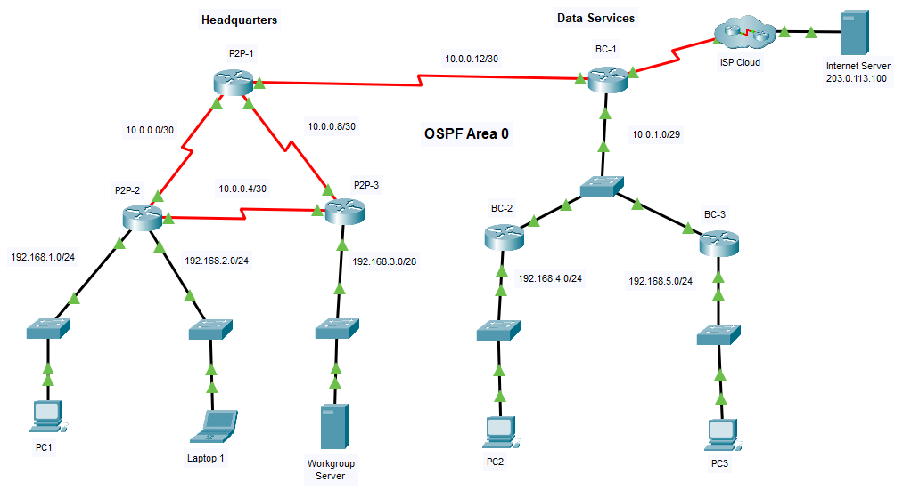

---

> **ВАЖНО**
> 
> Форма для ответов на вопросы будет доступна только при развертывании лабораторной работы 

---

## Топология

## Таблица адресации

| Устройство       | Интерфейс | IP адрес/префикс |
|------------------|-----------|------------------|
| P2P-1            | S0/1/0    | 10.0.0.1/30      |
| P2P-1            | S0/1/1    | 10.0.0.9/30      |
| P2P-1            | S0/2/0    | 10.0.0.13/30     |
| P2P-2            | S0/1/0    | 10.0.0.2/30      |
| P2P-2            | S0/1/1    | 10.0.0.5/30      |
| P2P-2            | G0/0/0    | 192.168.1.1/24   |
| P2P-2            | G0/0/1    | 192.168.2.1/24   |
| P2P-3            | S0/1/0    | 10.0.0.6/30      |
| P2P-3            | S0/1/1    | 10.0.0.10/30     |
| P2P-3            | G0/0/0    | 192.168.3.1/28   |
| BC-1             | S0/1/0    | 10.0.0.14/30     |
| BC-1             | S0/1/1    | 64.0.100.2/30    |
| BC-1             | G0/0/0    | 10.0.1.1/29      |
| BC-2             | G0/0/0    | 192.168.4.1/30   |
| BC-2             | G0/0/1    | 10.0.1.2/29      |
| BC-3             | G0/0/0    | 192.168.5.1/24   |
| BC-3             | G0/0/1    | 10.0.1.3/29      |
| Internet Server  | NIC       | 203.0.113.100/24 |
| PC 1             | NIC       | 192.168.1.10/24  |
| Laptop 1         | NIC       | 192.168.2.20/24  |
| Workgroup Server | NIC       | 192.168.3.14/28  |
| PC 2             | NIC       | 192.168.4.40/24  |
| PC 3             | NIC       | 192.168.5.50/24  |

## Цели

Реализовать OSPF для одной области в сетях типа «точка-точка» и широковещательных сетях с мультидоступом.

## Общие сведения

Вы помогаете сетевому инженеру протестировать настроенный OSPF, создав сеть в лаборатории, где работаете. Вы подключили устройства и настроили интерфейсы, а также выполнили подключение к локальным сетям. Ваша задача состоит в том, чтобы выполнить конфигурацию OSPF в соответствии с требованиями, составленными инженером.

Используйте предоставленную информацию и список требований для настройки тестовой сети. Когда задача будет успешно выполнена, все хосты должны иметь возможность выполнить эхо-запрос на интернет-сервер.

## Инструкции

Настройте сеть в соответсвтии с требованиями

## Требования

Используйте код процесса 10 для активации OSPF на всех роутерах.

- Активируйте OSPF с помощью операторов сети и обратных масок на роутерах в сети штаб-квартиры.

- Активируйте OSPF, настраивая интерфейсы сетевых устройств в сети Data Service, где это необходимо.

- Настройте идентификаторы на сетевых устройствахах с множественным доступом следующим образом:

    - BC-1: 6.6.6.6;

    - BC-2: 5.5.5.5;

    - BC-3: 4.4.4.4.

- Настройте OSPF таким образом, чтобы обновления маршрутизации не отправлялись в сети, где они не требуются.

- Настройте BC-1 с наивысшим приоритетом интерфейса OSPF так, чтобы он всегда был назначенным роутером сети с множественным доступом.

- Настройте маршрут по умолчанию к облаку поставщика услуг Интернета с помощью аргумента исходящего интерефейса.

- Автоматически раздайте маршрут по умолчанию для всех устройств в сети.

- Настройте роутеры OSPF таким образом, чтобы стоимость интерфейса Gigabit Ethernet составила 10, а стоимость Fast Ethernet — 100.

- Настройте значение затрат OSPF для интерфейса P2P-1 Serial0/1/1 на 50.

- Настройте значения таймера приветствия и dead time на интерфейсах, которые подключают P2P-1 и BC-1, чтобы в два раза превышали значения по умолчанию.

<!-- [Скачать файл Packet Tracer для локального запуска](./assets/2.7.1-lab.pka) -->
