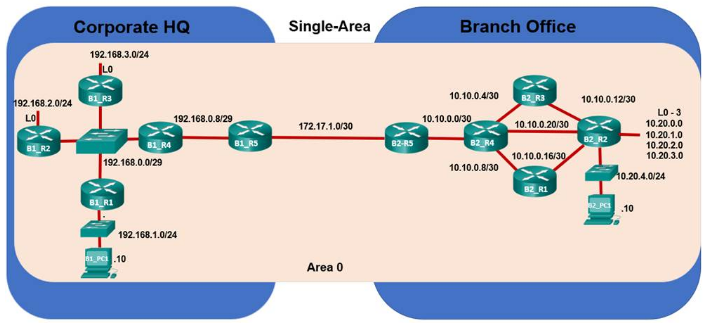

## Топология



## Задачи

Часть 1: Оценка работы сети OSPF для нескольких областей

Часть 2: Оценка работы сети OSPF для нескольких областей

Часть 3. Настройка новой области и подключение к **Area 0** через Интернет

## Общие сведения и сценарий

**Часть 1: Начало**

Компания Casual Recording Company, базирующаяся в Сан-Паулу, Бразилия, предоставляет мини-студии звукозаписи самообслуживания по всему городу, так что любой может арендовать время и записывать свои песни самостоятельно. CRC начал с сети OSPF для одной области, расположенной в одном здании. Эта идея была очень популярна, и, как следствие, бизнес вырос, в результате чего компания расширилась и превратилась в филиал во втором здании в дальнем конце города. Они продолжали использовать OSPF с одной областью. Вы можете оценить влияние на расширение сети.

**Часть 2: Бизнес процветает**

ИТ-отдел CRC решил перейти на сеть OSPF для нескольких областей. Вы оцените влияние и выгоды, полученные от изменения, чтобы определить, было ли это правильным решением.

**Часть 3: Расширение CRC продолжается**

CRC продолжает расти и откроет новый филиал в Монтевидео, Уругвай. Вы настроите пограничный маршрутизатор области (ABR) для новой области и физически подключите сеть филиала к корпоративной сети штаб-квартиры через Интернет.

## Инструкции

### Часть 1. Оценка работы сети OSPF для нескольких областей

В этой части CRC расширилась до второго места в Сан-Паулу и в настоящее время использует маршрутизацию OSPF для одной области.

**Шаг 1. Изучите OSPF в штаб-квартире корпорации.**

1.  Нажмите на значок города для **Сан-Паулу**. Обратите внимание, что есть два здания, соединенные оптоволоконным каналом.

2.  Нажмите на **Corporate HQ** и затем на иконку **rack** которая представляет собой **Sao Paulo HQ Office Wiring Closet**.

3.  Нажмите на **B1_R4** и затем выбирете вкладку **CLI**.

4.  Терминал должен показать, что G0/0/0 и G0/0/1 подняты и что четыре смежности были установлены, как показано ниже. Если нет, дождитесь завершения процесса загрузки OSPF.

    ```
    <output omitted>
    Press RETURN to get started!


    %LINEPROTO-5-UPDOWN: Line protocol on Interface GigabitEthernet0/0/0, changed state to up
    %LINEPROTO-5-UPDOWN: Line protocol on Interface GigabitEthernet0/0/1, changed state to up
    23:00:45: %OSPF-5-ADJCHG: Process 1, Nbr 172.17.1.1 on GigabitEthernet0/0/1 from LOADING to FULL, Loading Done
    23:00:45: %OSPF-5-ADJCHG: Process 1, Nbr 192.168.2.1 on GigabitEthernet0/0/0 from LOADING to FULL, Loading Done
    23:00:45: %OSPF-5-ADJCHG: Process 1, Nbr 192.168.1.1 on GigabitEthernet0/0/0 from LOADING to FULL, Loading Done
    23:00:45: %OSPF-5-ADJCHG: Process 1, Nbr 192.168.3.1 on GigabitEthernet0/0/0 from LOADING to FULL, Loading Done


    B1_R4>
    ```

5.  Проверьте вывод команды **show ip route**. Обратите внимание на размер таблицы маршрутизации и маршруты, полученные через OSPF от маршрутизаторов в филиале в Сан-Паулу.

6.  На B1_R4 выполните команду **show ip ospf** .

    Вопросы:

    Запишите количество раз, когда алгоритм SPF был выполнен.

    **Введите ваш ответ здесь.**

    Сколько областей отображается на маршрутизаторе B1_R4?

    **Введите ваш ответ здесь.**

7.  Держите окно консоли для B1_R4 открытым. Нажмите на **B1_R2** и затем выбирете вкладку **CLI**. Выполните те же две команды.

    Для команды **show ip route** сравните выводом на B1_R2 с выходными данными B1_R4. Обратите внимание, что таблица маршрутизации B1_R2, за исключением локальных и подключенных маршрутов, изучила те же маршруты через OSPF, что и B1_R4.

    Вопрос: Запишите количество раз, когда алгоритм SPF был выполнен.

    **Введите ваш ответ здесь.**

**Шаг 2. Изучите OSPF в Branch Office.**

1.  Держите окна консоли открытыми для обоих маршрутизаторов **B1_R2** и **B1_R4**.

2.  На синей панели инструментов в верхней части дважды нажмите кнопку **Back level**, чтобы вернуться к виду города **Сан-Паулу**. Вы также можете использовать сочетания клавиш **Alt+клавиши со стрелкой влево**.

3.  Нажмите на **Branch Office** и затем на иконку **rack** которая представляет собой **Sao Paulo Branch Office Wiring Closet**.

4.  Нажмите на **B1_R3** и затем выбирете вкладку **CLI**.

5.  Терминал должен показать, что интерфейсы G1/0 и G2/0 активны и что две смежности были установлены, как показано ниже.

    ```
    <output omitted>
    Press RETURN to get started!


    %LINK-5-CHANGED: Interface GigabitEthernet1/0, changed state to up
    %LINEPROTO-5-UPDOWN: Line protocol on Interface GigabitEthernet1/0, changed state to up
    %LINK-5-CHANGED: Interface GigabitEthernet2/0, changed state to up
    %LINEPROTO-5-UPDOWN: Line protocol on Interface GigabitEthernet2/0, changed state to up
    23:00:40: %OSPF-5-ADJCHG: Process 1, Nbr 2.2.2.2 on GigabitEthernet2/0 from LOADING to FULL, Loading Done
    23:00:45: %OSPF-5-ADJCHG: Process 1, Nbr 4.4.4.4 on GigabitEthernet1/0 from LOADING to FULL, Loading Done


    B2_R3>
    ```

6.  Выполните команду **show ip route**. Сравните выходные данные B2_R3 с выходом B1_R4 или B1_R2. Обратите внимание, что, кроме нескольких подключенных или локальных маршрутов, отображаются одни и те же сети.

7.  На B2_R3 выполните команду **show ip ospf** .

    Вопросы:

    Запишите количество раз, когда алгоритм SPF был выполнен.

    **Введите ваш ответ здесь.**

    Сколько областей отображается на маршрутизаторе B2_R3?

    **Введите ваш ответ здесь.**

8.  Держите окно консоли открытым. Нажмите на **B2_R1** и затем выбирете вкладку **CLI**. Выход должен быть похож на выход B2_R3.

9.  На B2_R1 перейдите на вкладку **Физического** режима и выключите устройство, чтобы имитировать отключение питания. Сети 10.10.0.8/30 и 10.10.0.16/36 больше не будут объявляться.

10. Выполните команды **show ip route** и **show ip ospf** на одном маршрутизаторе в филиале и одном маршрутизаторе в головном офисе.

    Вопрос: Отсутствуют ли две сети в обеих таблицах маршрутизации и увеличены ли счетсики выполнение алгоритма SPF?

    **Введите ваш ответ здесь.**

    **Примечание.** Каждый маршрутизатор в обоих зданиях был вынужден выполнять дополнительные алгоритмы SPF. Поскольку все маршрутизаторы находятся в одной области, каждое изменение топологии приведет к выполнению OSPF алгоритма SPF на каждом маршрутизаторе. Это не проблема для небольших сетей, но для больших сетей чрезмерные вычисления SPF могут повлиять на производительность сети. Решение состоит в том, чтобы разделить топологию OSPF на несколько областей. Изменения топологии в одной области не вызывают пересчет SPF в других областях.

Вы завершили **Часть 1: Оценка работы сети OSPF для нескольких областей**.

Чтобы перейти к части 2: оценка работы сети OSPF с несколькими областями, закройте этот файл Packet Tracer. Вернитесь к онлайн-курсу и откройте файл Изучение OSPF для нескольких областей - режим симуляции физического оборудования (Часть 2).

[Скачать файл Packet Tracer для локального запуска](./assets/2.7.3.1-lab.pka)