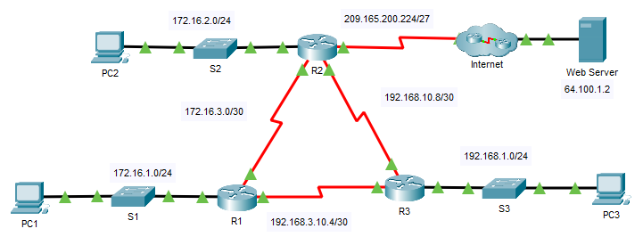

## Топология



## Таблица адресации

| Устройство | Интерфейс | IPv4-адрес      | Маска подсети   | Шлюз по умолчанию |
|------------|-----------|-----------------|-----------------|-------------------|
| R1         | G0/0      | 172.16.1.1      | 255.255.255.0   | —                 |
| R1         | S0/0/0    | 172.16.3.1      | 255.255.255.252 | —                 |
| R1         | S0/0/1    | 192.168.10.5    | 255.255.255.252 | —                 |
| R2         | G0/0      | 172.16.2.1      | 255.255.255.0   | —                 |
| R2         | S0/0/0    | 172.16.3.2      | 255.255.255.252 | —                 |
| R2         | S0/0/1    | 192.168.10.9    | 255.255.255.252 | —                 |
| R2         | S0/1/0    | 209.165.200.225 | 255.255.255.224 | —                 |
| R3         | G0/0      | 192.168.1.1     | 255.255.255.0   | —                 |
| R3         | S0/0/0    | 192.168.10.6    | 255.255.255.252 | —                 |
| R3         | S0/0/1    | 192.168.10.10   | 255.255.255.252 | —                 |
| PC1        | NIC       | 172.16.1.2      | 255.255.255.0   | 172.16.1.1        |
| PC2        | NIC       | 172.16.2.2      | 255.255.255.0   | 172.16.2.1        |
| PC3        | NIC       | 192.168.1.2     | 255.255.255.0   | 192.168.1.1       |
| Веб-сервер | NIC       | 64.100.1.2      | 255.255.255.0   | 64.100.1.1        |

## Цели

Часть 1. Распространение маршрута по умолчанию

Часть 2. Проверка связи

## Общие сведения

В этом упражнении потребуется настроить маршрут по умолчанию IPv4 в Интернет и распространить этот маршрут по умолчанию на другие маршрутизаторы OSPF. Затем понадобится проверить, что маршрут по умолчанию содержится в находящихся ниже таблицах маршрутизации и узлы могут получить доступ к веб-серверу в Интернете.

## Инструкции

### Часть 1. Распространение маршрута по умолчанию

**Шаг 1. Проверьте подключение к веб-серверу.**

1.  С PC1, PC2 и PC3 попытайтесь выполнить эхо-запрос IP-адреса веб-сервера, 64.100.1.2.

    Вопросы:

    Успешно ли выполнен эхо-запрос?

    **Введите ваш ответ здесь.**

    Какое сообщение вы получили и какое устройство выдало сообщение?

    **Введите ваш ответ здесь.**

2.  Проверьте таблицы маршрутизации на маршрутизаторах R1, R2 и R3.

    Вопрос: Какой оператор присутствует в таблицах маршрутизации, который указывает на то, что эхо-запрос на веб-сервер завершится неудачей?

    **Введите ваш ответ здесь.**

**Шаг 2. Настройте маршрут по умолчанию для маршрутизатора R2.**

На маршрутизаторе **R2** настройте маршрут по умолчанию с прямым подключением к Интернету.

```
R2(config)# ip route 0.0.0.0 0.0.0.0 Serial0/1/0
```

**Примечание.** Маршрутизатор выдаст предупреждение о том, что если этот интерфейс не является соединением точка-точка, это может повлиять на производительность. Это предупреждение можно игнорировать, так как это соединение «точка-точка».

**Шаг 3. Распространите маршрут в OSPF.**

Настройте OSPF для распространения маршрута по умолчанию в обновлениях маршрутизации OSPF.

```
R2(config)# router ospf 1
R2(config-router)# default-information originate
```

**Шаг 4. Изучите таблицы маршрутизации на маршрутизаторах R1 и R3.**

Изучите таблицы маршрутизации на **R1** и **R3** для проверки успешного распространения маршрута.

```
R1> show ip route
<output omitted>
Gateway of last resort is 172.16.3.2 to network 0.0.0.0
<output omitted>
O*E2 0.0.0.0/0 [110/1] via 172.16.3.2, 0:00:08, Serial0/0/0
!-------------------
R3> show ip route
<output omitted>
Gateway of last resort is 192.168.10.9 to network 0.0.0.0
<output omitted>
O*E2 0.0.0.0/0 [110/1] via 192.168.10.9, 0:08:15, Serial0/0/1
```

### Часть 2. Проверка подключения

Убедитесь, что узлы **PC1**, **PC2** и **PC3** могут успешно отправлять эхо-запросы на веб-сервер.

[Скачать файл Packet Tracer для локального запуска](./assets/2.5.3-packet-tracer---propagate-a-default-route-in-ospfv2_ru-RU.pka)
