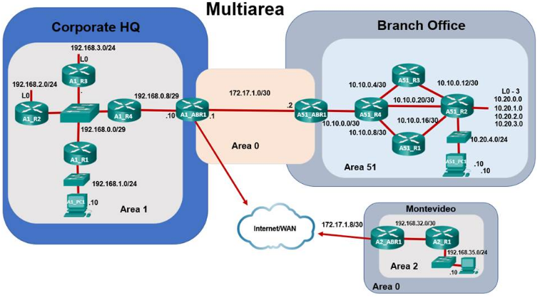

## Топология



## Задачи

Часть 1: Оценка работы сети OSPF для одной области

Часть 2: Оценка работы сети OSPF для нескольких областей

Часть 3. Настройка новой области и подключение к **Area 0** через Интернет

## Общие сведения и сценарий

**Часть 1: Начало**

Компания Casual Recording Company, базирующаяся в Сан-Паулу, Бразилия, предоставляет мини-студии звукозаписи самообслуживания по всему городу, так что любой может арендовать время и записывать свои песни самостоятельно. CRC начал с сети OSPF для одной области, расположенной в одном здании. Эта идея была очень популярна, и, как следствие, бизнес вырос, в результате чего компания расширилась и превратилась в филиал во втором здании в дальнем конце города. Они продолжали использовать OSPF с одной областью. Вы можете оценить влияние на расширение сети.

**Часть 2: Бизнес процветает**

ИТ-отдел CRC решил перейти на сеть OSPF для нескольких областей. Вы оцените влияние и выгоды, полученные от изменения, чтобы определить, было ли это правильным решением.

**Часть 3: Расширение CRC продолжается**

CRC продолжает расти и откроет новый филиал в Монтевидео, Уругвай. Вы настроите пограничный маршрутизатор области (ABR) для новой области и физически подключите сеть филиала к корпоративной сети штаб-квартиры через Интернет.

## Инструкции

### Часть 1. Настройка новой области и подключение к области **Area 0** через Интернет

В этой части CRC все еще расширяется и решил открыть еще один офис в Монтевидео, Уругвай. Интернет-связь между Сан-Паулу и Монтевидео представляет собой подводный кабель. Для получения дополнительной информации найдите в Интернете фотографии «волоконные связи между Сан-Паулу и Монтевидео».

**Шаг 1. Завершите физическую прокладку кабелей, чтобы подключить Area 0 к Area 2.**

1.  Теперь вы должны увидеть значок для **Montevideo**. Если нет, настройте полосы прокрутки так, чтобы вы могли видеть оба города и **Internet/WAN**.

2.  Нажмите на **Connections** в поле **Bottom Toolbar**, а затем нажмите на кабель **Fiber cable**. Нажмите на **Sao Paulo** и выберите **Corporate Headquarters** \> **HQ Wiring Closet** \> **Rack** \> **A1_ABR1** \> **GigabitEthernet2/0**. Затем нажмите на **Internet/WAN** \> **Internet/WAN Wiring Closet** \> **Rack** \> **WAN_R1** \> **GigabitEthernet1/0**.

3.  Выберите другой оптоволоконный кабель на панели инструментов и, используя ту же процедуру, что и выше, нажмите на **Internet/WAN** \> **Internet/WAN Wiring Closet** \> **Rack** \> **WAN_R2** \> **GigabitEthernet1/0**. Затем нажмите на **Montevideo** \> **Montevideo Branch Office** \> **Montevideo Branch Office Wiring Closet** \> **Rack** \> **A2_ABR1** \> **GigabitEthernet0/0**.

**Шаг 2. Настройте OSPF на маршрутизаторе A2_ABR1.**

A2_ABR1 уже настроен, за исключением протокола OSPF. На этом шаге вы настроите маршрутизатор как маршрутизатор границы области, соединяющий Area 2 с остальной частью сети.

1.  Нажмите **Montevideo**, чтобы войти в вид города. Обратите внимание, что есть здание **Branch Office** с оптоволоконным кабелем , который вы только что проложили.

2.  Нажмите на **Branch Office**, а затем на иконку **rack icon** которая представляет собой **Branch Office Wiring Closet**.

3.  Нажмите кнопку**A2_ABR1**, а затем выберите вкладку **CLI** .

4.  Включите OSPF на маршрутизаторе **A2_ABR1** и установите идентификатор маршрутизатора 172.17.1.10

    ```
    A2_ABR1(config)# router ospf 1
    A2_ABR1(config-router)# router-id 172.17.1.10
    ```

5.  Настройте сеть 192.168.32.0/32 так, чтобы она была в Area 2, а сеть 172.17.1.8/32 — в Area 0

    ```
    A2_ABR1(config-router)# network 192.168.32.0 0.0.0.3 area 2
    A2_ABR1(config-router)# network 172.17.1.8 0.0.0.3 area 0
    ```

6.  Настройте суммирование адресов на маршрутизаторе A2_ABR1 таким образом, чтобы он объявлял суммарную сеть 192.168.32.0/19 в области Area 0.

    ```
    A2_ABR1(config-router)# area 2 range 192.168.32.0 255.255.224.0
    ```

    **Примечание**: Задание должно быть выполнено на 100%. Если нет, обратитесь к предыдущим командам и исправьте все ошибки, прежде чем перейти к следующему шагу.

**Шаг 3. Просмотрите суммарные маршруты области Area 2 в областях Area 1 и Area 51.**

Для быстрого перехода к стойкам в Сан-Паулу можно использовать панель навигации **Navigation Panel (Shift+N)** на синей панели инструментов в верхней части.

1.  Перейдите к **Sao Paulo HQ Wiring Closet**. Нажмите на **A1_ABR1** и затем выбирете вкладку **CLI**. Выполните команду **show ip route**. Маршрут между областями до сети 192.168.32.0/19 должен появиться в таблице маршрутизации:

    ```
    O IA 192.168.32.0/19 [110/7] via 192.168.0.4, 02:54:00, GigabitEthernet0/0/0
    ```

2.  Перейдите к **Sao Paulo Branch Office Wiring Closet**. Нажмите кнопку**A2_ABR1**, а затем выберите вкладку **CLI** . Выполните команду **show ip route**. Маршрут между областями до сети 192.168.32.0/19 должен появиться в таблице маршрутизации:

    ```
    O IA 192.168.32.0/19 [110/8] via 10.10.0.21, 02:57:38, GigabitEthernet2/0
    ```

**Шаг 4. Проверка связи между областями Area 51 и Area 1 до области Area 2.**

1.  Выберите вкладку **A51_PC1** \> **Desktop** tab \> **Command Prompt**, а затем запустите эхо-запрос до A2_PC1.

    ```
    C:\> ping 192.168.35.10

    Pinging 192.168.20.10 with 32 bytes of data:

    Request timed out.
    Reply from 192.168.35.10: bytes=32 time<1ms TTL=120
    Reply from 192.168.35.10: bytes=32 time<1ms TTL=120
    Reply from 192.168.35.10: bytes=32 time<1ms TTL=120
    ```

2.  Перейдите к **Sao Paulo HQ Wiring Closet**. Выберите вкладку **A1_PC1** \> **Desktop** tab \> **Command Prompt**, а затем запустите эхо-запрос до A2_PC1.

Для получения ответов может потребоваться некоторое время.

    ```
    C:\> ping 192.168.35.10

    Pinging 192.168.20.10 with 32 bytes of data:

    Reply from 192.168.35.10: bytes=32 time\<1ms TTL=121
    Reply from 192.168.35.10: bytes=32 time\<1ms TTL=121
    Reply from 192.168.35.10: bytes=32 time=3ms TTL=121
    Reply from 192.168.35.10: bytes=32 time\<1ms TTL=121
    ```

## Вопрос для повторения

Каковы преимущества использования OSPF для нескольких областей в крупной многопользовательской компании?

**Введите ваш ответ здесь.**

[Скачать файл Packet Tracer для локального запуска](./assets/2.7.3-packet-tracer---multiarea-ospf-exploration---physical-mode--part-3-_ru-RU.pka)