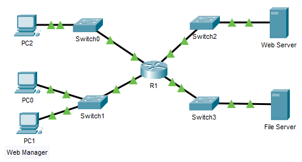

## Топология



## Таблица адресации

| Устройство  | Интерфейс | IP-адрес        | Маска подсети | Шлюз по умолчанию |
|-------------|-----------|-----------------|---------------|-------------------|
| R1          | F0/0      | 192.168.10.1    | 255.255.255.0 | —                 |
| R1          | F0/1      | 192.168.20.1    | 255.255.255.0 | —                 |
| R1          | E0/0/0    | 192.168.100.1   | 255.255.255.0 | —                 |
| R1          | E0/1/0    | 192.168.200.1   | 255.255.255.0 | —                 |
| File Server | NIC       | 192.168.200.100 | 255.255.255.0 | 192.168.200.1     |
| File Server | NIC       | 192.168.100.100 | 255.255.255.0 | 192.168.100.1     |
| PC0         | NIC       | 192.168.20.3    | 255.255.255.0 | 192.168.20.1      |
| PC1         | NIC       | 192.168.20.4    | 255.255.255.0 | 192.168.20.1      |
| PC2         | NIC       | 192.168.10.3    | 255.255.255.0 | 192.168.10.1      |

## Задачи

Часть 1. Настройка и применение стандартного именованного списка контроля доступа

Часть 2. Проверка реализации списка контроля доступа

## Общие сведения/сценарий

Старший сетевой администратор попросил вас создать стандартный именованный список контроля доступа (ACL) для запрета доступа к файловому серверу. Файловый сервер содержит базу данных для веб-приложений. Доступ к файловому серверу требуется только рабочая станция Web Manager PC1 и веб-сервер. Весь остальной трафик файлового сервера должен быть отклонен.

## Инструкции

### Часть 1. Настройка и применение стандартного именованного списка контроля доступа

**Шаг 1. Проверьте подключение перед настройкой и применением ACL-списка.**

Проверка связи всех трех рабочих станций c **Web Server** и **File Server** с помощью утилиты ping должна выполняться успешно.

**Шаг 2. Настройте стандартный именованный ACL-список.**

1.  Настройте следующий именованный ACL-список на маршрутизаторе **R1**.

    ```
    R1(config)# ip access-list standard File_Server_Restrictions
    R1(config-std-nacl)# permit host 192.168.20.4
    R1 (config-std-nacl) # permit host 192.168.100.100
    R1(config-std-nacl)# deny any
    ```

    Примечание. Для целей оценки имя ACL чувствительно к регистру, и инструкции должны быть в том же порядке, как показано на рисунке.

2.  Используйте команду **show access-lists** для проверки содержимого списка доступа перед его применением к интерфейсу. Убедитесь, что вы не ввели неправильные IP-адреса и что инструкции находятся в правильном порядке.

    ```
    R1# show access-lists
    Standard IP access list File_Server_Restrictions
    10 permit host 192.168.20.4
    20 permit host 192.168.100.100
    30 deny any
    ```

**Шаг 3. Примените именованный ACL-список.**

1.  Примените ACL-список к исходящему трафику на интерфейсе Fast Ethernet 0/1.

    Примечание. В реальной операционной сети применение списка доступа к активному интерфейсу не является хорошей практикой, и его следует избегать, если это возможно.

    ```
    R1(config-if)# ip access-group File_Server_Restrictions out
    ```

2.  Сохраните конфигурацию.

### Часть 2. Проверка реализации списка контроля доступа

**Шаг 1. Проверьте конфигурацию ACL-списка и его размещение на интерфейсе.**

Для проверки конфигурации списка контроля доступа используйте команду **show access-lists**. Используйте команду **show run** или **show ip interface fastethernet 0/1**, чтобы проверить правильность применения ACL-списка на интерфейсе.

**Шаг 2. Поверьте работоспособность ACL-списка.**

Все три рабочие станции должны осуществлять эхо-запросы к **веб-серверу**, но только компьютер **PC1** должен осуществлять эхо-запросы к **веб-серверу** и к **файловому серверу**. Повторите команду **show access-lists**, чтобы увидеть количество пакетов, соответствующих каждой инструкции.

[Скачать файл Packet Tracer для локального запуска](./assets/5.1.9-lab.pka)
