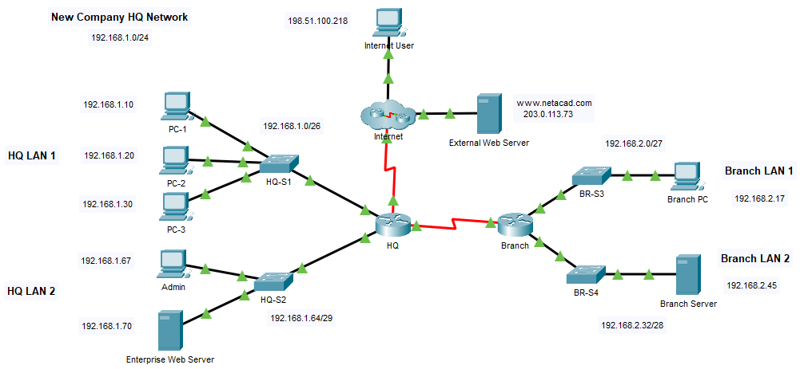

---

> **ВАЖНО**
> 
> Форма для ответов на вопросы будет доступна только при развертывании лабораторной работы 

---

## Топология

## Таблица адресации

| Устройство            | Интерфейс | IP-адрес          |
|-----------------------|-----------|-------------------|
| Филиал                | G0/0/0    | 192.168.1.1/26    |
| Филиал                | G0/0/1    | 192.168.1.65/29   |
| Филиал                | S0/1/0    | 192.0.2.1/30      |
| Филиал                | S0/1/1    | 192.168.3.1/30    |
| Головной офис         | G0/0/0    | 192.168.2.1/27    |
| Головной офис         | G0/0/1    | 192.168.2.33/28   |
| Головной офис         | S0/1/1    | 192.168.3.2/30    |
| PC-1                  | NIC       | 192.168.1.10/26   |
| PC-2                  | NIC       | 192.168.1.20/26   |
| PC-3                  | NIC       | 192.168.1.30/26   |
| Администратор         | NIC       | 192.168.1.67/29   |
| Enterprise Web Server | NIC       | 192.168.1.70/29   |
| Branch PC             | NIC       | 192.168.2.17/27   |
| Branch Server         | NIC       | 192.168.2.45/28   |
| Internet User         | NIC       | 198.51.100.218/24 |
| Внешний веб-сервер    | NIC       | 203.0.113.73/24   |

## Цели

-   Настройте маршрутизатор со стандартными именованными ACL.

-   Настройте маршрутизатор с расширенными именованными ACL.

-   Настройте маршрутизатор с расширенными ACL в соответствии с конкретными требованиями.

-   Настройте ACL для управления доступом к линиям терминалов сетевого устройства.

-   Настройте соответствующие интерфейсы маршрутизатора с ACL в соответствующем направлении.

-   Проверьте работу настроенных списков ACL.

## Общие сведения и сценарий

В этом задании будут настроены расширенные, стандартныеименованные и расширенные именованные списки ACL в соответствии с указанными требованиями к связи.

## Инструкции

**Шаг 1. Проверка возможности подключения в новой корпоративной сети**

Прежде чемнастраивать списки ACL, проверьте подключение к сети в том виде, в каком она есть. Все хосты должны иметь возможность выполнить пинг до всех остальных узлов.

**Шаг 2. Настройка стандартных и расширенных списков ACL в соответствии с требованиями.**

Настройте ACL для соответствия следующим требованиям.

**Важные руководящие принципы:**

-   **Не** используйте неявную инструкцию deny any в конце списков ACL.

-   Используйте сокращения (**host** и **any**), когда это возможно.

-   Напишите инструкции ACL, чтобы соответствовать требованиям в том порядке, в котором они указаны здесь.

-   Поместите списки ACL в наиболее эффективном месте и направлении.

**Требования ACL 1**

-   Создайте ACL **101**.

-   Явно заблокируйте доступ FTP к Enterprise Web Server из Интернета.

-   Никакой трафик ICMP из Интернета не должен быть разрешен любым хостам в сети LAN 1 HQ

-   Разрешить весь другой трафик.

**Требования ACL 2**

-   Использовать ACL номер **111**

-   Ни один хост-сервер в локальной сети 1 не должен иметь доступа к серверу филиалов.

-   Все остальные видытрафика должны быть разрешены.

**ACL 3: Требования**

-   Создайте стандартный именованный список контроля доступа. Используйте имя **vty_block**. Имя ACL должно точно совпадать с этим именем.

-   Только адреса из сети HQ LAN 2 должны иметь доступ к линиям VTY маршрутизатора HQ.

**ACL 4: Требования**

-   Создайте именованный расширенный ACL с именем **branch_to_hq**. Имя ACL должно точно совпадать с этим именем.

-   Ни в одной из сетей филиалов не должен быть разрешен доступ к сети HQ LAN 1. Используйте одну инструкциюсписка доступа для из каждой сети Branch LAN .

-   Весь остальной трафик должен быть разрешен.

**Шаг 3. Проверка операции ACL.**

1.  Выполните следующие тесты на связность между устройствами втопологии. Обратите внимание, успешны ли они.

    **Примечание.** Используйте команду **show ip access-lists** для проверки работы ACL. Используйте команду clear access list counters для сброса **счетчиков соответствия.**

    Вопросы

    - ответьте на вопрос №1

    - ответьте на вопрос №2

    - ответьте на вопрос №3

    - ответьте на вопрос №4

    - ответьте на вопрос №5

    - ответьте на вопрос №6

2.  Проверьте подключения к внутреннему серверу из Интернета.

    Вопросы:

    - ответьте на вопрос №7

    - ответьте на вопрос №8

    - ответьте на вопрос №9

[Скачать файл Packet Tracer для локального запуска](./assets/5.5.1-lab.pka)
