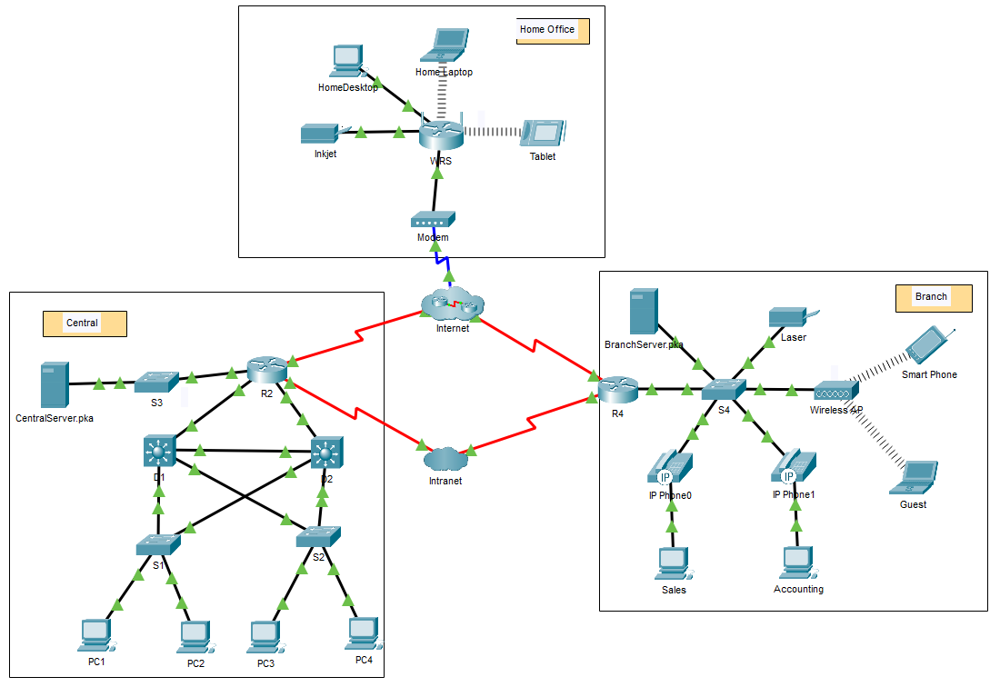

---

> **ВАЖНО**
> 
> Форма для ответов на вопросы будет доступна только при развертывании лабораторной работы 

---

## Топология



## Таблица адресации

В следующей таблице приведена адресация только для интерфейсов сетевых устройств.

| Устройство | Интерфейс | IP-адрес и префикс |
|------------|-----------|--------------------|
| R2         | G0/0      | 10.255.255.245/30  |
| R2         | G0/1      | 10.255.255.249/30  |
| R2         | G0/2      | 10.10.10.1/24      |
| R2         | S0/0/0    | 64.100.100.2/27    |
| R2         | S0/0/1.1  | 64.100.200.2/30    |
| R4         | G0/0      | 172.16.0.1/24      |
| R4         | S0/0/0    | 64.100.150.1/30    |
| R4         | S0/0/1.1  | 64.100.200.1/30    |
| WRS        | LAN       | 192.168.0.1/24     |
| WRS        | Internet  | 64.104.223.2/30    |

## Задачи

Часть 1. Изучите работу NAT во внутренней сети

Часть 2. Изучите работу NAT в сети Интернет

Часть 3. Дополнительные исследования

## Сценарий

При передаче кадра по сети MAC-адреса могут меняться. IP-адреса также могут меняться при перенаправлении пакета устройством, настроенным для использования NAT. В рамках данного задания мы изучим изменения IP-адресов во время процесса NAT.

## Инструкции

### Часть 1. Изучение работы NAT во внутренней сети (интранет)

**Шаг 1. Дождитесь, когда сеть сойдётся.**

Схождение всех служб в сети может занять несколько минут. Процесс можно ускорить, нажав кнопку Fast Forward Time (Ускорить время).

**Шаг 2. С любого ПК в центральном домене (Central) создайте запрос HTTP.**

1.  Перейдите в режим симуляции (**Simulation**) и измените фильтры, чтобы отображались только запросы HTTP.

2.  Откройте веб-браузер любого ПК в **центральном** домене, введите URL-адрес **http: //branchserver.pka** и нажмите **«Перейти».** Сверните окно браузера.

3.  Нажимайте кнопку **Capture/Forward** (Захват/Далее) до тех пор, пока PDU не окажется над **D1** или **D2**. Нажмите на последний PDU в списке событий. Запишите IP-адреса источника и назначения.

    Вопрос: Каким устройствам принадлежат эти адреса?

    **Введите ваш ответ здесь.**

4.  Нажимайте **Capture/Forward** (Захват/Далее) до тех пор, пока PDU не окажется над маршрутизатором **R2**. Запишите IP-адреса источника и назначения в исходящем пакете.

    Вопрос: Каким устройствам принадлежат эти адреса?

    **Введите ваш ответ здесь.**

5.  Войдите в R2 из интерфейса командной строки, используя **class** пароля для входа в привилегированный EXEC и выполните следующую команду:

    ```
    R2# show run | include pool
    ip nat pool R2Pool 64.100.100.3 64.100.100.31 netmask 255.255.255.224
    ip nat inside source list 1 pool R2Pool
    ```

    Адрес поступил из пула NAT **R2Pool**.

6.  Нажимайте **Capture/Forward** (Захват/Далее) до тех пор, пока PDU не окажется над маршрутизатором **R4**. Запишите IP-адреса источника и назначения в исходящем пакете.

    Вопрос: Каким устройствам принадлежат эти адреса?

    **Введите ваш ответ здесь.**

7.  Нажимайте **Capture/Forward** (Захват/Далее) до тех пор, пока PDU не окажется над **Branchserver.pka**. Запишите адреса портов TCP источника и назначения в исходящем сегменте.

    **Введите ваш ответ здесь.**

8.  На обоих маршрутизаторах **R2** и **R4** выполните следующую команду и сопоставьте записанные выше IP-адреса и порты соответствующей строке результата:

    ```
    R2# show ip nat translations
    R4# show ip nat translations
    ```

    Вопросы:

    Что общего между внутренними локальными IP-адресами?

    **Введите ваш ответ здесь.**

    Передаются ли по внутренней сети частные адреса?

    **Введите ваш ответ здесь.**

9.  Нажмите Reset Simulation и оставайтесь в Simulation Model.

### Часть 2. Изучение работы NAT в Интернете

**Шаг 1. С любого ПК из домашнего офиса (Home Office) создайте запрос HTTP.**

1.  Откройте веб-браузер любого компьютера в домене **Home Office** и введите URL-адрес **http://centralserver.pka** и нажмите кнопку **Перейти** .

2.  Нажимайте кнопку Capture/Forward (Захват/Далее) до тех пор, пока PDU не окажется над WRS. Запишите IP-адреса источника и назначения для входящих и исходящих пакетов.

    Вопрос: Каким устройствам принадлежат эти адреса?

    **Введите ваш ответ здесь.**

3.  Нажимайте **Capture/Forward** (Захват/Далее) до тех пор, пока PDU не окажется над маршрутизатором **R2**. Запишите IP-адреса источника и назначения в исходящем пакете.

    Вопрос: Каким устройствам принадлежат эти адреса?

    **Введите ваш ответ здесь.**

4.  На маршрутизаторе **R2** выполните следующую команду и сопоставьте записанные выше IP-адреса и порты соответствующей строке результата:

    ```
    R2# show ip nat translations
    ```

5.  Вернитесь в режим реального времени (Realtime).

    Вопрос: Все ли веб-страницы отображаются в браузерах?

    **Введите ваш ответ здесь.**

### Часть 3. Дополнительное изучение

Поэкспериментируйте с большим количеством пакетов, как HTTP, так и HTTPS и ответьте на следующие вопросы..

Вопросы:

Увеличиваются ли таблицы преобразований NAT?

**Введите ваш ответ здесь.**

Имеется ли в NAT пул адресов NAT?

**Введите ваш ответ здесь.**

Таким ли способом компьютеры в учебной аудитории подключаются к Интернету?

**Введите ваш ответ здесь.**

Почему преобразование NAT использует четыре столбца адресов и портов?

**Введите ваш ответ здесь.**

Где сети находятся внутри глобальных и внутри локальных?

**Введите ваш ответ здесь.**

На каких устройствах работают службы NAT? Что у них общего?

**Введите ваш ответ здесь.**

[Скачать файл Packet Tracer для локального запуска](./assets/6.2.7-lab.pka)
