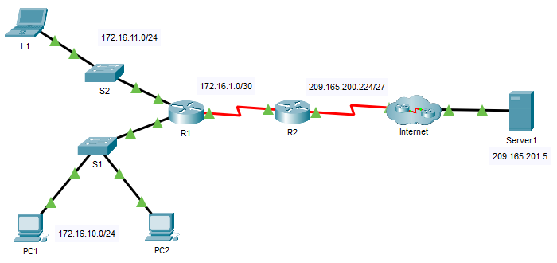

---

> **ВАЖНО**
> 
> Форма для ответов на вопросы будет доступна только при развертывании лабораторной работы 

---

## Топология



## Цели

Часть 1. Настроить динамическое преобразование NAT

Часть 2. Проверить реализацию NAT

## Инструкции

### Часть 1. Настройка динамического NAT

**Шаг 1. Настройте трафик, который будет разрешен**

На роутере **R2** настройте одно правило для ACL-списка 1, разрешающее любой адрес, принадлежащий подсети 172.16.0.0/16.

**Шаг 2. Настройте пул адресов для NAT**

Настройте **R2**, определяя пул NAT, использующий два адреса из адресного пространства 209.165.200.228/30.

Обратите внимание, что в топологии имеется 3 сетевых адреса, которые должны преобразовываться согласно созданному ACL-списку.

- Ответьте на вопрос №1

**Шаг 3. Соотнесите список ACL 1 и пул NAT**

Введите команду, связывающую ACL 1 с только что созданным пулом NAT.

**Шаг 4. Настройте интерфейсы NAT**

Настройте интерфейсы **R2** с помощью соответствующих внутренних и внешних команд NAT.

### Часть 2. Проверка реализации NAT

**Шаг 1. Осуществите доступ к сервисам через Интернет**

Из веб-браузера узла **L1**, **PC1** или **PC2** осуществите доступ к веб-странице сервера **Server1**.

**Шаг 2. Просмотрите преобразования NAT**

Просмотрите преобразования NAT на роутере **R2**. Определите внутренний адрес источника ПК и переведенный адрес из пула NAT в выходных данных команды.

```
R2# show ip nat translations
```

<!-- [Скачать файл Packet Tracer для локального запуска](./assets/6.5.6-lab.pka) -->
