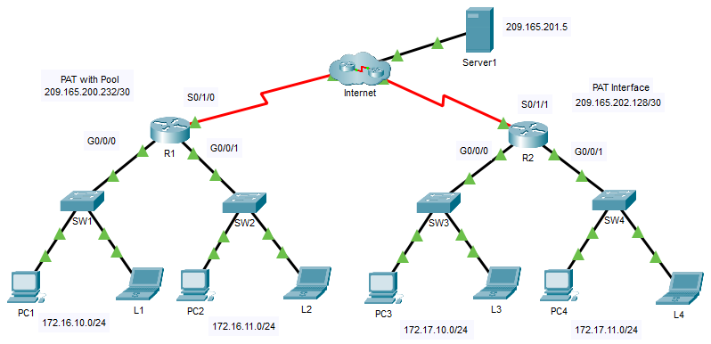

---

> **ВАЖНО**
> 
> Форма для ответов на вопросы будет доступна только при развертывании лабораторной работы 

---

## Топология



## Задачи

Часть 1. Настроить динамический NAT с перегрузкой

Часть 2. Проверить динамический NAT с реализацией перегрузки

Часть 3. Настроить PAT с помощью интерфейса

Часть 4. Проверить реализацию NAT

### Часть 1. Настройка динамического NAT с перегрузкой

**Шаг 1. Настройте трафик, который будет разрешен**

На **R1** настройте одно правило для ACL-списка 1, разрешающее любой адрес, принадлежащий подсети 172.16.0.0/16.

```
R1(config)# access-list 1 permit 172.16.0.0 0.0.255.255
```

**Шаг 2. Настройте пул адресов для NAT**

Настройте **R1** с пулом NAT, который использует два используемых адреса в адресном пространстве 209.165.200.232/30.

```
R1(config)# ip nat pool ANY_POOL_NAME 209.165.200.233 209.165.200.234 netmask 255.255.255.252
```

**Шаг 3. Свяжите ACL 1 с пулом NAT и разрешите повторно использовать адреса**

```
R1(config)# ip nat inside source list 1 pool ANY_POOL_NAME overload
```

**Шаг 4. Настройте интерфейсы NAT**

Настройте интерфейсы **R1** с помощью соответствующих внутренних и внешних команд NAT.

```
R1(config)# interface s0/1/0
R1(config-if)# ip nat outside
R1 (config-if) # interface g0/0/0
R1(config-if)# ip nat inside
R1 (config-if) # interface g0/0/1
R1(config-if)# ip nat inside
```

### Часть 2. Проверка динамического NAT с реализацией перегрузки

**Шаг 1. Осуществите доступ к сервисам через Интернет**

Из веб-браузера каждого компьютера, использующего **R1** в качестве шлюза (**PC1**, **L1**, **PC2** и **L2**), откройте веб-страницу **Server1**.

- Ответьте на вопрос №1

**Шаг 2. Просмотрите преобразования NAT**

Просмотрите преобразования NAT на **R1**.

```
R1# show ip nat translations
```

Обратите внимание, что все четыре устройства могли общаться, и они используют только один адрес из пула. PAT будет продолжать использовать тот же адрес до тех пор, пока не закончится количество портов, которые будут связаны с преобразованием. После этого будет использоваться следующий адрес в пуле. Хотя теоретический предел составит 65 536, так как поле номера порта имеет 16-битный номер, у устройства, скорее всего, закончится нехватка памяти до достижения этого предела.

### Часть 3. Настройка PAT с помощью интерфейса

**Шаг 1. Настройте трафик, который будет разрешён**

На **R2** настройте одно правило для ACL-списка 1, разрешающее любой адрес, принадлежащий подсети 172.17.0.0/16.

**Шаг 2. Свяжите ACL 2 с интерфейсом NAT и разрешите повторно использовать адреса**

Введите инструкцию **R2** NAT, чтобы использовать интерфейс, подключенный к Интернету, и предоставить переводы для всех внутренних устройств.

```
R2(config)# ip nat inside source list 2 interface s0/1/1 overload
```

**Шаг 3. Настройте интерфейсы NAT**

Настройте интерфейсы **R2** с помощью соответствующих внутренних и внешних команд NAT.

### Часть 4. Проверка реализации интерфейса PAT

**Шаг 1. Осуществите доступ к сервисам через Интернет**

Из веб-браузера каждого компьютера, использующего **R2** в качестве шлюза (**PC3**, **L3**, **PC4** и **L4**), откройте страницу **сервера Server1**.

- Ответьте на вопрос №2

**Шаг 2. Просмотрите преобразования NAT**

Просмотрите преобразования NAT на **R2**.

**Шаг 3. Сравните статистику NAT на R1 и R2**

Сравните статистику NAT на двух устройствах.

- Ответьте на вопрос №3

[Скачать файл Packet Tracer для локального запуска](./assets/6.6.7-lab.pka)
