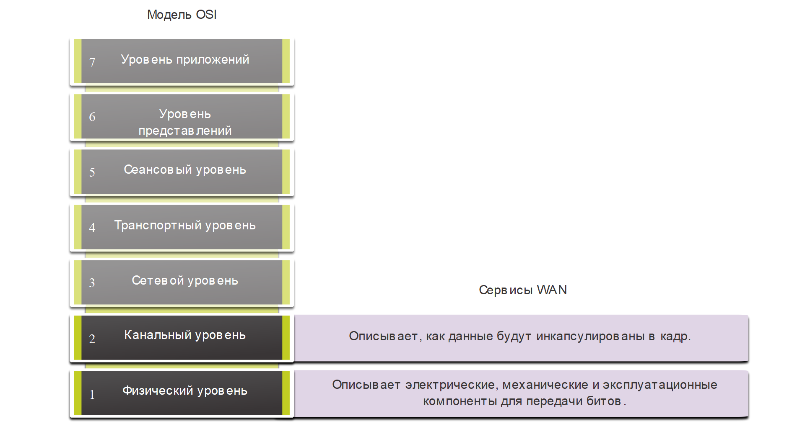
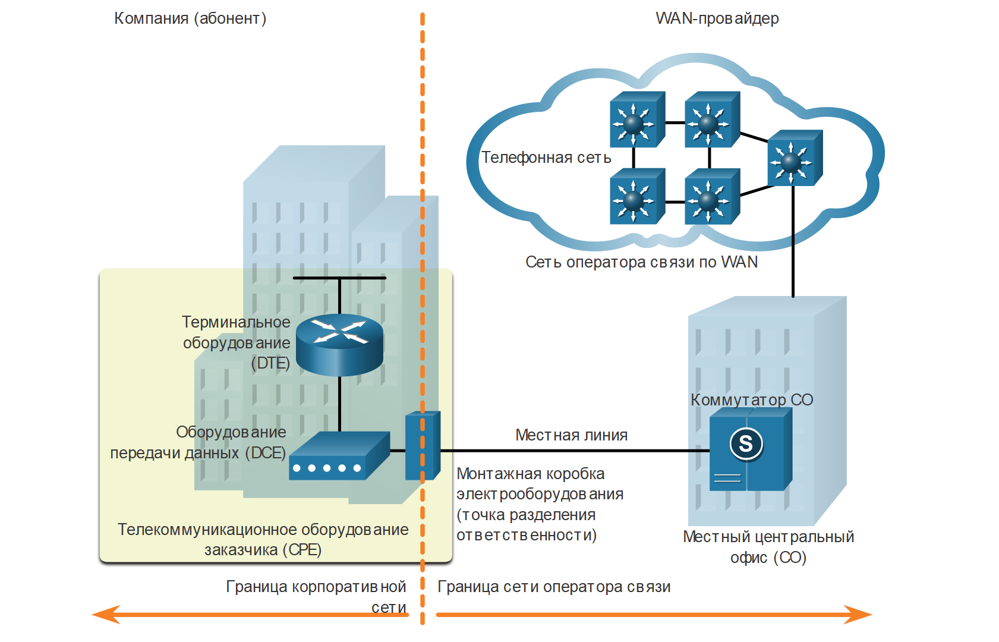
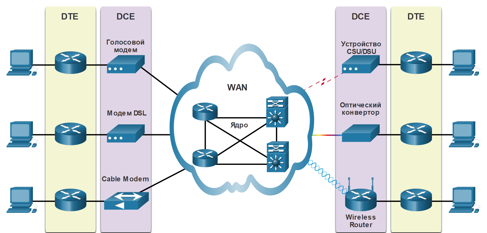
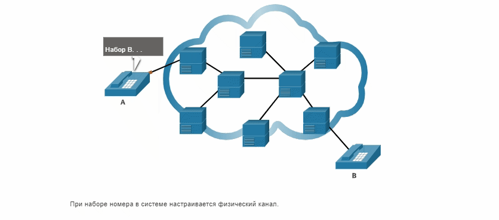
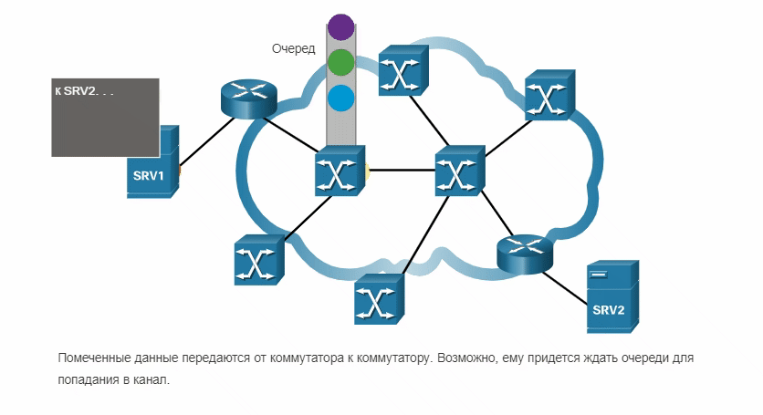
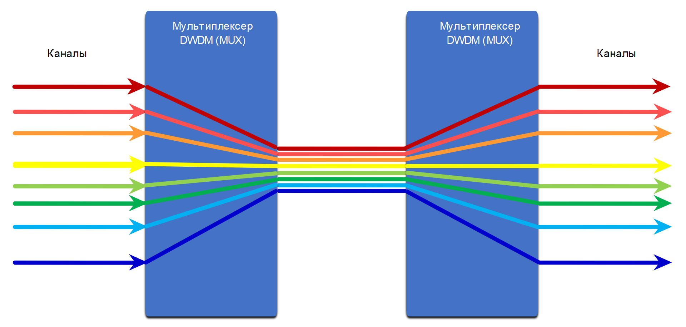

<!-- 7.2.1 -->
## Стандарты WAN

Теперь, когда вы понимаете, насколько важны WAN для больших сетей, в этом разделе рассматривается, как они работают. Концепция глобальной сети существует уже много лет. Считаем, что телеграфная система была первой крупномасштабной WAN, за которой следовали радио, телефонная система, телевидение, а теперь сети передачи данных. Многие технологии и стандарты, разработанные для этих WAN, использовались в качестве основы для сетевых WAN.

Стандарты доступа WAN разрабатываются и контролируются рядом авторитетных организаций:

* **TIA/EIA**  (Ассоциация телекоммуникационной отрасли и Альянс отраслей электронной промышленности)
* **ISO**  (Международная организация по стандартизации)
* **IEEE**  (Институт инженеров по электротехнике и электронике)

<!-- 7.2.2 -->
## Глобальные сети в модели OSI

Большинство стандартов глобальной сети сосредоточены на физическом уровне (OSI Layer 1) и уровне канала данных (OSI Layer 2), как показано на рисунке.

<!-- /courses/ensa-dl/ae8e8c88-34fd-11eb-ba19-f1886492e0e4/aeb57576-34fd-11eb-ba19-f1886492e0e4/assets/c64f0fa2-1c46-11ea-af56-e368b99e9723.svg -->

<!--
На рисунке показана модель OSI с выделенными уровнями, связанными с технологиями WAN, физическим уровнем и канальным уровнем. Канальный уровень данных Описывает, как данные будут инкапсулированы в кадр. Физический уровень Описывает электрические, механические и эксплуатационные компоненты для передачи битов.
-->

**Протоколы уровня 1**

Протоколы уровня 1 описывают электрические, механические и эксплуатационные компоненты, необходимые для передачи битов по глобальной сети. Например, поставщики услуг обычно используют широкополосные оптоволоконные носители для охвата больших расстояний (то есть дальних расстояний), используя следующие стандарты протокола оптоволокна уровня 1:

* Синхронная цифровая иерархия (SDH)
* Синхронная оптическая сеть (SONET)
* Технология спектрального уплотнения каналов (DWDM)

SDH и SONET по существу предоставляют одни и те же услуги, и их пропускная способность может быть увеличена с помощью технологии DWDM.

**Протоколы уровня 2**

Протоколы уровня 2 обеспечивают инкапсуляцию данных.

За эти годы были разработаны несколько протоколов уровня 2, в том числе следующие:

* Широкополосные (например, DSL и кабель)
* Беспроводное подключение
* Ethernet WAN (Метро Ethernet)
* MPLS
* Протокол «точка-точка» (PPP) (редко используемый)
* Высокоуровневый протокол управления каналом (HDLC) (редко используемый)
* Протокол Frame Relay (устаревший)
* Асинхронный способ передачи данных (ATM) (устаревший)

<!-- 7.2.3 -->
## Общепринятая терминология глобальных сетей

Физический уровень глобальной сети описывает физические подключения между сетью компании и сетью оператора связи.

Существуют определенные термины, используемые для описания WAN соединений между абонентом (т.е. компанией/клиентом) и поставщиком услуг WAN, как показано на рисунке.

<!-- /courses/ensa-dl/ae8e8c88-34fd-11eb-ba19-f1886492e0e4/aeb57576-34fd-11eb-ba19-f1886492e0e4/assets/c64fabe3-1c46-11ea-af56-e368b99e9723.svg -->

<!--
На рисунке показано, что линия, отделяющая абонента от поставщика услуг WAN, является точкой разграничения, точкой присутствия на кабельной распределительной коробке абонентов
-->

Обратитесь к таблице для объяснения термина, показанного на рисунке, а также некоторых дополнительных терминов, связанных с WAN.

| **Термин WAN** | **Описание** |
| --- | --- |
| **Терминальное оборудование данных**  **(DTE)** | <ul><li>Это устройство, которое подключает локальные сети абонентов к глобальной сети коммуникационное устройство (например, DCE). </li><li>Внутренние узлы отправляют свой трафик на устройство DTE. </li><li>DTE подключается к местной линии через DCE.</li><li>Устройство DTE обычно является маршрутизатором, но может быть хостом или сервером.</li></ul> |
| **Оборудование передачи данных (DCE)** | <ul><li>Также называется оконечное оборудование для передачи данных, это устройство используемое для связи с провайдером. </li><li>DCE главным образом обеспечивает интерфейс для подключения абонентов к каналу связи в облаке глобальной сети.</li></ul> |
| **Телекоммуникационное оборудование заказчика (CPE)** | <ul><li>Это устройства DTE и DCE (то есть маршрутизатор, модем, оптический конвертер), расположенный на границе сети предприятия. </li><li>Абонент является либо собственником CPE, либо арендует его у оператора связи.</li></ul> |
| **Точка присутствия (POP)** | <ul><li>Это точка, где абонент подключается к услуге сети поставщика услуг.</li></ul> |
| **Точка разграничения** | <ul><li>Это физическое место в здании или комплексе, который официально отделяет оборудование заказчика от оборудования оператора связи. </li><li>Точка разграничения обычно представляет собой кабельную соединительную коробку, расположенную на территории заказчика, который соединяет проводку CPE с локальной линией. </li><li>В точке разграничения заканчивается зона ответственности абонента и начинается зона ответственности оператора связи. </li><li>В случае возникновения неполадок необходимо определить, кто отвечает за поиск и устранение неполадок или ремонт — абонент или оператор связи.</li></ul> |
| **Местная линия (или последняя миля)** | <ul><li>Фактический медный или волоконный кабель, который соединяет CPE с CO поставщика услуг.</li></ul> |
| **Центральный офис (CO)** | <ul><li>Локальный объект поставщика услуг или здание, которое подключает CPE к сети поставщика.</li></ul> |
| **Телефонная сеть** | <ul><li>Включает в себя внутренний, дальнемагистральный, полностью цифровой, волоконно-оптический линии связи, коммутаторы, маршрутизаторы и другое оборудование внутри сети поставщика услуг.</li></ul> |
| **Транспортная сеть** | <ul><li>(Не показано) Транспортная сеть соединяют несколько узлов доступа cеть поставщика услуг. </li><li>Транспортная сеть может охватывать муниципалитеты, страны и регионы. </li><li>Транспортные сети также подключены к интернет-провайдерам и к магистральным сетям. </li></ul> |
| **Магистральная сеть** | <ul><li>(Не показано) Это большие сети высокой емкости, используемые для соединения сети поставщиков услуг и создания избыточных сетей. </li><li>Другие поставщики услуг могут напрямую подключаться к магистральной сети или через другого поставщика услуг. </li><li>Поставщики магистральных сетевых услуг также называются провайдерами уровня 1. </li></ul> |

<!-- 7.2.4 -->
## Устройства глобальной сети

Рассмотрим некоторые типы устройств, характерные для сетей WAN. Однако сквозной путь передачи данных по глобальной сети обычно проходит от исходного DTE к DCE, затем к облаку WAN, затем к DCE и, наконец, к DTE назначения, как показано на рисунке.

<!-- /courses/ensa-dl/ae8e8c88-34fd-11eb-ba19-f1886492e0e4/aeb57576-34fd-11eb-ba19-f1886492e0e4/assets/c6504821-1c46-11ea-af56-e368b99e9723.svg -->

<!--
Рисунок показывает, что для доступа в Интернет компьютеры подключаются к маршрутизаторам, которые являются устройствами DTE, которые затем подключаются к устройствам DCE, которые могут быть различными типами устройств, включая широкополосные технологии модемы, CSU/DSUs, оптические преобразователи и беспроводные маршрутизаторы
-->

Описание устройств WAN, показанных на рисунке, см. в таблице.

| **Устройства глобальной сети** | **Описание** |
| --- | --- |
| **Голосовой модем** | <ul><li>Также известный как модем удаленного доступа.(dial-up)</li><li>Устаревшие устройства, преобразующие (т.е. модулированные) цифровые сигналы производимые компьютером в аналоговые голосовые частоты.</li><li>Использует телефонные линии для передачи данных. </li></ul> |
| **DSL-модем** и **кабельный модем** | <ul><li>Совместно известные как широкополосные модемы, эти высокоскоростные цифровые модемы подключаются к маршрутизатору DTE с помощью Ethernet.</li><li>DSL-модемы подключаются к глобальной сети с помощью телефонных линий.</li><li>Кабельные модемы подключаются к глобальной сети с помощью коаксиальных линий.</li><li>Оба работают аналогично модему голосовой полосы, но используют более высокие широкополосные частоты и скорости передачи.</li></ul> |
| **Устройство CSU/DSU** | <ul><li>Устройство CSU/DSU. Для цифровых выделенных линий требуется устройство CSU или DSU.</li><li>Он соединяет цифровое устройство с цифровой линией.</li><li>Устройство CSU/DSU может быть отдельным устройством, например модемом, или может быть интерфейсом на маршрутизаторе.</li><li>CSU обеспечивает терминирование цифрового сигнала и обеспечивает целостность соединения через исправление ошибок и мониторинг линии.</li><li>DSU (Data Service Unit, устройство, передающее данные) преобразует кадры, передаваемые по линии, в кадры, которые может интерпретировать сеть LAN, и наоборот.</li></ul> |
| **Оптический конвертор** | <ul><li>Также известный как оптический волоконный преобразователь.</li><li>Эти устройства соединяют волоконно-оптические носители с медными носителями и преобразуют оптические сигналы на электронные импульсы.</li></ul> |
| **Беспроводной маршрутизатор**  или **Точка доступа** | <ul><li>Устройства используются для беспроводного подключения к провайдеру глобальной сети.</li><li>Маршрутизаторы также могут использовать сотовую беспроводную связь. </li></ul> |
| **Устройства ядра глобальной сети** | <ul><li>Магистральная сеть WAN состоит из нескольких высокоскоростных маршрутизаторов и коммутаторов уровня 3.</li><li>Маршрутизатор или многоуровневый коммутатор должен поддерживать несколько высокоскоросных телекоммуникационныех интерфейсов, используемые в WAN ядре. </li><li>Он должен также обеспечивать пересылку пакетов IP на полной скорости на всех этих интерфейсах. </li><li>Маршрутизатор или многоуровневый коммутатор должен также поддерживать протоколы маршрутизации, используемых в ядре.</li></ul> |

**Примечание:** Предшествующий список не является исчерпывающим и в зависимости от выбранной технологии доступа к глобальной сети могут потребоваться другие устройства.

<!-- 7.2.5 -->
## Последовательная связь

Почти все сетевые связи происходят с использованием последовательной передачи. Последовательное соединение обеспечивают последовательную передачу битов по одному каналу. В отличие от этого, параллельные коммуникации одновременно передают несколько бит с помощью нескольких проводов.

Нажмите кнопку воспроизведения, чтобы увидеть разницу между последовательным и параллельным подключениями.

<!--
Анимация показывает два разных способа передачи битов, параллельно 8 битов за раз или последовательно по одному биту за раз
-->

Хотя теоретически параллельное подключение передает данные в восемь раз быстрее, чем последовательное. По мере увеличения длины кабеля синхронизация между несколькими каналами становится более чувствительной к расстоянию. По этой причине параллельная связь ограничена только очень короткими расстояниями (например, медные носители ограничены расстоянием менее 8 метров (т.е. 26 футов).

Таким образом, параллельная связь не является жизнеспособным методом связи WAN из-за его ограничения длины. Однако это жизнеспособное решение в центрах обработки данных, где расстояния между серверами и коммутаторами относительно не большие.

Например, коммутаторы Cisco Nexus в центрах обработки данных поддерживают параллельные оптические решения для передачи большего количества сигналов данных и достижения более высоких скоростей (т.е. 40 Гбит/с и 100 Гбит/с).

<!-- 7.2.6 -->
## Сеть с коммутацией каналов

Сетевая связь может быть реализована с помощью  технологии коммутации каналов. В сети с коммутацией каналов, прежде чем пользователи смогут обмениваться данными, устанавливается выделенное электрическое соединение (канал) между узлами и терминалами.

В частности, коммутация каналов динамически устанавливает выделенное виртуальное соединение через сеть поставщика услуг перед началом передачи голоса или данных.

Например, когда пользователь делает телефонный звонок с помощью стационарной линии, вызываемый номер используется оборудованием провайдера для создания выделенного каала от вызывающего абонента к вызываемой площадке.

**Примечание:** Стационарный телефон описывает телефон, расположенный в фиксированном месте, который подключен к поставщику с помощью медных или оптоволоконных носителей.

Во время передачи по сети с коммутацией каналов все коммуникации используют один и тот же путь. Вся фиксированная емкость, выделенная для канала, доступна на время соединения, независимо от того, есть ли информация для передачи или нет. Это может привести к неэффективности использования канала. По этой причине коммутация цепей обычно не подходит для передачи данных.

К двум самым распространенным типам технологий WAN с коммутацией каналов относятся коммутируемая телефонная сеть общего пользования (ТСОП) и цифровая сеть с интеграцией сервисов (ISDN).

Чтобы запустить анимированную модель коммутации каналов, нажмите кнопку «Воспроизведение» на рисунке.

<!--
Анимация показывает, что телефон A взаимодействует с телефоном B через сеть с коммутацией каналов
-->

<!-- 7.2.7 -->
##  Сеть с коммутацией пакетов

Сетевое взаимодействие чаще всего реализуется с помощью коммутации пакетов. В отличие от сети с коммутацией каналов, сеть с коммутацией пакетов разделяет трафик данных на пакеты, которые направляются по сети общего пользования. В сетях с коммутацией пакетов не требуется устанавливать канал и в них множество пар узлов может обмениваться данными по одному и тому же каналу.

Коммутация пакетов намного дешевле и гибче, чем коммутация каналов. Хотя и восприимчивы к задержкам (латентность) и изменчивости задержки (дрожание), современные технологии позволяют удовлетворительно транспортировать голосовую и видеосвязь по этим сетям.

Распространенными типами технологий WAN с коммутацией пакетов являются Ethernet WAN (Metro Ethernet), многопротокольная коммутация меток (MPLS), а также устаревшие Frame Relay и ATM.

Чтобы запустить анимированную модель коммутации пакетов, нажмите Play (Воспроизведение) на рисунке.

<!--
Анимация показывает, что SRV1 взаимодействует с SRV2 через глобальную сеть глобальной сети с использованием маркированных данных и коммутаторов глобальной сети
-->

<!-- 7.2.8 -->
## SDH, SONET и DWDM

Сети поставщиков услуг используют волоконно-оптические инфраструктуры для транспортировки пользовательских данных между пунктами назначения. Волоконно-оптический кабель намного превосходит медный кабель для передачи на большие расстояния по причине  гораздо меньшего затухания сигнала  и меньшего уровня помех.

Поставщикам услуг доступны два стандарта уровня 1 OSI для  оптических волокон:

* **SDH** - Синхронная цифровая иерархия (SDH) является глобальным стандартом для передачи данных по оптоволоконному кабелю.
* **SONET** - синхронные оптические сети (SONET) является североамериканским стандартом, который предоставляет те же услуги, что и SDH.

По существу, это один и тот же стандарт, и часто его обозначают как SONET/SDH.

Эти стандарты определяют способ передачи на большие расстояния большого количества трафика, состоящего из данных, речевой и видеоинформации, по оптоволоконному кабелю с использованием лазеров или светодиодов (LED). Оба стандарта используются в топологии кольцевой сети, содержащей избыточные волоконные пути, которые позволяют трафику в обоих направлениях.

Dense Wavelength Division Multiplexing (DWDM) - это новая технология, которая увеличивает пропускную способность SDH и SONET путем одновременной отправки нескольких потоков данных (мультиплексирования) с использованием различных длин волн света, как показано на рисунке.

<!-- /courses/ensa-dl/ae8e8c88-34fd-11eb-ba19-f1886492e0e4/aeb57576-34fd-11eb-ba19-f1886492e0e4/assets/c652b920-1c46-11ea-af56-e368b99e9723.svg -->

DWDM имеет следующие функции:

* Поддерживает стандарты SONET и SDH.
* Позволяет мультиплексировать более 80 различных каналов данных (т.е. длин волн) в одной оптоволоконной линии.
* Обеспечивает передачу мультиплексированного сигнала 10 Гбит/с по каждому каналу;
* Назначает входящие оптические сигналы конкретным длинам световой волны (т. е. частотам);

**Примечание:** Каналы DWDM используются во всех современных кабельных системах подводной связи и других типах дальней связи.

<!--
На рисунке показано, что мультиплексор DWDM может одновременно поддерживать несколько сеансов передачи данных, проводя их по мультиплексированным оптоволоконным каналам
-->

<!-- 7.2.9 -->
<!-- quiz -->

