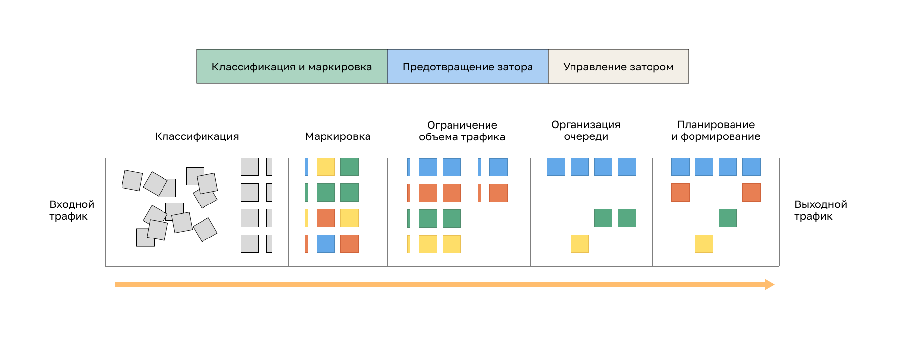
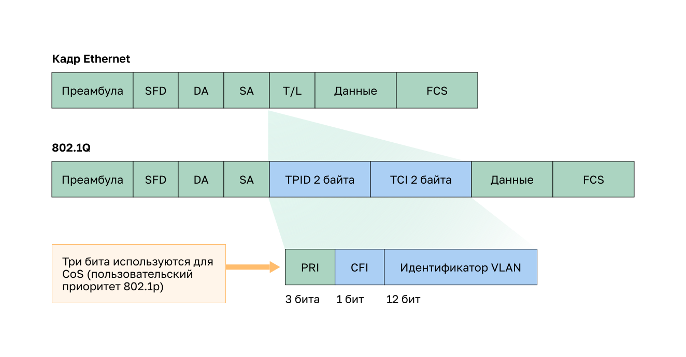
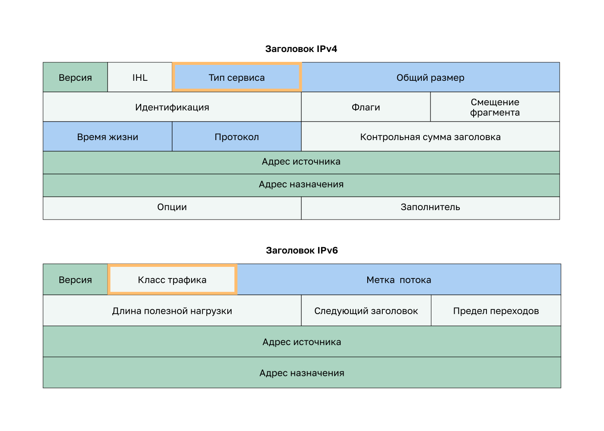
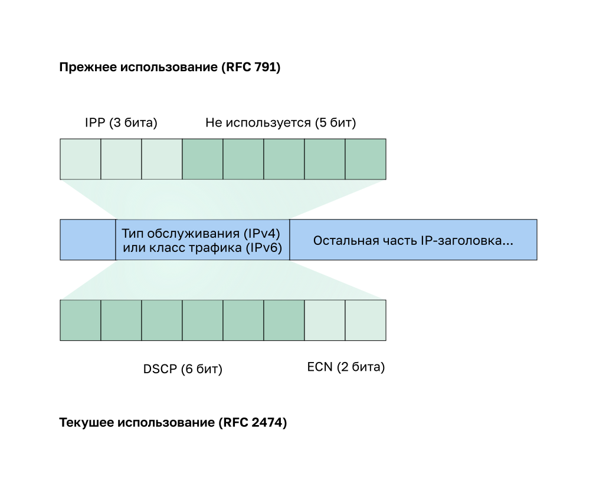
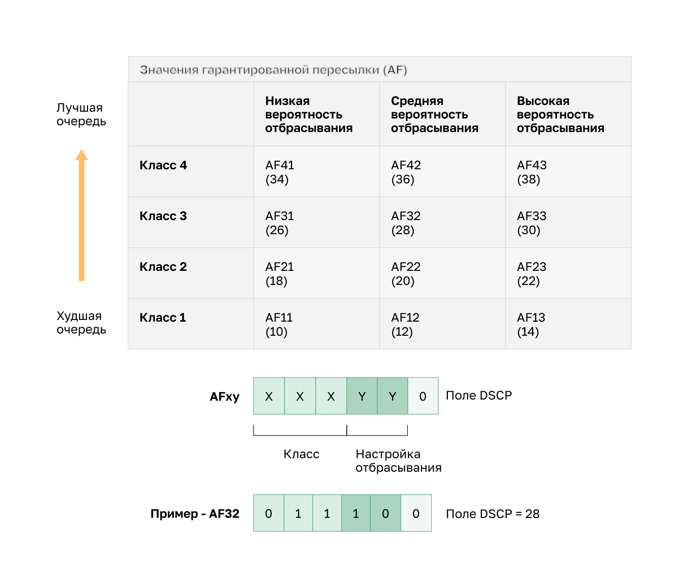
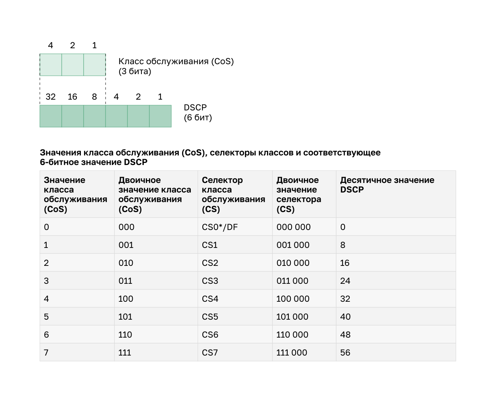
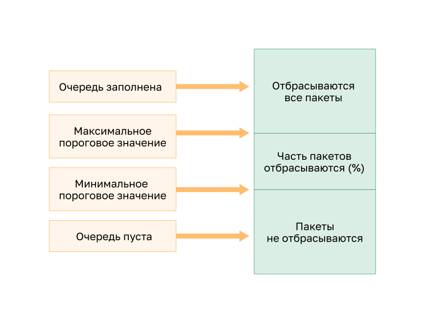

<!-- 9.5.1 -->
## Видео: Методы внедрения QoS

Посмотрите видео про обзор классификации, маркировки, границ доверия, предотвращения заторов, профилирования и ограничения объема трафика.

<!-- 9.5.2 -->
## Предотвращение потери пакетов

Вы узнали о характеристиках трафика, алгоритмах очередей и моделях качества обслуживания, теперь пришло время узнать о методах реализации QoS.

Начнем с потери пакетов. Она обычно возникает из-за заторов на интерфейсе. Большинство приложений, использующих TCP, сталкиваются с замедлением работы, поскольку при заторах в сети автоматически происходит регулировка TCP-трафика. Из-за потери сегментов TCP увеличиваются размеры окон сеансов. Некоторые приложения не используют TCP и не могут обрабатывать потерянные сегменты (уязвимые потоки).

Можно предотвратить потери пакетов для важных приложений несколькими методами:

* увеличить пропускную способность канала для уменьшения или предотвращения заторов;
* зарезервировать достаточную пропускную способность и увеличить объем буфера, чтобы гарантированно обрабатывать всплески трафика в уязвимых потоках. WFQ, CBWFQ и LLQ могут гарантировать пропускную способность и обеспечить приоритетную переадресацию в приложения, чувствительные к отбросу;
* сократить объем трафика, отбрасив пакеты с низким приоритетом. Cisco IOS QoS предоставляет механизмы организации очередей, такие как взвешенное случайное раннее обнаружение (WRED), которые начинают отбрасывать пакеты с более низким приоритетом до перегрузки.

<!-- 9.5.3 -->
## Инструменты QoS

В таблице описываются три категории инструментов качества обслуживания:

* для классификации и маркировки;
* для предотвращения заторов;
* для управления заторами.

| **Инструменты QoS** | **Описание** |
| --- | --- |
| Инструменты для классификации и маркировки | <ul><li>Сеансы или потоки анализируются на принадлежность определенному классу трафика, после чего пакеты маркируются.</li></ul> |
| Инструменты для предотвращения заторов | <ul><li>Классам трафика выделяются фрагменты сетевых ресурсов в соответствии с политикой качества обслуживания.</li><li>Политика QoS также определяет порядок отбрасывания или перемаркировки некоторого трафика для предотвращения заторов.</li><li>Основной инструмент предотвращения перегрузок — WRED. Он регулирует трафик данных TCP и эффективно использует полосу пропускания до возникновения отвалов из-за переполнения очереди.</li></ul> |
| Инструменты для управления заторами | <ul><li>Когда объем трафика превышает доступные сетевые ресурсы, трафик ставится в очередь ожидания.</li><li>Для управления заторами в Cisco IOS обычно используются алгоритмы CBWFQ и LLQ. Алгоритмы LLQ.</li></ul> |

Рисунок поможет понять последовательность использования этих инструментов при применении политики QoS к потокам пакетов.

**Последовательность QoS**

<!-- /courses/ensa-dl/ae8eb390-34fd-11eb-ba19-f1886492e0e4/aeb5c394-34fd-11eb-ba19-f1886492e0e4/assets/c68e6290-1c46-11ea-af56-e368b99e9723.svg -->

<!--
На рисунке показана последовательность инструментов для реализации QoS. Рисунок начинается в разделе «Классификация и маркировка» с входящими пакетами. Они классифицируются и организуются до их пометки. Затем пакеты перемещаются в раздел «Предотвращение заторов». Они распределяются на основе определенных политик, а некоторые из них отбрасываются выборочно. Наконец, пакеты попадают в раздел «Управление заторами». Далее они ставятся в очередь и пересылаются из выходного интерфейса на основании заданной политики качества обслуживания, шейпинга и полисинга.
-->

Как показано на рисунке, входные пакеты (серые квадраты) классифицируются, а их IP-заголовки помечаются (цветные квадраты). Чтобы избежать заторов, пакетам назначаются ресурсы на основании заданных политик. После этого они ставятся в очередь и пересылаются из выходного интерфейса на основании заданной политики QoS, шейпинга и полисинга.

**Примечание:** Классификацию и маркировку можно проводить и на входе и на выходе, а другие действия, связанные с качеством обслуживания, например постановку в очередь и формирование трафика, обычно выполняют на выходе.

<!-- 9.5.4 -->
## Классификация и маркировка

Чтобы применить политику качества обслуживания к пакету, его нужно классифицировать. Классификация и маркировка позволяют идентифицировать типы пакетов и определить класс трафика, к которому они относятся. Применять политики можно только к маркированному трафику.

Классификация пакета зависит от реализации политики QoS. При классификации потоков трафика на уровне 2 и 3 используются интерфейсы, списки контроля доступа и карты классов. Это также можно сделать и на уровнях с 4-го по 7-й с помощью распознавания приложений по параметрам сетевого трафика (Network Based Application Recognition, NBAR).

**Примечание:** NBAR — это функция операционной системы Cisco IOS для классификации и обнаружения протоколов, используемая совместно с функциями QoS. NBAR в рамках данного курса не рассматривается.

Маркировка означает добавление некоторого значения в заголовок пакета. Принимающие устройства сравнивают значение этого поля со значением, определенным политикой. ГНеобходимо проводить маркировку максимально близко к исходному устройству. Она устанавливает границы доверия.

Маркировка трафика обычно зависит от используемой технологии передачи данных. В таблице на рисунке описываются некоторые поля, используемые в различных технологиях. Решение о маркировке трафика на уровне 2 и 3 (или на обоих уровнях) непростое и должно приниматься с учетом следующих факторов.

* маркировку уровня 2 для кадров можно выполнять для трафика, отличного от IP-трафика;
* маркировка уровня 2 для кадров — единственный возможный вариант реализации QoS для коммутаторов, не поддерживающих IP;
* маркировка уровня 3 обеспечивает сквозную передачу данных о качестве обслуживания.

| **Инструменты QoS** | **Уровень**  | **Поле маркирования**  | **Ширина в битах**  |
| --- | --- | --- | --- |
| Ethernet (802.1Q, 802.1p) | 2 | Класс обслуживания (CoS) | 3 |
| 802.11 (Wi-Fi) | 2 | Идентификатор трафика беспроводной сети (TID) | 3 |
| MPLS | 2 | Экспериментальное (EXP) | 3 |
| IPv4 и IPv6 | 3 | Приоритет IP (IPP) | 3 |
| IPv4 и IPv6 | 3 | Точка кода дифференцированных сервисов (DSCP) | 6 |

<!-- 9.5.5 -->
## Маркировка на уровне коммутации

802.1Q — стандарт IEEE, который поддерживает маркировку трафика VLAN на уровне 2 в сетях Ethernet. При использовании стандарта 802.1Q в кадр Ethernet после поля MAC-адреса источника добавляются 2 поля, как показано на рисунке.

**Значения класса обслуживания (CoS) Ethernet**

<!-- /courses/ensa-dl/ae8eb390-34fd-11eb-ba19-f1886492e0e4/aeb5c394-34fd-11eb-ba19-f1886492e0e4/assets/c68f4cf0-1c46-11ea-af56-e368b99e9723.svg -->

<!--
На рисунке показаны поля кадра Ethernet и кадра 802.1Q. Кадр Ethernet состоит из семи полей: Преамбула, SFD, DA, SA, T/L, Data и FCS. Когда реализован 802.1Q, в кадр Ethernet добавляются два дополнительных поля: TPID и TCI, каждое по 2 байта. Внутри этих двух полей находится 3-битное поле приоритета, 1-битное поле CFI и 12-битное поле VLAN ID. 3 бита, используемые в поле приоритета, предназначены для маркировки класса обслуживания (CoS).
-->

Стандарт 802.1Q также включает схему установки приоритетов QoS, известную как IEEE 802.1p. Этот стандарт использует первые три бита в поле контрольных данных тега (TCI). Это трехбитное поле называется полем приоритета (PRI) и определяет маркировку класса обслуживания (CoS). CoS позволяет маркировать кадр Ethernet уровня 2 приоритетом одного из восьми уровней (значения 0–7), как показано на рисунке.

| **Значение класса обслуживания (CoS)** | **Двоичное значение класса обслуживания (CoS)** | **Описание** |
| --- | --- | --- |
| 0 | 000 | Данные с низким приоритетом |
| 1 | 001 | Данные со средним приоритетом |
| 2 | 010 | Данные с высоким приоритетом |
| 3 | 011 | Сигнализация вызовов |
| 4 | 100 | Видео-конференц-связь |
| 5 | 101 | Голосовой канал (трафик голосовых данных) |
| 6 | 110 | Зарезервировано |
| 7 | 111 | Зарезервировано |

<!-- 9.5.6 -->
## Маркировка на сетевом уровне

В протоколах IPv4 и IPv6 в заголовке пакета есть 8-битное поле для маркировки. Как показано на рисунке, для маркировки в IPv4 используют поле типа обслуживания (ToS), а для IPv6 — поле класса трафика.

**Заголовки пакетов IPv4 и IPv6**

<!-- /courses/ensa-dl/ae8eb390-34fd-11eb-ba19-f1886492e0e4/aeb5c394-34fd-11eb-ba19-f1886492e0e4/assets/c6901042-1c46-11ea-af56-e368b99e9723.svg -->

<!--
На рисунке показаны заголовки пакетов IPv4 и IPv6. Заголовок IPv4 состоит из следующих полей: Версия, IHL, Тип службы, Общая длина, Идентификация, Флаги, Смещение фрагмента, Время работы, Протокол, Контрольная сумма заголовка, Адрес источника, Адрес назначения, Параметры и Заполнение. Поле Тип сервиса обрисовывается прямоугольником. На рисунке показан заголовок IPv6 с полями: версия, класс трафика, метка потока, длина полезной нагрузки, следующий заголовок, предел переходов, адрес источника и адрес назначения. Поле «Класс трафика» обрисовывается прямоугольником.
-->

<!-- 9.5.7 -->
## Поле «Тип обслуживания / Класс трафика»

Тип службы (IPv4) и класс трафика (IPv6) несут маркировку пакетов, назначенную средствами классификации QoS. Получающие устройства сверяются с этим полем для пересылки пакетов на основании соответствующей назначенной политики качества обслуживания.

На рисунке показано содержимое 8-битного поля. В RFC 791 оригинальный стандарт для IP определяет поле приоритета IP (IPP), используемое для маркировки. Однако на практике эти три бита не обеспечивают достаточную детализацию для QoS.

RFC 2474 заменяет RFC 791 и переопределяет поле типа обслуживания (ToS) через переименование и расширение IPP. Новое поле, как показано на рисунке, выделяет для качества обслуживания 6 бит. Оно называется полем точки кода дифференцирования трафика (DSCP) и за счет этих 6 бит предлагает до 64 возможных классов обслуживания. Остальные 2 бита расширенного уведомления о перегрузке IP (ECN) могут использоваться маршрутизаторами, поддерживающими расширение ECN, для маркировки пакетов вместо их удаления. Маркировка ECN сообщает нижестоящим маршрутизаторам о наличии перегрузки потока пакетов.

<!-- /courses/ensa-dl/ae8eb390-34fd-11eb-ba19-f1886492e0e4/aeb5c394-34fd-11eb-ba19-f1886492e0e4/assets/c6916fd2-1c46-11ea-af56-e368b99e9723.svg -->

<!--
На рисунке показано старое и текущее поле «Тип службы» и «Класс трафика» в заголовке пакета. Старое поле состояло из 3 бит для IP Precedence (IPP) и 5 неиспользуемых бит. Текущее поле состоит из 6 бит для кода дифференциальных служб (DSCP) и 2 бит для расширенного уведомления о перегрузке (ECN).
-->

<!-- 9.5.8 -->
## Значения DSCP

64 значения DSCP организованы в три категории:

* **без гарантированной доставки (BE)** — категория по умолчанию для всех IP-пакетов. Значение DSCP равно 0. Пошаговое обслуживание (PHB) — нормальная маршрутизация. Когда возникает затор, эти пакеты отбрасываются. Никакой схемы качества обслуживания не применяется;
* **ускоренная пересылка (EF)** — RFC 3246 определяет EF как десятичное значение DSCP 46 (двоичное **101**110). Первые 3 бита (101) сопоставляются со значением 5 CoS уровня 2, используемого для трафика голосовых данных. На уровне 3 Cisco рекомендует использование EF только для маркировки пакетов голосовых данных;
* **гарантированная пересылка (Assured Forwarding)** — RFC 2597 выделяет для AF пять самых старших битов DSCP для определения очереди и приоритета отбрасывания. Определение AF проиллюстрировано на рисунке.

**Значения гарантированной пересылки (AF)**

<!-- /courses/ensa-dl/ae8eb390-34fd-11eb-ba19-f1886492e0e4/aeb5c394-34fd-11eb-ba19-f1886492e0e4/assets/c6920c11-1c46-11ea-af56-e368b99e9723.svg -->

**AFxy** Формула задается следующим образом:

* первые три самых старших бита определяют классы, где 4 — очередь с самым высоким приоритетом, а класс 1 — с самым низким;
* 4-й и 5-й старшие определяют приоритет отбрасывания;
* 6-й старший бит равен нулю.

Например, AF32 принадлежит классу 3 (двоичный код 011), и для нее устанавливается средний приоритет отбрасывания (двоичный код 10). Полное значение DSCP равно 28, поскольку в него включается нулевое значение 6-го бита (двоичный код 011100).

<!--
На рисунке показаны гарантированные значения пересылки дифференциальных служб (DSCP) и формула AFxy. Гарантированные значения пересылки состоят из четырех классов. Класс 4 означает очередь с самым высоким приоритетом, класс 1 — с самым низким. Каждый из них имеет значения пересылки, основанные на низком, среднем или высоком приоритете отбрасывания. Низкая вероятность отбрасывания класса 4 обозначается AF41 со значением DSCP 34, средняя — AF42 со значением DSCP 36, высокая — AF43 со значением DSCP 38. Низкая вероятность отбрасывания класса 3 обозначается AF31 со значением DSCP 26, средняя — AF32 со значением DSCP 28, высокая — AF33 со значением DSCP 30. Низкая вероятность отбрасывания класса 2 обозначается AF21 со значением DSCP 18, средняя — AF22 со значением DSCP 20, высокая — AF23 со значением DSCP 22. Низкая вероятность отбрасывания класса 1 обозначается AF11 со значением DSCP 10, средняя — AF12 со значением DSCP 12, высокая — AF13 со значением DSCP 14. Формула для определения числа AF основана на поле DSCP, первые три наиболее значимых бита используют для обозначения класса, четвертый и пятый наиболее значимые биты используют для обозначения предпочтения падения, а шестой бит устанавливается равным нулю. Пример для AF32 имеет первые три наиболее значимых бита как 011, а биты предпочтения падения — 10 с шестым битом как 0. Это приводит к двоичному 011100 или при преобразовании в десятичную, 28.
-->

<!-- 9.5.9 -->
## Средство выбора класса (CS)

Поскольку первые три старшх бита поля точки кода дифференцированных услуг определяют класс, их называют битами селектора класса (Class Selector). Как показано на риунке, они точно соответствуют трем битам полей CoS и IPP для обеспечения совместимости со стандартами 802.1p и RFC 791.

**Класс обслуживания уровня 2 и тип обслуживания уровня 3**

<!-- /courses/ensa-dl/ae8eb390-34fd-11eb-ba19-f1886492e0e4/aeb5c394-34fd-11eb-ba19-f1886492e0e4/assets/c6931d83-1c46-11ea-af56-e368b99e9723.svg -->

<!--
На рисунке показаны биты сектора классов в DSCP, приоритет класса обслуживания (CoS) и IPP поля сопоставлены для обеспечения совместимости с 802.1p. Кадр 802.1Q отображается с тремя отдельными полями: Priority CoS, CFI и 12 битов VLAN ID. Ниже кадра 802.1Q находится старое поле Тип службы с 2 отдельными полями: IPP с 3 битами, у второго поля 5 неиспользуемых битов. Под старым полем «Тип обслуживания» находится текущее поле «Тип обслуживания». Оно состоит из 2 отдельных полей: DSCP с 6 битами и ECN с 2 битами. Первый 3-бит поля DSCP помечен как CS. Первые 3 бита поля 802.1Q, старый тип обслуживания и текущий тип обслуживания обозначены пунктирными линиями.
-->

В таблице  показано, как значения CoS сопоставляются с селекторами класса и соответствующим 6-битным значением точки кода дифференцированных услуг. Эту же таблицу можно использовать для сопоставления значений IPP и селекторов класса.

**Сопоставление класса обслуживания с CS в точке кода дифференцированных услуг (DSCP)**

<!-- /courses/ensa-dl/ae8eb390-34fd-11eb-ba19-f1886492e0e4/aeb5c394-34fd-11eb-ba19-f1886492e0e4/assets/c693b9c0-1c46-11ea-af56-e368b99e9723.svg -->

<!--
На рисунке показано, как значения класса обслуживания (CoS) сопоставляются с селекторами классов в DSCP. В значеним CoS три бита помечены знаками битов 4, 2 и 1. Ниже них находится DSCP с шестью битами. Они помечены знаками битов 32, 16, 8, 4, 2 и 1. 3 бита CoS и первые 3 бита DSCP связаны пунктирными линиями, указывающими, что они отображаются.
-->

<!-- 9.5.10 -->
## Границы доверия

Где следует применять маркировку? Трафик нужно классифицировать и маркировать настолько близко к источнику, насколько это оправдано с технической и административной точки зрения. Это определяет границу доверия, как показано на рисунке.

1.  Доверенные оконечные устройства могут и умеют маркировать трафик приложений соответствующими значениями CoS уровня 2 и значениями DSCP уровня 3. К доверенным оконечным устройствам относятся IP-телефоны, точки беспроводного доступа, шлюзы и системы видеоконференций, станции IP-конференций и многое другое.
2.  Защищенные оконечные устройства могут работать с трафиком, маркированным на коммутаторе уровня 2.
3.  Трафик также можно маркировать на коммутаторах и маршрутизаторах уровня 3.

Обычно требуется перемаркировка трафика, например значений CoS на значения IP Precedent или DSCP.

**Различные границы доверия**

<!-- /courses/ensa-dl/ae8eb390-34fd-11eb-ba19-f1886492e0e4/aeb5c394-34fd-11eb-ba19-f1886492e0e4/assets/c6947d10-1c46-11ea-af56-e368b99e9723.svg -->

<!--
На рисунке приведены три примера различных границ доверия в сети. Пять категорий устройств в сети: конечные точки, доступ, распределение, агрегирование ядра и глобальной сети. Устройства конечных точек на рисунке — 3 ПК и один IP телефон, уровень доступа на рисунке состоит из 3 коммутаторов, уровень распределения имеет 2 многослойных коммутатора, а уровень агрегации WAN — 2 маршрутизатора. Первый пример границы доверия останавливается между ПК и IP-телефоном, что означает, что ПК — не доверенная конечная точка. Однако конечные точки IP-телефона, коммутаторы доступа, распределения и основные, а также маршрутизаторы агрегации глобальной сети — доверенные. Второй пример останавливается между ПК и коммутатором, что означает, что ПК — не доверенный. Однако все коммутаторы доступа, распределения и ядра, а также маршрутизаторы агрегации глобальной сети — доверенные. В третьем примере ПК подключается к коммутатору, и граница между коммутатором и коммутатором распределения останавливается, что означает, что ПК и коммутатор доступа — доверенные. Коммутаторы распределения и ядра, а также маршрутизаторы агрегации глобальной сети — доверенные.
-->

<!-- 9.5.11 -->
## Предотвращение затора

Управление заторами предусматривает планирование и формирование очередей, предполагающих буферизацию лишнего трафика или помещение его в очередь (а иногда и удаление) на время ожидания отправки на выходном интерфейсе. Средства предотвращения заторов проще. Они отслеживают распределения сетевого трафика, пытаясь предугадать и предотвратить заторы в типичных узких местах внутри сети и между сетями до того, как затор превратится в серьезную проблему. Эти инструменты могут отслеживать среднюю глубину очереди, как показано на рисунке. Когда заполнение очереди меньше минимального порогового значения, никакие пакеты не отбрасываются. Когда очередь заполняется до максимального порогового значения, отбрасывается небольшой процент пакетов. Если заполнение превышает максимальное пороговое значение, отбрасываются все пакеты.

**Механизмы предотвращения затора**

<!-- /courses/ensa-dl/ae8eb390-34fd-11eb-ba19-f1886492e0e4/aeb5c394-34fd-11eb-ba19-f1886492e0e4/assets/c6954060-1c46-11ea-af56-e368b99e9723.svg -->

<!--
На рисунке показаны механизмы предотвращения заторов на различных глубинах очереди. Рисунок имеет три вертикальных поля: верхний прямоугольник помечен как «Все пакеты отбрасываются», средний — «% отбрасываемых пакетов», нижний — «Пакеты не отбрасываются». Четыре этапа очереди: полная очередь, максимальное пороговое значение, минимальное пороговое значение и пустая очередь. У них стрелки указывают на соответствующие поля. Если очередь заполнена, все пакеты отбрасываются. Между минимальным и максимальным порогом существует процент отброшенных пакетов. Если очередь пуста, пакеты не отбрасываются.
-->

Некоторые методы предотвращения заторов предлагают установку приоритетов для отбрасывания пакетов. Например, система качества обслуживания в Cisco IOS предотвращает заторы с помощью механизма измеренного произвольного раннего обнаружения (Weighted Random Early Detection, WRED). В алгоритме WRED инструменты управляют буферизацией и снижают или отбрасывают трафик TCP раньше, чем буфер переполнится. Это и позволяет избегать заторов на сетевых интерфейсах. WRED не отбрасывает последний элемент и рационально использует сетевые мощности и производительность приложений, использующих TCP. Заторы для трафика UDP, например голосового трафика, не предотвращаются. Для трафика UDP сокращают и даже предотвращают потерю пакетов организация очередей и сжатие.

<!-- 9.5.12 -->
## Шейпинг и ограничение трафика

Шейпинг и полисинг трафика — это механизмы Cisco IOS, позволяющие предотвращать заторы.

Шейпинг сохраняет лишние пакеты в очереди, а затем планирует их последующую передачу через определенные промежутки времени. В результате пакеты отправляются со сбалансированной интенсивностью, как показано на рисунке.

**Пример формирования трафика**

<!-- /courses/ensa-dl/ae8eb390-34fd-11eb-ba19-f1886492e0e4/aeb5c394-34fd-11eb-ba19-f1886492e0e4/assets/c695dca2-1c46-11ea-af56-e368b99e9723.svg -->

<!--
На рисунке двумя графиками показан пример шейпинга трафика. Первый показывает трафик, идущий по максимуму и ниже максимальной скорости в течение определенного периода времени. Второй график показывает трафик после формирования. Трафик формируется так, чтобы иметь плавную скорость вывода пакетов.
-->

Для шейпинга трафика нужна очередь и достаточный объем памяти для буферизации задерживаемых пакетов, а для ограничения трафика это не нужно.

При включении шейпинга трафика убедитесь, что памяти достаточно. Также потребуется функция планирования, чтобы передать все отложенные пакеты. Она разбивает трафик в очереди на несколько очередей. Примеры функций планирования — CBWFQ и LLQ.

Шейпинг связан с управлением исходящим трафиком. Он применяется к очереди пакетов, исходящих через интерфейс. А к входящему трафику может применяться только ограничение. Если скорость передачи достигает установленного максимума, излишний трафик отбрасывается (или заново маркируется).

Ограничение трафика обычно применяют операторы связи, чтобы соблюдалась гарантированная скорость передачи данных (CIR). Однако провайдер может также предусмотреть превышение показателя гарантированной скорости передачи данных, если его сеть в текущий момент не перегружена.

**Пример ограничения объема трафика**

<!-- /courses/ensa-dl/ae8eb390-34fd-11eb-ba19-f1886492e0e4/aeb5c394-34fd-11eb-ba19-f1886492e0e4/assets/c6962ac3-1c46-11ea-af56-e368b99e9723.svg -->

<!--
На рисунке двумя графиками показан пример полисинга трафика. Первый показывает трафик, идущий по максимуму и ниже максимальной скорости трафика в течение определенного периода времени. Второй график показывает трафик после обработки. Он идет на уровень или ниже, но не выше установленного, потому что избыточный трафик отбрасывается или перемаркируется.
-->

<!-- 9.5.13 -->
## Руководящие принципы политики QoS

Политика QoS должна учитывать полный путь от источника к месту назначения. Если одно устройство в пути использует другую политику, это влияет на всю политику QoS. Например, заикание при воспроизведении видео может быть результатом одного переключателя в пути, для которого значение CoS не задано соответствующим образом.

Некоторые рекомендации, которые помогают обеспечить лучшие условия для конечных пользователей:

* включите очередь на каждом устройстве в пути между источником и конечным устройством;
* сетевой трафик классифицируется и маркируется максимально близко к исходному устройству;
* шейпинг и полисинг транспортных потоков как можно ближе к их источникам.

<!-- 9.5.14 -->
<!-- quiz -->

