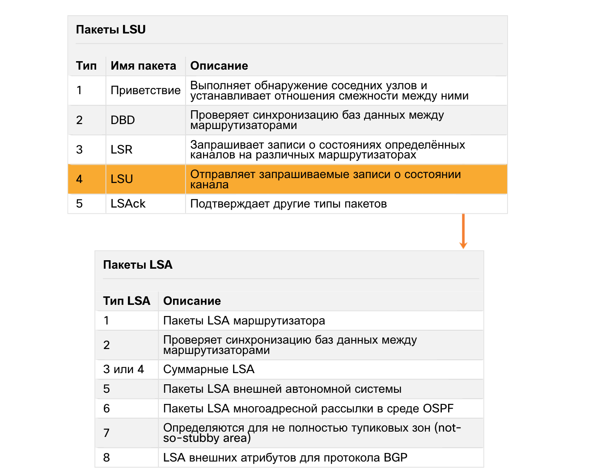
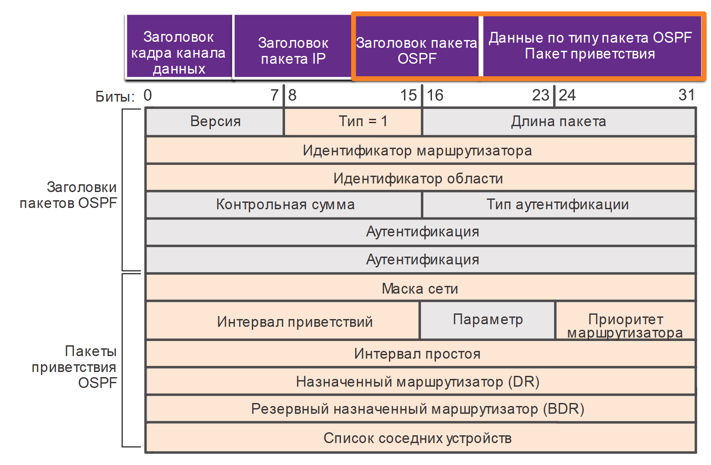

<!-- 1.2.1 -->
## Видео: OSPF пакеты

Нажмите Воспроизвести на рисунке, чтобы просмотреть видео о пакетах OSPF.

<!-- 1.2.2 -->
## Типы пакетов OSPF

Пакеты состояния канала — это инструменты, используемые OSPF для определения наиболее быстрого доступного маршрута для пакета. Протокол OSPF использует пакеты состояния канала для установления и поддержания отношений смежности и обмена обновлениями маршрутизации. Каждый тип пакета выполняет определённую задачу в процессе маршрутизации OSPF:

* **Тип 1: пакет приветствия (hello)**  — используется для установления и поддержания отношений смежности с маршрутизаторами OSPF.
* **Тип 2: пакет описания базы данных (DBD)**  — содержит сокращённый список базы данных состояний каналов отправляющего маршрутизатора. Используется принимающими маршрутизаторами для сверки с локальной базой данных о состоянии канала. Для построения точного дерева кратчайших путей SPF маршрутизаторы с маршрутизацией по состоянию канала в пределах области должны использовать идентичную базу данных состояний каналов.
* **Тип 3: пакет запроса состояния канала (LSR)**  — принимающие маршрутизаторы могут запросить дополнительные данные о любой записи в пакете описания базы данных (DBD), отправив пакет запроса состояния канала (LSR).
* **Тип 4: пакет обновления состояния канала (LSU)**  — используется для отправки отклика на пакеты запроса состояния канала (LSR) и объявления новых данных. Пакеты обновления состояния канала (LSU) содержат семь различных типов LSA.
* **Тип 5: пакет подтверждения состояния канала (LSAck)**  — при получении LSU маршрутизатор отправляет LSAck для подтверждения приёма LSU. Поле данных LSAck является пустым.

В таблице показаны пять различных типов LSP, используемых в OSPFv2. OSPFv3 использует аналогичные типы пакетов.

| **Тип** | **Имя пакета** | **Описание** |
| --- | --- | --- |
| 1 | Приветствие | Выполняет обнаружение соседних узлов и устанавливает отношения смежности между ними |
| 2 | Дескриптор базы данных (DBD) | Проверяет синхронизацию баз данных между маршрутизаторами |
| 3 | Запрос состояния канала (LSR) | Запрашивает записи о состояниях определённых каналов на различных маршрутизаторах |
| 4 | Обновление состояния канала (LSU) | Отправляет запрашиваемые записи о состоянии канала |
| 5 | Подтверждение состояния канала (LSAck) | Подтверждает другие типы пакетов |

<!-- 1.2.3 -->
## Обновления состояния канала

Маршрутизаторы первоначально обмениваются пакетами  типа 2 DBD, которые представляют собой сокращенный список LSDB отправляющего маршрутизатора. Он используется принимающими маршрутизаторами для сравнения с локальным LSDB.

Пакет LSR (пакет 3-го типа) используется принимающими маршрутизаторами для запроса дополнительных данных о записи в пакете DBD.

Пакет LSU (пакет 4-го типа) используется для отправки отклика на полученный пакет LSR.

Пакет 5-го типа используется для подтверждения получения LSU 4-го типа.

Пакеты LSU также используются для пересылки обновлений маршрутизации OSPF, например данных об изменении канала. В частности, пакет LSU может содержать 11 различных типов объявлений состояния канала (LSA) протокола OSPFv2, как показано на рисунке. Протокол OSPFv3 переименовал некоторые из этих пакетов LSA и также содержит два дополнительных пакета LSA.

**Примечание**: Разница между терминами «LSU» и «LSA» может привести в замешательство, поскольку эти термины нередко заменяют друг друга. Однако пакет LSU содержит один или несколько пакетов LSA.

**Пакеты LSU содержат пакеты LSA**

<!-- /courses/ensa-dl/ae8cded0-34fd-11eb-ba19-f1886492e0e4/aeb30470-34fd-11eb-ba19-f1886492e0e4/assets/c5809c10-1c46-11ea-af56-e368b99e9723.svg -->

* Пакет LSU может содержать один или несколько пакетов LSA.
* Пакеты LSA содержат сведения о маршруте для сетей назначения.

<!--
показывает, что OSPFv2 LSU может содержать один или несколько различных типов LSAs
-->

<!-- 1.2.4 -->
## Пакет приветствия

Пакет протокола OSPF 1-го типа— это пакет приветствия или hello-пакет. Пакеты приветствия используются для выполнения следующих действий:

* Обнаружение соседних устройств OSPF и установление отношений смежности с ними.
* Объявление параметров, при которых два маршрутизатора обязаны согласиться установить отношения смежности.
* В сетях с множественным доступом (Ethernet и Frame Relay) необходимо выбрать выделенный маршрутизатор (DR) и резервный выделенный маршрутизатор (BDR). Для каналов типа «точка-точка» наличие DR или BDR не требуется.

На рисунке показаны поля, содержащиеся в пакете приветствия OSPFv2 1-го типа.

**Содержимое пакета приветствия OSPF**

<!-- /courses/ensa-dl/ae8cded0-34fd-11eb-ba19-f1886492e0e4/aeb30470-34fd-11eb-ba19-f1886492e0e4/assets/c5815f61-1c46-11ea-af56-e368b99e9723.svg -->

<!--
показывает диаграмму содержимой/полей пакета «Hello» OSPFv2
-->

<!-- 1.2.5 -->
<!-- quiz -->

