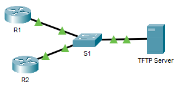

---

> **ВАЖНО**
> 
> Форма для ответов на вопросы будет доступна только при развертывании лабораторной работы 

---

## Топология



## Таблица адресации

| Устройство  | Интерфейс       | IP-адрес      | Маска подсети | Шлюз по умолчанию |
|-------------|-----------------|---------------|---------------|-------------------|
| R1          | G0/0/0          | 192.168.2.1   | 255.255.255.0 | —                 |
| R2          | G0/0            | 192.168.2.2   | 255.255.255.0 | —                 |
| S1          | VLAN 1          | 192.168.2.3   | 255.255.255.0 | 192.168.2.1       |
| TFTP-сервер | Сетевой адаптер | 192.168.2.254 | 255.255.255.0 | 192.168.2.1       |

## Задачи

Часть 1. Обновление образа IOS на устройстве Cisco

Часть 2. Создание резервной копии образа IOS на TFTP-сервере

## Сценарий

TFTP-сервер может помочь управлять хранением и выпусками образов IOS. В любой сети рекомендуется сохранить резервную копию образа ОС Cisco IOS на случай его повреждения или случайного удаления на маршрутизаторе. На TFTP-сервер можно также хранить новые обновления IOS, чтобы затем развернуть их по всей сети там, где это необходимо. В рамках задания обновите образы IOS на устройствах Cisco с помощью TFTP-сервера. Также сделайте резервную копию образа IOS, используя TFTP-сервер.

## Инструкция

### Часть 1: Обновление образа IOS на устройстве Cisco

**Шаг 1: Обновление образа IOS на маршрутизаторе.**

1.  Получите доступ к TFTP-серверу и включите службу TFTP.

2.  Запишите образы IOS, доступные на сервере.

    - ответьте на вопрос №1

3.  На маршрутизаторе **R2** введите команду **show flash:** и запишите доступный объём флеш-памяти.

4.  Скопируйте образ CISCO1941/K9 IOS версии 15.5 для маршрутизатора 1941 с сервера TFTP на R2.

    **Примечание.** В реальной сети, если на маршрутизаторе активны более одного интерфейса, может потребоваться ввести команду **ip tftp source** interface, чтобы указать, какой интерфейс должен использоваться для связи с TFTP-сервером. Эта команда не поддерживается в PT 7.2 и более ранних версиях и не требуется для выполнения этого действия.

    ```
    R2# copy tftp: flash:
    Address or name of remote host []? 192.168.2.254
    Source filename []? c1900-universalk9-mz.SPA.155-3.M4a.bin
    Destination filename [c1900-universalk9-mz.SPA.155-3.M4a.bin]?
    Accessing tftp://192.168.2.254/c1900-universalk9-mz.SPA.155-3.M4a.bin....
    Loading c1900-universalk9-mz.SPA.155-3.M4a.bin from 192.168.2.254: !!!!!!!!!!!!!!!!!!!!!!!!!!!!!!!!!!!!!!!!!!!!!!!!!!!!!!!!!!!!!!!!!!!!!!!!!!!!!!!!!!!!!!!!!!!!!!!!!!!!!!!!!!!!!!!!!!!!!!!!!!!!!!!!!!!!!!!!!!!!!!!!!!!!!!!!!!!!!!!!!!!!!!!!!!!!!!!!!!!!!!!!!!!!!!!!!!!!!!!!!!!!!!!!!!!!!!!!!!!!!!!!!!!!!!!!!!!!!!!!!!!!!!!!!!!!!!!!!!!!!!!!!!!!!!!!!!!!!!!!!!!!!!!!!!!!!!!!!!!!!!!!!!!!!!!!!!!!!!!!!!!!!!!!!!!!!!!!!!!!!!!!!!!!!!!!!!!!!!!!!!!!!!!!!!!!!!!!!!!!!!!!!!!!!!!!!!!!!!!!!!!!!!!!!!!!!!!!!!!!!!!!!!!!!!!!!!!!!!!!!!!!!!!!!!!!!!!!!!!!!!!!!!!!!!!!!!!!!!!!!!!!!!!!!!!!!!!!!!!!!!!!!!!!!!!!!!!!!!!!!!!!!!!!!!!!!!!!!!!!!!!!!!!!!!!!!!!!!!!!!!!!!!!!!!!!!!!!!!!!!!!!!!!!!!!!!!!!!!!!!!!!!!!!!!!!!!!!!!!!!!!!!!!!!!!!!!!!!!!!!!!!!!!!!!!!!!!!!
    [OK - 33591768 bytes]
    33591768 bytes copied in 4.099 secs (860453 bytes/sec)
    ```

5.  Убедитесь, что образ IOS скопирован во флеш-память.

    - ответьте на вопрос №2

6.  Используйте команду **boot system**, чтобы загрузить образ IPBase 15.5 при следующей перезагрузке.

    ```
    R2(config)# boot system flash c1900-universalk9-mz.SPA.155-3.M4a.bin
    ```

7.  Сохраните конфигурацию и перезагрузите маршрутизатор **R2**.

8.  Используйте команду **show version** для проверки загрузки обновленного образа IOS после перезагрузки **R2.**

    ```
    R2# show version
    Cisco IOS Software, C1900 Software (C1900-UNIVERSALK9-M), Version 15.5(3)M4a, RELEASE SOFTWARE (fc1)
    Technical Support: http://www.cisco.com/techsupport
    Copyright (c) 1986-2016 by Cisco Systems, Inc.
    Compiled Thu 06-Oct-16 13:56 by mnguyen
    ROM: System Bootstrap, Version 15.0(1r)M9, RELEASE SOFTWARE (fc1)
    R2 uptime is 21 seconds
    System returned to ROM by power-on
    System image file is "flash0:c1900-universalk9-mz.SPA.155-3.M4a.bin"
    ---- output omitted -----
    ```

**Шаг 2: Обновите образ IOS на коммутаторе.**

1.  Получите доступ к TFTP-серверу и скопируйте образ **c2960-lanbasek9-mz.150-2.SE4.bin** на коммутатор S1.

    ```
    S1# copy tftp: flash:
    ```

2.  Используйте команду **boot system** для настройки коммутатора для загрузки нового образа IOS.

3.  Перезагрузите коммутатор S1 и убедитесь, что новый образ загружен в память.

4.  Закройте окно конфигурации TFTP, если оно все еще открыто.

### Часть 2. Создание резервной копии образа IOS на TFTP-сервере

1.  На **R1** просмотрите содержимое флеш-памяти и запишите образ IOS.

2.  Используйте команду **copy**, чтобы сделать резервную копию образа IOS из флеш-памяти маршрутизатора **R1** на TFTP-сервер. Примечание. Изображение isr4300 значительно больше, чем изображение c1900. Передача на TFTP-сервер займет больше времени.

    ```
    R1# copy flash: tftp:
    Source filename []? isr4300-universalk9.03.16.05.S.155-3.S5-ext.SPA.bin
    Address or name of remote host []? 192.168.2.254
    Destination filename [isr4300-universalk9.03.16.05.S.155-3.S5-ext.SPA.bin]?
    Writing isr4300-universalk9.03.16.05.S.155-3.S5-ext.SPA.bin....!!!!!!!!!!!!!!!!!!!!!!!!!!!!!!!!!!!!!!!!!!!!!!!!!!!!!!!!!!!!!!!!!!!!!!!!!!!!!!!!!!!!!!!!!!!!!!!!!!!!!!!!!!!!!!!!!!!!!!!!!!!!!!!!!!!!!!!!!!!!!!!!!!!!!!!!!!!!!!!!!!!!!!!!!!!!!!!!!!!!!!!!!!!!!!!!!!!!!!!!!!!!!!!!!!!!!!!!!!!!!!!!!!!!!!!!!!!!!!!!!!!!!!!!!!!!!!!!!!!!!!!!!!!!!!!!!!!!!!!!!!!!!!!!!!!!!!!!!!!!!!! --- output omitted ----
    !!!!!!!!!!!!!!!!!!!!!!!!!!!!!!!!!!!!!!!!!!!!!!!!!!!!!!!!!!!!!!!!!!!!!!!!!!!!!!!!!!!!!!!!!!!!!!!!!!!!!
    [OK - 486899872 bytes]
    486899872 bytes copied in 18.815 secs (83367 bytes/sec)
    ```

3.  Получите доступ к TFTP-серверу и убедитесь, что образ IOS скопирован на него.

    **Примечание.** Возможно, потребуется запустить и остановить службу TFTP на сервере, чтобы файл отобразился в списке.

[Скачать файл Packet Tracer для локального запуска](./assets/10.7.6-lab.pka)
