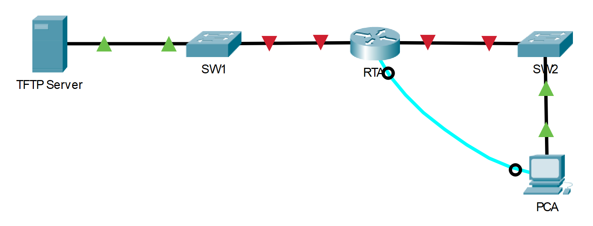

## Топология



## Цели

Часть 1. Установка соединения с TFTP-сервером

Часть 2: Перенос файла конфигурации с TFTP-сервера

Часть 3. Резервное копирование конфигурации и образа IOS на TFTP-сервер

## Общие сведения и сценарий

В этом упражнении вы можете продемонстрировать способы восстановления файлов конфигурации из резервной копии для последующего резервного копирования. Из-за отказа оборудования был установлен новый маршрутизатор. К счастью, резервные копии файлов конфигурации были сохранены на сервере простого протокола передачи данных (TFTP). Вам необходимо восстановить эти файлы с TFTP-сервера, чтобы маршрутизатор вернулся в режим онлайн как можно скорее.

## Инструкции

### Часть 1. Установка соединения с TFTP-сервером

**Примечание**. Поскольку это новый маршрутизатор, первоначальная настройка будет выполняться через консольное подключение к маршрутизатору.

1.  Щёлкните **PCA**, откройте вкладку **Desktop** (Рабочий стол), выберите **Terminal** (Терминал), чтобы открыть окно командной строки **RTA**.

2.  Настройте и включите **Gigabit Ethernet 0/0**. IP-адрес должен совпадать с адресом шлюза по умолчанию для **TFTP-сервера**.

3.  Проверьте связь с **TFTP-сервером**. При необходимости устраните неполадки.

### Часть 2. Передача файла конфигурации с TFTP-сервера

1.  В привилегированном режиме EXEC введите следующую команду:

    ```
    Router# copy tftp running-config
    Address or name of remote host []? 172.16.1.2
    Source filename []? RTA-confg
    Destination filename [running-config]? <cr>
    ```

    Маршрутизатор должен возвратить следующие данные:

    ```
    Accessing tftp://172.16.1.2/RTA-confg...
    Loading RTA-confg from 172.16.1.2: !
    [OK - 785 bytes]
    785 bytes copied in 0.001 secs
    RTA#
    %SYS-5-CONFIG_I: Configured from console by console
    RTA#
    ```

2.  Выполните команду, чтобы отобразить текущую конфигурацию.

    Вопрос: Какие изменения были внесены?

    **Введите ваш ответ здесь.**

3.  Выполните соответствующую команду **show**, чтобы отобразить состояние интерфейса.

    Вопрос: Все ли интерфейсы активны?

    **Введите ваш ответ здесь.**

4.  Устраните все проблемы, связанные с интерфейсами, и проверьте связь между PCA и сервером TFTP.

### Часть 3. Резервное копирование конфигурации и образа IOS на TFTP-сервер

1.  Измените имя узла **RTA** на **RTA-1**.

2.  Сохраните конфигурацию в NVRAM.

3. Скопируйте конфигурацию на **TFTP-сервер** с помощью команды **copy**:

    ```
    RTA-1# copy running-config tftp:
    Address or name of remote host []? 172.16.1.2
    Destination filename [RTA-1-confg]? <cr>
    ```

4. Выполните эту команду, чтобы отобразить файлы из флеш-памяти.

5. Скопируйте образ IOS на **TFTP-сервер** с помощью следующей команды:

    ```
    RTA-1# copy flash tftp:
    Source filename []? c1900-universalk9-mz.SPA.151-4.M4.bin
    Address or name of remote host []? 172.16.1.2
    Destination filename [c1900-universalk9-mz.SPA.151-4.M4.bin]? <cr>
    ```

    Вопрос: Какой специальный символ неоднократно показывает, что файл IOS успешно копируется на TFTP-сервер?

    **Введите ваш ответ здесь.**

6. Откройте TFTP-сервер и перейдите на вкладку Службы, выберите TFTP и прокрутите список файлов IOS.

    Вопрос: Был ли скопирован файл IOS **c1900-universalk9-mz.SPA.151-4.M4.bin** на TFTP-сервер?

    **Введите ваш ответ здесь.**

[Скачать файл Packet Tracer для локального запуска](./assets/10.6.10-packet-tracer---back-up-configuration-files_ru-RU.pka)
