<!-- 11.2.1 -->
## Проектирование для обеспечения масштабируемости

Вы понимаете, что ваша сеть изменится. Количество пользователей, скорее всего, увеличится, их можно найти где угодно, и они будут использовать самые разнообразные устройства. Ваша сеть должна быть в состоянии меняться вместе со своими пользователями. Масштабируемость — это термин для сети, которая может расти без потери доступности и надежности.

Для поддержки крупной, средней или малой сети проектировщик должен разработать стратегию, чтобы обеспечить доступность и эффективную масштабируемость сети. Базовая стратегия проектирования сети включает в себя следующие рекомендации.

* Следует использовать расширяемое модульное оборудование или кластерные устройства, которые можно легко модернизировать для увеличения их возможностей. Для поддержки новых функций и устройств к уже существующему оборудованию можно просто добавить новые аппаратные модули, и существенная модернизация оборудования не потребуется. Некоторые устройства можно интегрировать в кластер, чтобы они работали как одно устройство. Это упрощает управление и настройку.
* Иерархическую сеть следует проектировать с учетом возможностей добавления, обновления и изменения модулей в случае необходимости, не затрагивая при этом другие функциональные области сети. Например, можно создать отдельный уровень доступа, который можно расширять, не затрагивая уровни распределения и ядра кампусной сети.
* Используйте иерархическую стратегию адресации IPv4 и IPv6. При продуманном планировании адресации для организации поддержки дополнительных пользователей и сервисов вам не потребуется заново настраивать адреса во всей сети.
* Выберите маршрутизаторы или многоуровневые коммутаторы, чтобы ограничивать широковещательные рассылки и отфильтровывать из сети нежелательный трафик. Используйте устройства уровня 3 для фильтрации и сокращения объема трафика к ядру сети.

**Резервные линии**

Внедрите резервные каналов в сети между критически важными устройствами, а также между устройствами уровня доступа и уровня ядра;

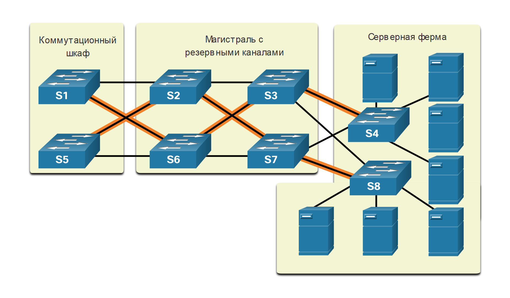
<!-- /courses/ensa-dl/ae8eb394-34fd-11eb-ba19-f1886492e0e4/aeb638c0-34fd-11eb-ba19-f1886492e0e4/assets/c6cc2ee2-1c46-11ea-af56-e368b99e9723.svg -->

<!--
На рисунке показаны избыточные связи между устройствами доступа и устройствами основного уровня. В проводном шкафу есть два коммутатора, а в магистрали четыре коммутатора. Шесть коммутаторов имеют избыточные каналы связи. Кроме того, магистральные коммутаторы имеют избыточные связи с фермой серверов. Ферма серверов состоит из двух коммутаторов и семи серверов.
-->

**Несколько каналов связи**

Внедрите несколько каналов связи между различными устройствами с использованием функций агрегации каналов (EtherChannel) или распределением нагрузки в соответствии с равной стоимостью в целях увеличения пропускной способности; объединение нескольких каналов Ethernet в единую конфигурацию EtherChannel с распределенной нагрузкой, что позволяет увеличить доступную пропускную способность; используйте технологию EtherChannel, если в связи с ограничениями бюджета невозможно приобрести высокоскоростные интерфейсы и оптоволоконные кабели;

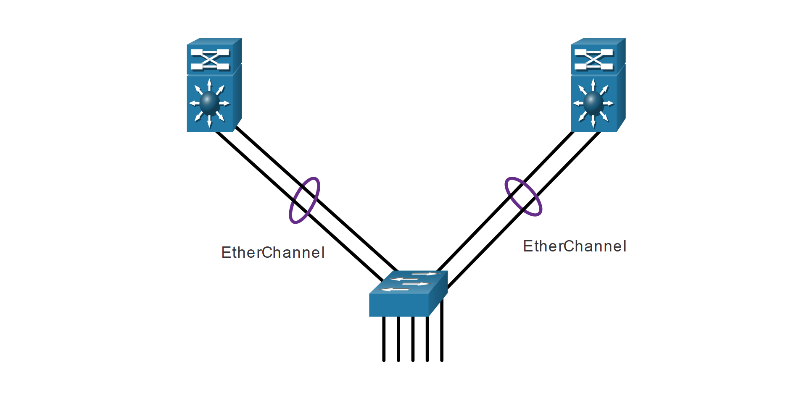
<!-- /courses/ensa-dl/ae8eb394-34fd-11eb-ba19-f1886492e0e4/aeb638c0-34fd-11eb-ba19-f1886492e0e4/assets/c6cc7d01-1c46-11ea-af56-e368b99e9723.svg -->

<!--
На рисунке показано несколько каналов связи между коммутаторами, использующими EtherChannel. На рисунке есть два многослойных переключателя с двумя связями каждый с коммутатором. Каналы объединяются вместе с помощью EtherChannel.
-->

**Масштабируемый протокол маршрутизации**

Использование масштабируемого протокола маршрутизации и реализация в этом протоколе функций, позволяет изолировать обновления маршрутизации и минимизировать размер таблицы маршрутизации;

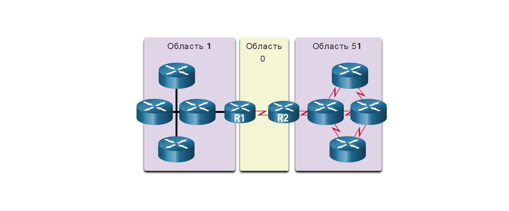
<!-- /courses/ensa-dl/ae8eb394-34fd-11eb-ba19-f1886492e0e4/aeb638c0-34fd-11eb-ba19-f1886492e0e4/assets/c6cca413-1c46-11ea-af56-e368b99e9723.svg -->

<!--
На рисунке показано использование масштабируемого протокола маршрутизации, такого как OSPF. На рисунке показаны три области OSPF: область 0, область 1 и область 51. Область 1 имеет четыре маршрутизатора, один из которых обозначен R1 на границе. R1 находится в области 1 и области 0. Область 0 имеет два маршрутизатора: R1 и R2. R2 находится в области 0 и области 51. Область 51 состоит из четырех маршрутизаторов, подключенных через последовательные каналы.
-->

**Беспроводное соединение**

Внедрение беспроводного подключения для поддержки мобильности и расширения.

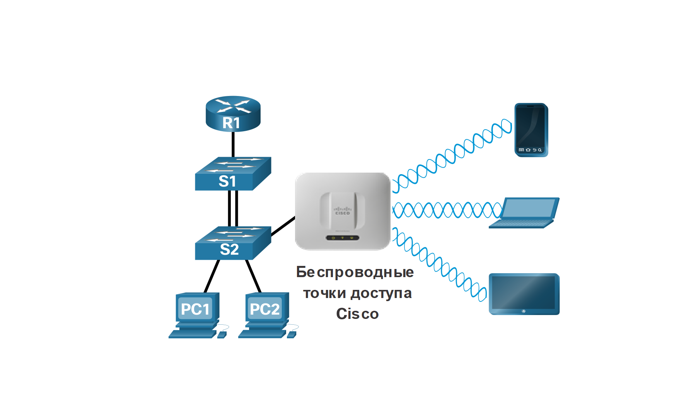
<!-- /courses/ensa-dl/ae8eb394-34fd-11eb-ba19-f1886492e0e4/aeb638c0-34fd-11eb-ba19-f1886492e0e4/assets/c6cccb25-1c46-11ea-af56-e368b99e9723.svg -->

<!--
Рисунок иллюстрирует реализацию беспроводного подключения для поддержки мобильности и расширения. Маршрутизатор R1 имеет соединение с коммутатором S1. S1 имеет избыточные каналы связи с другим коммутатором, S2. S2 имеет связи с двумя ПК и точкой беспроводного доступа Cisco. Точка беспроводного доступа Cisco подключается по беспроводной сети к мобильному телефону, ноутбуку и планшету.
-->

<!-- 11.2.2 -->
## Планирование резервирования

Во многих компаниях обеспечение потребностей бизнеса во многом зависит от доступности сети. Резервирование является важной частью проектирования сети. Резервирование  защищает от перебоев в работе всех сетевых служб в случае отказа в отдельной точке. Одним из способов реализации резервирования является установка дублирующего оборудования и обеспечение отказоустойчивых сервисов для критически важных устройств.

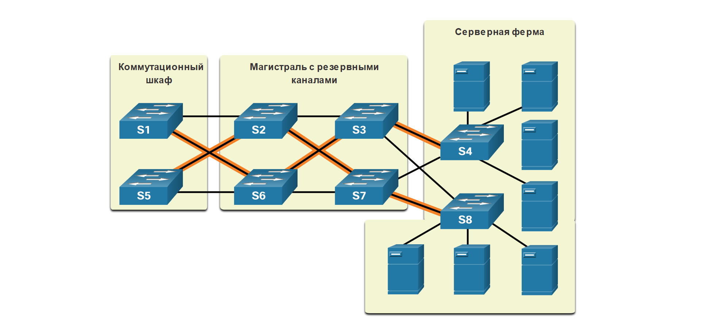
<!-- /courses/ensa-dl/ae8eb394-34fd-11eb-ba19-f1886492e0e4/aeb638c0-34fd-11eb-ba19-f1886492e0e4/assets/c6ce2ab0-1c46-11ea-af56-e368b99e9723.svg -->

<!--
На рисунке показаны избыточные связи между важными устройствами в сети. В проводном шкафу есть два коммутатора, а в магистрали четыре коммутатора. Шесть коммутаторов имеют избыточные каналы связи. Кроме того, магистральные коммутаторы имеют избыточные связи с фермой серверов. Ферма серверов состоит из двух коммутаторов и семи серверов.
-->

Другим способом реализации резервирования является использование резервных путей, как показано на рисунке. Резервные пути предоставляют альтернативные физические маршруты передачи данных по сети. Резервные пути в коммутируемой сети обеспечивают высокую доступность сетевых сервисов. Однако в связи с работой коммутаторов резервные пути в коммутируемой сети Ethernet могут стать причиной возникновения логических петель 2-го уровня. По этой причине необходимо использовать протокол STP.

STP исключает образование петель на уровне 2, когда используются резервные каналы между коммутаторами. Это обеспечивается за счет механизма отключения резервных путей в коммутируемой сети до тех пор, пока этот путь не потребуется (например, в случае сбоя). STP основывается на открытых стандартах и используется для создания логической топологии без петель.

Использование уровня 3 в магистральной системе является еще одним способом реализации избыточности без необходимости STP на уровне 2. Уровень 3 также обеспечивает лучший выбор пути и более высокую сходимость во время переключения на резервный ресурс.

<!-- 11.2.3 -->
## Уменьшение размера домена сбоев

Качественно спроектированная сеть не только обеспечивает контроль трафика, но уменьшает размер доменов отказов. Домен отказов представляет собой область сети, затронутую сбоями в работе критически важного устройства или сетевого сервиса.

Воздействие на домен отказов зависит от функций отказавшего устройства.  Например, неисправный коммутатор в сетевом сегменте, как правило, влияет только на хосты данного сегмента. Однако если отказывает маршрутизатор, соединяющий сегмент с другими сегментами, степень воздействия будет гораздо выше.

Использование резервных каналов и надежных устройств корпоративного класса сводит к минимуму вероятность нарушения работы сети. Уменьшение размера доменов отказов снижает степень воздействия отдельных неполадок на работу компании в целом. При этом также упрощается процесс поиска и устранения неполадок и сокращается время простоя для всех пользователей.

**Пограничный маршрутизатор**

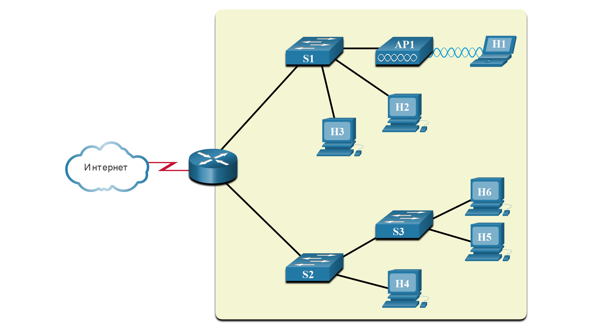
<!-- /courses/ensa-dl/ae8eb394-34fd-11eb-ba19-f1886492e0e4/aeb638c0-34fd-11eb-ba19-f1886492e0e4/assets/c6ce9fe5-1c46-11ea-af56-e368b99e9723.svg -->

<!--
На рисунке показана область сбоя пограничного маршрутизатора. Облако, изображающее Интернет, подключено к пограничному маршрутизатору. Пограничный маршрутизатор имеет две разветвленные связи с двумя коммутаторами S1 и S2. S1 имеет каналы всязи с двумя ПК с надписью H2 и H3 и точкой беспроводного доступа с надписью AP1. AP1 имеет беспроводное подключение к ноутбуку с надписью H1. Другой коммутатор S2 имеет каналы связи с коммутатором с меткой S3 и ПК с меткой H4. S3 имеет два канала связи с двумя ПК с надписью H5 и H6. Домен сбоя для пограничного маршрутизатора выделяется квадратом, который охватывает все устройства, подключенные к пограничным маршрутизаторам, за исключением связи с Интернетом.
-->

**AP1**

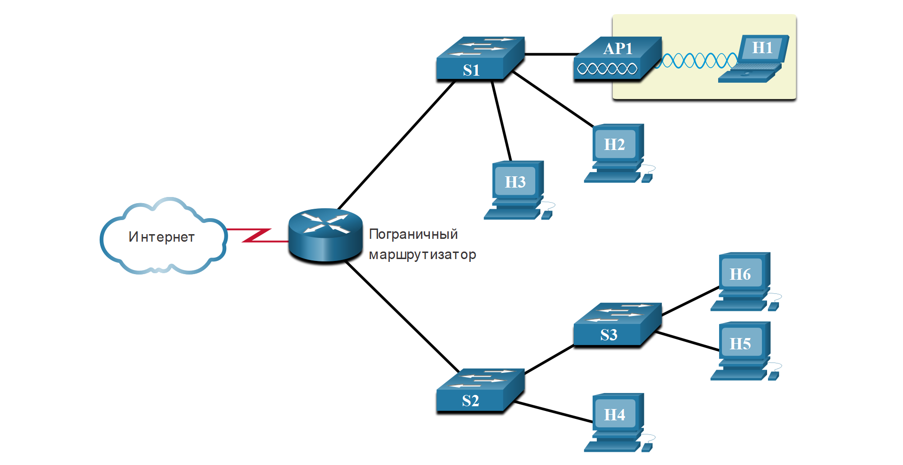
<!-- /courses/ensa-dl/ae8eb394-34fd-11eb-ba19-f1886492e0e4/aeb638c0-34fd-11eb-ba19-f1886492e0e4/assets/c6cec6f5-1c46-11ea-af56-e368b99e9723.svg -->

<!--
На рисунке показан домен сбоя точки доступа AP1. Облако, изображающее Интернет, подключено к пограничному маршрутизатору. Пограничный маршрутизатор имеет две разветвленные связи с двумя коммутаторами S1 и S2. S1 имеет каналы связи с двумя ПК с надписью H2 и H3 и точкой беспроводного доступа с надписью AP1. AP1 имеет беспроводное подключение к ноутбуку с надписью H1. Другой коммутатор S2 имеет каналы связи с коммутатором с меткой S3 и ПК с меткой H4. S3 имеет два канала связи с двумя ПК с надписью H5 и H6. Домен сбоя для AP1 состоит только из ПК H1, подключенного к AP1 по беспроводной сети.
-->

**S1**

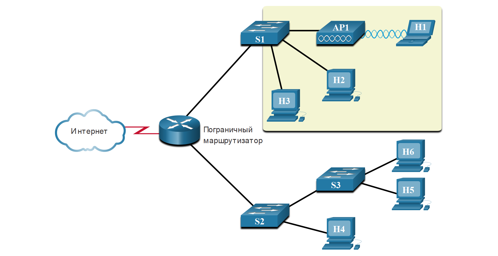
<!-- /courses/ensa-dl/ae8eb394-34fd-11eb-ba19-f1886492e0e4/aeb638c0-34fd-11eb-ba19-f1886492e0e4/assets/c6cf1510-1c46-11ea-af56-e368b99e9723.svg -->

<!--
На рисунке показана область сбоя S1. Облако, изображающее Интернет, подключено к пограничному маршрутизатору. Пограничный маршрутизатор имеет две разветвленные связи с двумя коммутаторами S1 и S2. S1 имеет каналы связи с двумя ПК с надписью H2 и H3 и точкой беспроводного доступа с надписью AP1. AP1 имеет беспроводное подключение к ноутбуку с надписью H1. Другой коммутатор S2 имеет каналы связи с коммутатором с меткой S3 и ПК с меткой H4. S3 имеет два канала связи с двумя ПК с надписью H5 и H6. Домен отказа для S1 состоит из всех устройств, подключенных к S1; ПК, H2 и H3, а также AP1 и его беспроводного соединения H1.
-->

**S2**

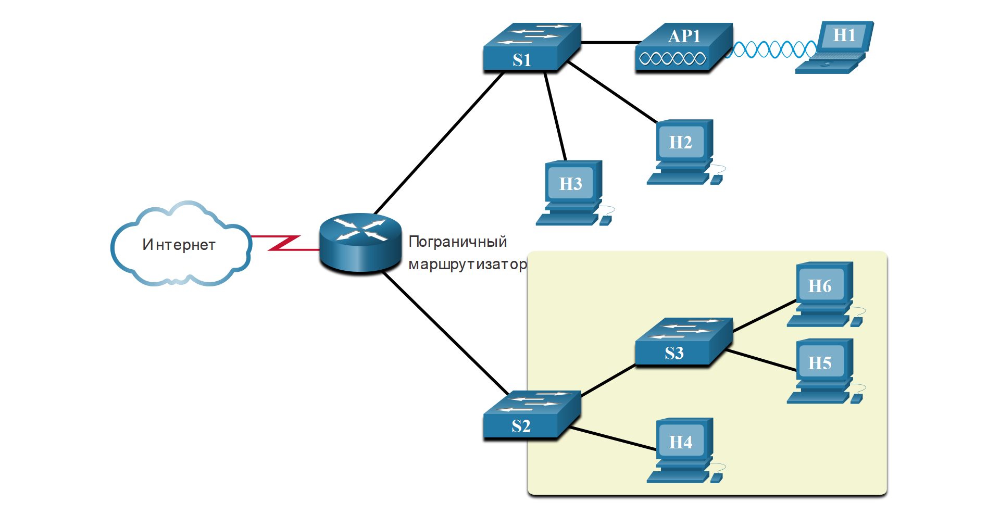
<!-- /courses/ensa-dl/ae8eb394-34fd-11eb-ba19-f1886492e0e4/aeb638c0-34fd-11eb-ba19-f1886492e0e4/assets/c6cf3c22-1c46-11ea-af56-e368b99e9723.svg -->

<!--
На рисунке показана область сбоя S2. Облако, изображающее Интернет, подключено к пограничному маршрутизатору. Пограничный маршрутизатор имеет две разветвленные связи с двумя коммутаторами S1 и S2. S1 имеет каналы связи с двумя ПК с надписью H2 и H3 и точкой беспроводного доступа с надписью AP1. AP1 имеет беспроводное подключение к ноутбуку с надписью H1. Другой коммутатор S2 имеет каналы связи с коммутатором с меткой S3 и ПК с меткой H4. S3 имеет два канала связи с двумя ПК с надписью H5 и H6. Домен сбоя для S2 состоит из всех устройств, подключенных к S2; ПК, H4 и S3, а также S3s ссылки на ПК H5 и H6.
-->

**S3**

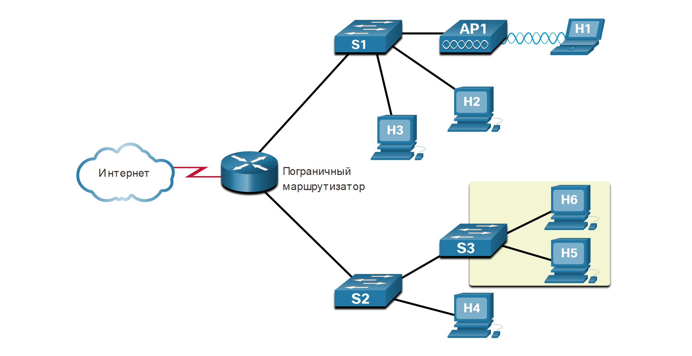
<!-- /courses/ensa-dl/ae8eb394-34fd-11eb-ba19-f1886492e0e4/aeb638c0-34fd-11eb-ba19-f1886492e0e4/assets/c6cf6333-1c46-11ea-af56-e368b99e9723.svg -->

<!--
На рисунке показана область сбоя S3. Облако, изображающее Интернет, подключено к пограничному маршрутизатору. Пограничный маршрутизатор имеет две разветвленные связи с двумя коммутаторами S1 и S2. S1 имеет каналы связи с двумя ПК с надписью H2 и H3 и точкой беспроводного доступа с надписью AP1. AP1 имеет беспроводное подключение к ноутбуку с надписью H1. Другой коммутатор S2 имеет каналы связи с коммутатором с меткой S3 и ПК с меткой H4. S3 имеет два канала связи с двумя ПК с надписью H5 и H6. Домен сбоя для S3 состоит из всех устройств, подключенных к S3; ПК H5 и H6.
-->

**Ограничение размера домена сбоя**

Поскольку сбой на уровне ядра сети может привести к серьезным последствиям, проектировщики сети нередко уделяют особое внимание предотвращению сбоев. Меры по предотвращению сбоев могут в значительной мере увеличить затраты на реализацию сети. Иерархическая модель архитектуры обеспечивает самый простой и экономичный метод контроля размера домена отказов на уровне распределения. На уровне распределения можно ограничить ошибки сети областью меньшего размера, благодаря чему они будут затрагивать меньшее количество пользователей. При использовании устройств уровня 3 на уровне распределения каждый маршрутизатор выступает в качестве шлюза для ограниченного количества пользователей уровня доступа.

**Развертывание блока коммутации**

Маршрутизаторы или многоуровневые коммутаторы обычно развертываются парами, при этом коммутаторы уровня доступа распределяются между ними равномерно. Данная конфигурация называется блоком коммутации здания или отдела. Каждый блок коммутации функционирует независимо от других. Поэтому в случае отказа отдельного устройства не будет сбоя всей сети. Даже сбой всего блока коммутации отражается лишь на незначительном количестве конечных пользователей.

<!-- 11.2.4 -->
## Увеличение пропускной способности

В иерархической модели сети в некоторых каналах между коммутаторами доступа и коммутаторами распределения может потребоваться обработка большего объема трафика, чем в других каналах. Поскольку трафик из нескольких каналов объединяется в одном исходящем канале, такой канал может стать «узким местом». Агрегация каналов, например EtherChannel, позволяет администратору увеличить пропускную способность между устройствами за счет создания единого логического канала, состоящего из нескольких физических каналов.

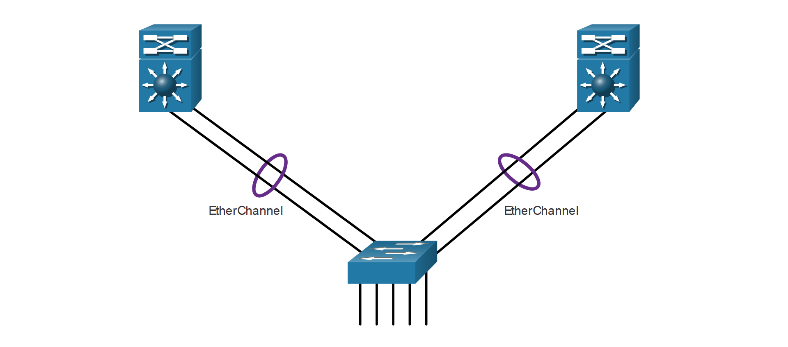
<!-- /courses/ensa-dl/ae8eb394-34fd-11eb-ba19-f1886492e0e4/aeb638c0-34fd-11eb-ba19-f1886492e0e4/assets/c6d02680-1c46-11ea-af56-e368b99e9723.svg -->

<!--
На рисунке показано увеличение полосы пропускания за счет использования EtherChannel и объединения нескольких каналов связи между коммутаторами. На рисунке есть два многоуровневых коммутатора с двумя каналами связи с коммутатором. Каналы объединены с помощью EtherChannel.
-->

EtherChannel использует существующие порты коммутатора. Таким образом, исключены дополнительные затраты на модернизацию канала с помощью более скоростного и дорогостоящего подключения. EtherChannel можно рассматривать как единый логический канал, использующий интерфейс EtherChannel. Большинство задач настройки выполняется на интерфейсе EtherChannel, а не на отдельных портах. Это обеспечивает согласованную конфигурацию на всех каналах. Наконец, конфигурация EtherChannel использует преимущества распределения нагрузки между каналами, которые относятся к одному каналу EtherChannel. В зависимости от аппаратной платформы может применяться один или несколько методов распределения нагрузки.

<!-- 11.2.5 -->
## Расширение уровня доступа

Сеть должна быть спроектирована таким образом, чтобы при необходимости дать возможность пользователям и устройствам расширить к ней доступ. Все более важное значение приобретает расширение возможностей подключения на уровне доступа посредством беспроводного подключения. Беспроводное подключение обладает множеством преимуществ, среди которых повышенная гибкость, снижение затрат и возможность расширения и адаптации к меняющимся требованиям сети и бизнеса.

Для беспроводного обмена данными конечным устройствам требуется беспроводная сетевая интерфейсная плата со встроенным радиопередатчиком/радиоприемником, а также драйвер, необходимый для работы этой платы. Кроме того, для подключения пользователей нужны беспроводной маршрутизатор и точка беспроводного доступа (AP), как показано на рисунке.

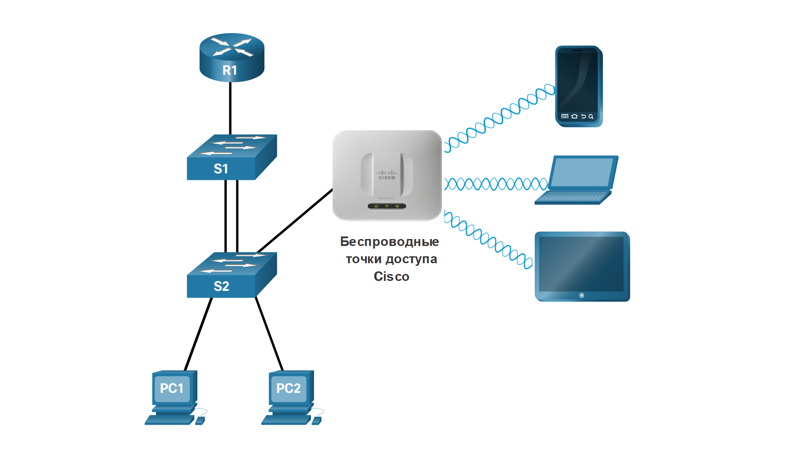
<!-- /courses/ensa-dl/ae8eb394-34fd-11eb-ba19-f1886492e0e4/aeb638c0-34fd-11eb-ba19-f1886492e0e4/assets/c6d0c2c0-1c46-11ea-af56-e368b99e9723.svg -->

<!--
На рисунке показана беспроводная точка доступа Cisco, соединяющая беспроводные устройства с сетью. Маршрутизатор R1 имеет соединение с коммутатором S1. S1 имеет избыточные каналы связи с другим коммутатором, S2. S2 имеет связи с двумя ПК и точкой беспроводного доступа Cisco. Точка беспроводного доступа Cisco подключается по беспроводной сети к мобильному телефону, ноутбуку и планшету.
-->

При реализации беспроводной сети необходимо учитывать множество факторов, в том числе типы используемых беспроводных устройств, требования к зоне покрытия беспроводной сети, возможные помехи и аспекты безопасности.

<!-- 11.2.6 -->
## Протоколы маршрутизации

Усовершенствованные протоколы маршрутизации, например OSPF, используемых в крупных сетях.

OSPF основывается на алгоритме состояния канала. Как показано на рисунке, OSPF работает нормально в сетях с более крупной иерархией, где важна быстрая сходимость. Маршрутизаторы OSPF устанавливают и поддерживают отношения смежности с другими маршрутизаторами OSPF, подключенными к сети. Маршрутизаторы OSPF синхронизируют свою базу данных состояния канала. При изменении сети отправляются обновления состояния канала, информирующие другие маршрутизаторы OSPF об изменении и установлении нового оптимального пути, если он доступен.

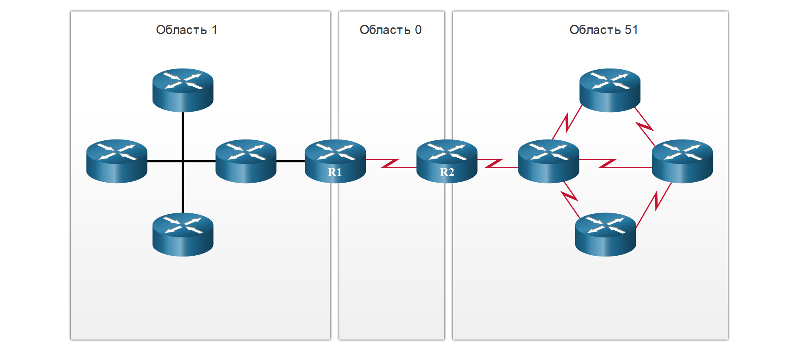
<!-- /courses/ensa-dl/ae8eb394-34fd-11eb-ba19-f1886492e0e4/aeb638c0-34fd-11eb-ba19-f1886492e0e4/assets/c6d110e3-1c46-11ea-af56-e368b99e9723.svg -->

<!--
На рисунке показано использование протоколов маршрутизации в больших сетях. На рисунке показаны три области OSPF: область 0, область 1 и область 51. Область 1 имеет четыре маршрутизатора, один из которых обозначен R1 на границе. R1 находится в области 1 и области 0. Область 0 имеет два маршрутизатора: R1 и R2. R2 находится в области 0 и области 51. Область 51 состоит из четырех маршрутизаторов, подключенных через последовательные каналы.
-->

<!-- 11.2.7 -->
<!-- quiz -->

