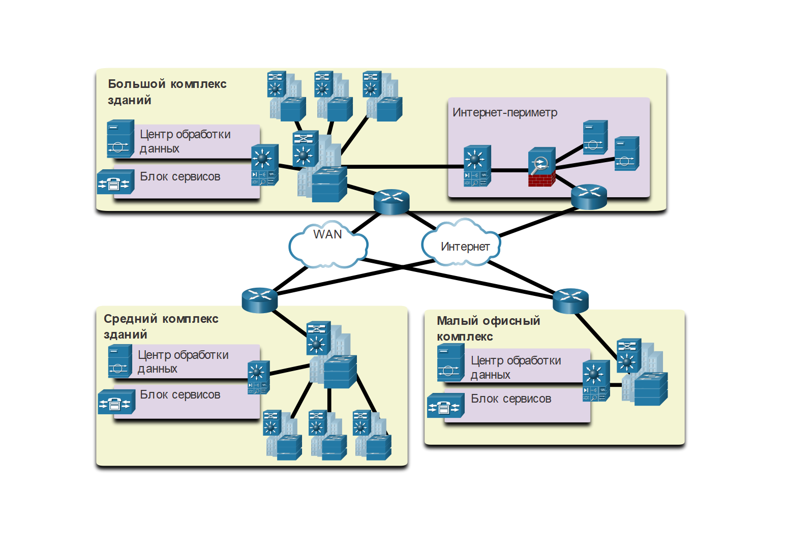
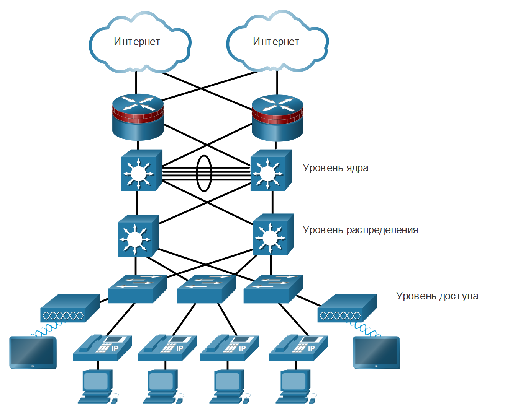
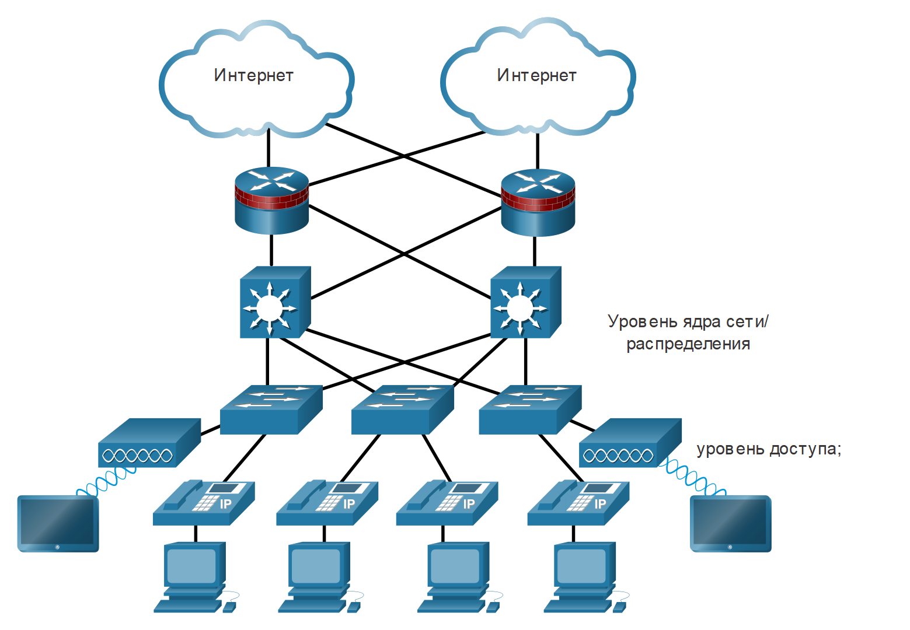
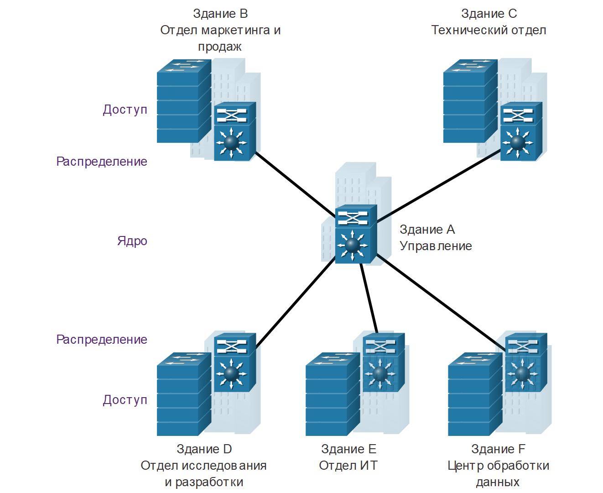
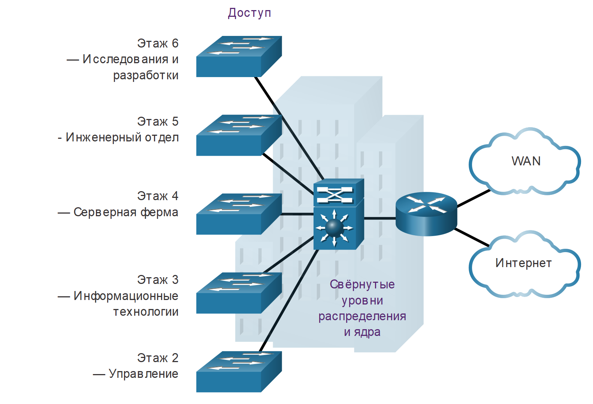
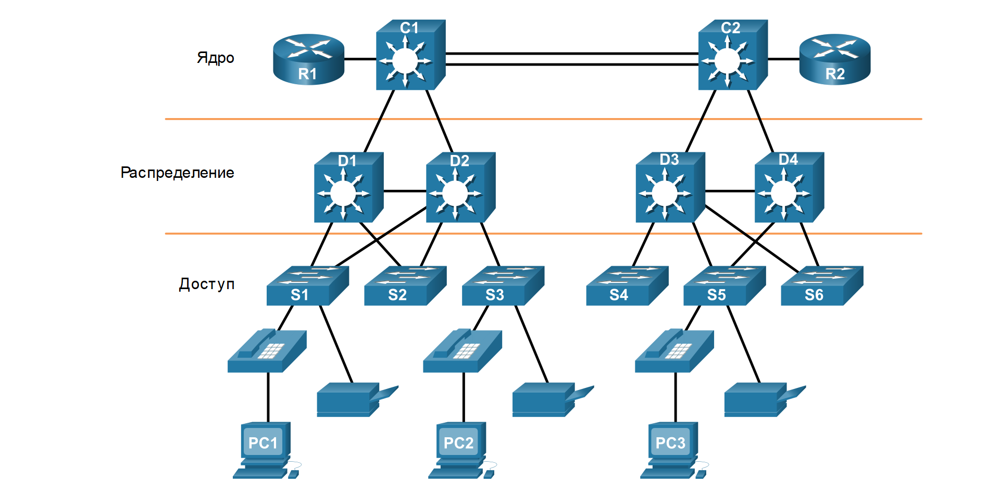

<!-- 11.1.1 -->
## Видео - Трехуровневая модель проектирования сети

<!-- 11.1.2 -->
## Необходимость масштабирования сети

Наш цифровой мир непрерывно развивается. Возможность доступа в Интернет и корпоративные сети больше не ограничиваются территорией офиса, географическим местоположением или часовым поясом. В современных компаниях сотрудники могут получить доступ к необходимым ресурсам и информации практически из любой точки мира, в любое время и с любого устройства. Подобные требования приводят к необходимости выстраивать сети нового поколения — сети, обеспечивающие большую безопасность, надежность и доступность.

Сети нового поколения должны не только соответствовать существующим ожиданиям и поддерживать современное оборудование, но также взаимодействовать с устаревшими платформами. Организации все больше полагаются на свои сети, предоставляющие критически важные сервисы. По мере роста и развития предприятия его штат увеличивается, открываются новые филиалы и компания выходит на международный уровень. Эти изменения непосредственно влияют на требования сети, которая должна быть в состоянии масштабироваться для удовлетворения потребностей бизнеса.

Нажмите кнопку воспроизведения на рисунке, чтобы просмотреть анимацию, демонстрирующую расширение сети небольшого размера.

<!--
Анимация, показывающая небольшую сеть, добавляющую локальную сеть по мере увеличения числа сотрудников. Компания выросла, и у нее появились филиалы в других местах города. Затем компания превращается в многогородское предприятие и начинает нанимать телеработников. Наконец, предприятие расширяется и в другие страны.
-->

Сеть должна обеспечивать обмен сетевым трафиком различного вида, включая файлы данных, электронные сообщения, IP-телефонию и работу с видео для нескольких бизнес-подразделений. Все корпоративные сети должны иметь возможность выполнять следующие действия:

* поддерживать работу критически важных приложений;
* поддерживать трафик в конвергентных сетях;
* соответствовать различным требованиям бизнеса;
* обеспечивать возможность централизованного административного управления.

Локальная сеть — это сетевая инфраструктура, которая обеспечивает доступ к сетевым подключениям и ресурсам связи для конечных пользователей и устройств. Конечные пользователи и устройства могут размещаться на одном этаже или в одном здании. Вы создаете кампусную сеть, соединяя несколько локальных сетей, занимающих небольшой район. Архитектуры кампусных сетей могут быть различными: от небольших сетей, состоящих из одного коммутатора локальной сети, до очень больших сетей с тысячами подключений.

<!-- 11.1.3 -->
## Коммутируемые сети без границ

Ввиду растущих требований к объединенным сетям развитие последних требует нового архитектурного подхода, учитывающего внедрение интеллекта, упрощение операций и масштабируемость сети в зависимости от потребностей будущих пользователей. Одна из последних разработок в области проектирования сетей — концепция сети без границ Cisco.

Сеть без границ Cisco — это сетевая архитектура, которая объединяет инновационную идею и проектирование. Основываясь на этой архитектуре, организации могут обеспечить поддержку сети без границ, которая безопасно, надежно и удобно связывает пользователей любых устройств, в любое время и в любом месте. Эта сетевая архитектура разработана специально для решения информационных и деловых вопросов, например поддержки объединенной сети и непрерывно меняющихся схем организации работ.

Сеть без границ Cisco предоставляет платформу для объединения средств проводного и беспроводного доступа, включая применение политик, разграничение доступа и управление производительностью устройств различных типов. Сеть без границ, использующая такую архитектуру, строится на основе масштабируемой и отказоустойчивой иерархической инфраструктуры аппаратного обеспечения.

<!-- /courses/ensa-dl/ae8eb394-34fd-11eb-ba19-f1886492e0e4/aeb611b6-34fd-11eb-ba19-f1886492e0e4/assets/c6c6d7b1-1c46-11ea-af56-e368b99e9723.svg -->

<!--
На рисунке показаны примеры сети Cisco без границ. Есть 3 кампуса, большие, средние и малые, подключенные через WAN/Интернет. Большой кампус имеет основной кампус и три филиала. Он имеет центр обработки данных, блок сервисов и центр подключения к сети интернет. Центр подключения к сети интернет подключен к глобальной сети и облаку Интернета. Средний кампус имеет основной кампус и три филиала. Он имеет центр обработки данных и блок сервисов. Он имеет маршрутизатор на краю сети, подключенный к глобальной сети и облаку Интернета. Небольшой кампус имеет одно здание. Он имеет центр обработки данных и блок сервисов. Он имеет маршрутизатор на краю сети, подключенный к глобальной сети и облаку Интернета.
-->

Объединяя эту аппаратную инфраструктуру с программными решениями на основе политик, сеть без границ Cisco предоставляет два главных набора сервисов: сетевые сервисы и сервисы для пользователей и оконечных устройств под эгидой интегрированного решения управления. В результате разные сетевые элементы могут совместно работать, пользователи получают повсеместный доступ к ресурсам в любое время, обеспечиваются оптимизация, масштабируемость и безопасность.

<!-- 11.1.4 -->
## Иерархия в коммутируемой сети без границ

Для обеспечения максимальной доступности, гибкости, безопасности и удобства эксплуатации коммутируемой сети без границ в процессе ее создания необходимо следовать четким принципам проектирования. Коммутируемая сеть без границ должна соответствовать текущим и возможным будущим требованиям к работе сервисов и технологий. Руководство по проектированию коммутируемой сети без границ построено на следующих принципах:

* **Иерархичность** — упрощает понимание роли каждого устройства на каждом уровне, обеспечивает поддержку в процессе развертывания, эксплуатации и управления, а также снижает количество неполадок на каждом уровне.
* **Модульность** — позволяет при необходимости легко расширять сеть и внедрять интегрированные сервисы по запросу.
* **Отказоустойчивость** — обеспечивает бесперебойную работу сети в соответствии с ожиданиями пользователей.
* **Гибкость** — обеспечивает рациональное распределение нагрузки трафика за счет использования всех сетевых ресурсов.

Перечисленные принципы зависят друг от друга. Именно поэтому крайне важно понимать природу и способы их взаимодействия в рамках коммутируемой сети. Иерархическое проектирование коммутируемой сети без границ создает основу, которая позволяет сетевым разработчикам объединять функции безопасности, мобильности и унифицированной коммуникации. Основой иерархического проектирования сетей кампусного типа являются дважды проверенные и одобренные к применению трехуровневые и двухуровневые модели.

Три основных уровня в рамках рассматриваемых многоуровневых проектов представляют собой уровни доступа, распределения и ядра. Каждый уровень можно рассматривать как четкий, структурированный модуль кампусной сети, наделенный определенными ролями и функциями. Введение принципа модульности в иерархическую архитектуру сети дает дополнительную гарантию — кампусные сети модульных конструкций демонстрируют большую надежность и гибкость в отношении обеспечения важнейших сетевых сервисов. Модульность также способствует расширению сети и внесению изменений, происходящих с течением времени.

**Трехуровневая модель**

<!-- /courses/ensa-dl/ae8eb394-34fd-11eb-ba19-f1886492e0e4/aeb611b6-34fd-11eb-ba19-f1886492e0e4/assets/c6c79b00-1c46-11ea-af56-e368b99e9723.svg -->

<!--
На рисунке показан пример трехуровневой модели. На вершине есть два облака, изображающие Интернет. Существуют избыточные каналы, подключающиеся к двум маршрутизаторам брандмауэра. Маршрутизаторы имеют избыточные связи с двумя многослойными коммутаторами основного уровня. Коммутаторы имеют EtherChannel между собой с четырьмя каналами. Они также имеют избыточные связи с двумя многослойными коммутаторами уровня распределения. Коммутаторы уровня распространения имеют избыточные связи с тремя коммутаторами уровня доступа. Два коммутатора имеют каналы до точек доступа. Обе точки доступа имеют подключение к планшетам. Коммутаторы уровня доступа также подключены к IP-телефонам и ПК.
-->

**Двухуровневая модель**

<!-- /courses/ensa-dl/ae8eb394-34fd-11eb-ba19-f1886492e0e4/aeb611b6-34fd-11eb-ba19-f1886492e0e4/assets/c6c81030-1c46-11ea-af56-e368b99e9723.svg -->

<!--
На рисунке показан пример двухуровневой модели. На вершине есть два облака, изображающие Интернет. Существуют избыточные каналы, подключающиеся к двум маршрутизаторам брандмауэра. Маршрутизаторы имеют избыточные связи с двумя многослойными коммутаторами уровня ядра и распределения. Коммутаторы уровня ядра и распределения имеют избыточные связи с тремя коммутаторами уровня доступа. Два коммутатора имеют каналы до точек доступа. Обе точки доступа имеют подключение к планшетам. Коммутаторы уровня доступа также подключены к IP-телефонам и ПК.
-->

<!-- 11.1.5 -->
## Функции уровней доступа, распределения и ядра

Уровни доступа, распределения и ядра выполняют определенные функции в иерархической структуре сети.

**Уровень доступа**

Уровень доступа представляет периметр сети, где трафик входит или покидает сеть кампусного типа. Традиционно основная функция коммутатора уровня доступа заключается в обеспечении пользователю сетевого доступа. Коммутаторы уровня доступа подключаются к коммутаторам уровня распределения, которые реализуют технологии сетевой инфраструктуры, такие как маршрутизация, качество обслуживания и безопасность.

Для соответствия требованиям сетевых приложений и конечных пользователей коммутационные платформы нового поколения предоставляют более сошедшиеся, интегрированные и интеллектуальные сервисы для различных типов конечных устройств по периметру сети. Внедрение интеллектуальных функций в коммутаторы уровня доступа обеспечивает более эффективную и безопасную работу приложений сети.

**Уровень распределения**

Уровень распределения взаимодействует между уровнем доступа и уровнем ядра для обеспечения многих важных функций:

* возможность агрегации больших проводных сетей в коммуникационном шкафу;
* агрегация широковещательных доменов уровня 2 и границ маршрутизации уровня 3;
* предоставление доступа интеллектуальной коммутации, маршрутизации и функций политики доступа к остальной части сети;
* обеспечение высокого уровня доступности ядра для конечных пользователей и наличие маршрутов равной стоимости посредством резервных коммутаторов уровня распределения;
* предоставление дифференцированных услуг приложениям с различными классами обслуживания по периметру сети.

**Уровень ядра**

Уровень ядра — это сетевая магистраль. Данный уровень объединяет несколько уровней сети кампусного типа. Уровень ядра служит агрегатором для всех устройств уровня распределения и связывает кампус вместе с остальной частью сети. Основная задача уровня ядра заключается в обеспечении изоляции сбоев и высокоскоростного магистрального подключения.

<!-- 11.1.6 -->
## Трехуровневые и двухуровневые примеры

**Пример трехуровневой сети**

На рисунке представлена трехуровневая архитектура сети кампусного типа для организаций, в которых уровни доступа, распределения и ядра являются отдельными уровнями. Для создания упрощенного, масштабируемого, рентабельного и эффективного проекта физической структуры кабельной сети рекомендуется выстраивать физическую топологию сети по типу расширенной звезды от центрального здания до всех остальных зданий в рамках одного комплекса.

<!-- /courses/ensa-dl/ae8eb394-34fd-11eb-ba19-f1886492e0e4/aeb611b6-34fd-11eb-ba19-f1886492e0e4/assets/c6c921a0-1c46-11ea-af56-e368b99e9723.svg -->

<!--
На рисунке показан пример проектирования трехуровневой сети кампуса. Есть шесть зданий, названных от А до Ф. Здание А называется Управление, Здание Б — Маркетинг и Продажи, Здание С — Технический отдел, Здание D — Исследования и разработки, Здание Е — Информационные технологии и Здание F — Центр обработки данных. Здания B - F соединены со зданием A в топологии hub and spoke. Здание A находится на уровне ядра. Все здания B - F находятся на уровнях распределения и доступа.
-->

**Пример двухуровневой сети**

В некоторых случаях, когда отсутствует высокая масштабируемость физической инфраструктуры или сети, разграничение уровней распределения и ядра не требуется. Разделение между уровнем ядра и уровнем распределения может не понадобиться в небольшой кампусной сети, в которой количество подключенных к сети пользователей невелико, или когда подразделение кампуса состоит из одного здания. При таком варианте рекомендуется использовать альтернативную двухуровневую схему сети комплекса зданий, также называемую схемой сети со свернутым ядром, как показано на рисунке.

<!-- /courses/ensa-dl/ae8eb394-34fd-11eb-ba19-f1886492e0e4/aeb611b6-34fd-11eb-ba19-f1886492e0e4/assets/c6c96fc1-1c46-11ea-af56-e368b99e9723.svg -->

<!--
На рисунке показан пример проектирования двухуровневой сети кампуса. На рисунке показана топология этого здания. Граничный маршрутизатор имеет два канала связи один к глобальной сети и другой к Интернету. Маршрутизатор соединен с многоуровневым коммутатором. Маршрутизатор и многоуровневый коммутатор составляют свернутый уровень ядра/распределения. многоуровневый коммутатор имеет ссылки на пять коммутаторов на уровне доступа. Коммутаторы уровня доступа имеют маркировку: Этаж 6 Исследования и разработки, Этаж 5 Инженерный, Этаж 4 Серверная ферма, Этаж 3 Информационные технологии и Этаж 2 Управление. 
-->

<!-- 11.1.7 -->
## Роль коммутируемых сетей

За последние два десятилетия роль коммутируемых сетей существенно возросла. Совсем недавно повсеместно использовались плоские коммутируемые сети 2-го уровня. Для передачи трафика локальной сети в организации плоские коммутируемые сети 2-го уровня использовали Ethernet-подключения и распространенные узловые ретрансляторы.

Как показано на рисунке, в иерархической топологии произошла радикальная замена сетей на коммутируемые LAN.

<!-- /courses/ensa-dl/ae8eb394-34fd-11eb-ba19-f1886492e0e4/aeb611b6-34fd-11eb-ba19-f1886492e0e4/assets/c6c9e4f0-1c46-11ea-af56-e368b99e9723.svg -->

<!--
На рисунке показана роль коммутируемых сетей в иерархической сети. На уровне ядра расположены два маршрутизатора и два многосуровневых коммутатора. Маршрутизаторы находятся за пределами многоуровневых коммутаторов. Между многоуровневыми коммутаторами имеются избыточные связи. Оба коммутатора подключены к двум многоуровневым коммутаторам уровня распределения, в общей сложности четыре коммутатора распределения. Распределяющие коммутаторы разделены на две пары. Каждая пара имеет канал связи между ними, а также избыточные каналы связи с тремя коммутаторами уровня доступа, в общей сложности шесть коммутаторов уровня доступа. Коммутаторы уровня доступа имеют соединения с IP-телефонами, принтерами и ПК.
-->

Коммутируемая локальная сеть обеспечивает дополнительную гибкость, управление трафиком, качество обслуживания и безопасность. Он также обеспечивает поддержку беспроводных сетей и подключения, а также поддержку других технологий, таких как IP-телефонии и услуги мобильной связи.

<!-- 11.1.8 -->
<!-- quiz -->

