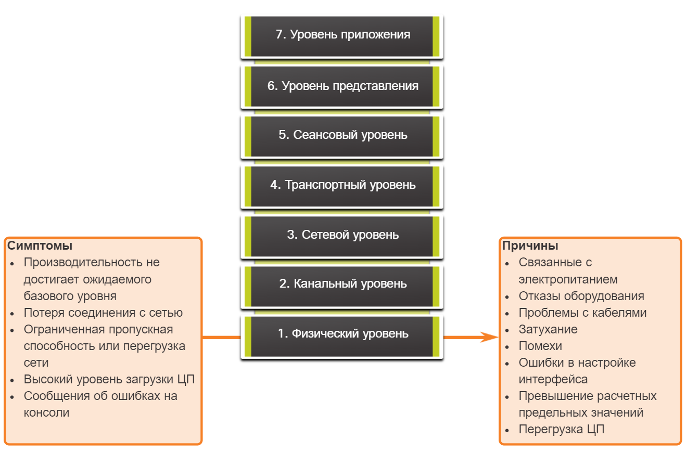
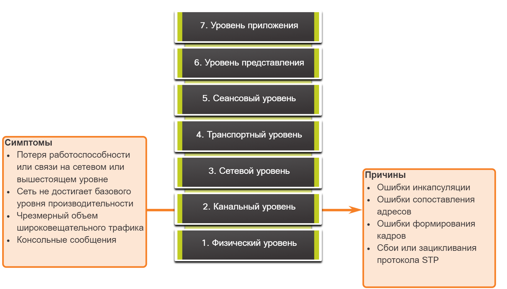
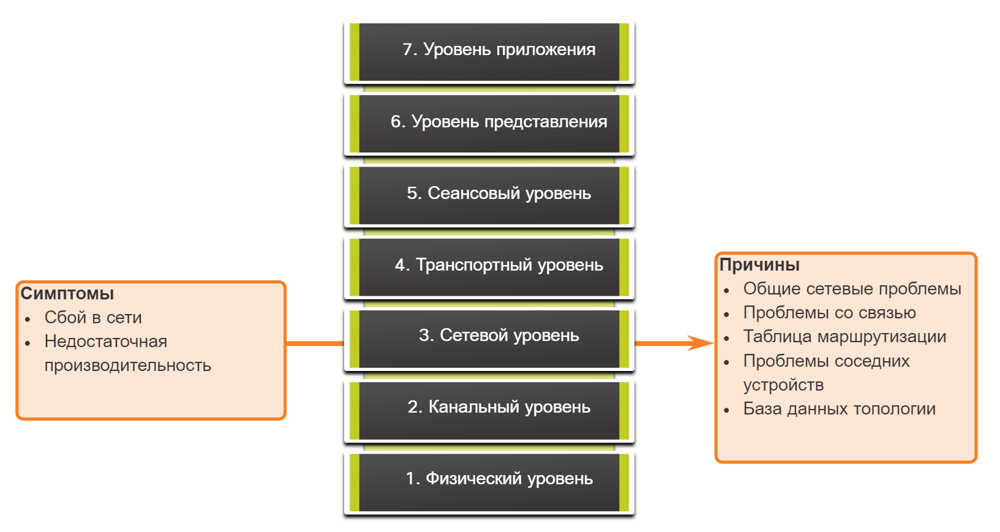
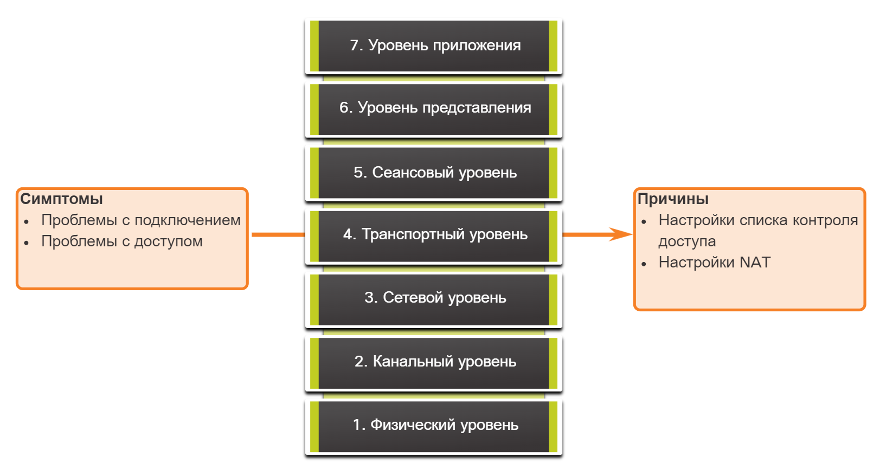
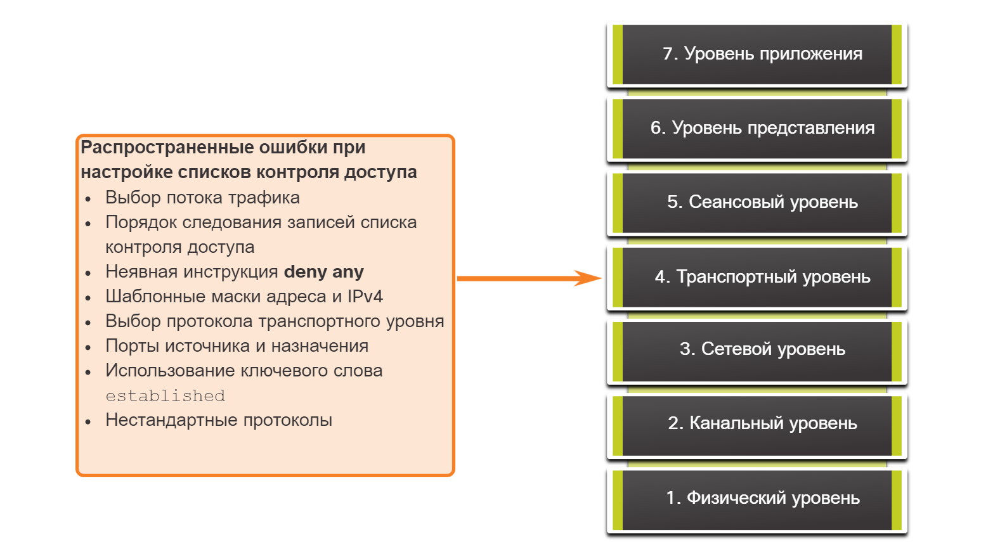
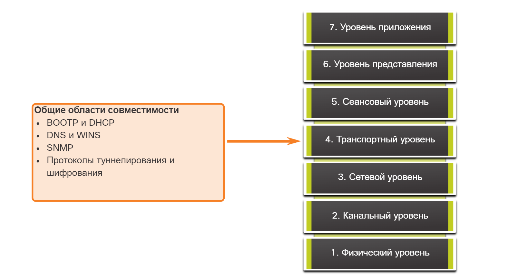
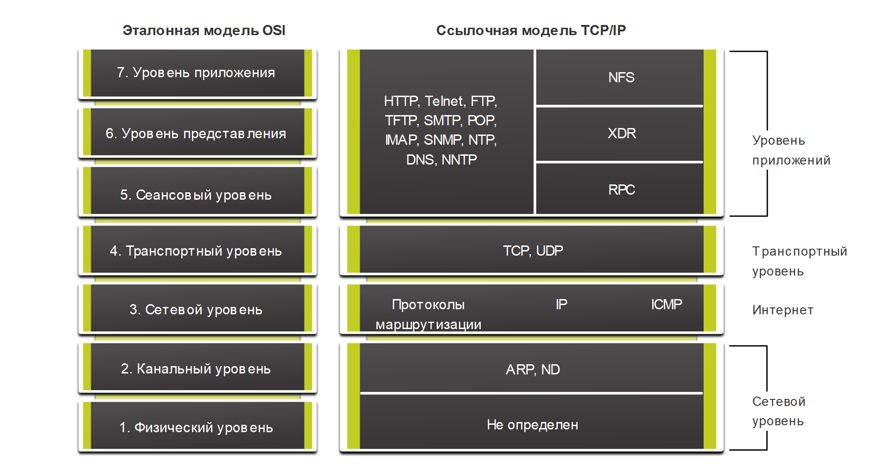

<!-- 12.4.1 -->
## Поиск и устранение неполадок на физическом уровне

Теперь, когда у вас есть документация, некоторые знания методов устранения неполадок и программные и аппаратные средства для диагностики проблем, вы готовы начать поиск и устранение неисправностей! В этом разделе рассматриваются наиболее распространенные проблемы, возникающие при устранении неполадок в сети.

Во многих случаях проблемы в сети проявляются как проблемы с производительностью. Проблемы с производительностью означают, что имеется разница между ожидаемым и наблюдаемым режимом работы и что система не функционирует должным образом. Отказы и неоптимальные состояния на физическом уровне не только создают неудобства пользователям, но и могут отрицательно влиять на уровень производительности всей компании. Сети, где возникают подобные ситуации, обычно перестают работать. Так как верхние уровни модели OSI зависят от функционирования физического уровня, то администратор сети должен иметь возможность эффективно изолировать и устранять проблемы на этом уровне.

На рисунке обобщены симптомы и причины проблем с сетью физического уровня.

<!-- /courses/ensa-dl/ae8eb396-34fd-11eb-ba19-f1886492e0e4/aeb65fd0-34fd-11eb-ba19-f1886492e0e4/assets/c6f53ab0-1c46-11ea-af56-e368b99e9723.svg -->

<!--
На рисунке обобщены симптомы и причины проблем с сетью физического уровня. На рисунке показана 7-уровневая модель OSI с симптомами и причинами на физическом уровне. Эти симптомы: производительность ниже базового уровня, потеря подключения, узкие места или перегрузка сети, высокая загрузка ЦП и сообщения об ошибках консоли. Причины: связанные с питанием, неисправности оборудования, неисправности кабелей, затухание, шум, ошибки конфигурации интерфейса, превышение проектных ограничений и перегрузка ЦП. 
-->

В таблице перечислены распространенные симптомы проблем с сетью физического уровня.

| **Признак** | **Описание** |
| --- | --- |
| **Уровень производительности ниже базового**  | <ul><li>Требуются предыдущие исходные условия для сравнения.</li><li>наиболее распространенными причинами медленного или плохого функционирования являются перегрузка или недостаточная вычислительная мощность серверов, ненадлежащая настройка коммутаторов или маршрутизаторов, затор трафика в канале с низкой пропускной способностью и постоянная потеря кадров.</li></ul> |
| **Потеря связи**  | <ul><li>Потеря связи — если кабель или устройство выходит из строя; наиболее очевидным симптомом является потеря связи между устройствами, которые обмениваются данными по данному каналу с неисправным устройством либо интерфейсом.</li><li>Такую ситуацию можно обнаружить путем отправки обычного ping-запроса (ping). </li><li>Неустойчивая связь может указывать на плохой электрический контакт или окислившиеся контактные поверхности.</li></ul> |
| **Ограниченная пропускная способность или перегрузка сети**  | <ul><li>Если маршрутизатор, интерфейс или кабель выходит из строя, то протоколы маршрутизации могут перенаправить трафик на другие маршруты, которые не рассчитаны на обработку дополнительного трафика. Это может привести к затору или появлению</li><li>«узких мест» в таких зонах сети.</li></ul> |
| **Высокая интенсивность использования ЦП**  | <ul><li>Высокая интенсивность использования ЦП — высокая интенсивность использования ЦП говорит о том, что устройство, например маршрутизатор, коммутатор или сервер, работает на пределе своей расчетной производительности или превышает его.</li><li>Если данную проблему быстро не устранить, то перегрузка ЦП может привести к выключению или отказу устройства.</li></ul> |
| **Консольные сообщения об ошибках**  | <ul><li>Консольные сообщения об ошибках — сообщения об ошибках, выводимые на консоли устройства, указывают на проблему на физическом уровне.</li><li>Сообщения консоли должны регистрироваться на центральном сервере системного журнала.</li></ul> |

К общим сетевым проблемам на физическом уровне относятся следующие:

| **Причина проблемы** | **Описание** |
| --- | --- |
| **Связанные с электропитанием**  | <ul><li>Это основная причина сбоя сети. </li><li>Также необходимо проверить режим работы вентиляторов и убедиться, что впускные и вытяжные вентиляционные каналы шасси не загрязнены. </li><li>Если на другие расположенные поблизости устройства также не поступает электропитание, то предположительно неисправен основной источник питания.</li></ul> |
| **Отказы оборудования**  | <ul><li>Неисправные платы сетевых интерфейсов (NIC) могут быть причиной ошибок при передаче данных в сети вследствие коллизий, коротких кадров и некорректных сигналов. Некорректный сигнал (Jabber)</li><li>часто определяется как состояние, при котором сетевое устройство непрерывно передает беспорядочные и бессмысленные данные в сеть.</li><li>Другими вероятными причинами таких сигналов являются поврежденные файлы драйверов сетевых карт, плохие кабельные соединения или проблемы с заземлением.</li></ul> |
| **Проблемы с кабелями**  | <ul><li>Многие проблемы можно устранить путем повторного подключения кабелей, которые были частично отсоединены.</li><li>Во время физического контроля обращайте внимание на поврежденные кабели, неправильные типы кабелей и дефектные разъемы RJ-45.</li><li>Предположительно неисправные кабели следует проверить и заменить исправными.</li></ul> |
| **Затухание**  | <ul><li>Затухание может происходить в тех случаях, если длина кабеля превышает расчетный предел для среды передачи данных, или при наличии некачественного подключения вследствие применения некачественного кабеля,</li><li>либо загрязненных или окисленных контактов. Если уровень ослабления высокий, то принимающее устройство не всегда сможет успешно отличать друг от друга битовые компоненты в потоке данных.</li></ul> |
| **Шум**  | <ul><li>Шум — обычно шумом называются локальные электромагнитные помехи (EMI).</li><li>Шум могут создавать разные источники, такие как радиостанции, полицейские системы радиосвязи, системы обеспечения безопасности в зданиях, авиационные системы для автоматической посадки, перекрестные помехи (шум, наводимый другими кабелями в том же кабельном канале, или соседними кабелями), расположенные поблизости электрические кабели, устройства с крупными электродвигателями или любое оборудование, содержащее радиопередатчик, более мощный, чем мобильный телефон.</li></ul> |
| **Ошибки в настройке интерфейса**  | <ul><li>На интерфейсе многие параметры могут оказаться неправильно настроенными, что может приводить к неработоспособности интерфейса, например неправильная тактовая частота, неправильный источник синхронизации, а также состояние, когда интерфейс не включен.</li><li>Это приводит к потере связи с подключенными сегментами сети.</li></ul> |
| **Превышение расчетных предельных значений**  | <ul><li>Компонент может работать некорректно на физическом уровне, если он используется с нарушением технических спецификаций или возможностей конфигурации.</li><li>При устранении проблем такого типа становится очевидно, что ресурсы для устройства работают на максимальном пределе или почти на максимальном уровне, что приводит к увеличению количества ошибок интерфейса.</li></ul> |
| **Перегрузка ЦП**  | <ul><li>К симптомам относятся процессы с высоким процентом загрузки ЦП, снижение количества входных очередей, низкая производительность, истечение времени ожидания SNMP, отсутствие удаленного доступа, медленная работа или отсутствие ответа сервисов, таких как DHCP, Telnet и ping.</li><li>На коммутаторе может произойти следующее: повторная сходимость протокола связующего дерева, скачкообразная работа каналов EtherChannel, нестабильность UDLD, сбои IP SLA.</li><li>Маршрутизаторы могут столкнуться с отсутствием обновлений маршрутизации, нестабильностью маршрутов или нестабильностью HSRP.</li><li>Одной из причин перегрузки ЦП на маршрутизаторе или коммутаторе может быть интенсивный трафик.</li><li>Если один или несколько интерфейсов постоянно оказываются в состоянии перегрузки по трафику, то рекомендуется перераспределить потоки трафика в сети или модернизировать аппаратное обеспечение.</li></ul> |

<!-- 12.4.2 -->
## Поиск и устранение неполадок канального уровня

Процесс поиска и устранения неполадок на уровне 2 может быть довольно сложным. Настройка и функционирование этих протоколов являются крайне важными аспектами для создания функциональной, хорошо настроенной сети. Проблемы на уровне 2 имеют отличительные признаки, которые в случае их обнаружения позволят оперативно выявить проблему.

На рисунке обобщены симптомы и причины проблем сети на уровне канала данных.

<!-- /courses/ensa-dl/ae8eb396-34fd-11eb-ba19-f1886492e0e4/aeb65fd0-34fd-11eb-ba19-f1886492e0e4/assets/c6f62511-1c46-11ea-af56-e368b99e9723.svg -->

<!--
На рисунке обобщены симптомы и причины проблем сети на уровне канала данных. На рисунке показана 7-уровневая модель OSI с симптомами и причинами на канальном уровне. Симптомы: Неработоспособность или отсутствие связи на сетевом уровне или выше расположенных уровнях, Фактический уровень производительности сети ниже базового, Чрезмерный широковещательный трафик, Консольные сообщения. Причинами являются ошибки инкапсуляции, ошибки сопоставления адресов, ошибки формирования кадров и сбои STP или коммутационные петли.
-->

В таблице перечислены распространенные симптомы сетевых проблем на  канальном уровне.

| **Признак** | **Описание** |
| --- | --- |
| **Потеря подключения или работоспособности сети на сетевом и вышестоящих уровнях** | Некоторые проблемы уровня 2 могут остановить обмен кадрами по каналу передачи данных, в то время как другие приводят к ухудшению производительности сети. |
| **Сеть не достигает базового показателя производительности**  | <ul><li>Существует два различных типа не оптимальных операций уровня 2, которые может возникнуть в сети. </li><li>Во-первых, передача кадров по неоптимальному пути к месту назначения, что приводит к неожиданно высокому потреблению пропускной способности каналов передачи данных. </li><li>Во-вторых, некоторые кадры отбрасываются, как определенные через статистику учета ошибок и через консольные сообщения, которые появляются на коммутаторе или маршрутизаторе. </li><li>Расширенный или непрерывный ping может помочь определить, начинают ли кадры отбрасываться.</li></ul> |
| **Чрезмерный объем широковещательного трафика**  | <ul><li>Операционные системы широко используют широковещательные и многоадресные передачи для обнаружение сетевых служб и других узлов. </li><li>Как правило, чрезмерный широковещательный трафик возникает в следующих ситуациях: плохо разработанные или настроенные приложения, крупные домены на уровне 2 для широковещательной рассылки или базовые сетевые проблемы, например петли STP или нестабильность маршрутов.</li></ul> |
| **Консольные сообщения**  | <ul><li>В некоторых случаях маршрутизатор обнаруживает проблему на уровне 2 и посылает предупреждающие сообщения на консоль. </li><li>Как правило, это происходит при интерпретации входящих кадров (проблемы с инкапсуляцией или формированием кадров) или при отсутствии сообщений keepalive, которые должны поступать. </li><li>Самое распространенное сообщение об ошибке на консоли — отключение протокола, свидетельствующее о проблеме на 2-м уровне сети.</li></ul> |

В таблице перечислены проблемы, которые обычно вызывают проблемы с сетью на  канальном уровне.

| **Причина проблемы** | **Описание** |
| --- | --- |
| **Ошибки инкапсуляции** | <ul><li>Ошибка инкапсуляции происходит в случае, если биты, помещаемые отправителем в конкретное поле, отличаются от битов, которые получатель предполагает увидеть. </li><li>Это состояние возникает, если настройки инкапсуляции на обоих концах канала WAN отличаются друг от друга.</li></ul> |
| **Ошибки сопоставления адресов** | <ul><li>В таких топологиях, как «точка — несколько точек», Frame Relay или широковещательный Ethernet, необходимо, чтобы кадр содержал соответствующий адрес назначения на уровне 2. Это обеспечит прибытие кадра в нужное место назначения. </li><li>Для этого сетевое устройство должно сопоставлять адрес назначения на уровне 3 с правильным адресом на уровне 2 с помощью статических или динамических сопоставлений. </li><li>В динамической среде при сопоставлении информации на уровнях 2 и 3и. могут происходить ошибки, так как на устройствах может быть настроен запрет, не позволяющий им отвечать на запросы ARP, а сохраненная в кэше информация на уровне 2 или 3 могла быть физически изменена либо были получены недействительные отклики ARP вследствие неправильной настройки или атак.</li></ul> |
| **Ошибки формирования кадров** | <ul><li>Обычно кадры формируются в виде групп из 8-битовых байтов </li><li>Ошибка формирования кадров возникает, если кадр не заканчивается на границе 8-битового байта. </li><li>В этом случае у получателя могут возникнуть проблемы при определении окончания одного кадра и начала другого. </li><li>Слишком большое количество неправильных кадров может приводить к невозможности обмена сообщениями keepalive. </li><li>Ошибки формирования кадров могут быть вызваны высоким уровнем помех на последовательной линии, неправильно спроектированным кабелем (слишком длинным или неправильно экранированным), неисправной сетевой интерфейсной платой, несоответствием дуплексных режимов или некорректно настроенными тактовыми сигналами на устройствах обслуживания канала.</li></ul> |
| **Сбои или петли STP** | <ul><li>Протокол STP предназначен для преобразования физической топологии с резервными путями в древовидную топологию путем блокировки резервных портов. </li><li>Большинство проблем STP связаны с возникновением петель передачи данных, которые возникают, если в топологии с резервными путями не заблокированы порты, вследствие чего происходит циклическое перенаправление трафика, а также чрезмерная лавинная рассылка вследствие очень частого изменения топологии STP. </li><li>В хорошо настроенной сети перестроение топологии случается крайне редко. </li><li>Если канал между двумя коммутаторами начинает или перестает работать, то, в конечном счете, происходит изменение топологии (меняется состояние порта в STP, так как порт начинает или перестает участвовать в передаче данных). </li><li>Однако если порт работает неустойчиво (быстрое чередование состояний up и down), то это будет вызывать частые изменения топологии и лавинную рассылку либо медленную сходимость или повторное схождение STP. </li><li>Такая ситуация может быть вызвана несоответствием между реальной и задокументированной топологией, ошибкой настройки, например противоречивой настройкой таймеров STP, перегрузкой ЦП коммутатора во время схождения или ошибкой в программном обеспечении.</li></ul> |

<!-- 12.4.3 -->
## Поиск и устранение неполадок сетевого уровня

Проблемы сетевого уровня включают любые проблемы, связанные с протоколом уровня 3, такие как IPv4, IPv6, EIGRP, OSPF и т.д. На рисунке обобщены симптомы и причины проблем сетевого уровня.

<!-- /courses/ensa-dl/ae8eb396-34fd-11eb-ba19-f1886492e0e4/aeb65fd0-34fd-11eb-ba19-f1886492e0e4/assets/c6f784a2-1c46-11ea-af56-e368b99e9723.svg -->

<!--
На рисунке обобщены симптомы и причины проблем сети на сетевом уровне. На рисунке показана 7-уровневая модель OSI с симптомами и причинами на сетевом уровне. Симптомы: сбой сети и неоптимальная производительность. Причинами являются общие проблемы с сетью, проблемы с подключением, таблица маршрутизации, проблемы с соседями и база данных топологии.
-->

В таблице перечислены распространенные симптомы сетевых проблем на сетевом уровне.

| **Признак** | **Описание** |
| --- | --- |
| **Сбой в сети**  | <ul><li>Сбой в сети происходит в тех случаях, когда сеть полностью или частично неработоспособна, что сказывается на всех пользователях и приложениях в сети. </li><li>Обычно о таких сбоях быстро сообщают пользователи и сетевые администраторы, и они отрицательно влияют на уровень производительности компании.</li></ul> |
| **Недостаточная производительность**  | <ul><li>Проблемы оптимизации сети обычно распространяются на группу пользователей, приложений, пунктов назначения или на конкретный тип трафика. </li><li>Проблемы оптимизации бывает трудно обнаружить, а также довольно сложно изолировать и диагностировать. </li><li>Это связано с тем, что обычно они затрагивают несколько уровней или даже сам хост целиком. </li><li>Для того чтобы определить, относится ли проблема к сетевому уровню, может потребоваться некоторое время.</li></ul> |

Во многих сетях статические маршруты используются вместе с динамическими протоколами маршрутизации. Неправильная настройка статических маршрутов может привести к неоптимальной маршрутизации. В некоторых случаях из-за неправильно настроенных статических маршрутов могут появляться петли маршрутизации, делающие невозможной связь с отдельными частями сети.

При отладке динамических протоколов маршрутизации требуется высокий уровень знаний о функционировании соответствующих протоколов маршрутизации. Некоторые проблемы являются общими для всех протоколов маршрутизации, тогда как другие проблемы относятся только к какому-то одному протоколу маршрутизации.

Не существует одного варианта решения всех проблем, которые могут возникать на уровне 3. Для устранения проблем маршрутизации следует применять методичный подход с помощью набора команд, позволяющих изолировать и диагностировать проблемы.

В таблице перечислены области, которые необходимо изучить при диагностировании возможной проблемы, связанной с протоколами маршрутизации.

| **Причина проблемы** | **Описание** |
| --- | --- |
| **Общие сетевые проблемы**  | <ul><li>Во многих случаях изменение топологии, например выход канала из строя, может оказывать влияние на другие зоны сети, что может быть неочевидным в некоторый момент времени. </li><li>Это может повлечь за собой установку новых маршрутов (статических и динамических) или удаление других маршрутов. </li><li>Выясните, вносились ли недавно какие-либо изменения в сети, и работает ли в настоящее время кто-то над инфраструктурой сети.</li></ul> |
| **Проблемы со связью**  | <ul><li>Проверьте наличие любых проблем с оборудованием и связью, включая проблемы с электропитанием, например, отключения и проблемы окружающей среды (такие как перегрев). </li><li>Также проверьте наличие проблем на уровне 1, например, некачественные кабельные соединения, неисправные порты, а также проблемы на стороне интернет-провайдера.</li></ul> |
| **Таблица маршрутизации**  | <ul><li>Проверьте, нет ли в таблице маршрутизации чего-то необычного, например, отсутствующих или неожиданных маршрутов. </li><li>Используйте команду **debug** для просмотра обновлений маршрутизации и сопровождения таблицы маршрутизации</li></ul> |
| **Проблемы соседних устройств**  | Если протокол маршрутизации формирует отношения смежности с соседним маршрутизатором, то проверьте наличие проблем с установлением соседства между маршрутизаторами. |
| **База данных топологии**  | если протокол маршрутизации использует таблицу или базу данных топологии, проверьте, нет ли в таблице чего-то необычного, например отсутствующих или неожиданных записей. |

<!-- 12.4.4 -->
## Поиск и устранение неполадок на транспортном уровне — списки контроля доступа

Сетевые проблемы могут возникать вследствие проблем транспортного уровня на маршрутизаторе, особенно на границе сети, где выполняется анализ и изменение трафика. Например, списки управления доступом (ACL) и преобразование сетевых адресов (NAT) работают на сетевом уровне и могут включать операции на транспортном уровне, как показано на рисунке.

<!-- /courses/ensa-dl/ae8eb396-34fd-11eb-ba19-f1886492e0e4/aeb65fd0-34fd-11eb-ba19-f1886492e0e4/assets/c6f89610-1c46-11ea-af56-e368b99e9723.svg -->

<!--
На рисунке обобщены симптомы и причины проблем сети транспортного уровня. На рисунке показана 7-уровневая модель OSI с симптомами и причинами на транспортном уровне. Симптомы: проблемы с подключением и проблемы доступа. Причинами являются конфигурации ACL и NAT.
-->

В большинстве случаев проблемы с ACL возникают вследствие неправильной настройки, как показано на рисунке.

<!-- /courses/ensa-dl/ae8eb396-34fd-11eb-ba19-f1886492e0e4/aeb65fd0-34fd-11eb-ba19-f1886492e0e4/assets/c6f93252-1c46-11ea-af56-e368b99e9723.svg -->

<!--
На рисунке показаны наиболее распространенные проблемы с ACL. На рисунке показана 7-уровневая модель OSI с  с распространенными ошибками ACL  на транспортном уровне. Распространенными ошибками ACL являются выбор потока трафика, порядок записей ACL, Неявный deny any, шаблонные  маски IPv4-адресация, выбор протокола транспортного уровня, порты источника и назначения, Использование ключевого слова established и нестрандартные протоколы.
-->

Проблемы с ACL могут вызывать сбои в работе исправных систем. В таблице указаны несколько областей, где наиболее часто встречаются ошибки настройки:

| **Некорректная настройка** | **Описание** |
| --- | --- |
| **Выбор потока трафика** | <ul><li>Трафик определяется интерфейсом маршрутизатора, через который данный трафик передается, а также направлением передачи этого трафика. </li><li>ACL-список должен применяться к нужному интерфейсу, а для обеспечения правильной работы необходимо правильно выбирать направление трафика.</li></ul> |
| **Порядок записей контроля доступа**  | <ul><li>Записи в ACL должны строго следовать в порядке от конкретных к общим. </li><li>Хотя ACL-список может иметь отдельную запись, разрешающую определенный поток трафика, пакеты никогда не будут сравниваться с данной записью, если они были уже отклонены другой записью, расположенной ранее в списке. </li><li>Если на маршрутизаторе одновременно применяются ACL и NAT, то важное значение имеет порядок применения этих технологий к потоку трафика. </li><li>Входящий трафик сначала обрабатывается входящим ACL-списком и только потом — NAT в направлении «снаружи внутрь». </li><li>Исходящий трафик сначала обрабатывается исходящим ACL-списком и только потом NAT в направлении «изнутри наружу».</li></ul> |
| **Неявное deny any**  | Если для списка контроля доступа высокий уровень безопасности не требуется, то этот неявный элемент контроля доступа может оказаться причиной неправильной настройки списка. |
| **Адреса IPv4 и шаблонные маски**  | <ul><li>Сложные шаблонные маски IPv4 позволяют существенно повысить уровень эффективности, но часто связаны с ошибками настройки. </li><li>Примером сложной шаблонной маски является применение IPv4-адреса 10.0.32.0 и шаблонной маски 0.0.32.15 для выбора первых 15 адресов компьютеров либо в сети 10.0.0.0, либо в сети 10.0.32.0.</li></ul> |
| **Выбор протокола транспортного уровня**  | <ul><li>После настройки ACL важно правильно указать протоколы транспортного уровня. </li><li>Многие сетевые администраторы, не зная точно, какой порт (TCP или UDP) используется конкретным потоком трафика, настраивают оба порта. </li><li>Но в этом случае в межсетевом экране появляется «дырка», которой могут воспользоваться злоумышленники для проникновения в сеть. </li><li>Кроме того, в списке контроля доступа также появляется дополнительный элемент, поэтому время обработки в списке контроля доступа возрастает, что будет приводить к увеличению задержки при передаче данных в сети.</li></ul> |
| **Порты источника и назначения**  | <ul><li>Для надлежащего контроля трафика между двумя компьютерами требуются симметричные элементы контроля доступа для входящего и исходящего ACL. </li><li>Информация об адресах и портах для трафика, создаваемого компьютером-ответчиком, является зеркальным отражением информации об адресах и портах для трафика, создаваемого компьютером-инициатором.</li></ul> |
| **Использование ключевого слова established**  | <ul><li>Ключевое слово **established** ключевое слово повышает информационную безопасность, обеспечиваемую списками контроля доступа. </li><li>Однако если ключевое слово применяется неправильно, то результаты могут быть неожиданными.</li></ul> |
| **Нестандартные протоколы**  | <ul><li>Неправильно настроенные ACL часто создают проблемы для протоколов, отличных от TCP и UDP. </li><li>К специальным протоколам, которые становятся все более популярными, относятся VPN и протоколы шифрования.</li></ul> |

Ключевое слово **log** представляет собой полезную команду для вывода сведений о работе списка ACL на уровне его записей. В соответствии с данным ключевым словом маршрутизатор добавляет запись в системный журнал при каждом совпадении с условиями в этой записи. Зарегистрированное событие содержит подробную информацию о пакете, который соответствует элементу списка ACL. Ключевое слово **log** главным образом используется для поиска и устранения неполадок, а также предоставляет информацию о попытках вторжения, блокируемых с помощью ACL.

<!-- 12.4.5 -->
## Поиск и устранение неполадок на транспортном уровне — NAT для IPv4

Применительно к NAT могут появляться различные проблемы, например, невозможность взаимодействия со службами (такими как DHCP) и туннелированием. К ним могут относиться неправильно настроенные наружные и внутренние интерфейсы NAT или список ACL. Другими возможными проблемами являются несовместимость с другими сетевыми технологиями, прежде всего теми, которые содержат или извлекают информацию из адреса узла, указанного в пакете.

На рисунке приведены общие области взаимодействия с NAT.

<!-- /courses/ensa-dl/ae8eb396-34fd-11eb-ba19-f1886492e0e4/aeb65fd0-34fd-11eb-ba19-f1886492e0e4/assets/c6f9f5a2-1c46-11ea-af56-e368b99e9723.svg -->

<!--
На рисунке приведены общие области взаимодействия с NAT. На рисунке показана 7-уровневая модель OSI с общими областями взаимодействия на транспортном уровне. Распространенными областями взаимодействия являются протоколы BOOTP и DHCP, DNS и WINS, SNMP, протоколы  туннелирования и шифрования.
-->

В таблице приведены общие области взаимодействия с NAT.

| **Признак** | **Описание** |
| --- | --- |
| **BOOTP и DHCP** | <ul><li>Оба этих протокола позволяют управлять процессом автоматического назначения IPv4-адресов клиентам. </li><li>Следует напомнить, что первым пакетом, который посылает новый клиент, является широковещательный пакет IPv4 DHCP-Request. </li><li>Пакет DHCP-Request имеет IPv4-адрес источника 0.0.0.0. </li><li>Так как для NAT требуются действительные IPv4-адреса источника и назначения, то протоколы BOOTP и DHCP могут испытывать трудности при взаимодействии с маршрутизатором, на котором выполняется статическое или динамическое преобразование NAT </li><li>Настройка помощника (helper) для IPv4 может помочь решить эту проблему.</li></ul> |
| **DNS**  | <ul><li>Так как маршрутизатор, на котором выполняется динамическое преобразование NAT, регулярно меняет взаимосвязь между внутренними и внешними адресами (по мере удаления и повторного создания записей в таблице), сервер DNS за пределами маршрутизатора NAT не имеет точной информации о сети внутри маршрутизатора. </li><li>Настройка помощника (helper) для IPv4 может помочь решить эту проблему.</li></ul> |
| **SNMP**  | <ul><li>По аналогии с пакетами DNS таблица NAT не может изменять адресную информацию, которая хранится в части пакета, несущей полезную нагрузку. </li><li>Поэтому станция управления SNMP на одной стороне маршрутизатора NAT может быть неспособна связываться с агентами SNMP на другой стороне маршрутизатора NAT. </li><li>Настройка помощника (helper) для IPv4 может помочь решить эту проблему.</li></ul> |
| **Протоколы туннелирования и шифрования**  | <ul><li>Протоколам шифрования и туннелирования часто требуется, чтобы источником трафика был конкретный порт UDP или TCP, или же они используют протокол на транспортном уровне, который не может быть обработан таблицей NAT. </li><li>Например, протоколы туннелирования IPsec и GRE, используемые в реализациях VPN, не могут быть обработаны таблицей NAT.</li></ul> |

<!-- 12.4.6 -->
## Поиск и устранение неисправностей на уровне приложений

Большинство протоколов уровня приложений предоставляют пользовательские услуги. Протоколы уровня приложений обычно используются для управления сетями, передачи файлов, распределенных файловых сервисов, эмуляции терминалов и электронной почты. Во многих случаях добавляются пользовательские услуги, например сети VPN и VoIP.

На рисунке показаны наиболее известные и распространенные протоколы уровня приложений TCP/IP:

<!-- /courses/ensa-dl/ae8eb396-34fd-11eb-ba19-f1886492e0e4/aeb65fd0-34fd-11eb-ba19-f1886492e0e4/assets/c6fa6ad3-1c46-11ea-af56-e368b99e9723.svg -->

<!--
На рисунке показаны наиболее известные и распространенные протоколы уровня приложений TCP/IP: На рисунке показана 7-уровневая модель OSI с моделью TCP/IP, с протоколами на каждом уровне. На прикладном уровне модели TCP/IP и на прикладном уровне, уровне представления и  сеансовом уровне модели OSI используются следующие протоколы: HTTP, Telnet, FTP, TFTP, SMTP, POP, IMAP, SNMP, NTP, DNS, NNTP, NFS, XDR и RPC. На транспортном уровне модели TCP/IP и OSI находятся следующие протоколы TCP и UDP. На сетевом уровне  OSI и Интернет уровне  модели TCP/IP представлены следующие протоколы, протоколы маршрутизации, IP и ICMP. На канальном уровне модели TCP/IP и  OSI находятся следующие протоколы, ARP и ND. На физическом уровне модели TCP/IP & OSI находятся протоколы, не указанные на рисунке.
-->

В таблице приводится краткое описание этих протоколов прикладного уровня.

|  **Приложения** | **Описание** |
| --- | --- |
| **SSH/Telnet**  | Позволяет пользователям устанавливать подключения в виде сеансов терминала с удаленными компьютерами. |
| **HTTP**  | Поддерживает обмен текстом, графическими изображениями, звуком, видео и другими мультимедийными файлами по Интернету. |
| **FTP** | Реализует интерактивный обмен файлами между компьютерами. |
| **TFTP**  | Реализует базовые возможности интерактивного обмена файлами, обычно между компьютерами и сетевыми устройствами. |
| **SMTP**  | Поддерживает базовые услуги доставки сообщений. |
| **POP**  | Позволяет подключаться к почтовым серверам и загружать электронную почту. |
| **SNMP** | Позволяет собирать управляющую информацию от сетевых устройств. |
| **DNS**  | Сопоставляет IP-адреса с именами, назначенными сетевым устройствам. |
| **Сетевая файловая система (NFS)**  | Позволяет компьютерам монтировать диски на удаленных компьютерах и эксплуатировать их таким образом, как если бы они были локальными дисками. Первоначально разработанный компанией Sun Microsystems, он сочетается с двумя другими протоколами прикладного уровня, внешнее представление данных (XDR) и вызов удаленной процедуры (RPC), чтобы разрешить прозрачный доступ к ресурсам удаленной сети. |

Типы симптомов и причины зависят от самого приложения.

Проблемы на уровне приложений не позволяют предоставлять услуги прикладным программам. Проблема на уровне приложений может привести к недоступности или невозможности использования ресурсов (хотя физический, канальный, сетевой и транспортный уровни работают нормально). Сеть может быть полностью работоспособна с точки зрения связи, но приложение не может обеспечивать данные.

Проблемы другого типа на уровне приложений происходят, когда физический, канальный, сетевой и транспортный уровни функционируют нормально, но передача данных и запросы сетевых услуг из службы или приложения не соответствуют обычным ожиданиям пользователя.

Из-за проблем на уровне приложений пользователи могут начать жаловаться на то, что сеть или конкретное приложение, которое они используют, работает нестабильно или медленнее, чем обычно, при передаче данных или запросе сетевых услуг.

<!-- 12.4.7 -->
<!-- quiz -->

