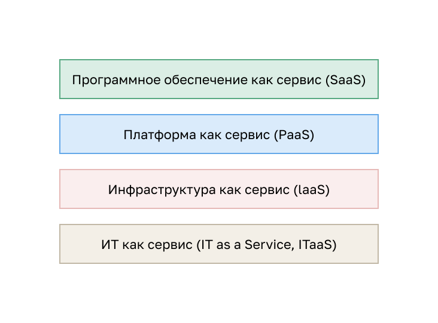
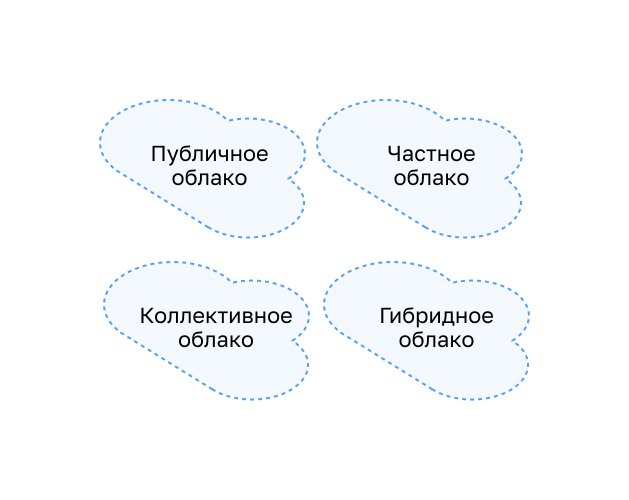

<!-- 13.1.1 -->
## Видео: Облако и виртуализация

Посмотрите видео про обзор облачных вычислений и виртуализации.

<!-- 13.1.2 -->
## Обзор облачных вычислений

В видео описан обзор облачных вычислений. Они предполагают множество подключенных через сеть компьютеров, которые могут находиться в любой точке земного шара. Провайдеры во многом полагаются на виртуализацию при предоставлении услуг облачных вычислений. Они сокращают операционные расходы, используя ресурсы более эффективно. Облачные вычисления решают различные проблемы управления данными:

* предоставляют доступ к данным организации в любом месте и в любое время;
* оптимизаируют IT-инфраструктуру в организации за счет подписки только на необходимые сервисы;
* исключают или снижают необходимость развертывать и поддерживать оборудование на площадках;
* сокращают затраты на оборудование и электроэнергию, уменьшают требования к материальной части и потребность в обучении персонала;
* оперативно реагируют на растущие требования к объему данных.

Облачные вычисления с моделью оплаты «по мере использования» позволяют организациям относиться к вычислениям и хранению утилитарно, а не как к инвестиции в инфраструктуру. В результате капиталовложения преобразуются в расходы на экплуатацию.

<!-- 13.1.3 -->
## Облачные сервисы

Множество разновидностей облачных сервисов ориентируются на разные требования клиентов. Три основных типа услуг облачных вычислений, согласно определению Национального института по стандартам и технологиям (США):

* **ПО как услуга (SaaS).**  Поставщик облачных сервисов отвечает за доступ к онлайн-приложениям и услугам, таким как электронная почта, обмен данными или Office 365. Пользователь не управляет ни одним аспектом служб, за исключением ограниченных настроек приложения. От пользователя требуется только предоставить свои данные.
* **Платформа как услуга (PaaS).**  Поставщик облачных сервисов отвечает за доступ к средствам разработки и сервисам для предоставления приложений. Обычно этим пользуются программисты. Они могут контролировать параметры конфигурации среды размещения приложений облачного провайдера.
* **Инфраструктура как услуга (IaaS).**  Поставщик облачных сервисов предоставляет IT-менеджерам доступ к сетевому оборудованию, виртуализированным сервисам и поддержке инфраструктуры. Использование этого сервиса позволяет менеджерам развертывать и запускать программный код, который может включать операционные системы и приложения.

Как видно из рисунка, поставщики облачных услуг расширили эту модель, и предоставляют IT-поддержку каждому из сервисов облачных вычислений (IT как услуга). Для предприятий модель ITaaS расширяет возможности сети без инвестиций в новую инфраструктуру, обучения нового персонала или лицензирований нового программного обеспечения. Эти экономичные сервисы доступны по запросу на любом устройстве в любой точке мира и обеспечивают должный уровень безопасности и функциональности.

<!-- /courses/ensa-dl/ae8eb398-34fd-11eb-ba19-f1886492e0e4/aeb65fd8-34fd-11eb-ba19-f1886492e0e4/assets/c70b5ac3-1c46-11ea-af56-e368b99e9723.svg -->

<!-- 13.1.4 -->
## Облачные модели

На рисунке показаны четыре основные модели облаков:

* **Общедоступные.**  Приложения и службы доступны практически всем пользователям. Услуги могут быть бесплатными или оплачиваться «по факту использования», как платное интернет-хранилище. Общедоступное облако предоставляет услуги через Интернет.
* **Частные.**  Приложения и службы предназначены для определенной организации или юридического лица, например для государственного учреждения. Такое облако можно организовать а частной сети компании. Однако создать и обслуживать его может быть затратно. Управлять частным облаком может подрядная организация, способная обеспечить максимально безопасный доступ.
* **Гибридные.**  Они состоят из нескольких облаков (например: частного и общедоступного), причем каждая из частей остается отдельным объектом, но они связаны между собой в рамках единой архитектуры. Пользователи, подключенные к гибридному облаку, могут иметь разные уровни доступа к услугам в зависимости от своих прав.
* **Коллективное облако.**  Они создаются для исключительного использования определенным сообществом. Облако сообщеста отличается от общедоступного функциональными потребностями, настроенными для сообщества. Например, медицинские учреждения должны соблюдать политики и законы (например, HIPAA, закон об ответственности и переносе данных о страховании здоровья граждан), которые требуют особой аутентификации и конфиденциальности.

<!-- /courses/ensa-dl/ae8eb398-34fd-11eb-ba19-f1886492e0e4/aeb65fd8-34fd-11eb-ba19-f1886492e0e4/assets/c70ba8e3-1c46-11ea-af56-e368b99e9723.svg -->

<!-- 13.1.5 -->
## Облачные вычисления и центр обработки данных

Термины «центр обработки данных» и «облачные вычисления» часто используются неправильно. Ниже представлены их значения.

* **Центр обработки данных** — специализированная система хранения и обработки данных, принадлежащая IT-отделу компании или арендуемая у третьих сторон.
* **Облачные вычисления** — размещенный не на территории заказчика сервис, который предоставляет доступ по запросу к совместно используемому пулу настраиваемых вычислительных ресурсов. Их можно быстро выделять и освобождать с минимальными усилиями по управлению.

Центры обработки данных — это физические средства, которые обеспечивают вычислительные, сетевые и складские потребности облачных вычислений. Поставщики облачных сервисов используют центры обработки данных для размещения своих сервисов и ресурсов.

ЦОД может занимать одно помещение, несколько этажей или все здание. Его дорого создавать и обслуживать. Поэтому только крупные организации используют собственные ЦОД, чтобы размещать корпоративные данные и предоставлять услуги пользователям. Меньшие организации, которые не могут содержать собственный частный ЦОД, сокращают общие расходы на владение, взяв серверные мощности и сервисы хранения данных в облаке в лизинг у более крупной организации с ЦОД.

<!-- 13.1.6 -->
<!-- quiz -->

