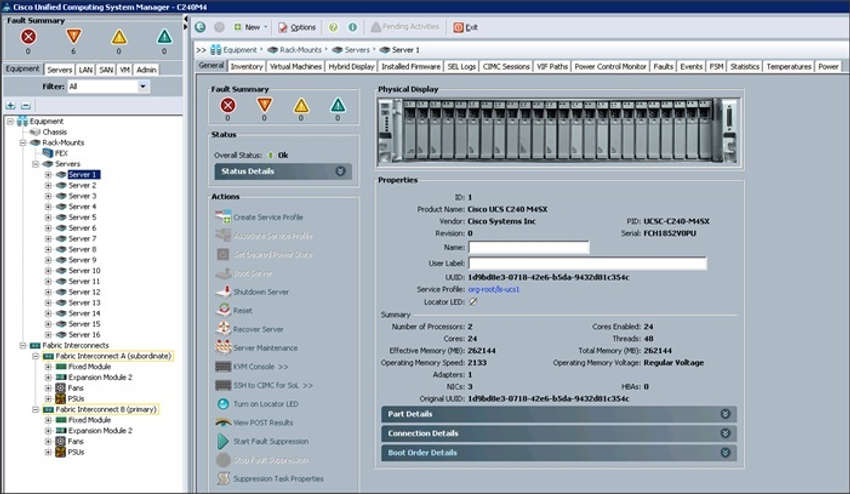

<!-- 13.3.1 -->
## Гипервизоры типа 1

В предыдущей теме вы узнали о принципах работы виртуализации. В этом разделе рассматривается инфраструктура виртуальной сети.

В гипервизорах типа 1 используется подход bare metal (без ОС). Он называется так потому, что гипервизор устанавливается непосредственно на аппаратную часть. Гипервизоры типа 1 обычно используют на серверах предприятия и сетевых устройствах центра обработки данных.

Гипервизоры типа 1 устанавливают непосредственно на физическом сервере или сетевом оборудовании. После этого экземпляры ОС устанавливают на гипервизор, как показано на рисунке. У гипервизоров типа 1 прямой доступ к аппаратным ресурсам, поэтому они эффективнее размещенных архитектур. Гипервизоры типа 1 отличаются повышенной масштабируемостью, производительностью и надежностью.

<!-- /courses/ensa-dl/ae8eb398-34fd-11eb-ba19-f1886492e0e4/aeb65fdc-34fd-11eb-ba19-f1886492e0e4/assets/c71286b1-1c46-11ea-af56-e368b99e9723.svg -->

<!--
На рисунке показан гипервизор типа 1 на сервере. Начиная снизу, сервер имеет аппаратное обеспечение с гипервизором сверху, ветвящихся от гипервизора находятся 3 операционные системы: ОС Windows, ОС Linux и ОС Unix.
-->

<!-- 13.3.2 -->
## Установка виртуальной машины на гипервизоре

После установки гипервизора типа 1 и перезагрузки сервера на экране отображаются только основные сведения, такие как версия ОС, объем ОЗУ и IP-адрес. На данном этапе создать экземпляр операционной системы нельзя. Для управления гипервизорами типа 1 требуется «консоль управления». Управляющее программное обеспечение позволяет управлять несколькими серверами, использующими один гипервизор. Консоль управления может автоматически объединять, включать и выключать серверы по мере необходимости.

Например, допустим, что у Сервера 1 на рисунке остается мало ресурсов. Чтобы предоставить недостающие ресурсы, консоль управления переносит экземпляр Windows на гипервизор на Сервер 2. Консоль управления также может быть запрограммирована с пороговыми значениями, которые автоматически запускают перемещение.

<!-- /courses/ensa-dl/ae8eb398-34fd-11eb-ba19-f1886492e0e4/aeb65fdc-34fd-11eb-ba19-f1886492e0e4/assets/c71322f1-1c46-11ea-af56-e368b99e9723.svg -->

<!--
На рисунке показано перемещение ресурсов с одного гипервизора на сервере на другой. На рисунке показаны 2 сервера. Сервер 1 начинается снизу, имеет аппаратное обеспечение с гипервизором #1 сверху, ветвящихся от гипервизора #1 3 операционных систем: ОС Windows, ОС Linux и ОС Unix. Сервер 2 начинается снизу, имеет аппаратное обеспечение с гипервизором #2 сверху, ветвление от гипервизора #2 - это 1 операционная система, ОС Windows. Есть стрелка, изображающая ОС Windows, перемещаемую с Сервера 1 на Сервер 2.
-->

Консоль управления обеспечивает восстановление после аппаратного сбоя. При выходе из строя серверного компонента консоль управления автоматически переносит виртуальную машину на другой сервер. Консоль управления для системы Cisco UCS показана на рисунке. Cisco UCS Manager управляет множеством серверов, а также выделяет ресурсы для тысяч виртуальных машин.

<!--
The figure shows the management console for the Cisco Unified Computing System (UCS) Manager. The manager shows the various servers on the side menu. The figure has server 1 selected, displaying the fault summary, status, properties and physical display.
-->

Некоторые консоли управления также позволяют серверу настраивать переподписку ресурсов. Она возникает, когда несколько установленных экземпляров ОС занимают места больше, чем объем физической памяти на сервере. Например, если на сервере 16 Гбайт ОЗУ, а администратор создает четыре экземпляра операционной системы, каждому из которых выделено 10 Гбайт ОЗУ. Такой тип выделения ресурсов используется достаточно часто, поскольку все четыре экземпляра операционной системы очень редко одновременно нуждаются во всем объеме памяти.

<!-- 13.3.3 -->
## Сложность виртуализации сети

Виртуализация серверов скрывает серверные ресурсы (например, количество и идентификаторы физических серверов, процессоров и ОС) от пользователей серверов. В этом случае возникают проблемы, когда центр обработки данных использует традиционные сетевые архитектуры.

Например, виртуальные локальные сети (VLAN), используемые виртуальными машинами, должны назначаться тому же порту коммутатора, что и физический сервер, на котором работает гипервизор. Однако виртуальные машины могут переноситься, и сетевой администратор должен иметь возможность добавлять, удалять и изменять сетевые ресурсы и профили. Этот процесс будет ручным и трудоемким с традиционными сетевыми коммутаторами.

Другая проблема в том, что потоки трафика значительно отличаются от традиционной модели типа «клиент-сервер». Как правило, у центра обработки данных значительный объем трафика, которым обмениваются виртуальные серверы, такие как UCS, показанные на рисунке. Эти потоки называются движением Восток-Запад и со временем могут изменяться в местоположении и интенсивности. Трафик Север-Юг происходит между распределением и основным слоями. Он обычно предназначен для удаленных местоположений, таких как другой центр обработки данных, другие поставщики облачных услуг или Интернет.

<!-- /courses/ensa-dl/ae8eb398-34fd-11eb-ba19-f1886492e0e4/aeb65fdc-34fd-11eb-ba19-f1886492e0e4/assets/c713bf30-1c46-11ea-af56-e368b99e9723.svg -->

<!--
На рисунке показан трафик с севера на юг и с востока на запад в центре обработки данных, обмен которым осуществляется между виртуальными серверами. На рисунке приведена топология филиалов. Вверху находится облако, помеченное вне узла. Вне узла — это два маршрутизатора брандмауэра на уровне ядра. Маршрутизаторы связываются с двумя коммутаторами Nexus на уровне распространения с избыточными каналами. Вне площадки, маршрутизаторы и коммутаторы помечены как движение север-юг. Филиалы от коммутаторов уровня распределения — это четыре коммутатора Nexus на уровне доступа с избыточными связями. Каждый коммутатор уровня доступа имеет три связи с отдельными серверами UCS. В нижней части топологии находятся стрелки, идущие влево и вправо по горизонтали, обозначенные движением восток-запад. 
-->

Динамический постоянно меняющийся трафик требует гибкого подхода к управлению сетевыми ресурсами. Существующие сетевые инфраструктуры могут реагировать на меняющиеся требования, связанные с управлением потоками трафика, с помощью механизмов качества обслуживания (QoS) и конфигураций уровня безопасности для отдельных потоков. Однако на крупных предприятиях, использующих оборудование от различных поставщиков, при добавлении каждой новой виртуальной машины необходимые изменения конфигурации могут занимать очень много времени.

Сетевая инфраструктура также может пользоваться преимуществами виртуализации. Сетевые функции можно виртуализироввать. Каждое сетевое устройство может быть разделено на несколько виртуальных устройств, которые работают независимо. Примеры включают субинтерфейсы, виртуальные интерфейсы, VLAN и таблицы маршрутизации. Виртуализированная маршрутизация называется виртуальной маршрутизацией и переадресацей (VRF - virtual routing and forwarding). 

Как виртуализируется сеть? Ответ в том, как именно сетевое устройство работает, используя уровень передачи данных и уровень управления, что обсуждается в следующем разделе.

<!-- 13.3.4 -->
<!-- quiz -->

