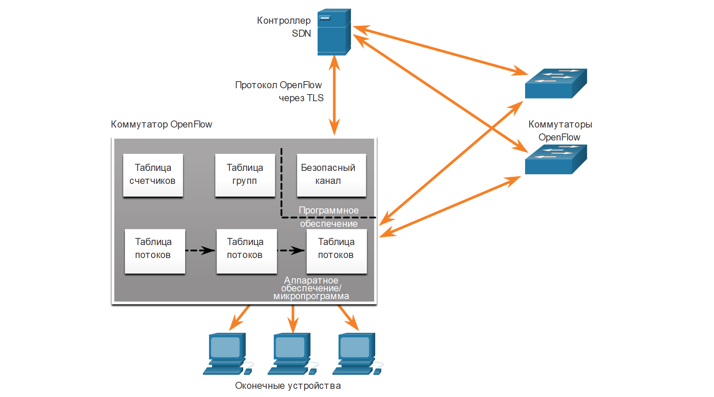
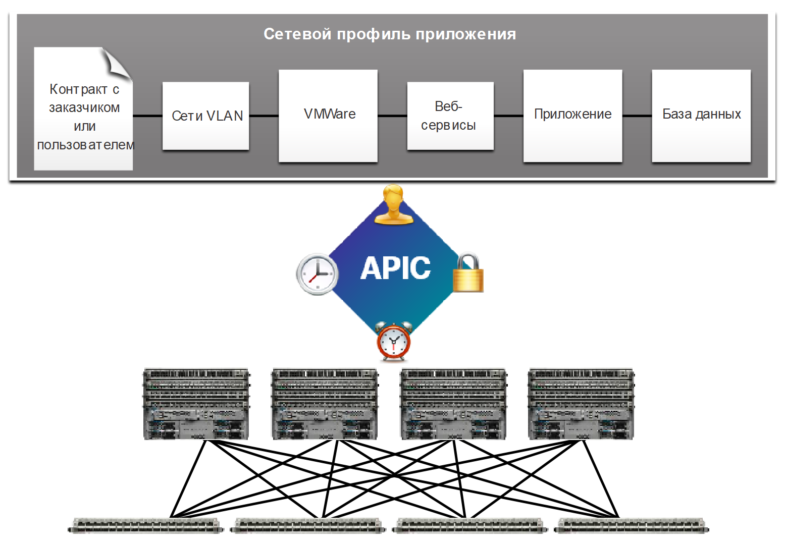
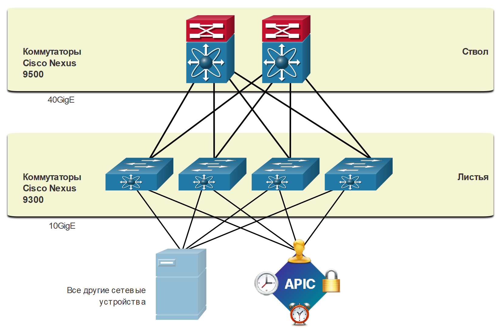
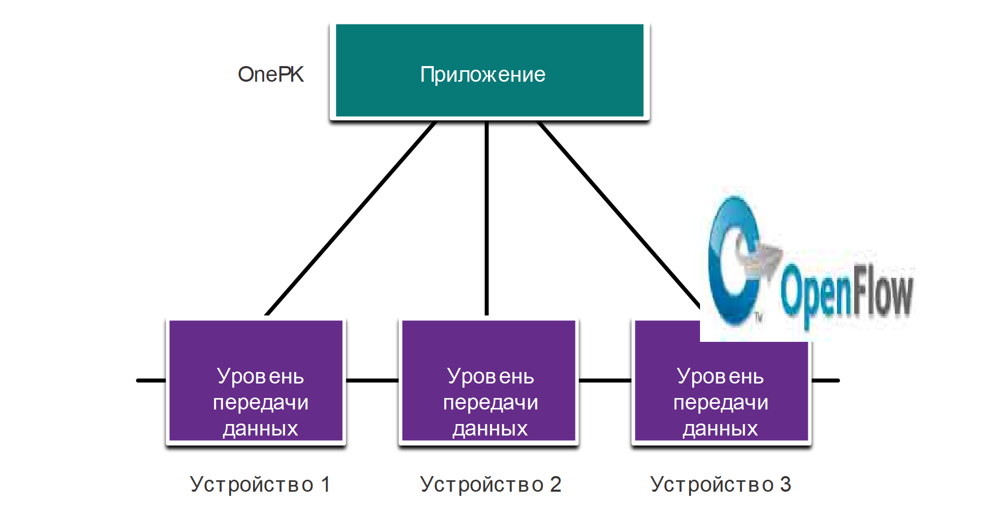
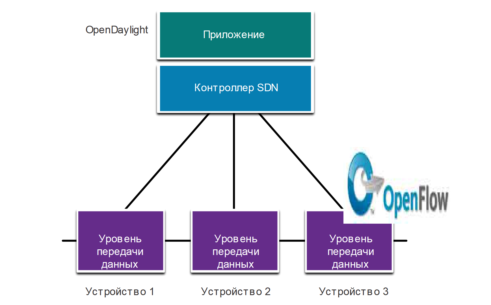
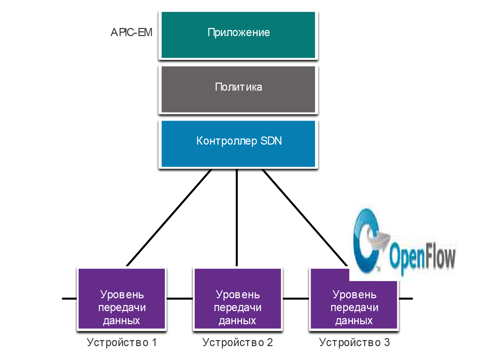

<!-- 13.5.1 -->
## Контроллер и операции SDN

Предыдущая тема охватывала компоненты SDN. В этом разделе будут описаны контроллеры.

Контроллер SDN определяет потоки данных между централизованным уровнем управления и уровнями передачи данных на отдельных маршрутизаторах и коммутаторах.

Каждый из потоков, проходящих по сети, сначала должен получить разрешение от контроллера SDN, который проверяет, разрешен ли такой обмен данными в соответствии с сетевыми политиками. Если контроллер разрешает поток, он рассчитывает для него маршрут и добавляет запись для этого потока в каждом из коммутаторов на пути.

Все сложные функции выполняются контроллером. Контроллер заполняет таблицы потоков. Коммутаторы управляют таблицами потоков. На рисунке контроллер SDN обменивается данными с коммутаторами, совместимыми с OpenFlow, используя протокол OpenFlow. Этот протокол использует протокол TLS для безопасной отправки сообщений уровня управления по сети. Каждый коммутатор OpenFlow подключается к другим коммутаторам OpenFlow. Они также могут подключаться к оконечным устройствам, которые являются частью потока пакетов.

<!-- /courses/ensa-dl/ae8eb398-34fd-11eb-ba19-f1886492e0e4/aeb686e2-34fd-11eb-ba19-f1886492e0e4/assets/c71a27d0-1c46-11ea-af56-e368b99e9723.svg -->

<!--
На рисунке контроллер SDN взаимодействует с поддерживающими OpenFlow коммутаторами с помощью протокола OpenFlow. Коммутаторы OpenFlow имеют таблицу счетчиков, таблицу групп и таблицы потоков, которые реализованы в аппаратном обеспечении. Коммутаторы OpenFlow также имеют защищенный канал, реализованный программным обеспечением. Контроллер SDN связывается с двумя коммутаторами OpenFlow по протоколу OpenFlow по защищенному каналу TLS. Переключатели подключены к трем конечным устройствам.
-->

В каждом коммутаторе имеется набор таблиц, реализованных на уровне аппаратных средств, или микропрограммы, которые используются для управления потоками пакетов через коммутатор. Для коммутатора поток представляет собой последовательность пакетов, которая соответствует определенной записи в таблице потоков.

Три типа таблиц, показанные на предыдущем рисунке, являются следующими:

* **Таблица потоков.**  Используется для сопоставления входящих пакетов с конкретным потоком и определения функций, которые выполняются для пакетов. Возможно наличие нескольких таблиц потоков, которые работают как конвейер.
* **Таблица групп.**  Таблица потоков может направлять поток в таблицу групп, которая может запускать различные действия, влияющие на один или несколько потоков.
* **Таблица счетчиков.**  Запускает различные, связанные с производительностью операции в потоке, включая возможность ограничения скорости трафика.

<!-- 13.5.2 -->
## Видео: Cisco ACI

На деле лишь немногие организации хотят программировать сети с помощью средств SDN или обладают для этого достаточной квалификацией. Однако большинство организаций хотят автоматизировать сеть, ускорить развертывание приложений и привести свою ИТ-инфраструктуру в соответствие с бизнес-требованиями. Компания Cisco разработала ориентированную на приложения инфраструктуру (ACI), чтобы решать эти задачи более современными и инновационными способами, чем те, которые основаны на SDN.

Архитектура Cisco ACI — это специализированное аппаратное решение для интеграции облачных вычислений и управления ЦОД. На верхнем уровне элемент управления политиками сети удаляется из уровня передачи данных. Это упрощает создание сетей центра обработки данных.

Нажмите кнопку Воспроизведение, чтобы просмотреть видео об эволюции SDN и ACI.

<!-- 13.5.3 -->
## Основные компоненты архитектуры ACI

Существует три основных компонента архитектуры ACI:

* **Сетевой профиль приложения (ANP)**  — это набор групп оконечных устройств (EPG), их подключений, а также политик, определяющих эти подключения. Группы EPG, показанные на рисунке, такие как сети VLAN, веб-сервисы и приложения, приведены лишь в качестве примера. Однако зачастую ANP оказывается гораздо сложнее.
* **Контроллер Cisco APIC (Application Policy Infrastructure Controller)**  — контроллер APIC считается мозгом архитектуры ACI. APIC — это централизованный программный контроллер, который управляет масштабируемой кластеризованной структурой ACI. Он разработан для обеспечения возможности программирования и централизованного управления. Он преобразует политики приложений в сетевой программный код.
* **Коммутаторы Cisco Nexus серии 9000**  — эти коммутаторы реализуют коммутационную структуру с учетом работы приложений и работают совместно с контроллером Cisco APIC, обеспечивая управление инфраструктурой виртуальной и физической сети.

Контроллер APIC располагается между ANP и сетевой инфраструктурой ACI. На рисунке APIC преобразует требования приложений в настройке сети, соответствующей этим требованиям.

<!-- /courses/ensa-dl/ae8eb398-34fd-11eb-ba19-f1886492e0e4/aeb686e2-34fd-11eb-ba19-f1886492e0e4/assets/c71b3943-1c46-11ea-af56-e368b99e9723.svg -->

<!--
APIC преобразует требования приложений в настройке сети, соответствующей этим требованиям. Вверху находится профиль сети приложений, который состоит из контракта клиента или арендатора, VLAN, VMWare, веб-служб, приложений и базы данных. Ниже профиля сети приложения находится APIC, а ниже APIC находятся четыре коммутатора Cisco Nexus 9000 с избыточными связями с четырьмя другими коммутаторами.
-->

<!-- 13.5.4 -->
## Топология «ствол-листья» (Spine-Leaf)

Структура Cisco ACI состоит из контроллера APIC и коммутаторов Cisco Nexus серии 9000, использующих двухуровневую топологию «ствол и листья», как показано на рисунке. Листовые коммутаторы всегда соединяются со стволовыми коммутаторами, но никогда не соединяются друг с другом. Аналогично стволовые коммутаторы соединяются только с листовыми и базовыми коммутаторами (не показано). В этой двухъярусной топологии любой узел находится в одном переходе от любого другого узла.

Cisco APIC и все остальные устройства в сети физически соединены с листовыми коммутаторами.

В отличие от SDN, контроллер APIC напрямую не управляет каналом данных. Вместо этого APIC обеспечивает централизованное хранение определений политик и программирует листовые коммутаторы на пересылку трафика с учетом определенных политик.

<!-- /courses/ensa-dl/ae8eb398-34fd-11eb-ba19-f1886492e0e4/aeb686e2-34fd-11eb-ba19-f1886492e0e4/assets/c71bae72-1c46-11ea-af56-e368b99e9723.svg -->

<!--
На рисунке показана двухуровневая топология «ствол-листья». В верхней части топологии находится часть Spine (ствол) с двумя коммутаторами Cisco Nexus 9500. Коммутаторы 9500 имеют избыточные соединения с листом, состоящим из четырех коммутаторов Cisco Nexus 9300. Коммутаторы 9300 имеют избыточные связи с APIC и всеми другими сетевыми устройствами. 
-->

<!-- 13.5.5 -->
## Типы SDN

Модуль контроллера Cisco Application Policy Infrastructure Controller — Enterprise Module (APIC-EM) расширяет ACI функционалом, рассчитанным на развертывание в корпоративных средах и средах комплексов зданий. Чтобы лучше понять суть APIC-EM, полезно в общих чертах ознакомиться с тремя типами SDN.

**SDN на базе устройств**

В этом типе SDN устройства могут программироваться приложениями, работающими на самих устройствах или на сервере в сети, как показано на рисунке. Примером SDN на базе устройств является Cisco OnePK. Cisco OnePK позволяет программистам создавать приложения с помощью языков C и Java с Python для интеграции и взаимодействия с устройствами Cisco.

<!-- /courses/ensa-dl/ae8eb398-34fd-11eb-ba19-f1886492e0e4/aeb686e2-34fd-11eb-ba19-f1886492e0e4/assets/c71c4ab2-1c46-11ea-af56-e368b99e9723.svg -->

<!--
На рисунке приведен пример устройства SDN. В верхней части фигуры находится квадрат с надписью Приложение с тремя строками вниз до трех отдельных плоскостей данных. Cisco OnePK используется в качестве приложения и между приложением и плоскостями данных является OpenFlow.
-->

**SDN на базе контроллера**

Этот тип SDN использует централизованный контроллер, который знает обо всех устройствах в сети, как показано на рисунке. Приложения могут взаимодействовать с контроллером, отвечающим за управление устройствами и обработку потоков трафика в сети. Контроллер Cisco Open SDN является коммерческим дистрибутивом OpenDaylight.

<!-- /courses/ensa-dl/ae8eb398-34fd-11eb-ba19-f1886492e0e4/aeb686e2-34fd-11eb-ba19-f1886492e0e4/assets/c71cbfe3-1c46-11ea-af56-e368b99e9723.svg -->

<!--
На рисунке приведен пример SDN на основе контроллера. В верхней части рисунка находится квадрат с надписью Приложение с контроллером SDN под ним. Контроллер SDN имеет три линии вплоть до трех отдельных плоскостей данных. OpenDaylight используется в качестве контроллера SDN и между контроллером SDN и плоскостями данных OpenFlow.
-->

**SDN на базе политик**

Этот тип SDN аналогичен SDN на базе контроллера, где централизованный контроллер знает обо всех устройствах в сети, как показано на рисунке. SDN на базе политик включает дополнительный уровень политик, который работает на более высоком уровне абстракции. Он использует встроенные приложения, которые автоматизируют задачи настройки с помощью управляемого рабочего процесса и удобного графического интерфейса пользователя. Навыки программирования не требуются. Примером такого типа SDN — Cisco APIC-EM.

<!-- /courses/ensa-dl/ae8eb398-34fd-11eb-ba19-f1886492e0e4/aeb686e2-34fd-11eb-ba19-f1886492e0e4/assets/c71d8330-1c46-11ea-af56-e368b99e9723.svg -->

<!--
На рисунке приведен пример SDN на основе политики. В верхней части рисунка находится квадрат с надписью Приложение с политикой между ним и контроллером SDN. Контроллер SDN имеет три линии вплоть до трех отдельных плоскостей данных. APIC-EM используется в качестве SDN и между контроллером SDN и уровнями передачи данных OpenFlow.
-->

<!-- 13.5.6 -->
## Функции APIC-EM

У каждого из типов SDN есть свои особенности и преимущества. SDN на базе политик — наиболее надежный тип, предоставляющий простой механизм контроля и управления политиками во всей сети.

Cisco APIC-EM - пример SDN на базе политик. Cisco APIC-EM предоставляет единый интерфейс для управления сетью, включая:

* обнаружение и доступ к списку данных устройств и хоста,
* просмотр топологии (как показано на рисунке),
* трассировка пути между конечными точками и политики настройки.

<!--
The figure shows the topology tab on the Cisco APIC-EM. The figure shows a topology beginning with a cloud node at the top. The cloud has links to three routers. The first router is connected to switches on a campus network. The campus network consists of three switches and hubs connected together with an AP connected to the third switch. The AP has a wireless device connected. A host is also connected to the third switch. The second router is connected to a switch. The third router is connected to a branch access switch. The switch is connected to a host. 
-->

<!-- 13.5.7 -->
## APIC-EM: Path Trace

APIC-EM Path Trace позволяют администратору легко визуализировать потоки трафика и обнаруживать любые конфликтующие, дублированные или теневые записи ACL. Этот инструмент исследует конкретные ACL-списки на пути между двумя конечными узлами и показывает все возможные неполадки. На рисунке вы можете видеть, как любые ACL вдоль пути разрешают или запрещают трафик, как показано на рисунке. Обратите внимание, как Branch-Router2 разрешает весь трафик. Теперь администратор сети может вносить коррективы, если это необходимо, для лучшей фильтрации трафика.

<!--
The figure shows the APIC-EM Path Trace tool and where ACLs are permitted or denied traffic. The trace path tool shows the topology of the trace and information about those devices such as the hostname, ingress and egress interfaces and VLANs. In the example the topology starts at the source, a host device with an arrow labeled switched pointing from the source to the branch access switch. The switch has an arrow labeled switching between it and the branch router. The branch router has an arrow labeled OSPF between it and the cloud. An arrow labeled Netflow is pointed from the cloud to a campus router. The campus router has an arrow labeled ECMP between it and the campus core switch. The core switch has an arrow between it and the campus distribution switch labeled OSPF. The distribution switch has an arrow labeled Inter VLAN routing between it and the access switch. The access switch has an arrow between it and the destination host labeled switched.
-->

<!-- 13.5.8 -->
<!-- quiz -->

