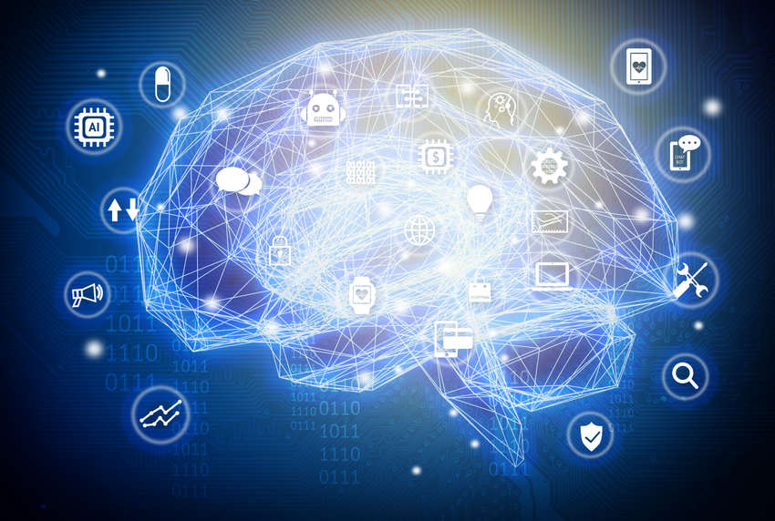

<!-- 14.1.1 -->
## Видео: Автоматизация повсюду

Теперь мы видим автоматизацию повсюду: от касс самообслуживания в магазинах и климат контроля в зданиях до беспилотных автомобилей и самолетов. Сколько автоматизированных систем вы видите в течение одного дня?

<!-- 14.1.2 -->
## Рост автоматизации

Автоматизация — любой самоуправляемый процесс, который снижает и в конечном итоге устраняет необходимость вмешательства человека.

Раньше автоматизацию применяли только в промышленности. Многократно повторяющиеся задачи, например сборку автомобилей, переложили на машины. Так появилась современная сборочная линия. Машины превосходно справляются с повторением одной и той же задачи без усталости и ошибок, которые люди неизбежно совершают при выполнении таких работ.

Некоторые из преимуществ автоматизации:

* существенно повышается производительность, так как машины могут работать круглосуточно без перерывов;
* повышается единообразность выпускаемой продукции;
* огромные объемы данных можно быстро проанализировать, чтобы получить информацию для управления событием или процессом;
* людям меньше прихоится рисковать, так как роботы используются в опасных условиях, например в шахтах, при тушении пожаров и устранении промышленных аварий;
* при определенных обстоятельствах интеллектуальные устройства могут изменить свое поведение, чтобы уменьшить потребление энергии, поставить медицинский диагноз и повысить безопасность вождения автомобиля.

<!-- 14.1.3 -->
## Умные устройства

Устройства могут думать или учиться у своего окружения? В данном контексте есть множество определений слова «думать». Одно из них — возможность объединить несколько связанных частей информации и использовать их для изменения хода действий.

Многие устройства теперь включают интеллектуальные технологии, помогающие управлять их поведением. Это может быть простое снижение потребляемой мощности смарт-устройством в периоды пиковой нагрузки или что-то более сложное, например самостоятельное движение автомобиля.

Если устройство принимает решение или действует на основе внешней информации, оно считается интеллектуальным. В названиях многих устройств, с которыми мы взаимодействуем, есть слово «смарт», то есть «умный», «интеллектуальный». Оно означает, что устройство может изменять свое поведение в зависимости от окружающей среды.

Чтобы устройства могли «мыслить», их необходимо программировать с использованием средств автоматизации сети.

<!-- 14.1.4 -->
<!-- quiz -->

