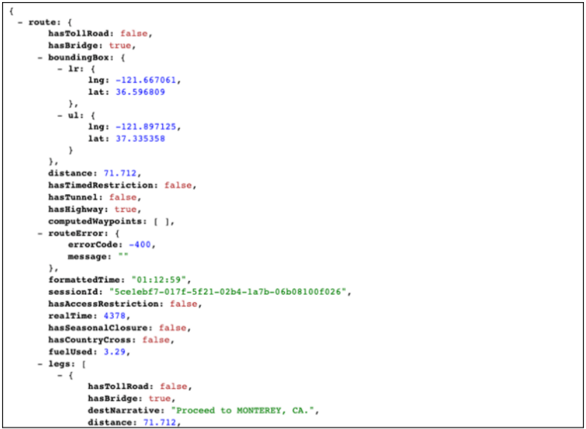
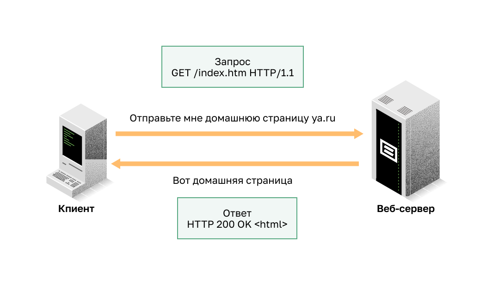
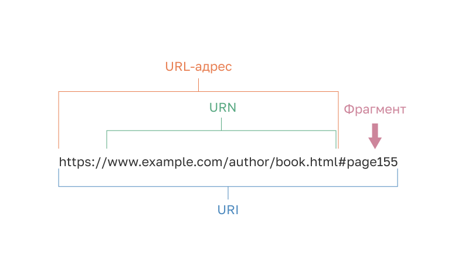
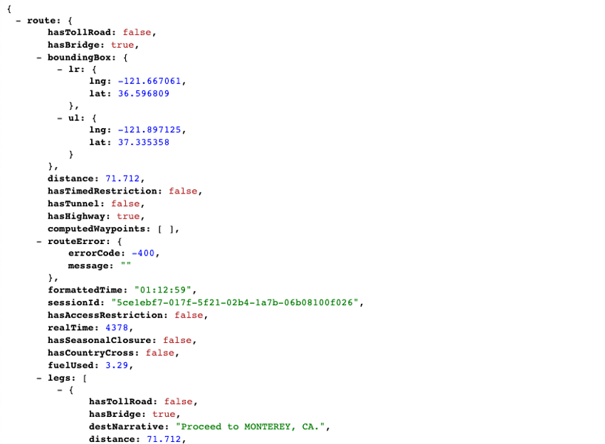
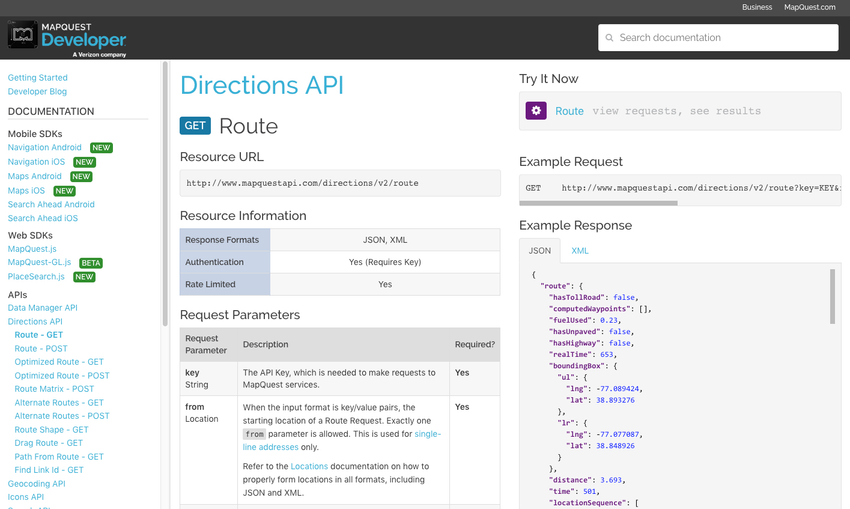
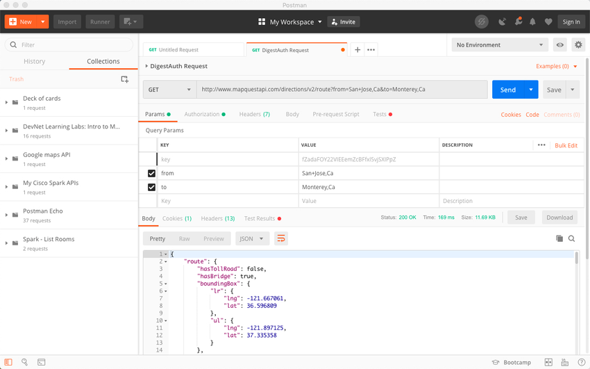
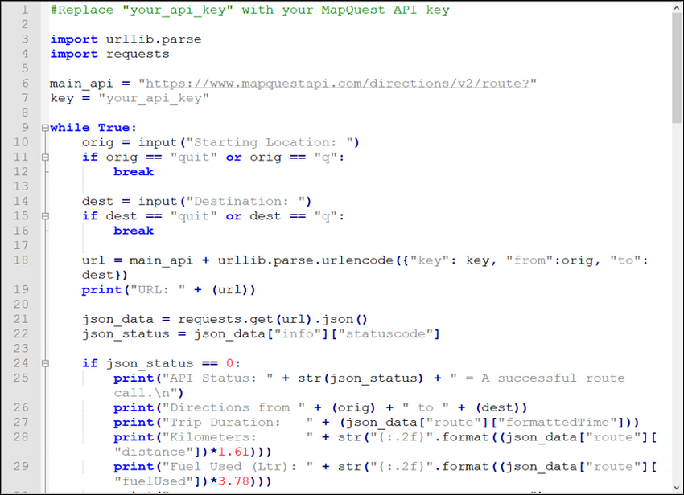

<!-- 14.4.1 -->
## Видео: REST

Посмотрите видео об архитектуре REST.


<!-- 14.4.2 -->
## REST и RESTful API

Браузеры используют HTTP или HTTPS для запроса (GET) веб-страницы. При успешном запросе (код состояния HTTP 200) веб-серверы отвечают на запросы GET страницей в кодировке HTML, как показано на рисунке.


<!-- /courses/ensa-dl/ae8eb39a-34fd-11eb-ba19-f1886492e0e4/aeb686ee-34fd-11eb-ba19-f1886492e0e4/assets/c7346692-1c46-11ea-af56-e368b99e9723.svg -->

<!--
На рисунке показан клиент, использующий запрос GET для сайта, и ответ сервера. Клиентский ПК отправляет GET-запрос на веб-сервер для домашней страницы cisco.com. Запрос GET /index.html HTTP/1.1. Затем сервер отправляет данные домашней страницы обратно клиенту. Ответ HTTP 200 OK <html>.
-->

REST — это архитектурный стиль для разработки приложений веб-сервисов. Это относится к стилю веб-архитектуры со множеством базовых характеристик. Она управляет поведением клиентов и серверов. Проще говоря, REST API — это API, который работает поверх протокола HTTP. Он определяет набор функций, которые разработчики могут использовать для выполнения запросов и получения ответов по протоколу HTTP, например, GET и POST.

Соответствие ограничениям архитектуры REST обычно называется «RESTful». API можно считать «RESTful», если он имеет следующие функции:

* **Клиент-Сервер (Client-Server)** — клиент управляет интерфейсом (front end), а сервер — обработкой данных (back end). Каждого можно заменить независимо друг от друга.
* **Без сохранения состояния (Stateless)** —  Никакие клиентские данные не хранятся на сервере между запросами. Состояние сессии сохраняется на клиенте. 
* **Кешируемый (Cacheable)** — Клиент может кешировать запрос для улучшения производительности. 

<!-- 14.4.3 -->
## Реализация RESTful 

Веб-сервисы RESTful реализованы с использованием HTTP. Это набор ресурсов с четырьмя определенными аспектами:

* базовый унифицированный идентификатор ресурса (URI) для веб-службы, такой как http://example.com/resources;
* формат данных, поддерживаемый веб-сервисом: JSON, YAML, XML, либо другой допустимый стандарт гипертекста;
* набор операций, поддерживаемых веб-сервисом с использованием методов HTTP;
* API должен быть управляемым гипертекстом.

API RESTful используют общие методы HTTP, включая POST, GET, PUT, PATCH и DELETE. Как показано в следующей таблице, они соответствуют операциям RESTful: создание, чтение, обновление и удаление (Create, Read, Update, Delete или CRUD).

| Метод HTTP | Операция RESTful |
| --- | --- |
| POST | Create |
| GET | Чтение |
| PUT/PATCH | Update |
| DELETE | Delete |

На рисунке HTTP-запрос данных в формате JSON. Если запрос успешно создан в соответствии с документацией API, сервер ответит данными JSON. Они могут использоваться веб-приложением клиента для отображения данных. Например, приложение для определения местоположения смартфонов показывает местоположение Сан-Хосе, штат Калифорния.


<!-- /courses/ensa-dl/ae8eb39a-34fd-11eb-ba19-f1886492e0e4/aeb686ee-34fd-11eb-ba19-f1886492e0e4/assets/c734b4b4-1c46-11ea-af56-e368b99e9723.svg -->

<!--
На рисунке показаны маршруты проезда из Сан-Хосе, штат Калифорния, для картографического приложения в формате JSON. В коде указаны широта и долгота, независимо от того, есть ли на маршруте платные дороги, мосты или туннели. В нем также указано время, использованное топливо и текст комментария.
-->


<!-- /courses/ensa-dl/ae8eb39a-34fd-11eb-ba19-f1886492e0e4/aeb686ee-34fd-11eb-ba19-f1886492e0e4/assets/c734dbc2-1c46-11ea-af56-e368b99e9723.svg -->

<!--
На рисунке показан клиент, использующий запрос GET для сайта, и ответ сервера. Клиентский ПК отправляет GET-запрос на веб-сервер для домашней страницы cisco.com. Запрос GET /index.html HTTP/1.1. Затем сервер отправляет данные домашней страницы обратно клиенту. Ответ HTTP 200 OK <html>.
-->

<!-- 14.4.4 -->
## URI, URN и URL

Веб-ресурсы и веб-службы, такие как RESTful API, идентифицируются с помощью URI. Это строка символов, которая идентифицирует конкретный сетевой ресурс. Как показано на рисунке, у URI две специализации:

* **Единое имя ресурса (Uniform Resource Name — URN)** — идентифицирует только пространство имен ресурса (веб-страница, документ, изображение и т. д.) без ссылки на протокол.
* **Унифицированный указатель ресурса (Uniform Resource Locator — URL)** — определяет сетевое местоположение конкретного ресурса в сети. HTTP или HTTPS URL обычно используются в веб-браузерах. Другие протоколы, такие как FTP, SFTP, SSH, могут использовать URL. URL с использованием SFTP может выглядеть так: sftp://sftp.example.com.

На рисунке показаны части URI:

* **Протокол/Схема - (Protocol/scheme)** – HTTPS или другие протоколы, такие как FTP, SFTP, mailto и NNTP
* **Имя хоста** — www.example.com
* **Путь и имя файла** — /author/book.html
* **Фрагмент** — #page155

**Parts of a URI**


<!-- /courses/ensa-dl/ae8eb39a-34fd-11eb-ba19-f1886492e0e4/aeb686ee-34fd-11eb-ba19-f1886492e0e4/assets/c73529e3-1c46-11ea-af56-e368b99e9723.svg -->

<!--
На рисунке показан URI https://www.example.com/author/book.html#page155. URL универсального идентификатора ресурса (URI): https://www.example.com/author/book.html. URN-часть: example.com/author/book.html#page155. Фрагмент: #page155.
-->

<!-- 14.4.5 -->
## Анатомия запроса RESTful 

В веб-службе RESTful запрос к URI ресурса вызовет ответ. Им будет полезная нагрузка, обычно отформатированная в JSON, но может быть HTML, XML или каким-либо другим форматом. На рисунке показан URI для API направлений MapQuest. Запрос API для указания направления из Сан-Хосе, штат Калифорния в Монтерей, штат Калифорния.

**Части запроса API**


<!-- /courses/ensa-dl/ae8eb39a-34fd-11eb-ba19-f1886492e0e4/aeb686ee-34fd-11eb-ba19-f1886492e0e4/assets/c735c622-1c46-11ea-af56-e368b99e9723.svg -->

<!--
На рисунке показаны части запроса API. На рисунке используется URI http://www.mapquestapi.com/directions/v2/route?outFormat=json&key=KEY&from=San+Jose,Ca&to=Monterey,Ca. Серверная часть API URI:: http://www.mapquestapi.com. Ресурсная часть URI:: directions/v2/route. Часть запроса URI: ?outFormat=json&key=KEY&from=San+Jose,Ca&to=Monterey,Ca. Формат: outFormat=json&. Ключ: key=KEY&. Параметры: from=San+Jose,Ca&to=Monterey,Ca.
-->

На рисунке показана часть ответа API. В этом примере это направление MapQuest из Сан-Хосе в Монтерей в формате JSON.

**Частичная полезная нагрузка JSON, полученная из запроса API**



<!--
На рисунке показано направление MapQuest из Сан-Хосе в Монтерей в формате JSON. В коде указаны широта и долгота, независимо от того, есть ли на маршруте платные дороги, мосты или туннели. В нем также указано время, использованное топливо и текст комментария.
-->

Частии запроса API:

* **Сервер API** — URL-адрес сервера, который отвечает на запросы REST (в данном примере это сервер API MapQuest);
* **Ресурсы** — определяют запрашиваемый API (в данном примере это API направлений MapQuest);
* **Запрос** — определяет формат данных и информацию, которую клиент запрашивает у службы API.  Запросы могут включать в себя:
    * **Формат** – обычно это JSON, но может быть YAML или XML (в данном примере запрашивается JSON);
    * **Ключ** — ключ для авторизации, если требуется. MapQuest требует ключ для своих направлений API (в приведенном выше URI вам потребуется заменить «KEY» на действительный ключ, чтобы отправить действительный запрос);
    * **Параметры** — используются для отправки информации, относящейся к запросу. В этом примере параметры запроса включают информацию о направлениях, которые нужны API, чтобы он знал, какие направления возвращать: "from=San+Jose,Ca" и "to=Monterey,Ca".

Многие API-интерфейсы RESTful, включая общедоступные API, требуют ключа. Ключ используется для определения источника запроса. Причины, по которым провайдеру API может потребоваться ключ:

* для проверки подлинности источника необходимо убедиться, что он авторизован для использования API;
* ограничить число людей, использующих API;
* ограничить количество запросов на пользователя;
* для лучшего сбора и отслеживания данных, запрашиваемых пользователями;
* для сбора информации о людях, использующих API.

**Примечание:** Если вы хотите использовать API MapQuest, для API требуется ключ. Найдите в Интернете URL-адрес, чтобы получить ключ MapQuest. Используйте параметры поиска: developer.mapquest. Вы также можете найти в Интернете текущий URL, который описывает политику конфиденциальности MapQuest.

<!-- 14.4.6 -->
## Приложения RESTful API

Многие веб-сайты и приложения используют API для доступа к информации и предоставления услуг своим клиентам. Например, для работы своего сайта туристическая служба использует API различных авиакомпаний, чтобы предоставлять пользователю информацию об авиакомпании, отеле и т. д.

Некоторые запросы RESTful API можно выполнить, введя URI в браузере. Например, API направлений MapQuest. Запрос RESTful API также можно сделать другими способами.

**Веб-сайт разработчика**

Разработчики часто поддерживают веб-сайты, которые включают информацию об API, информацию о параметрах и примеры использования. На этих сайтах пользователи также могут выполнить запрос API на веб-странице разработчика, вводя параметры и другую информацию. На следующем рисунке показан пример веб-страницы API MapQuest Directions.



**Postman**

Postman — приложение для тестирования и использования REST API. Он доступен в виде приложения для браузера или отдельной установки. Он содержит все необходимое для построения и отправки запросов REST API, включая ввод параметров запроса и ключей. Postman позволяет собирать и сохранять часто используемые вызовы API в истории или в виде коллекций. Postman — отличный инструмент для изучения того, как создавать запросы API, и для анализа данных, возвращаемых из API. На следующем рисунке показан пример использования API MapQuest с Postman.



**Python**

API также можно вызывать из программы Python. Это учитывает возможную автоматизацию, настройку и интеграцию приложения с API. На следующем рисунке показан пример части программы на Python, используемой для отправки запросов в API MapQuest.



**Сетевые операционные системы**

Используя такие протоколы, как NETCONF (NET CONFiguration) и RESTCONF, сетевые операционные системы начинают предоставлять альтернативный метод для конфигурации, мониторинга и управления. Например, следующий вывод может быть ответом от маршрутизатора после того, как пользователь установил сеанс NETCONF в командной строке. Однако работа в командной строке не автоматизирует сеть. Вместо этого сетевой администратор может использовать скрипты Python или другие средства автоматизации, такие как Cisco DNA Center, для программного взаимодействия с маршрутизатором.

```
$ ssh admin@192.168.0.1 -p 830 -s netconf 
admin@192.168.0.1's password: 
<hello xmlns="urn:ietf:params:xml:ns:netconf:base:1.0"> 
<capabilities> 
  <capability>urn:ietf:params:netconf:base:1.1</capability> 
  <capability>urn:ietf:params:netconf:capability:candidate:1.0</capability> 
  <capability>urn:ietf:params:xml:ns:yang:ietf-netconf-monitoring</capability> 
  <capability>urn:ietf:params:xml:ns:yang:ietf-interfaces</capability> 
  [output omitted and edited for clarity] 
</capabilities> 
<session-id>19150</session-id></hello> 
```

<!-- 14.4.7 -->
<!-- quiz -->

