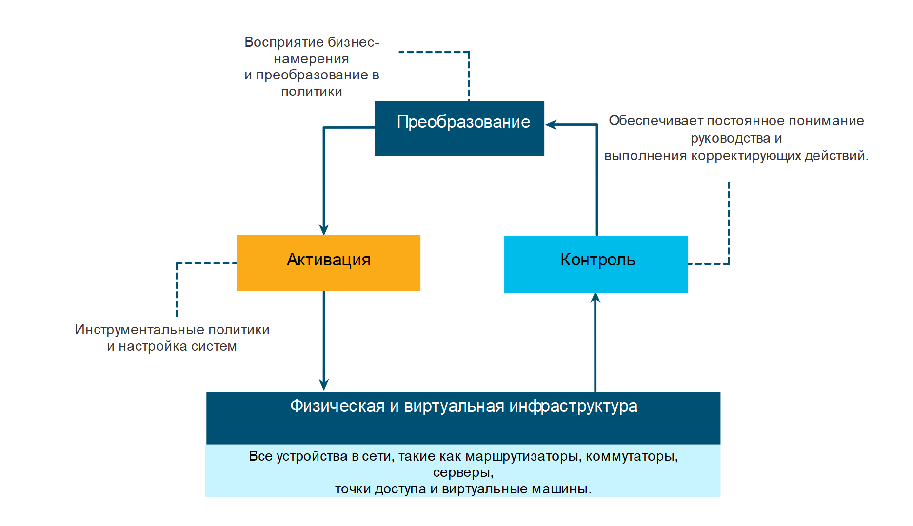
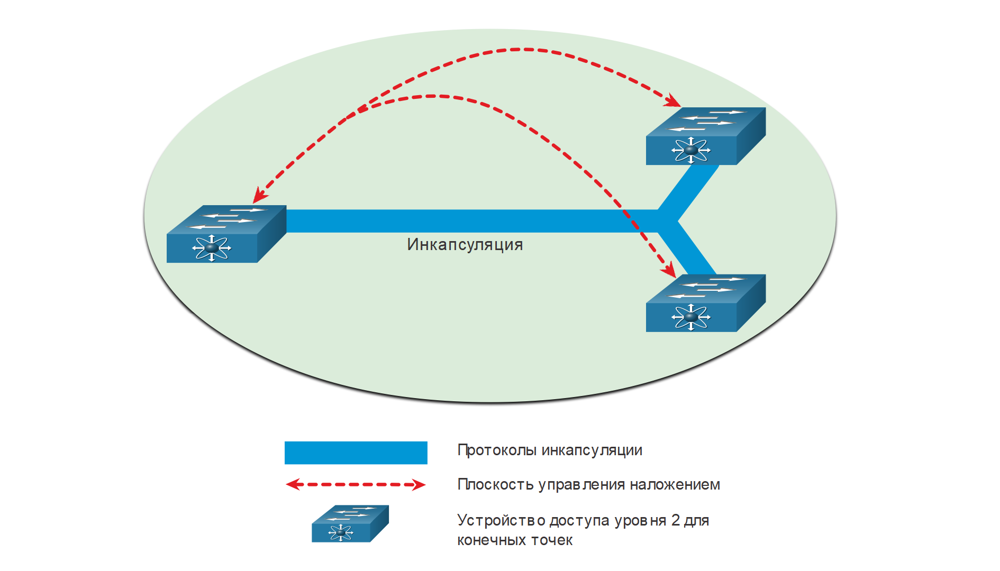
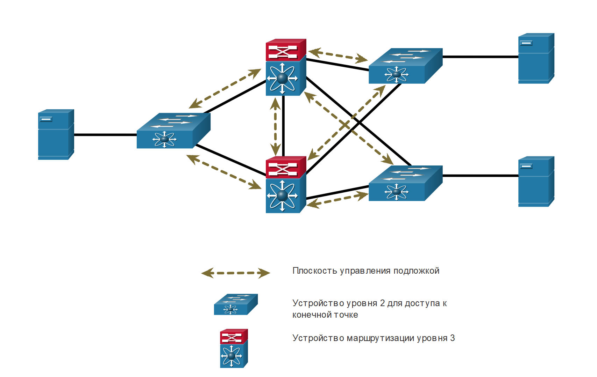
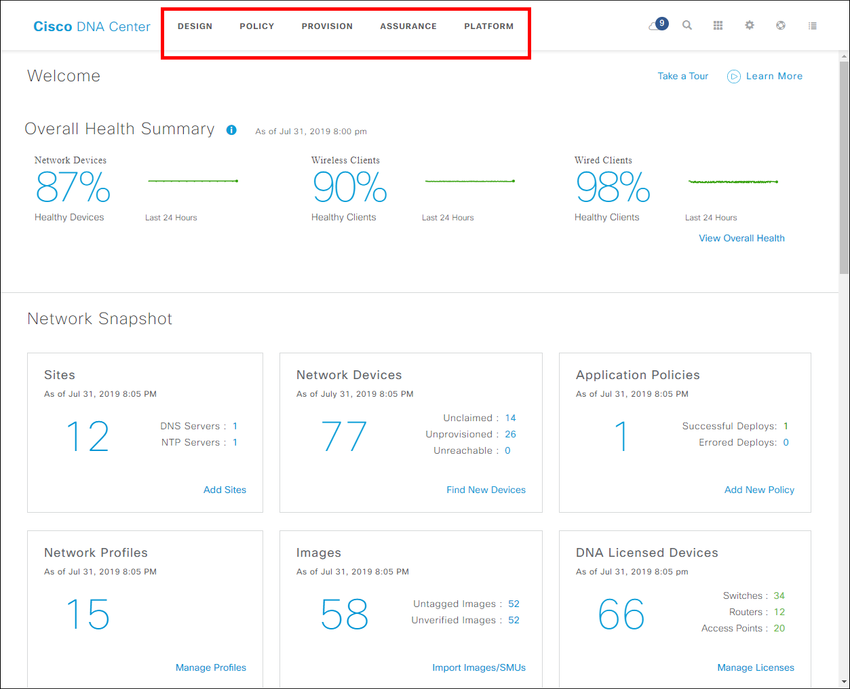

<!-- 14.6.1 -->
## Видео: Сети, управляемые на основе намерений

Вы узнали о многих инструментах и программном обеспечении, которые могут помочь вам автоматизировать вашу сеть. Сеть на основе намерений (Intent-Based Networking - IBN) и Центр архитектуры цифровой сети (Digital Network Architecture - DNA) Cisco могут помочь вам собрать все это вместе для создания автоматизированной сети.

Нажмите кнопку «Воспроизвести» на рисунке, чтобы просмотреть видео Джона Апостолопулоса и Ананда Освала из Cisco, объясняющее, как искусственный интеллект и IBN могут улучшить сети.

<!-- 14.6.2 -->
## Обзор сетей на основе намерения

IBN - это развивающаяся отраслевая модель для следующего поколения сетей. IBN основывается на программно-определяемой сети (Software-Defined Networking - SDN), преобразуя аппаратно-ориентированный и ручной подход к проектированию и эксплуатации сетей в программно-ориентированный и полностью автоматизированный.

Бизнес-цели для сети выражены как намерения. IBN фиксирует бизнес-намерения и использует аналитику, машинное обучение и автоматизацию для непрерывного и динамического выравнивания сети по мере изменения потребностей бизнеса.

IBN фиксирует и преобразует деловые намерения в сетевые политики, которые можно автоматизировать и применять последовательно в сети.

Cisco рассматривает IBN как имеющего три основных функции: перевод, активация и контроль. Эти функции взаимодействуют с базовой физической и виртуальной инфраструктурой, как показано на рисунке.

<!-- /courses/ensa-dl/ae8eb39a-34fd-11eb-ba19-f1886492e0e4/aeb6adf0-34fd-11eb-ba19-f1886492e0e4/assets/c73c2ec0-1c46-11ea-af56-e368b99e9723.svg -->

* **Преобразование** - Функция преобразования позволяет сетевому администратору выразить ожидаемое сетевое поведение, которое будет наилучшим образом соответствовать деловым намерениям.
* **Активация** - Полученное намерение затем необходимо интерпретировать в политики, которые могут быть применены к сети. Функция активации внедряет эти политики в физическую и виртуальную сетевую инфраструктуру с помощью общесетевой автоматизации.
* **Контроль** - Чтобы удостовериться в том, что выраженное намерение реализуется в сети на постоянной основе, функция контроля выполняет непрерывный цикл проверки и верификации.

<!--
На рисунке показаны три основные функции IBN и их взаимодействие с базовой физической и виртуальной инфраструктурой. Три функции - это преобразование, активация и контроль. Рисунок представляет собой блок-схему. Внизу находится физическая и виртуальная сетевая инфраструктура. Это все устройства в сети, такие как маршрутизаторы, коммутаторы, серверы, точки доступа и виртуальные машины. Направлена стрелка из физической и виртуальной сетевой инфраструктуры в Контроле. Контроль обеспечивает постоянное понимание руководства и выполнения корректирующих действий. Еще одна стрелка указывает от Контроля к Преобразованию. Преобразование фиксирует деловые намерения и переводит их в Перевод фиксирует деловые намерения и переводит на правила.  Еще одна стрелка указывает от Преобразования к Активации. Активация политик оркестрации и настройка систем. Последняя стрелка указывает от Активации до Физической и Виртуальной сетевой инфраструктуры.
-->

<!-- 14.6.3 -->
## Сетевая инфраструктура как Фабрика

С точки зрения IN физическая и виртуальная сетевая инфраструктура - это фабрика. Фабрика (Fabric) - это термин, используемый для описания наложения, представляющего логическую топологию, используемую для виртуального подключения к устройствам, как показано на рисунке. Наложение (Overlay) ограничивает количество устройств, которые должен запрограммировать администратор сети. Он также предоставляет услуги и альтернативные методы пересылки, не контролируемые базовыми физическими устройствами. Например, наложение - это место, где происходят протоколы инкапсуляции, такие как IP security (IPsec) и Control and Provisioning of Wireless Access Points (CAPWAP). Используя решение IBN, сетевой администратор может указать через политики именно то, что происходит в плоскости управления наложением. Обратите внимание, что физическое подключение коммутаторов не является проблемой наложения.

**Пример наложенной сети (Overlay network)**

<!-- /courses/ensa-dl/ae8eb39a-34fd-11eb-ba19-f1886492e0e4/aeb6adf0-34fd-11eb-ba19-f1886492e0e4/assets/c73ca3f2-1c46-11ea-af56-e368b99e9723.svg -->

<!--
На рисунке показан пример наложенной сети. На рисунке одно устройство доступа уровня 2 для конечных точек слева и два устройства доступа уровня 2 справа. Линия  идет от одноуровневого устройства 2 к двухуровневым устройствам справа. Линия изображает протоколы инкапсуляции. Пунктирная двухсторонняя стрелка указывает от одноуровневого устройства 2 к двухуровневым устройствам справа. Стрелка изображает плоскость управления наложением. 
-->

Подложенная сеть (underlay network) - это физическая топология, которая включает в себя все оборудование, необходимое для достижения бизнес-целей. На рисунке подложенная сеть, которая показывает дополнительные устройства и указывает, как эти устройства подключены. Конечные точки, такие как серверы на рисунке, получают доступ к сети через устройства уровня 2. Плоскость управления подложкой отвечает за простые задачи пересылки.

**Пример подложенной сети (underlay network)**

<!-- /courses/ensa-dl/ae8eb39a-34fd-11eb-ba19-f1886492e0e4/aeb6adf0-34fd-11eb-ba19-f1886492e0e4/assets/c73cf213-1c46-11ea-af56-e368b99e9723.svg -->

<!--
На рисунке показан пример подложенной сети. На рисунке приведена топология. Сервер имеет соединение с устройством уровня 2 для доступа к конечной точке. Устройство уровня 2 имеет соединение с двумя устройствами маршрутизации уровня 3. Устройства маршрутизации уровня 3 имеют связь между собой, а также избыточные каналы связи с двумя другими устройствами уровня 2. Каждый из остальных коммутаторов уровня 2 связан с сервером.
-->

<!-- 14.6.4 -->
## Архитектура цифровых сетей Cisco (DNA)

Cisco внедряет структуру IBN, используя DNA. Как показано на рисунке, бизнес-намерение безопасно развертывается в сетевой инфраструктуре (фабрике). Затем Cisco DNA непрерывно собирает данные из множества источников (устройств и приложений), чтобы предоставить обширный контекст информации. Затем эту информацию можно проанализировать, чтобы убедиться, что сеть работает безопасно на своем оптимальном уровне и в соответствии с бизнес-намерениями и сетевыми политиками.

**Cisco DNA: постоянное выполнение бизнес-намерений**

<!--
The figure depicts Cisco DNAs continuous implementation of business intent. The figure shows a continuous flow chart. At the top is Learning, Intent, Security and Context. Cisco DNA continuously gathers data. This information can then be analyzed to make sure the network is performing securely at its optimal level and in accordance with business intent and network policies. At the top of the figure, the DNA center has policy, automation and analytics and at the bottom, Intent-based Network infrastructure has switching, routers and wireless.
-->

Cisco DNA - это система, которая постоянно обучается и адаптируется к потребностям бизнеса. В таблице перечислены некоторые продукты и решения Cisco DNA.

| **Решения Cisco DNA** | **Описание** | **Преимущества** |
| --- | --- | --- |
| **Программно-определяемый доступ** | <ul><li>Первое основанное на намерениях корпоративное сетевое решение, построенное с использованием Cisco DNA.</li><li>Используется единая сетевая структура в локальной сети и в сети WLAN для создания согласованного и надежного пользовательского интерфейса.</li><li>Сегментирует трафик пользователей, устройств и приложений и автоматизирует политики доступа пользователей, чтобы установить правильную политику для любого пользователя или устройства с любым приложением в сети. </li></ul> | Предоставляет доступ к сети за считанные минуты любому пользователю или устройству для любого приложения без ущерба для безопасности. |
| **SD-WAN** | <ul><li>Он использует безопасную облачную архитектуру для централизованного управления WAN-соединениями.</li><li>Это упрощает и ускоряет доставку безопасных, гибких и многофункциональных услуг WAN для подключения центров обработки данных, филиалов, кампусов и средств размещения.</li></ul> | <ul><li>Обеспечивает удобство работы пользователей с приложениями запущенными локально и в облаке </li><li>Добивается большей гибкости и экономии затрат за счет упрощения развертывания и независимости транспорта.</li></ul> |
| **Cisco DNA Assurance** | <ul><li>Используется для устранения неполадок и повышения производительности ИТ.</li><li>Применяет расширенную аналитику и машинное обучение для повышения производительности и разрешения проблем, а также прогнозирования для гарантии производительности сети.</li><li>Делает уведомления в режиме реального времени для условий сети, которые требуют внимания.</li></ul> | <ul><li>Позволяет идентифицировать основные причины и предлагает варианты исправлений для более быстрого устранения неполадок. </li><li>Cisco DNA Center предоставляет простую в использовании единую панель мониторинга с возможностями анализа и детализации. </li><li>Машинное обучение постоянно улучшает сетевой интеллект для прогнозирования проблем до их возникновения.</li></ul> |
| **Безопасность Cisco DNA**  | <ul><li>Обеспечивает эффективный мониторинг, используя сеть в качестве датчика для получения сведений и анализа в реальном времени. </li><li>Это обеспечивает расширенный детальный контроль для реализации политики и сдерживания угроз по всей сети.</li></ul> | <ul><li>Уменьшение риска и защита организации от угроз - даже в зашифрованном трафике. </li><li>Обеспечивает эффективный мониторинг с 360-градусным обзором благодаря аналитике в реальном времени для глубокой разведки в сети. </li><li>Снижение сложности благодаря сквозной безопасности.</li></ul> |

Эти решения не являются взаимоисключающими. Например, все четыре решения могут быть развернуты организацией.

Многие из этих решений реализованы с использованием Cisco DNA Center, который предоставляет программную панель мониторинга для управления корпоративной сетью.

<!-- 14.6.5 -->
## Cisco DNA Center

Cisco DNA Center — это базовый контроллер и аналитическая платформа, на которых основано решение Cisco DNA. Он поддерживает выражение намерения для нескольких вариантов использования, включая базовые возможности автоматизации, предоставление структуры и сегментацию на основе политик в сети предприятия. Cisco DNA Center - это центр управления сетями и командный центр для подготовки и настройки сетевых устройств. Это аппаратная и программная платформа, обеспечивающая «единый интерфейс», ориентированный на обеспечение достоверности, аналитику и автоматизацию.

Страница запуска интерфейса DNA Center предоставляет общую сводку состояния и снимок сети, как показано на рисунке. Отсюда администратор сети может быстро перейти к интересующим областям.

<!--
The figure shows the DNA Center interface launch page. The DNA launch page gives an overall health summary and network snapshot. The menu tabs are Design, Policy, Provision, Assurance and Platform. The Health summary shows in the last 24 hours, 87% of Network devices are healthy, 90% of Wireless clients are healthy and 98% of wired clients are healthy. It also gives a network snapshot. The snapshot has all the sites, network devices, application policies, network profiles, images and DNA licensed devices. 
-->

Вверху меню обеспечивает доступ к пяти основным областям DNA-центра. Как показано на рисунке, это

* **Проект** - Моделирует всю сеть, от сайтов и зданий до устройств и каналов связи, как физических, так и виртуальных, в пределах кампуса, филиала, глобальной сети и облака.
* **Политики** - Используйте политики для автоматизации и упрощения управления сетью, снижения затрат и рисков, а также ускорения развертывания новых и улучшенных услуг.
* **Обеспечение** - Предоставляйте пользователям новые услуги с легкостью, скоростью и безопасностью в корпоративной сети, независимо от размера и сложности сети.
* **Контроль** - Используйте упреждающий мониторинг и информацию из сети, устройств и приложений, чтобы быстрее прогнозировать проблемы и гарантировать, что изменения политики и конфигурации соответствуют бизнес-целям и пожеланиям пользователей.
* **Платформа** - Используйте API-интерфейсы для интеграции с предпочитаемыми вами ИТ-системами, чтобы создавать комплексные решения и добавлять поддержку устройств разных производителей.

<!-- 14.6.6 -->
## Видео: Обзор DNA Центра и API платформы 

Это первая часть серии из четырех статей, демонстрирующих DNA-центр Cisco.

Часть первая - это обзор графического интерфейса Cisco DNA Center. Он включает в себя инструменты проектирования, политики, контроля и обеспечения, используемые для управления несколькими сайтами и несколькими устройствами.

Нажмите Воспроизведение на рисунке, чтобы посмотреть видео

<!-- 14.6.7 -->
## Видео: Проектирование DNA Center и обеспечение

Это вторая часть серии из четырех статей, демонстрирующих DNA-центр Cisco.

Вторая часть представляет собой обзор областей проектирования и обеспечения Cisco DNA Center.

Нажмите Воспроизведение на рисунке, чтобы посмотреть видео

<!-- 14.6.8 -->
## Видео: Политики DNA Center и контроль

Это третья часть серии из четырех статей, демонстрирующих DNA-центр Cisco.

В третьей части объясняются области политики и гарантии Cisco DNA Center.

Нажмите Воспроизведение на рисунке, чтобы посмотреть видео

<!-- 14.6.9 -->
## Видео: DNA Center Устранение неполадок при подключении пользователя

Это четвертая часть серии из четырех статей, демонстрирующих DNA-центр Cisco.

В четвертой части объясняется, как использовать Cisco DNA Center для устранения неполадок в устройствах.

Нажмите Воспроизведение на рисунке, чтобы посмотреть видео

<!-- 14.6.10 -->
<!-- quiz -->

