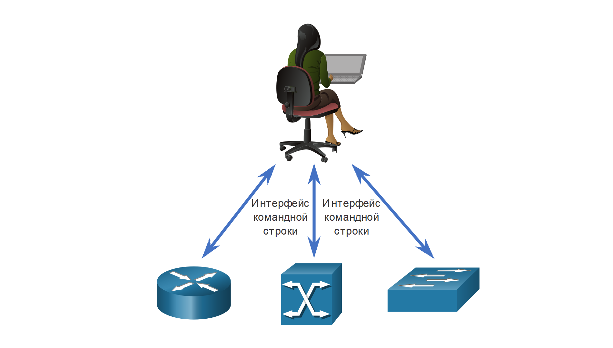
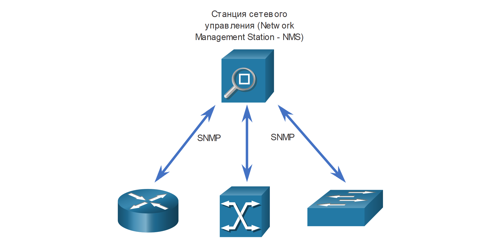
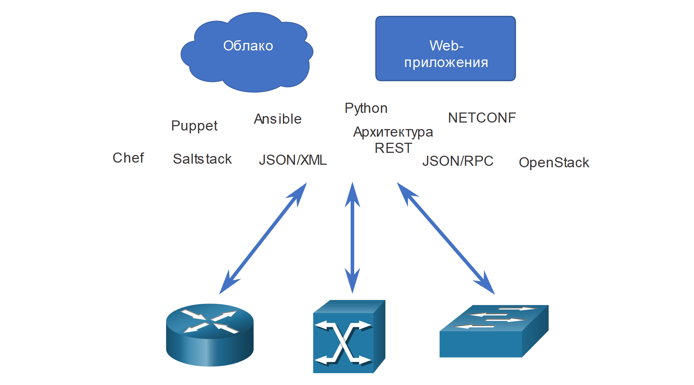

<!-- 14.5.1 -->
## Видео - Инструменты управления конфигурацией

Как упоминалось во введении к этому модулю, настройка сети может занять очень много времени. Инструменты управления конфигурацией могут помочь вам автоматизировать настройку маршрутизаторов, коммутаторов, брандмауэров и многих других аспектов вашей сети.

Нажмите кнопку Воспроизведение на видео, чтобы узнать об инструментах управления конфигурацией.

<!-- 14.5.2 -->
## Традиционная конфигурация сети

Сетевые устройства, такие как маршрутизатор, коммутаторы и брандмауэры, традиционно настраиваются сетевым администратором с помощью интерфейса командной строки, как показано на рисунке. Всякий раз, когда есть изменение или новая функция, необходимые команды конфигурации должны быть введены вручную на всех соответствующих устройствах. Во многих случаях это не только отнимает много времени, но также может привести ошибкам. Это становится серьезной проблемой в больших сетях или в сетях со сложными конфигурациями.

<!-- /courses/ensa-dl/ae8eb39a-34fd-11eb-ba19-f1886492e0e4/aeb686f0-34fd-11eb-ba19-f1886492e0e4/assets/c7392183-1c46-11ea-af56-e368b99e9723.svg -->

<!--
На рисунке показан сетевой администратор, использующий интерфейс командной строки для настройки сетевых устройств. На рисунке изображен сетевой администратор, сидящий за компьютерным столом. Двухсторонние стрелки, помеченные как CLI, указывают от администратора сети на маршрутизатор, коммутатор ATM и коммутатор.
-->

Протокол SNMP был разработан, чтобы администраторы могли управлять узлами, такими как серверы, рабочие станции, маршрутизаторы, коммутаторы и устройства информационной безопасности, в сети IP. Используя станцию управления сетью (NMS), показанную на следующем рисунке, SNMP позволяет сетевым администраторам отслеживать и управлять производительностью сети, находить и решать сетевые проблемы, а также выполнять запросы для получения статистики. SNMP работает достаточно хорошо для мониторинга устройств. Тем не менее, он обычно не используется для конфигурации из-за проблем безопасности и сложности в реализации. Хотя SNMP широко доступен, он не может служить инструментом автоматизации для современных сетей.

<!-- /courses/ensa-dl/ae8eb39a-34fd-11eb-ba19-f1886492e0e4/aeb686f0-34fd-11eb-ba19-f1886492e0e4/assets/c7396fa1-1c46-11ea-af56-e368b99e9723.svg -->

<!--
На рисунке показана станция управления сетью (NMS), использующая SNMP для управления сетевыми устройствами. На рисунке представлена станция управления сетью (NMS) с двухсторонними стрелками, обозначенными SNMP, они указывают от NMS к маршрутизатору, коммутатору ATM и коммутатору.
-->

Вы также можете использовать API-интерфейсы для автоматизации развертывания и управления сетевыми ресурсами. Вместо того чтобы администратор сети вручную настраивал порты, списки доступа, качество обслуживания (QoS) и политики балансировки нагрузки, они могут использовать инструменты для автоматизации конфигураций. Эти инструменты подключаются к сетевым API-интерфейсам для автоматизации рутинных задач обеспечения сети, позволяя администратору выбирать и развертывать необходимые им сетевые службы. Это может значительно сократить количество повторяющихся и обыденных задач, чтобы освободить время сетевых администраторов для работы над более важными вещами.

<!-- 14.5.3 -->
## Автоматизация сети

Мы быстро уходим от мира, в котором сетевой администратор управляет несколькими десятками сетевых устройств, к миру, в котором они разворачивают и управляют сотнями, тысячами и даже десятками тысяч сложных сетевых устройств (физических и виртуальных) с помощью программного обеспечения. Это преобразование быстро распространяется начиная с центра обработки данных и заканчивая всей сетью. Для операторов сети существуют новые различные методы для автоматического мониторинга, управления и настройки сети. Как показано на рисунке, к ним относятся такие протоколы и технологии, как REST, Ansible, Puppet, Chef, Python, JSON, XML и другие.

<!-- /courses/ensa-dl/ae8eb39a-34fd-11eb-ba19-f1886492e0e4/aeb686f0-34fd-11eb-ba19-f1886492e0e4/assets/c739bdc0-1c46-11ea-af56-e368b99e9723.svg -->

<!--
На рисунке показаны протоколы и технологии автоматизации сети. На рисунке в верхней части рисунка показаны облачные и веб-приложения со следующими протоколами и технологиями: Puppet, Ansible, Python, REST, NETCONF, Chef, Saltstack, JSON/XML, JSON/RPC и OpenStack. Двухсторонние стрелки указывают из облака, веб-приложений, протоколов и технологий на маршрутизатор, коммутатор и коммутатор ATM.
-->

<!-- 14.5.4 -->
## Инструменты управления конфигурацией

Инструменты управления конфигурацией используют запросы API RESTful для автоматизации задач и могут масштабироваться на тысячи устройств. Инструменты управления конфигурацией поддерживают согласованность характеристик системы или сети. Вот некоторые характеристики сети, которые администраторы могут автоматизировать:

* Программное обеспечение и контроль версий
* Атрибуты устройства, такие как имена, адресация и безопасность
* Конфигурации протокола
* Настройки ACL-списков

Инструменты управления конфигурацией обычно включают в себя автоматизацию и оркестрацию. Автоматизация - это когда инструмент автоматически выполняет задачу в системе. Это может быть настройка интерфейса или развертывание VLAN. Оркестрация - это процесс того, как должны выполняться все эти автоматизированные действия, такие как порядок, в котором они должны быть выполнены, что должно быть выполнено до начала другой задачи и т. д. Оркестрация - это организация автоматизированных задач, которая приводит к координированию рабочего процесса.

Существует несколько инструментов, облегчающих управление конфигурацией:

* Ansible
* Chef
* Puppet
* Saltstack

Цель всех этих инструментов - уменьшить сложность и сэкономить время, необходимое для настройки и поддержки крупной сетевой инфраструктуры с сотнями, даже тысячами устройств. Эти же инструменты могут быть полезны и для небольших сетей.

<!-- 14.5.5 -->
## Compare Ansible, Chef, Puppet, и SaltStack

Ansible, Chef, Puppet и SaltStack поставляются с документацией по API для настройки запросов RESTful API. Все они поддерживают JSON и YAML, а также другие форматы данных. В следующей таблице приведено краткое изложение основных характеристик инструментов управления конфигурациями Ansible, Puppet, Chef и SaltStack.

| Характеристика | Ansible | Chef | Puppet | Saltstack |
| --- | --- | --- | --- | --- |
| **Что такое язык программирования?** | Python + YAML | Ruby | Ruby | Python |
| **На основе агента или без использования агентов?** | Без использования агентов | На уровне агента | Поддерживает оба | Поддерживает оба |
| **Как управляются устройства?** | Любое устройство может быть “контроллером” | Chef мастер | Puppet мастер | Salt мастер |
| **Что создано инструментом?** | Playbook (сборник сценариев) | Cookbook (сборник рецептов) | Manifest (манифест) | Pillar (базовый компонент) |

*   **Что такое язык программирования?** - Ansible и SaltStack построены на Python, а Puppet и Chef - на Ruby. Как и Python, Ruby является кроссплатформенным языком программирования с открытым исходным кодом. Тем не менее, Ruby обычно считается более сложным языком для изучения, чем Python.
*   **На основе агента или без использования агентов?** - Управление конфигурацией осуществляется на основе агентов или без агентов. Управление конфигурацией на основе агента  - использование метода извлечения («pull-based»), он означает, что агент на управляемом устройстве периодически соединяется с ведущим устройством для получения информации о конфигурации. Изменения вначале выполняются на главном устройстве и затем разворачиваются и выполняются  остальными устройствами. Безагентное управление конфигурацией на основе push («push-based»).  Скрипт конфигурации запускается на главном устройстве - мастере. Мастер подключается к устройству и выполняет задачи в скрипте. Из четырех инструментов конфигурации в таблице только Ansible не имеет агентов.
*   **Как управляются устройства?** - Это относится к устройству под названием Мастер в Puppet, Chef и SaltStack. Однако, поскольку Ansible не имеет агентов, контроллером может быть любой компьютер.
*   **Что создано инструментом?** - Сетевые администраторы используют инструменты управления конфигурацией для создания набора инструкций для выполнения. Каждый инструмент имеет собственное название для этих инструкций: Playbook (сборник сценариев), Cookbook (сборник рецептов), Manifest (манифест) и Pillar (базовый компонент). Общим для каждого из них является спецификация политики или конфигурации, которая должна применяться к устройствам. У каждого типа устройства может быть своя собственная политика. Например, все серверы Linux могут иметь одинаковую базовую конфигурацию и политику безопасности.

<!-- 14.5.6 -->
<!-- quiz -->

