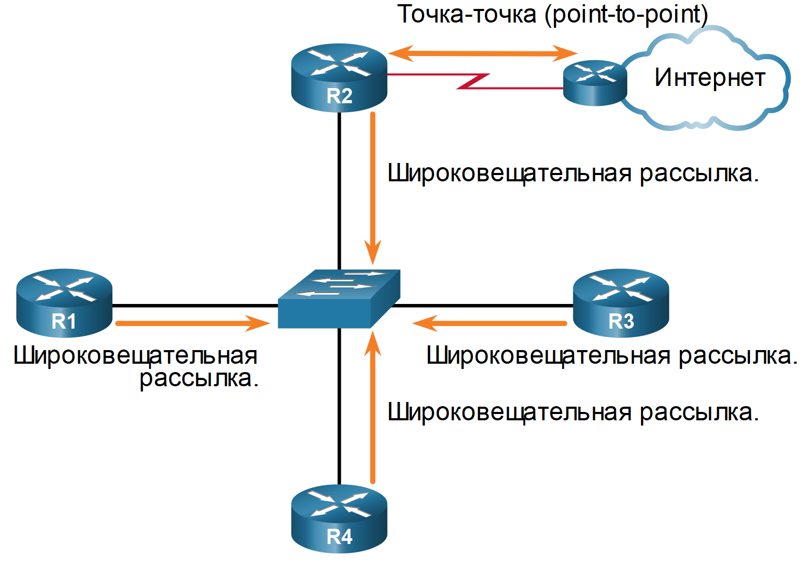
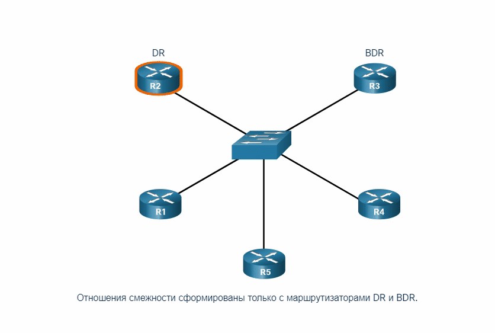
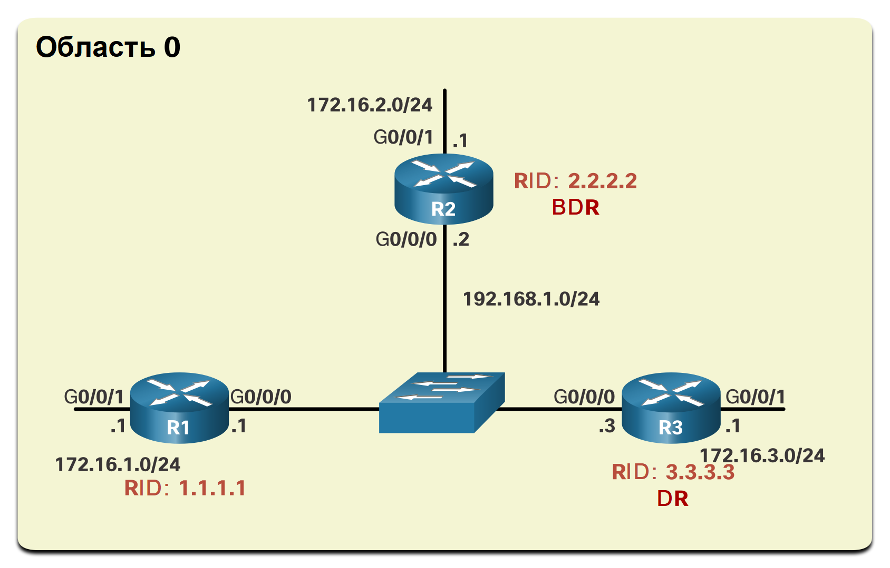
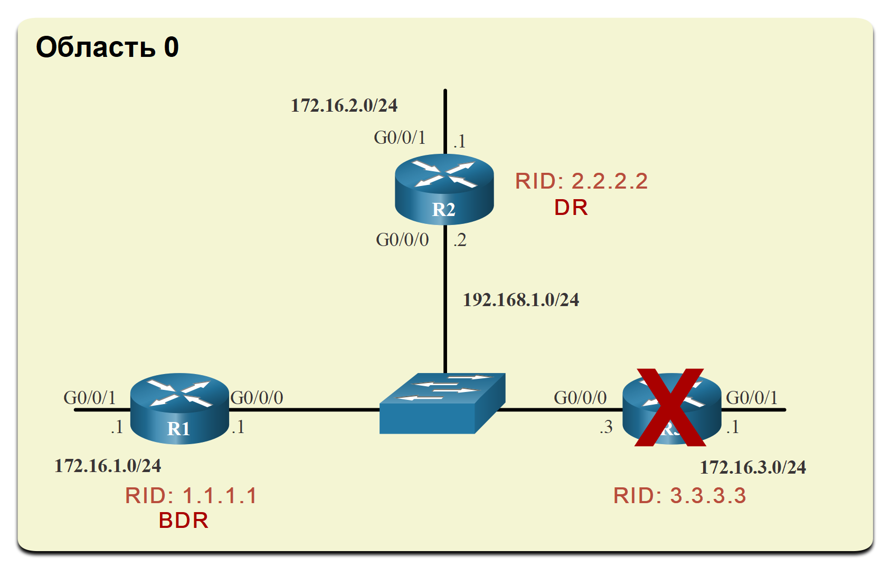
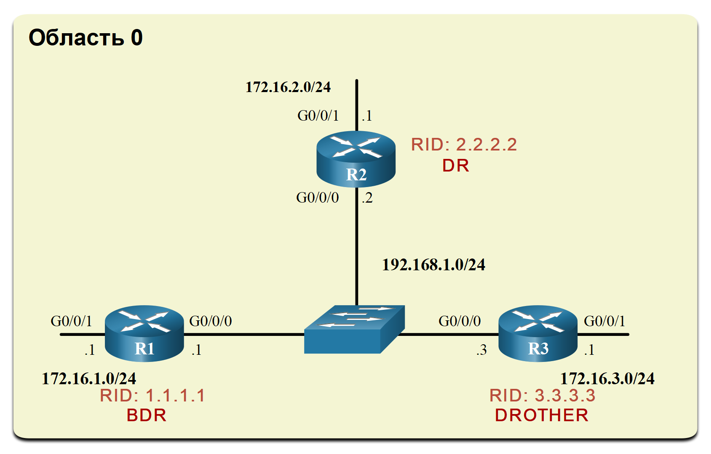
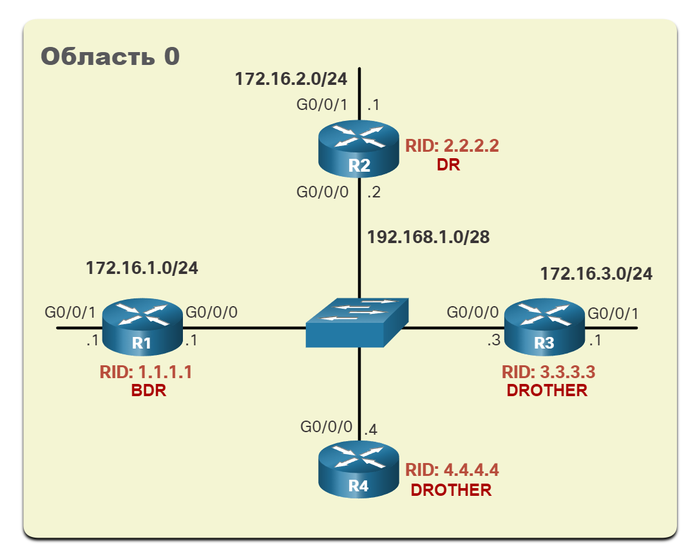
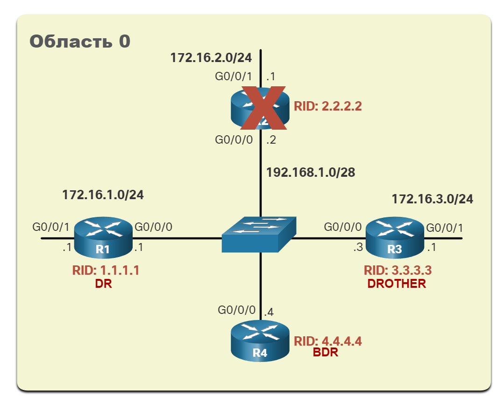

<!-- 2.3.1 -->
## Типы сетей OSPF

Другой тип сети, использующей OSPF, — это сеть OSPF с множественным доступом. Многоканальные сети OSPF уникальны тем, что один маршрутизатор управляет распределением LSA. Маршрутизатор, выбранный для этой роли, должен быть определен администратором сети с помощью правильной настройки.

OSPF может включать дополнительные процессы в зависимости от типа сети. В предыдущей топологии использовались каналы  «точка-точка» между маршрутизаторами. Однако маршрутизаторы могут быть подключены к одному и тому же коммутатору, чтобы сформировать сеть с множественным доступом, как показано на рисунке. Локальные сети Ethernet — это наиболее распространённый пример широковещательных сетей множественного доступа. В широковещательных сетях все устройства в рамках сети видят все широковещательные кадры и кадры групповой рассылки.

**Сеть OSPF множественного доступа**


<!-- /courses/ensa-dl/ae8e6570-34fd-11eb-ba19-f1886492e0e4/aeb32b82-34fd-11eb-ba19-f1886492e0e4/assets/c5a932b1-1c46-11ea-af56-e368b99e9723.svg -->

<!--
Сеть коллективного доступа OSPF, состоящая из четырех маршрутизаторов, подключенных к центральному коммутатору; стрелки, представляющие широковещательные рассылки, перенаправляются каждым маршрутизатором на коммутатор; один маршрутизатор имеет соединение «точка-точка» с другим маршрутизатором в облаке Интернета
-->

<!-- 2.3.2 -->
## Выделенный маршрутизатор OSPF

Напомним, что в сетях коллективного  доступа OSPF выбирает DR и BDR в качестве решения для управления количеством смежностей и переполнением объявлений состояния каналов (LSA). DR отвечает за сбор и распространение отправленных и полученных LSAs. DR использует IPv4-адрес многоадресной рассылки 224.0.0.5, который предназначен для всех маршрутизаторов OSPF.

На случай сбоя выделенного маршрутизатора (DR) также выбирается резервный назначенный маршрутизатор (BDR). Маршрутизатор BDR пассивно наблюдает за этим обменом и поддерживает отношения со всеми маршрутизаторами. Если DR перестает создавать пакеты приветствия (hello), то BDR самостоятельно принимает роль DR.

Остальные маршрутизаторы, не являющиеся DR или BDR, станут маршрутизаторами DROTHER (маршрутизатор, которые не являются ни DR, ни BDR). DROTHER используют адрес с несколькими доступом 224.0.0.6 (все назначенные маршрутизаторы) для отправки пакетов OSPF в DR и BDR. Только DR и BDR прослушивают 224.0.0.6.

На рисунке R1, R5 и R4 являются DROTHER. Нажмите кнопку воспроизведения, чтобы увидеть анимацию R2, действующей в качестве DR. Обратите внимание, что только DR и BDR обрабатывает LSA, отправленные R1, используя IPv4 адрес 224.0.0.6 многоадресной рассылки. Затем DR отправляет LSA всем маршрутизаторам OSPF, используя адрес IPv4 для многоадресной рассылки 224.0.0.5.

**Роль выделенного маршрутизатора (DR)**



<!--
анимация, показывающая пять маршрутизаторов в одной и той же сети коллективного  доступа, подключенной к коммутатору. Соседское взаимоотношение были сформированы только между DR и BDR. DRother отправляет LSA в DR и BDR. DR отправляет объявления состояний канала ко всем остальным маршрутизаторам.
-->

<!-- 2.3.3 -->
## Топология широковещательной рассылки с множественным доступом OSPFv2

В топологии множественного доступа, показанной на рисунке, три маршрутизатора связаны между собой через общую сеть Ethernet с множественным доступом 192.168.1.0/24. Для каждого из маршрутизаторов на интерфейсе Gigabit Ethernet 0/0/0 настраивается указанный адрес IPv4.

Поскольку маршрутизаторы соединены сети коллективного  доступа, OSPF выбрал DR и BDR автоматически. В данном примере в качестве DR был выбран маршрутизатор R3, поскольку он обладает идентификатором 3.3.3.3 — самым высоким в этой сети. Маршрутизатор R2 выбран в качестве BDR, поскольку он обладает наивысшим идентификатором в сети среди оставшихся маршрутизаторов.


<!-- /courses/ensa-dl/ae8e6570-34fd-11eb-ba19-f1886492e0e4/aeb32b82-34fd-11eb-ba19-f1886492e0e4/assets/c5ab0771-1c46-11ea-af56-e368b99e9723.svg -->

<!--
Диаграмма представляет собой  топологию коллективного доступа  OSPF, используемую в нескольких разделах этого модуля и показывающую три маршрутизатора, подключенных к центральному коммутатору, все из которых находятся в сети 192.168.1.0/24 в области 0. Слева находится маршрутизатор R1, подключенный к коммутатору через интерфейс g0/0/0 по адресу .1. R1 имеет идентификатор маршрутизатора 1.1.1.1. R1 имеет другое подключение к сети 172.16.1.0/24 через интерфейс g0/0/1 по адресу .1. На вершине находится маршрутизатор R2, подключенный к коммутатору через интерфейс g0/0/0 по адресу .2. R2 имеет идентификатор маршрутизатора 2.2.2.2 и был выбран BDR. R2 имеет другое подключение к сети 172.16.2.0/24 через интерфейс g0/0/1 по адресу .1. Справа расположен маршрутизатор R3, подключенный к коммутатору через интерфейс g0/0/0 по адресу .3. R3 имеет идентификатор маршрутизатора 3.3.3.3 и был выбран DR. R3 имеет другое подключение к сети 172.16.3.0/24 через интерфейс g0/0/1 по адресу .1.
-->

<!-- 2.3.4 -->
## Проверка ролей маршрутизатора OSPF

Для проверки ролей маршрутизатора OSPFv2 используйте команду **show ip ospf** **interface**.

**R1 DROTHER**

Выходные данные, сгенерированные маршрутизатором R1, подтверждают это:

1.  R1 является ни DR, ни BDR, а является маршрутизатором DROTHER с приоритетом по умолчанию 1. (строка 7)
2.  Выделенный маршрутизатор DR — это R3 с идентификатором маршрутизатора 3.3.3.3 по адресу IPv4 192.168.1.3, а резервный выделенный маршрутизатор BDR — это R2 с идентификатором маршрутизатора 2.2.2.2 по адресу IPv4 192.168.1.2. (строки 8 и 9)
3.  R1 имеет два отношения смежности: одно с BDR, другое с DR. (Строки 20-22)

```
R1# show ip ospf interface GigabitEthernet 0/0/0 
GigabitEthernet0/0/0 is up, line protocol is up 
  Internet Address 192.168.1.1/24, Area 0, Attached via Interface Enable 
  Process ID 10, Router ID 1.1.1.1, Network Type BROADCAST, Cost: 1 
  Topology-MTID Cost Disabled Shutdown Topology Name
        0 1 no no Base
  Enabled by interface config, including secondary ip addresses
  Transmit Delay is 1 sec, State DROTHER, Priority 1 Designated Router (ID) 3.3.3.3, Interface address 192.168.1.3
  Backup Designated router (ID) 2.2.2.2, Interface address 192.168.1.2 
  Timer intervals configured, Hello 10, Dead 40, Wait 40, Retransmit 5
    oob-resync timeout 40
     Hello due in 00:00:07 
  Supports Link-local Signaling (LLS)
  Cisco NSF helper support enabled
  IETF NSF helper support enabled
  Index 1/1/1, flood queue length 0
  Next 0x0(0)/0x0(0)/0x0(0)
  Last flood scan length is 0, maximum is 1 
  Last flood scan time is 0 msec, maximum is 1 msec
  Neighbor Count is 2, Adjacent neighbor count is 2 
    Adjacent with neighbor 2.2.2.2 (Backup Designated Router)
    Adjacent with neighbor 3.3.3.3 (Designated Router)
  Suppress hello for 0 neighbor(s)
R1#
```

**R2 BDR**

Выходные данные, сгенерированные маршрутизатором R2, подтверждают это:

1.  R2 — это BDR с приоритетом по умолчанию 1. (строка 7)
2.  Выделенный маршрутизатор DR — это R3 с идентификатором маршрутизатора 3.3.3.3 по адресу IPv4 192.168.1.3, а резервный выделенный маршрутизатор BDR — это R2 с идентификатором маршрутизатора 2.2.2.2 по адресу IPv4 192.168.1.2. (строки 8 и 9)
3.  R2 имеет два отношения смежности: одно с соседним устройством с идентификатором 1.1.1.1 (R1), а другое — с DR. (Строки 20-22)

```
R2# show ip ospf interface GigabitEthernet 0/0/0 
GigabitEthernet0/0/0 is up, line protocol is up 
  Internet Address 192.168.1.2/24, Area 0, Attached via Interface Enable 
  Process ID 10, Router ID 2.2.2.2, Network Type BROADCAST, Cost: 1 
  Topology-MTID Cost Disabled Shutdown Topology Name
        0 1 no no Base
  Enabled by interface config, including secondary ip addresses
  Transmit Delay is 1 sec, State BDR, Priority 1 Designated Router (ID) 3.3.3.3, Interface address 192.168.1.3
  Backup Designated router (ID) 2.2.2.2, Interface address 192.168.1.2 
  Timer intervals configured, Hello 10, Dead 40, Wait 40, Retransmit 5
    oob-resync timeout 40
    Hello due in 0:00:01
  Supports Link-local Signaling (LLS)
  Cisco NSF helper support enabled
  IETF NSF helper support enabled
  Index 1/1, flood queue length 0
  Next 0x0(0)/0x0(0)
  Last flood scan length is 0, maximum is 1 
  Last flood scan time is 0 msec, maximum is 0 msec
  Neighbor Count is 2, Adjacent neighbor count is 2 
    Adjacent with neighbor 1.1.1.1
    Adjacent with neighbor 3.3.3.3 (Designated Router)
  Suppress hello for 0 neighbor(s)
R2#
```

**R3 DR**

Выходные данные, сгенерированные маршрутизатором R3, подтверждают это:

1.  R3 — это DR с приоритетом по умолчанию 1. (строка 7)
2.  Выделенный маршрутизатор DR — это R3 с идентификатором маршрутизатора 3.3.3.3 по адресу IPv4 192.168.1.3, а резервный выделенный маршрутизатор BDR — это R2 с идентификатором маршрутизатора 2.2.2.2 по адресу IPv4 192.168.1.2. (строки 8 и 9) 
3.  R3 имеет два отношения смежности: одно с соседним устройством с идентификатором 1.1.1.1 (R1), а другое с BDR. (Строки 20-22)

```
R3# show ip ospf interface GigabitEthernet 0/0/0 
GigabitEthernet0/0/0 is up, line protocol is up 
  Internet Address 192.168.1.3/24, Area 0, Attached via Interface Enable 
  Process ID 10, Router ID 3.3.3.3, Network Type BROADCAST, Cost: 1 
  Topology-MTID Cost Disabled Shutdown Topology Name
        0 1 no no Base
  Enabled by interface config, including secondary ip addresses
  Transmit Delay is 1 sec, State DR, Priority 1 Designated Router (ID) 3.3.3.3, Interface address 192.168.1.3
  Backup Designated router (ID) 2.2.2.2, Interface address 192.168.1.2 
  Timer intervals configured, Hello 10, Dead 40, Wait 40, Retransmit 5
    oob-resync timeout 40
    Hello due in 0:00:06
  Supports Link-local Signaling (LLS)
  Cisco NSF helper support enabled
  IETF NSF helper support enabled
  Index 1/1/1, flood queue length 0
  Next 0x0(0)/0x0(0)/0x0(0)
  Last flood scan length is 2, maximum is 2 
  Last flood scan time is 0 msec, maximum is 0 msec
  Neighbor Count is 2, Adjacent neighbor count is 2 
    Adjacent with neighbor 1.1.1.1 
    Adjacent with neighbor 2.2.2.2 (Backup Designated Router)
  Suppress hello for 0 neighbor(s)
R3#
```

<!-- 2.3.5 -->
## Проверка отношений смежности DR/BDR

Чтобы проверить смежность OSPFv2, используйте  команду **show ip ospf neighbor**, как показано в примере для R1. У соседей в сетях со множественным доступом могут быть следующие состояния:

* **FULL/DROTHER** - это выделенный маршрутизатор DR или резервный выделенный маршрутизатор BDR, который полностью смежен с не выделенным маршрутизатором (не DR и не BDR). Эти два соседних устройства могут обмениваться пакетами приветствия (hello), обновлениями, запросами, ответами и подтверждениями.
* **FULL/DR** - маршрутизатор, полностью смежный с указанным соседом DR. Эти два соседних устройства могут обмениваться пакетами приветствия (hello), обновлениями, запросами, ответами и подтверждениями.
* **FULL/BDR** - маршрутизатор, полностью смежный с указанным соседом BDR. Эти два соседних устройства могут обмениваться пакетами приветствия (hello), обновлениями, запросами, ответами и подтверждениями.
* **2-WAY/DROTHER** - это не выделенный маршрутизатор (не DR и не BDR), у которого имеются отношения смежности с другим невыделенным маршрутизатором (не DR и не BDR). Эти два соседних устройства обмениваются пакетами приветствия (hello).

Нормальное состояние для маршрутизатора OSPF обычно FULL. Если маршрутизатор длительное время находится в другом состоянии, это означает, что у него возникли проблемы с формированием отношений смежности. Единственное исключение из этого правила — это состояние 2-WAY, которое является нормальным в вещательной сети со множественным доступом. Однако маршрутизаторы DROTHER по-прежнему будут формировать соседские отношения смежности 2-WAY с любыми маршрутизаторами DROTHER, которые подключатся к сети. В этом случае состояние соседа отображается как 2-WAY/DROTHER.

**Смежности R1**

Выходные данные, сгенерированные маршрутизатором R1, подтверждают, что R1 имеет отношения смежности с маршрутизатором:

* Маршрутизатор R2 с идентификатором 2.2.2.2 находится в состоянии Full и выполняет роль BDR.
* Маршрутизатор R3 с идентификатором 3.3.3.3 находится в состоянии Full и выполняет роль DR.

```
R1# show ip ospf neighbor 
Neighbor ID Pri State Dead Time Address Interface
2.2.2.2 1 FULL/BDR 00:00:31 192.168.1.2 GigabitEthernet0/0/0  
3.3.3.3 1 FULL/DR 00:00:39 192.168.1.3 GigabitEthernet0/0/0 
R1#
```

**Смежности R2**

Выходные данные, сгенерированные маршрутизатором R2, подтверждают, что R2 имеет отношения смежности с маршрутизатором:

* Маршрутизатор R1 с идентификатором 1.1.1.1 находится в состоянии Full и не выполняет роль DR или BDR.
* Маршрутизатор R3 с идентификатором 3.3.3.3 находится в состоянии Full и выполняет роль DR.

```
R2# show ip ospf neighbor 
Neighbor ID Pri State Dead Time Address Interface
1.1.1.1 1 FULL/DROTHER 00:00:31 192.168.1.1 GigabitEthernet0/0/0
3.3.3.3 1 FULL/DR 00:00:34 192.168.1.3 GigabitEthernet0/0/0 
R2#
```

**Смежности R3**

Выходные данные, сгенерированные маршрутизатором R3, подтверждают, что R3 имеет отношения смежности с маршрутизатором:

* Маршрутизатор R1 с идентификатором 1.1.1.1 находится в состоянии Full и не выполняет роль DR или BDR.
* Маршрутизатор R2 с идентификатором 2.2.2.2 находится в состоянии Full и выполняет роль BDR.

```
R3# show ip ospf neighbor 
Neighbor ID Pri State Dead Time Address Interface
1.1.1.1 1 FULL/DROTHER 00:00:31 192.168.1.1 GigabitEthernet0/0/0
2.2.2.2 1 FULL/BDR 00:00:31 192.168.1.2 GigabitEthernet0/0/0
R3#
```

<!-- 2.3.6 -->
## Процесс выбора DR/BDR по умолчанию

Как происходит выбор маршрутизаторов DR и BDR? Выбор ролей DR и BDR по протоколу OSPF основывается на следующих критериях в указанной очередности:

1.  Маршрутизаторы в сети выбирают маршрутизатор с самым высоким приоритетом интерфейса в качестве DR. Маршрутизатор со вторым по величине приоритетом интерфейса становится BDR. Приоритет может быть представлен любым числом от 0 до 255. Если значение приоритета интерфейса равно 0, этот интерфейс не может быть выбран как DR или BDR. Приоритет по умолчанию интерфейсов, подключенных к широковещательной сети множественного доступа, равен 1. Соответственно, при отсутствии иных настроек, все маршрутизаторы обладают равным приоритетом, и для выборов DR/BDR будет использоваться другой метод.
2.  Если приоритеты интерфейсов равны, то в качестве DR будет выбран маршрутизатор с наивысшим идентификатором. Маршрутизатор со вторым по величине идентификатором становится BDR.

Как вы помните, идентификатор маршрутизатора определяется одним из трех способов:

1.  Идентификатор маршрутизатора может быть настроен вручную.
2.  Если идентификаторы маршрутизатора не настроены, то идентификатор маршрутизатора определяется по наивысшему адресу обратной петли IPv4.
3.  Если интерфейсы loopback не настроены, то идентификатор маршрутизатора определяется по наивысшему активному IPv4-адресу.

**Топология OSPFv2  в сети коллективного  доступа**


<!-- /courses/ensa-dl/ae8e6570-34fd-11eb-ba19-f1886492e0e4/aeb32b82-34fd-11eb-ba19-f1886492e0e4/assets/c5adeda0-1c46-11ea-af56-e368b99e9723.svg -->

<!--
эталонная топология OSPF с коллективными  доступом, используемая в этом модуле, как описано в 2.3.3
-->

На рисунке все Ethernet-интерфейсы маршрутизатора имеют приоритет по умолчанию 1. В результате, в соответствии с вышеупомянутыми критериями выбора, для выбора DR и BDR используется идентификатор маршрутизатора OSPF. Роль DR принимает маршрутизатор R3, поскольку он имеет наивысший идентификатор. Маршрутизатор R2, имеющий второй по величине идентификатор, становится BDR.

Процедура выбора DR и BDR начинается сразу после появления в сети с множественным доступом первого активного маршрутизатора с интерфейсом, где включен OSPF. Это может произойти при включении питания маршрутизаторов с предварительно настроенным протоколом OSPF или при активации протокола OSPF на интерфейсе. Процедура выбора занимает всего несколько секунд. Если в сети с множественным доступом загрузились не все маршрутизаторы, то роль DR может получить маршрутизатор не с самым высоким идентификатором.

Процесс выбора DR и BDR по протоколу OSPF не является вытесняющим. Если после завершения выбора DR/BDR в сети появляется новый маршрутизатор с более высоким приоритетом или идентификатором, то этот новый маршрутизатор не перенимает роль DR или BDR, поскольку эти роли уже назначены. Добавление нового маршрутизатора не приводит к новому процессу выбора.

<!-- 2.3.7 -->
##  Сбой  и восстановление DR

Когда какой-либо маршрутизатор выбран в качестве DR, то он сохраняет эту роль, пока не произойдет одно из следующих событий:

* Сбой DR.
* Сбой или остановка OSPF-процесса на DR.
* Сбой или отключение интерфейса со множественным доступом на DR.

Если происходит сбой DR, то его роль автоматически перенимает BDR. Это происходит даже в том случае, если после первоначального выбора DR/BDR к сети добавляется другой маршрутизатор DROTHER с более высоким идентификатором или приоритетом. Однако когда BDR перенимает роль DR, происходит новый выбор BDR и его роль получает маршрутизатор DROTHER с высоким идентификатором или приоритетом.

**Сбой в работе R3**

В этом случае происходит сбой текущего DR (R3). Следовательно, его роль перенимает предварительно выбранный BDR (R2). После этого выполняется выбор нового BDR. Поскольку R1 является маршрутизатором DROTHER, то он и выбирается в качестве BDR.


<!-- /courses/ensa-dl/ae8e6570-34fd-11eb-ba19-f1886492e0e4/aeb32b82-34fd-11eb-ba19-f1886492e0e4/assets/c5af4d31-1c46-11ea-af56-e368b99e9723.svg -->

<!--
эталонная топология OSPF с коллективным  доступом, как описано в 2.3.3, и влияние неудачного маршрутизатора на выбор DR/BDR; красный X появляется над R3, указывающий на сбой маршрутизатора; R2 обозначается DR, а R1 — BDR
-->

**R3 повторно объединяет сеть**

В  сценарии R3 повторно подключился к сети после того, как был недоступен в течение нескольких минут. Поскольку маршрутизаторы DR и BDR уже выбраны, R3 не получает ни одну из этих ролей.  Вместо этого он становится DROTHER.


<!-- /courses/ensa-dl/ae8e6570-34fd-11eb-ba19-f1886492e0e4/aeb32b82-34fd-11eb-ba19-f1886492e0e4/assets/c5afc260-1c46-11ea-af56-e368b99e9723.svg -->

<!--
влияние на выбор DR и BDR в опорной топологии OSPF с коллективным доступом, как описано в 2.3.3, после сбоя R3, а затем R3 вновь присоединяется к сети; R2 остается DR, R1 остается BDR, а R3 становится DROTHER
-->

**R4 подключается к сети**

В этом сценарии  к сети добавляется новый маршрутизатор (R4) с более высоким идентификатором. DR (R2) и BDR (R1) сохраняют свои роли. R4 автоматически становится маршрутизатором DROTHER.


<!-- /courses/ensa-dl/ae8e6570-34fd-11eb-ba19-f1886492e0e4/aeb32b82-34fd-11eb-ba19-f1886492e0e4/assets/c5b01082-1c46-11ea-af56-e368b99e9723.svg -->

<!--
эталонная топология OSPF с коллективным  доступом, используемая в этом модуле, как описано в 2.3.3, и влияние нескольких изменений топологии
-->

**R2 отказывает**

В этом случае R2 не успешен. BDR (R1) автоматически принимает роль DR. В результате процесса выбора маршрутизатор R4 становится BDR, поскольку он обладает более высоким идентификатором.


<!-- /courses/ensa-dl/ae8e6570-34fd-11eb-ba19-f1886492e0e4/aeb32b82-34fd-11eb-ba19-f1886492e0e4/assets/c5b0d3d0-1c46-11ea-af56-e368b99e9723.svg -->

<!--
эталонная топология OSPF с коллективным доступом, используемая в этом модуле, как описано в 2.3.3, и влияние нескольких изменений топологии
-->

<!-- 2.3.8 -->
## Команда ip ospf priority

Если на всех маршрутизаторах приоритеты интерфейсов равны, то в качестве DR будет выбран маршрутизатор с наивысшим идентификатором. Идентификатор маршрутизатора можно настроить специально для манипуляции выбора DR/BDR. Однако этот процесс сработает лишь в том случае, если на всех маршрутизаторах существует строгий порядок настройки идентификатора. Настройка идентификатора маршрутизатора может помочь управлять этим. В крупных сетях использование данного метода может вызвать трудности.

Вместо того чтобы полагаться на идентификатор маршрутизатора, рекомендуется управлять выбором посредством настройки приоритетов интерфейсов. Также это позволяет маршрутизатору выполнять роль DR в одной сети, и DROTHER — в другой. Для задания приоритета интерфейса используйте команду **ip ospf priority** _value_, где значение от 0 до 255. Значение 0 не становится DR или BDR. Значение от 1 до 255 на интерфейсе повышает вероятность того, что маршрутизатор становится DR или BDR.

<!-- 2.3.9 -->
## Настройка приоритета OSPF

В топологии  команда **ip ospf priority** будет использоваться для изменения DR и BDR следующим образом:

* Маршрутизатор R1 должен выполнять роль DR и будет настроен с приоритетом 255.
* Маршрутизатор R2 должен выполнять роль BDR, и его приоритет останется со значением по умолчанию 1.
* Маршрутизатор R3 не должен выполнять роль DR или BDR и будет настроен с приоритетом 0.

Измените приоритет интерфейса R1 G0/0/0 с 1 на 255.

```
R1(config)# interface GigabitEthernet 0/0/0 
R1(config-if)# ip ospf priority 255 
R1(config-if)# end 
R1#
```

Измените приоритет интерфейса R3 G0/0/0 с 1 на 0.

```
R3(config)# interface GigabitEthernet 0/0/0
R3(config-if)# ip ospf priority 0
R3(config-if)# end
R3#
```

В следующем примере показано, как очистить процесс OSPF на R1. Команда **clear ip ospf process** также должна быть введена на R2 и R3 (не отображается). Обратите внимание на появившиеся сведения о состоянии OSPF.

```
R1# clear ip ospf process
Reset ALL OSPF processes? [no]: y
R1#
*Jun  5 03:47:41.563: %OSPF-5-ADJCHG: Process 10, Nbr 2.2.2.2 on GigabitEthernet0/0/0 from FULL to DOWN, Neighbor Down: Interface down or detached
*Jun  5 03:47:41.563: %OSPF-5-ADJCHG: Process 10, Nbr 3.3.3.3 on GigabitEthernet0/0/0 from FULL to DOWN, Neighbor Down: Interface down or detached
*Jun  5 03:47:41.569: %OSPF-5-ADJCHG: Process 10, Nbr 2.2.2.2 on GigabitEthernet0/0/0 from LOADING to FULL, Loading Done
*Jun  5 03:47:41.569: %OSPF-5-ADJCHG: Process 10, Nbr 3.3.3.3 on GigabitEthernet0/0/0 from LOADING to FULL, Loading Done
```

Выходные данные команды **show in ospf interface g0/0/0** на R1 подтверждают, что R1 теперь является DR с приоритетом 255, и идентифицируют новые соседние смежности с R1.

```
R1# show ip ospf interface GigabitEthernet 0/0/0
GigabitEthernet0/0/0 is up, line protocol is up 
  Internet Address 192.168.1.1/24, Area 0, Attached via Interface Enable
  Process ID 10, Router ID 1.1.1.1, Network Type BROADCAST, Cost: 1
  Topology-MTID    Cost    Disabled    Shutdown      Topology Name
        0           1         no          no            Base
  Enabled by interface config, including secondary ip addresses
  Transmit Delay is 1 sec, State DR, Priority 255
  Designated Router (ID) 1.1.1.1, Interface address 192.168.1.1
  Backup Designated router (ID) 2.2.2.2, Interface address 192.168.1.2
  Timer intervals configured, Hello 10, Dead 40, Wait 40, Retransmit 5
    oob-resync timeout 40
    Hello due in 00:00:00
  Supports Link-local Signaling (LLS)
  Cisco NSF helper support enabled
  IETF NSF helper support enabled
  Index 1/1/1, flood queue length 0
  Next 0x0(0)/0x0(0)/0x0(0)
  Last flood scan length is 1, maximum is 2
  Last flood scan time is 0 msec, maximum is 1 msec
  Neighbor Count is 2, Adjacent neighbor count is 2 
    Adjacent with neighbor 2.2.2.2  (Backup Designated Router)
    Adjacent with neighbor 3.3.3.3
  Suppress hello for 0 neighbor(s)
R1#
```

<!-- 2.3.10 -->
<!-- syntax -->

<!-- 2.3.11 -->
## Packet Tracer. Определение DR и BDR

В этом задании вы выполните следующие действия:

* В этом упражнении вы сможете изучить роли DR и BDR, а также проследить за изменением ролей при изменениях в сети.
* Затем вам предстоит изменить приоритет для контроля функций и инициировать новый выбор.
* Наконец, вам нужно будет проверить, выполняют ли маршрутизаторы свои функции.

[Определение DR и BDR (pdf)](./assets/2.3.11-packet-tracer---determine-the-dr-and-bdr_ru-RU.pdf)

[Определение DR и BDR (pka)](./assets/2.3.11-packet-tracer---determine-the-dr-and-bdr.pka)

