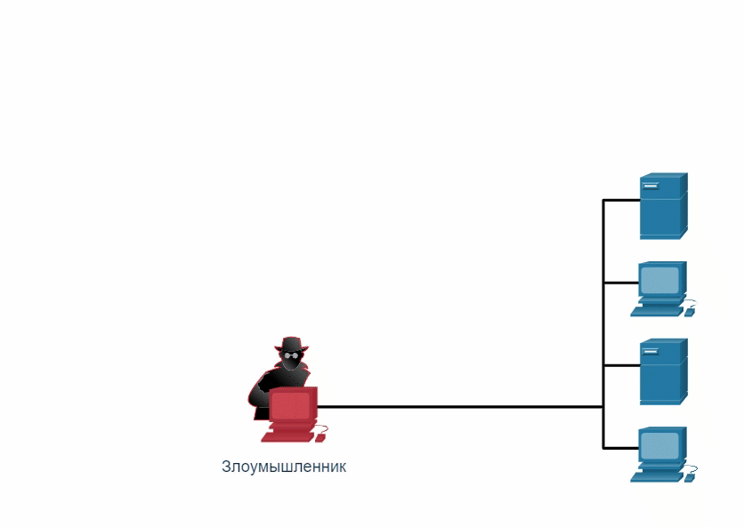
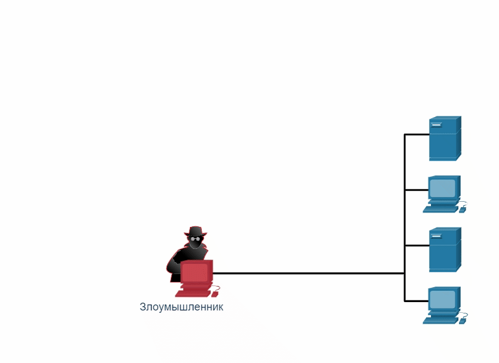
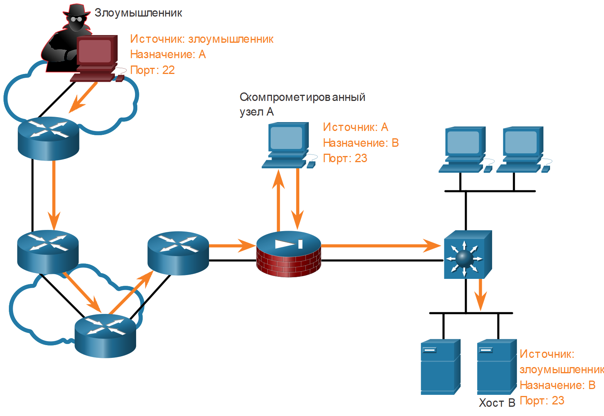
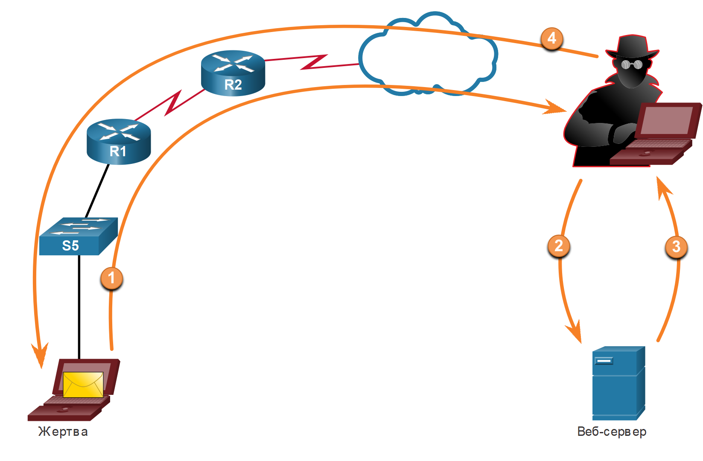
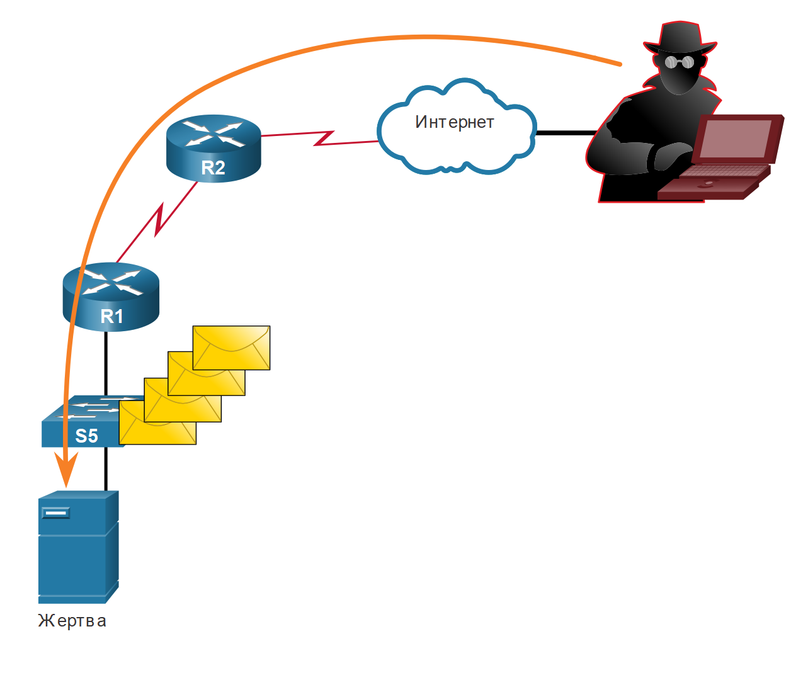
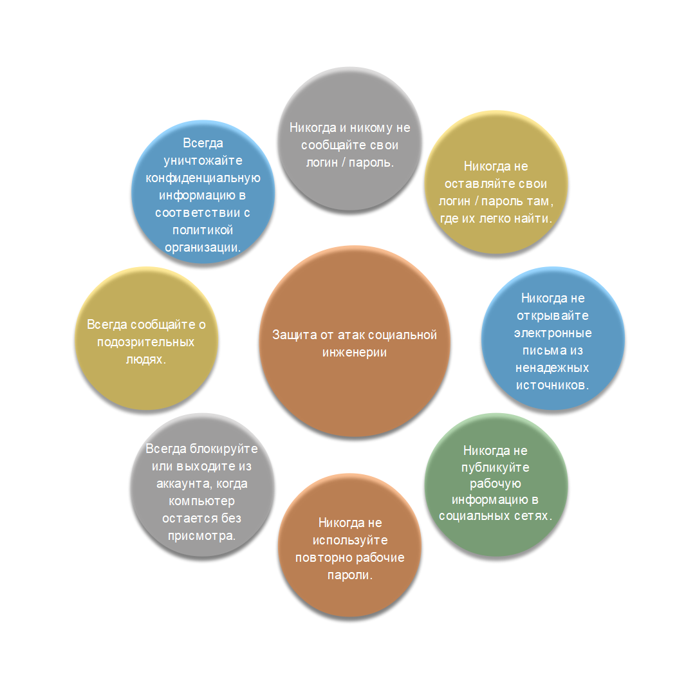
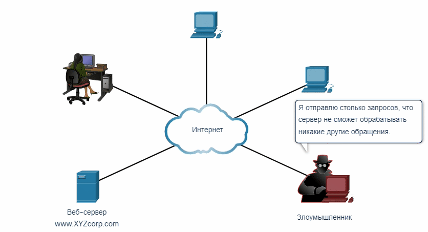
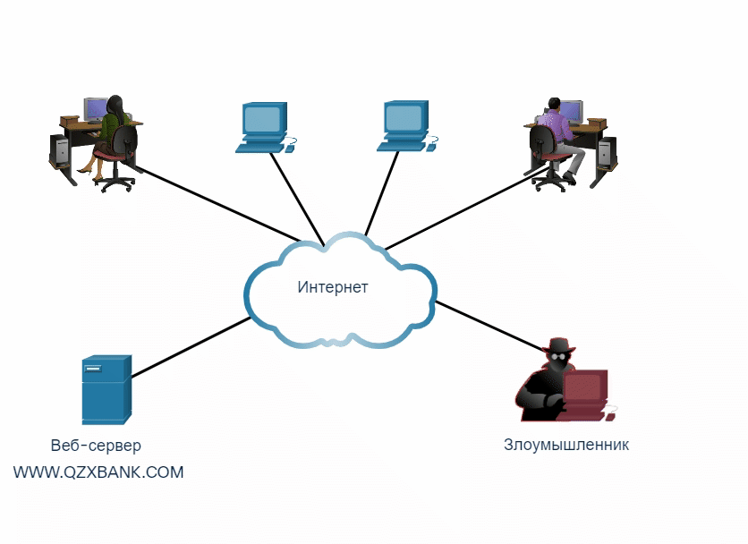

<!-- 3.5.1 -->
## Обзор сетевых атак

Как вы уже знаете, существует много типов вредоносных программ, которые могут использовать злоумышленники. Но это не единственный способ, которым они могут атаковать сеть или даже организацию.

Когда вредоносное ПО доставляется и устанавливается, его информационное наполнение может использоваться для различных сетевых атак.

Для того чтобы минимизировать последствия атак, полезно сначала классифицировать их различные виды. Распределив сетевые атаки по категориям, можно рассматривать типы атак, а не отдельные атаки.

Сети подвержены следующим типам атак:

* Разведывательные атаки
* Атаки доступа
* Атаки типа «отказ в обслуживании» (DoS-атаки)

<!-- 3.5.2 -->
## Видео - Разведывательные атаки

Нажмите "Воспроизведение", чтобы просмотреть видео о разведывательных атаках.

<!-- 3.5.3 -->
## Разведывательные атаки

Разведкой называется сбор информации. Такие атаки аналогичны вору, который осматривает окрестности, переходя от двери к двери и притворяясь, будто что-то продает. Вор фактически ищет уязвимые дома для взлома, например: незанятые дома, дома с легко открывающимися окнами и дверьми и дома без систем безопасности или камер видеонаблюдения.

Злоумышленники используют разведывательные атаки для несанкционированного обнаружения и сопоставления систем, служб или уязвимостей. Повторные атаки предшествуют атакам доступа или DoS-атакам.

Некоторые техники, используемые злоумышленниками для проведения разведывательных атак, описаны в таблице.

| **Техника** | **Описание** |
| --- | --- |
| **Выполнить информационный запрос цели** | Хакер ищет исходную информацию о целевом объекте. Можно использовать различные инструменты, в том числе поиск Google, веб-сайт организаций, whois и многое другое. |
| **Инициация пинг-запроса целевой сети.**  | Информационный запрос обычно выявляет целевой #сетевой адрес. Злоумышленник теперь может инициировать проверку связи, чтобы определить, какие IP-адреса активны. |
| **Инициация сканирования портов активных IP-адресов.** | Используется для определения доступных портов или сервисов. Примеры сканеров портов: инструменты Nmap, SuperScan, Angry IP Scanner и NetScan. |
| **Запуск сканеров уязвимостей.** | Выполняется для опроса идентифицированных портов, определения типа и версии приложений и операционной системы, запущенной на целевом хосте. Среди этих инструментов ― Nipper, Secunia PSI, Core Impact, Nessus v6, SAINT, и Open VAS. |
| **Запуск эксплойтов.** | Теперь хакер пытается обнаружить уязвимые сервисы, которые можно использовать. Существует целый ряд инструментов для использования уязвимостей, среди них: Metasploit, Core Impact, Sqlmap, Social Engineer Toolkit и Netsparker. |

**Информационные веб-запросы**

Посмотрите анимацию, иллюстрирующую злоумышленника, который использует команду whois для получения информации о цели.

<!--
The animation shows a threat actor connected to a network with p cs and servers. The animation shows the threat actor type the address http://www.whois.net into a web browser. The animation now shows a who is search for all who is records. the threat actor types in cisco.com to search for its record. the record is returned showing cisco.com and the physical address for Cisco in San Jose.
-->

**Выполнение ping-тестирования адресов (Ping Sweep)**

Посмотрите анимацию, иллюстрирующую хакера, который выполняет эхо тестирование пространства сетевых адресов целевого объекта для обнаружения активных IP-адресов.

<!--
The animation shows a threat actor connected to a network with p cs and servers. The animation shows the threat actor's computer send a small red target to each of the computers and servers on the network. Each of the small red targets is returned to the threat actor's computer.
-->

**Выполнение сканирования портов**

Посмотрите анимацию, иллюстрирующую хакера, выполняющего сканирование портов с помощью программы Nmap для обнаружения активных IP-адресов.

<!--
The animation shows a threat actor connected to a network with p cs and servers. The animation shows the threat actor's computer send multiple small red targets to a server on the network. These small red targets are then returned from the server to the threat actor's computer. The animation then shows a bubble over the threat actor with information about the state of multiple ports on the server. port 22 t c p is open, using s s h version open s s h 3.5 p  1 (p). port 53 t c p is open using domain service version i s c bind 9.2.1. port 111 tcp is open using r p c bind version 2 (r p c #100000). port 631  t c p is open using i p p version cups 1.1. port 953 t c p is open using r n d c service, but there is a question mark next to it with no version information.
-->

<!-- 3.5.4 -->
## Видео - Атаки для получения доступа и атаки социальной инженерии

Нажмите "Воспроизведение", чтобы просмотреть видео о атаках для получения доступа и атаках социальной инженерии.

<!-- 3.5.5 -->
## Атаки доступа

Атаки доступа используют известные уязвимости в службах аутентификации, FTP- и веб-сервисах. Цель таких атак - получить доступ к учетным записям в Интернете, конфиденциальным базам данных и другой секретной информации.

Злоумышленники используют атаки доступа на сетевые устройства и компьютеры для получения данных, получения доступа или для расширения прав доступа до статуса администратора.

**Подбор пароля**

При атаке с подбором пароля злоумышленник пытается обнаружить критические системные пароли, используя различные методы. Такие атаки очень распространены и могут быть запущены с использованием различных инструментов взлома паролей.

**Спуфинг-атаки**

В ходе спуфинг-атаки устройство злоумышленника пытается выдать себя за другое путем фальсификации данных. Обычные спуфинговые атаки включают IP-спуфинг, MAC-спуфинг и DHCP-спуфинг. Такие спуфинговые атаки еще будут более подробно обсуждаться в этом модуле.

Другие атаки доступа включают в себя:

* злоупотребление доверием;
* переадресация портов;
* атака через посредника;
* атака с переполнением буфера.

**Пример злоупотребления доверием**

При атаке с злоупотреблением доверия злоумышленник использует несанкционированные привилегии для получения доступа к системе, что может поставить под угрозу цель. Посмотрите анимацию, иллюстрирующую пример злоупотребления доверием.

<!--
иллюстрация атаки перенаправления портов
-->

**Пример переадресации портов**

При атаке с переадресацией портов злоумышленник использует взломанную систему в качестве базы для атак на другие целевые объекты. В примере на рисунке показан хакер, использующий SSH-протокол (port 22) для подключения к скомпрометированному хосту А. Хост А является доверенным хостом для хоста В, и, следовательно, хакер теперь может использовать для доступа к этому хосту протокол Telnet (port 23).

<!-- /courses/ensa-dl/ae8e8c80-34fd-11eb-ba19-f1886492e0e4/aeb3eed2-34fd-11eb-ba19-f1886492e0e4/assets/c5daa2f4-1c46-11ea-af56-e368b99e9723.svg -->

<!--
иллюстрация атаки через посредника
-->

**Пример атаки с «человеком посередине»**

При атаке через посредника злоумышленник располагается между двумя доверяемыми объектами, чтобы читать, изменять или перенаправлять данные, которыми они обмениваются. На рисунке показан пример атаки через посредника.

<!-- /courses/ensa-dl/ae8e8c80-34fd-11eb-ba19-f1886492e0e4/aeb3eed2-34fd-11eb-ba19-f1886492e0e4/assets/c5daf113-1c46-11ea-af56-e368b99e9723.svg -->

<!--
иллюстрация атаки переполнения буфера, в которой злоумышленник, подключенный к Интернету, отправляет несколько пакетов жертве, серверу, в другую сеть
-->

**Атака с переполнением буфера**

При атаке с переполнением злоумышленник угрозы использует буферную память и переполняет ее значениями. Это обычно делает систему неработоспособной, создавая атаку DoS. На рисунке показано, что злоумышленник отправляет жертве множество пакетов в попытке переполнить буфер жертвы.

<!-- /courses/ensa-dl/ae8e8c80-34fd-11eb-ba19-f1886492e0e4/aeb3eed2-34fd-11eb-ba19-f1886492e0e4/assets/c5db3f31-1c46-11ea-af56-e368b99e9723.svg -->

<!--
The figure shows a threat actor with a laptop. an arrow goes from the threat actor through the internet, two routers, a switch and arrives at a server labeled victim. there are four stacked envelopes next to the switch.
-->

<!-- 3.5.6 -->
## Атаки методами социальной инженерии

Социальная инженерия – это атака, которая пытается заставить человека выполнить определенные действия или раскрыть конфиденциальную информацию. Некоторые методы социальной инженерии подразумевают личное обращение к человеку, в то время как другие могут быть использованы через телефон или интернет.

Социальные инженеры часто полагаются на готовность людей помочь. Они также используют человеческие слабости. Например, злоумышленник может обратиться к уполномоченному сотруднику с неотложной проблемой, при которой требуется немедленный сетевой доступ. Злоумышленник может сыграть на тщеславии или жадности сотрудника или сослаться на известный авторитет.

Информация о методах социальной инженерии приведена в таблице.

| **Атаки методами социальной инженерии** | **Описание** |
| --- | --- |
| Вымышленный предлог | Злоумышленник притворяется, что ему необходимы личные или финансовые данные для подтверждения подлинности получателя. |
| Фишинг | Злоумышленник рассылает отдельным пользователям по электронной почте сообщение, которое замаскировано как письмо из законного надежного источника, рассчитывая, что пользователь нажмет ссылку, загрузит вредоносное ПО или откроет личную или финансовую информацию. |
| Направленный фишинг | Злоумышленник создает направленную фишинговую атаку, предназначенную для конкретного человека или организации. |
| Нежелательная почта | Злоумышленники могут отправлять спам по электронной почте, чтобы заставить пользователя щелкнуть на зараженную ссылку или загрузить зараженный файл. |
| Услуга за услугу (взаимовыгодный обмен) | Иногда называется #Quid pro quo#. Злоумышленник просит предоставить ему персональные данные какой-либо стороны в обмен на что-то, например безвозмездный дар. |
| Приманка | Злоумышленник оставляет зараженное вредоносным ПО физическое устройство, например, USB-накопитель, в общедоступном месте. Нашедший устройство может вставить его в свой компьютер и нечаянно установить вредоносное ПО. |
| Выдача себя за другое лицо | Это тип атаки, где злоумышленник притворяется тем, кем он не является, чтобы завоевать доверие жертвы. |
| Несанкционированное проникновение | Здесь злоумышленник быстро следует за авторизованным лицом в закрытое место, чтобы получить доступ к защищенной зоне. |
| Визуальное хакерство (Взгляд через плечо) | Злоумышленник физически следит за жертвой, «смотрит через плечо»,# при вводе учетных данных, пароля и другой информации. |
| Исследование содержимого мусорных корзин | Когда злоумышленник роется в мусорных корзинах, чтобы найти конфиденциальные документы. |

Компанией TrustedSec был разработан набор инструментов социальной инженерии (Social Engineering Toolkit, SET), чтобы помочь «белым» хакерам и другим специалистам по сетевой безопасности организовывать атаки методами социальной инженерии для проверки своих собственных сетей.

Предприятия должны информировать своих пользователей о рисках социальной инженерии и разрабатывать стратегии для подтверждения личности по телефону, электронной почте или лично.

На рисунке показаны рекомендуемые методы защиты, которым должны следовать все пользователи.

**Рекомендуемые методы защиты с помощью социальной инженерии**

<!-- /courses/ensa-dl/ae8e8c80-34fd-11eb-ba19-f1886492e0e4/aeb3eed2-34fd-11eb-ba19-f1886492e0e4/assets/c5dbb462-1c46-11ea-af56-e368b99e9723.svg -->

<!--
выделяют следующие 8 правил защиты от атак социальной инженерии: Никогда никому не передавайте свои логин / пароль; Всегда уничтожайте конфиденциальную информацию в соответствии с политикой организации; Всегда сообщайте о подозрительных лицах; Всегда блокируйте или выходите из аккаунта своего компьютера, когда он остается без присмотра; Никогда не используйте повторно рабочие пароли; Никогда не размещайте информацию, связанную с работой, на сайтах социальных сетей; Никогда не открывайте электронные письма из ненадежных источников; Никогда не оставляйте свои логин / пароль там, где их легко найти.
-->

<!-- 3.5.7 -->
## Лабораторная работа. Социальная инженерия

В этой лабораторной работе вы изучите методы социальной инженерии, а также способы, которые помогут распознать и предотвратить ее.

[Социальная инженерия (pdf)](./assets/3.5.7-lab---social-engineering.pdf)

<!-- 3.5.8 -->
## Видео - Атаки типа «отказ в обслуживании»

Нажмите Воспроизведение на рисунке, чтобы просмотреть видео об атаках типа «отказ в обслуживании»

<!-- 3.5.9 -->
## DoS- и DDoS-атаки

DoS-атака («отказ в обслуживании») влечет за собой перебои в сетевых службах для пользователей, устройств или приложений. Существует два типа DoS-атак.

* **Огромные объемы трафика** - киберпреступник отправляет огромное количество данных с такой скоростью, что сеть, хост или приложение не успевает их обрабатывать. Это приводит к замедлению передачи и времени отклика. Это также может привести к сбою работы устройства или службы.
* **Пакеты с неправильным форматированием** - киберпреступник посылает пакет данных с неправильным форматированием на хост или в приложение. Это замедлит его работу или приведет к сбою.

**DoS-атака**

DoS-атаки представляют высокий риск, поскольку могут легко нарушить обмен информацией и вести к крупным потерям времени и средств. Проводить такие атаки относительно несложно, это под силу даже неопытным злоумышленникам.

Посмотрите анимацию, иллюстрирующую DoS-атаку.

<!--
анимация показывает как злоумышленник отправляет на сервер поток пингов, подавляя его. Поскольку сервер теперь занят, законному пользователю доступ к нему запрещен.
-->

**Распределенная атака DDoS**

Распределенные атаки типа «Отказ в обслуживании» (DDoS) похожи на DoS-атаки, но проводятся скоординировано из нескольких источников. Например, злоумышленник создает сеть зараженных хостов, известных как зомби. Злоумышленник использует систему командования и управления (CnC) для отправки контрольных сообщений зомби. Зомби постоянно сканируют и заражают все больше хостов вредоносным кодом - ботами. Вредоносная программа бота предназначена для заражения хоста, превращая его в зомби, который может связываться с системой CnC. Группа зомби, инфицированных самостоятельно распространяющимся ботами, называется ботнет. Когда все готово, злоумышленник через систему управления отдает приказ начать DDoS-атаку.

Посмотрите анимацию, иллюстрирующую DDoS-атаку.

<!--
анимация показывает как злоумышленник отправляет команду двум ботам, чтобы отправить трафик на веб-сервер, чтобы подавить его.
-->

<!-- 3.5.10 -->
<!-- quiz -->

