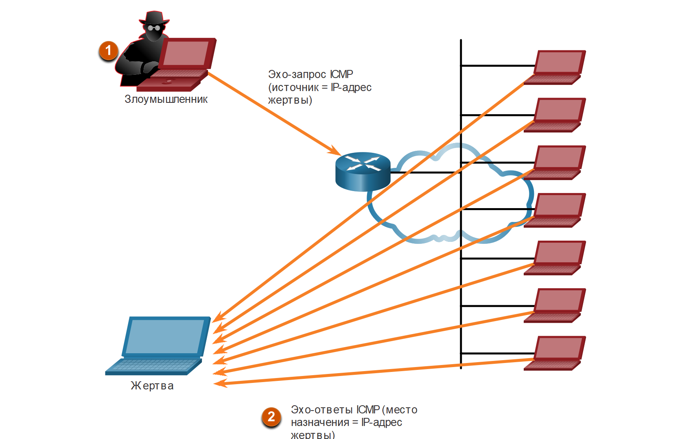
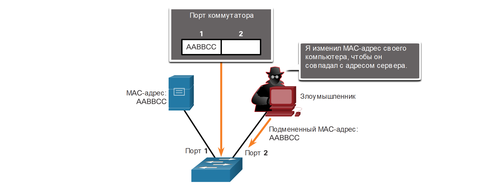
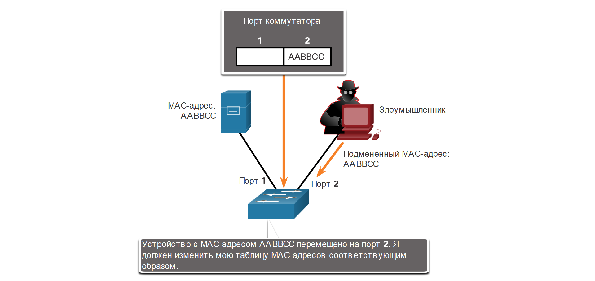

<!-- 3.6.1 -->
## Видео - обычные атаки IP и ICMP

На самом деле существует гораздо больше типов атак, чем те, которые мы обсуждали ранее. В этой теме мы рассмотрим те из них, которые специально направлены на уязвимости IP.

Нажмите "Воспроизведение", чтобы просмотреть видео об обычных атаках IP и ICMP.

<!-- 3.6.2 -->
## IPv4 и IPv6

IP не проверяет, действительно ли указанный в пакете IP-адрес источника поступил из этого источника. Поэтому злоумышленники могут отправлять пакеты, используя поддельный IP-адрес источника. Кроме того, при выполнении своих атак злоумышленники могут изменять и другие поля в заголовке IP. Поэтому аналитикам по вопросам безопасности важно понимать суть различных полей в заголовках IPv4 и IPv6.

В таблице приведены некоторые наиболее распространенные атаки, связанные с IP.

| **Методы IP-атак** | **Описание** |
| --- | --- |
| **Атаки на основе ICMP**  | Злоумышленники используют пакеты эхо-запросов (ping) протокола ICMP для обнаружения подсетей и хостов в защищенной сети, чтобы создавать лавинные DoS-атаки, а также изменять таблицы маршрутизации хоста. |
| **Атаки по методу**  **умножения и отражения** | Злоумышленники пытаются лишить законных пользователей доступа к информации или службам. |
| **Атаки с подменой адреса** | Злоумышленники подменяют IP-адрес источника в IP-пакете для выполнения открытой подмены или подмены вслепую. |
| **Атака через посредника (MITM)**  | Злоумышленники внедряются между источником и назначением для прозрачного мониторинга, захвата и контроля обмена данными. Они могут прослушивать, проверяя собранные пакеты, или изменять пакеты и пересылать по первоначальному целевому адресу. |
| **Перехват сеанса**  | Злоумышленники получают доступ к физической сети, а затем используют атаку через посредника для перехвата сеанса. |

<!-- 3.6.3 -->
## Атаки на основе ICMP

Злоумышленники используют ICMP для разведывательных атак и сканирования в сети. Они могут запустить атаку для сбора информации, чтобы определить топологию сети, узнать, какие хосты активны (доступны), определить операционную систему хоста (создание цифрового отпечатка ОС), а также определить состояние межсетевого экрана. Злоумышленники также используют ICMP для DoS-атак.

**Примечание**: ICMP для IPv4 (ICMPv4) и ICMP для IPv6 (ICMPv6) подвергаются атакам аналогичных типов.

В сетях должна применяться строгая фильтрация на основе списков контроля доступа (ACL) ICMP на границе сети, чтобы избежать зондирования ICMP из Интернета. Аналитики по безопасности должны быть в состоянии обнаруживать атаки, связанные с ICMP, просматривая захваченный трафик и файлы журналов. В крупных сетях устройства обеспечения безопасности, например, межсетевые экраны и системы обнаружения вторжений (IDS), должны обнаруживать такие атаки и выдавать предупреждения для аналитиков по безопасности.

В таблице представлены сообщения ICMP, которыми обычно интересуются злоумышленники. 

| **ICMP сообщения, которые используют злоумышленники** | **Описание** |
| --- | --- |
| **Эхо-запрос и эхо-ответ ICMP**  | Используются для выполнения проверки хостов и DoS-атак. |
| **Сообщение ICMP о недостижимости**  | Используется для выполнения разведывательных атак и сканирования сети. |
| **Ответ ICMP с маской.**  | Используется для составления карты внутренней IP-сети. |
| **Перенаправления ICMP.**  | Используются, чтобы спровоцировать целевой хост на отправку всего трафика через взломанное устройство и провести атаку через посредника (MITM). |
| **Обнаружение маршрутизатора ICMP**  | Используется для вставки фиктивных записей маршрута в таблицу маршрутизации целевого хоста. |

<!-- 3.6.4 -->
## Видео - Атаки по методу лавинообразного умножения и отражения и спуфинг-атаки.

Нажмите "Воспроизведение", чтобы просмотреть видео об таках по методу лавинообразного умножения и отражения и спуфинг-атаках.

<!-- 3.6.5 -->
## Атаки по методу умножения и отражения

Хакеры часто используют методы лавинообразного умножения данных и отражения для создания DoS-атак. В примере на рисунке показано использование метода лавинообразного умножения данных и отражения, называемого Smurf-атакой, для перегрузки целевого хоста.

<!-- /courses/ensa-dl/ae8e8c80-34fd-11eb-ba19-f1886492e0e4/aeb3eed4-34fd-11eb-ba19-f1886492e0e4/assets/c5e04840-1c46-11ea-af56-e368b99e9723.svg -->

1.  **Лавинообразное умножение данных** - злоумышленник пересылает сообщения эхо-запроса ICMP большому числу хостов. Эти сообщения содержат исходный IP-адрес жертвы.
2.  **Отражение** - все эти хосты отвечают на поддельный IP-адрес жертвы и перегружают его.

**Примечание**: в настоящее время используются более новые формы атак по методу умножения и отражения, например атаки на основе DNS и атаки по NTP с умножением данных.

Злоумышленники также используют атаки с исчерпанием ресурсов. Эти атаки могут перегрузить ресурсы целевого хоста и вызвать его сбой или загрузить ресурсы сети и существенно повлиять на ее работу.

<!-- 3.6.6 -->
## Атаки с подменой адреса

Атаки с подменой IP-адреса происходят, когда злоумышленник создает пакеты с ложной информацией об IP-адресе источника, чтобы скрыть личность отправителя или выдать себя за легитимного пользователя. Злоумышленник может получить доступ к данным, которые недоступны другими способами, или обойти конфигурации системы безопасности. Подмена адресов обычно применяется в рамках других атак, например в smurf-атаках.

Атаки с подменой могут быть с открытой подменой или вслепую.

* **Открытая подмена** - злоумышленник может видеть трафик, который передается между хостом и целевым объектом. Открытая подмена используется злоумышленником для изучения пакета ответа от целевой жертвы. Целью открытой подмены может быть определение состояния межсетевого экрана, прогнозирование порядкового номера, а так же перехват авторизованного сеанса.
* **Открытая подмена** - злоумышленник может видеть трафик, который передается между хостом и целевым объектом. Подмена вслепую используется в DoS-атаках.

Атаки с подменой MAC-адресов используются, когда у злоумышленника есть доступ к внутренней сети. Злоумышленники изменяют MAC-адрес своего хоста в соответствии с другим известным MAC-адресом целевого хоста, как показано на рисунке. Затем атакующий хост отправляет по сети кадр с только что заданным MAC-адресом. Когда коммутатор получает кадр, он проверяет MAC-адрес источника.

**Злоумышленник подделывает MAC-адрес сервера**

<!-- /courses/ensa-dl/ae8e8c80-34fd-11eb-ba19-f1886492e0e4/aeb3eed4-34fd-11eb-ba19-f1886492e0e4/assets/c5e0bd70-1c46-11ea-af56-e368b99e9723.svg -->

<!--
Сервер и злоумышленник связаны с одним и тем же коммутатором. Сервер имеет MAC-адрес AABBCC и подключен к порту 1. Злоумышленник подключен к порту 2 и имеет поддельный MAC-адрес AABBCC. Злоумышленник: Я изменил MAC-адрес своего компьютера, чтобы он совпадал с адресом сервера. Диаграмма над коммутатором показывает, что он подключил AABBCC к порту 1. Порт 2 не имеет привязки.
-->

Коммутатор перезаписывает текущую запись в таблице CAM и назначает MAC-адрес новому порту, как показано на рисунке. Затем он пересылает кадры, предназначенные для целевого хоста, на атакующий хост.

**Коммутатор изменяет таблицу CAM, включая в нее подмененный адрес**

<!-- /courses/ensa-dl/ae8e8c80-34fd-11eb-ba19-f1886492e0e4/aeb3eed4-34fd-11eb-ba19-f1886492e0e4/assets/c5e159b0-1c46-11ea-af56-e368b99e9723.svg -->

<!--
Сервер и злоумышленник связаны с одним и тем же коммутатором. Сервер имеет MAC-адрес AABBCC и подключен к порту 1. Злоумышленник подключен к порту 2 и имеет поддельный MAC-адрес AABBCC. Коммутатор: Устройство с MAC-адресом AABBCC перемещено на порт 2. Я должен изменить мою таблицу MAC-адресов соответствующим образом. Диаграмма над коммутатором показывает, что он подключил AABBCC к порту 2. Порт 1 не имеет привязки.
-->

Еще одним примером подмены является подмена приложения или службы. Злоумышленник может подключить мошеннический сервер DHCP, чтобы сформировать состояние «человек посередине».

<!-- 3.6.7 -->
<!-- quiz -->

