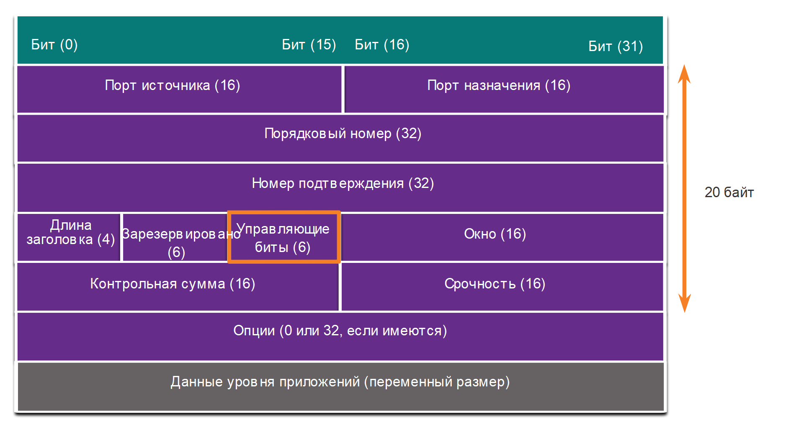
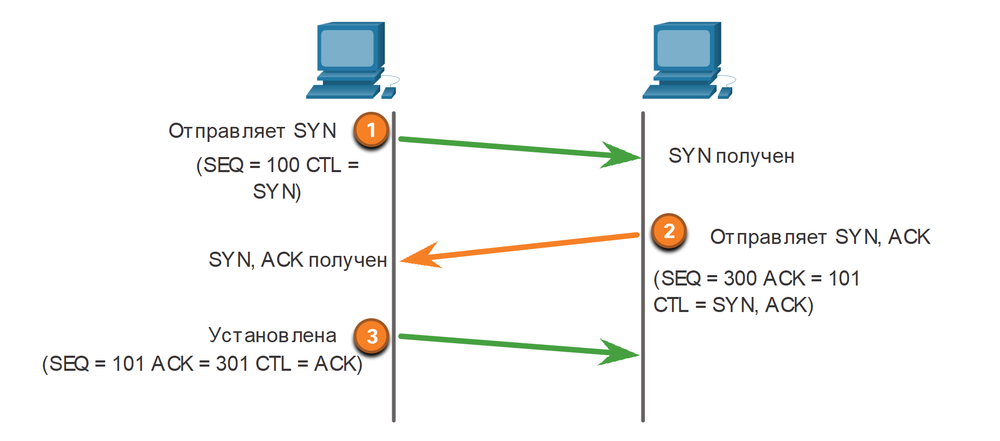
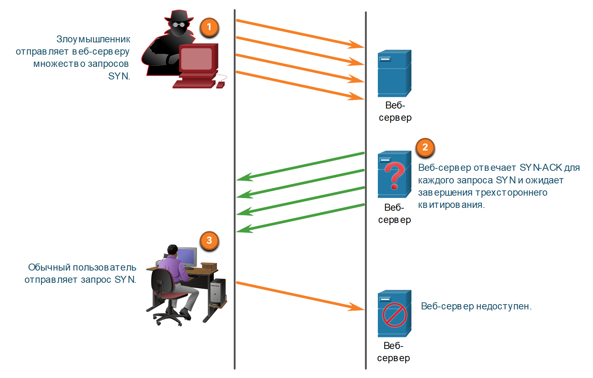
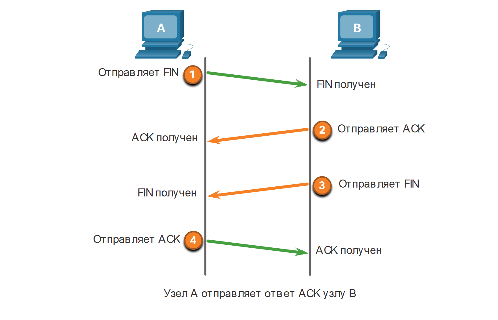

<!-- 3.7.1 -->
## Заголовок сегмента TCP 

Атаки нацелены не только на IP, в этом разделе обсуждаются атаки на TCP и UDP.

Информация сегмента TCP находится сразу после заголовка IP. На рисунке изображены поля сегмента TCP и флаги для поля управляющих битов.

<!-- /courses/ensa-dl/ae8e8c80-34fd-11eb-ba19-f1886492e0e4/aeb3eed6-34fd-11eb-ba19-f1886492e0e4/assets/c5e3cab0-1c46-11ea-af56-e368b99e9723.svg -->

Ниже приведены шесть управляющих битов сегмента TCP:

* **URG** - поле «Указатель важности» задействовано
* **ACK** - поле «Номер подтверждения» задействовано
* **PSH** - протолкнуть данные
* **RST** - сброс соединение
* **SYN** - синхронизировать порядковые номера
* **FIN** - больше нет данных от отправителя

<!--
На схеме показаны поля заголовка сегмента TCP. Название поля и его размер: порт источника (16), порт назначения (16), порядковый номер (32), номер подтверждения (32), длина заголовка (4), зарезервировано (6), управляющие биты (6), окно (16), контрольная сумма (16), срочность (16), опции (0 или 32 если есть). За полями заголовка следуют данные уровня приложения (переменный размер).
-->

<!-- 3.7.2 -->
## Сервисы TCP

TCP также обеспечивает следующие возможности:

* **Надежная доставка**. Для того чтобы не полагаться на протоколы вышестоящего уровня для обнаружения и устранения ошибок, в TCP для гарантированной доставки используются подтверждения. Если своевременное подтверждение не получено, отправитель передает данные повторно. Однако необходимость подтверждать получение данных может приводить к существенным задержкам. К примерам протоколов уровня приложений, использующих надежность протокола TCP, относятся SSL/TLS, HTTP, FTP, зонные переносы DNS и др.
* **Управление потоком**. Для решения этой проблемы в TCP реализуется управление потоком.  Для того чтобы не подтверждать сегменты по одному, с помощью одного сегмента подтверждения можно сообщить о получении сразу нескольких сегментов.
* **Обмен данными с отслеживанием состояния**. Обмен данными с отслеживанием состояния по протоколу TCP между двумя сторонами происходит посредством трехстороннего квитирования TCP. Перед передачей данных по протоколу TCP процесс трехстороннего квитирования открывает TCP-соединение, как показано на рисунке. Если обе стороны соглашаются установить TCP-соединение, может происходить отправка и получение данных обеими сторонами по протоколу TCP.

**Трехстороннее квитирование TCP**

<!-- /courses/ensa-dl/ae8e8c80-34fd-11eb-ba19-f1886492e0e4/aeb3eed6-34fd-11eb-ba19-f1886492e0e4/assets/c5e4dc23-1c46-11ea-af56-e368b99e9723.svg -->

Установление соединения по протоколу TCP осуществляется в три этапа.

1.  Инициирующий клиент запрашивает сеанс связи типа «клиент-сервер» с сервером.
2.  Сервер подтверждает сеанс обмена данными «клиент-сервер» и запрашивает сеанс обмена данными «сервер-клиент».
3.  Инициирующий клиент подтверждает сеанс связи «сервер-клиент».

<!--
Рисунок является иллюстрацией обмена сообщениями между двумя хостами во время трехстороннего квитирования TCP. Он начинается, когда клиент отправляет сообщение с установленным битом управления SYN (SEQ=100 CTL=SYN). Он принимается сервером, который отвечает отправкой сообщения с установленными битами управления SYN и ACK (SEQ=300 ACK=101 CTL=SYN, ACK). Клиент получает SYN, ACK и отвечает, отправляя сообщение с установленным битом управления ACK (SEQ=101 ACK=301 CTL=ACK), и сеанс устанавливается.
-->

<!-- 3.7.3 -->
## Атаки TCP

Сетевые приложения используют порты TCP или UDP. Злоумышленники выполняют сканирование портов оконечных устройств, чтобы определить предлагаемые ими службы.

**Лавинная атака SYN-flood TCP**

В лавинных атаках с применением TCP SYN используется трехстороннее квитирование TCP. Как показано на рисунке, злоумышленник непрерывно отправляет на целевой объект пакеты запросов сеанса TCP SYN со случайно выбранным поддельным исходным IP-адресом. Целевое устройство отправляет в ответ пакет TCP SYN-ACK на поддельный IP-адрес и ожидает пакет TCP ACK. Эти ответы никогда не приходят. В конечном итоге целевые хосты оказываются перегружены наполовину открытыми TCP-соединениями и отказывают в предоставлении служб TCP (например, электронной почты, передачи файлов или http) законным пользователям.

**Лавинная атака SYN-flood TCP**

<!-- /courses/ensa-dl/ae8e8c80-34fd-11eb-ba19-f1886492e0e4/aeb3eed6-34fd-11eb-ba19-f1886492e0e4/assets/c5e59f70-1c46-11ea-af56-e368b99e9723.svg -->

1.  Злоумышленник отправляет веб-серверу множество запросов SYN.
2.  Веб-сервер отвечает SYN-ACK для каждого запроса SYN и ожидает завершения трехстороннего квитирования. Злоумышленник не отвечает на SYN-ACK.
3.  Легитимный пользователь не может получить доступ к веб-серверу, поскольку веб-сервер имеет слишком много полуоткрытых TCP-соединений.

**Атака со сбросом TCP**

Атака со сбросом TCP может использоваться для завершения TCP-соединения между двумя хостами. На рисунке показано, как в протоколе TCP используется 4-сторонний обмен сообщениями для завершения TCP-соединения, в рамках которого применяется пара сегментов FIN и ACK, передаваемая с каждой оконечной точки TCP. TCP-соединение также может быть прервано при получении бита RST. Это аварийный способ разорвать TCP-соединение и сообщить принимающему хосту о необходимости немедленно прекратить использование TCP-соединения. Злоумышленник может выполнить атаку со сбросом TCP и отправить поддельный пакет, содержащий сегмент TCP RST, на одно или оба оконечных устройства.

**Завершение TCP-соединения**

<!-- /courses/ensa-dl/ae8e8c80-34fd-11eb-ba19-f1886492e0e4/aeb3eed6-34fd-11eb-ba19-f1886492e0e4/assets/c5e63bb0-1c46-11ea-af56-e368b99e9723.svg -->

Для завершения сеанса TCP используется следующий процесс четырехстороннего обмена:

1.  Когда у клиента больше нет данных для отправки в потоке, он отправляет сегмент с установленным флагом FIN.
2.  Сервер отправляет подтверждение ACK, чтобы подтвердить получение FIN для завершения сеанса связи «клиент-сервер».
3.  Сервер отправляет клиенту флаг FIN для завершения сеанса связи между сервером и клиентом.
4.  Клиент отправляет в ответ флаг ACK, чтобы подтвердить получение флага FIN от сервера.

**Перехват сеанса TCP.**

Перехват сеанса TCP представляет собой еще одну уязвимость TCP. Несмотря на сложность реализации, такой перехват позволяет хакеру взять под контроль уже аутентифицированный хост при обмене данными с целевым объектом. Злоумышленнику пришлось бы подменить IP-адрес одного хоста, спрогнозировать следующий порядковый номер и отправить подтверждение (ACK) на другой хост. В случае успеха злоумышленник сможет отправлять, но не получать данные от целевого устройства.

<!-- 3.7.4 -->
## Заголовок сегмента UDP и его работа

UDP обычно используется DNS, TFTP, NFS и SNMP. Он также используется с приложениями реального времени, такими как потоковая передача мультимедиа или передача голоса по IP. UDP — протокол транспортного уровня без установки соединения. Он связан с существенно меньшими накладными расходами в сравнении с TCP, поскольку не устанавливает соединение и не поддерживает сложные механизмы повторной отправки, упорядочения и управления процессами, которые обеспечивают надежность. Структура сегмента UDP, как показано на рисунке, намного меньше, чем структура сегмента TCP.

<!-- /courses/ensa-dl/ae8e8c80-34fd-11eb-ba19-f1886492e0e4/aeb3eed6-34fd-11eb-ba19-f1886492e0e4/assets/c5e6d7f0-1c46-11ea-af56-e368b99e9723.svg -->

<!--
Структура сегмента UDP включает в себя: порт источника (16), порт назначения (16), длина (16), контрольная сумма (16) данные уровня приложений (переменный размер)
-->

По сравнению с TCP протокол UDP может показаться ненадежным, но это не означает, что приложения, использующие UDP, всегда ненадежны, а также не означает, что UDP - неполноценный протокол. Это означает, что функции обеспечения надежности не обеспечиваются протоколом транспортного уровня и при необходимости должны быть реализованы на других уровнях.

Низкие накладные расходы, свойственные UDP, делают его просто незаменимым в случаях, когда требуется протокол, осуществляющий лишь транзакции по отправке запросов и получению ответов. Например, выбор в пользу протокола TCP для DHCP может обернуться ненужным увеличением объема сетевого трафика. Устройство просто отправляет запрос повторно, если ответ на него не получен.

<!-- 3.7.5 -->
## Атаки с использованием UDP

Протокол UDP не защищается шифрованием. В протокол UDP можно добавить функции шифрования, но по умолчанию они недоступны. Отсутствие шифрования позволяет злоумышленнику просмотреть трафик, изменить его и отправить по назначению. Изменение данных в трафике приведет к изменению 16-битной контрольной суммы, но контрольная сумма является необязательной и используется не всегда. Если же она используется, хакер может создать новую контрольную сумму на основе новых полезных данных и записать ее в заголовок. Целевое устройство обнаружит, что контрольная сумма соответствует данным, не зная, что данные были изменены. Этот тип атаки не очень широко распространен.

**Флуд-атака UDP**

Чаще встречаются лавинные атаки с использованием UDP (флуд-атаки UDP). Эти атаки с использованием UDP потребляют все ресурсы сети. Для этого злоумышленнику необходимо использовать такой инструмент, как UDP Unicorn или Low Orbit Ion Cannon. Такой инструмент отправляет лавину пакетов UDP, часто с ложного хоста, на сервер в подсети. Программа пройдется по всем известным портам в попытке найти закрытые. Это приведет к тому, что сервер отправит в ответ сообщение о недоступности порта ICMP. Поскольку на сервере существует множество закрытых портов, в результате в сегменте оказывается настолько большой объем трафика, что используется почти вся полоса пропускания. Результат очень похож на DoS-атаку.

<!-- 3.7.6 -->
<!-- quiz -->

