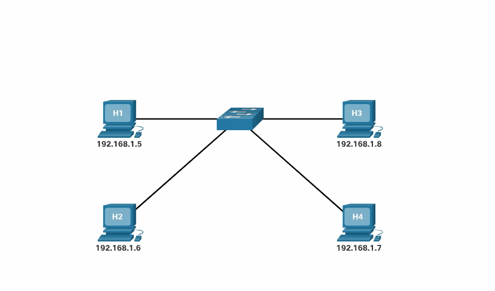
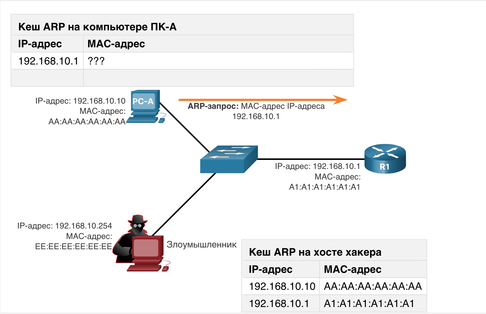
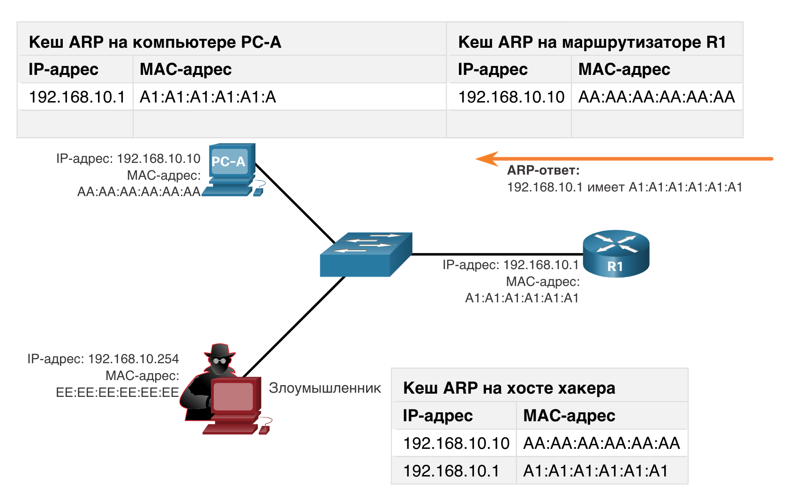
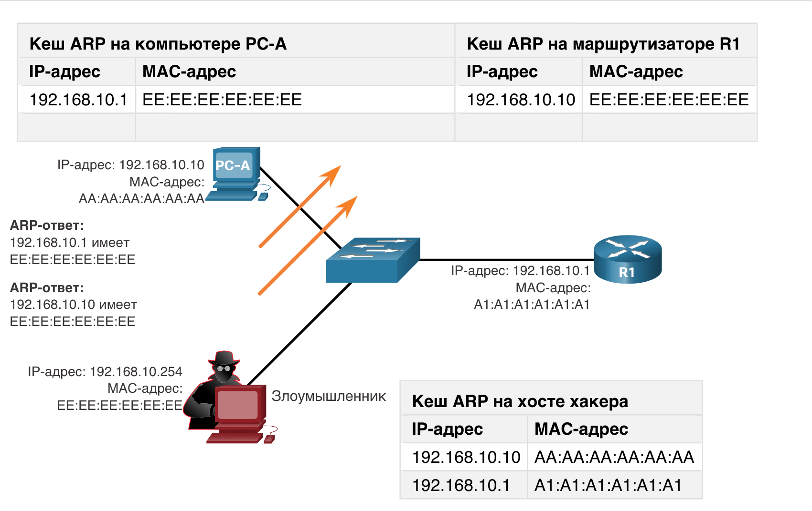
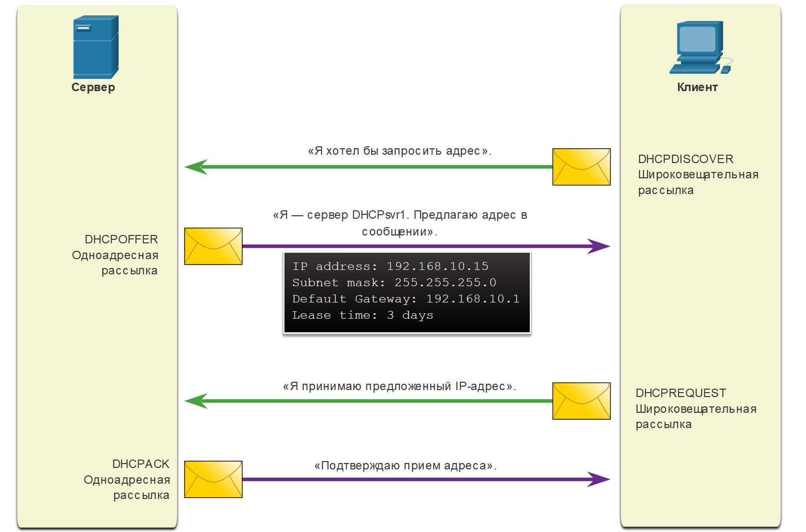
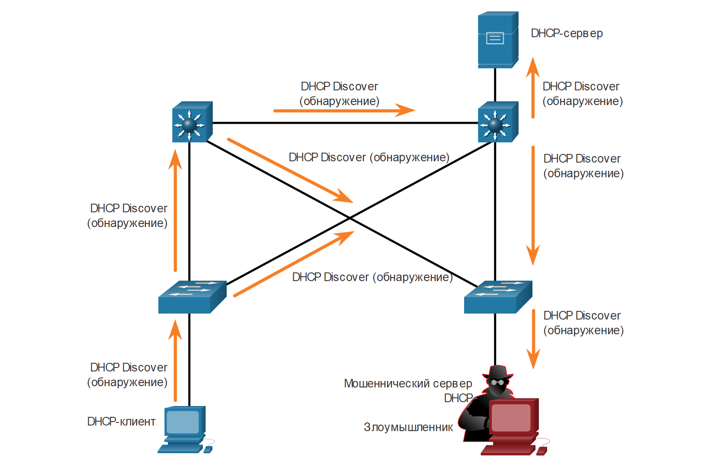
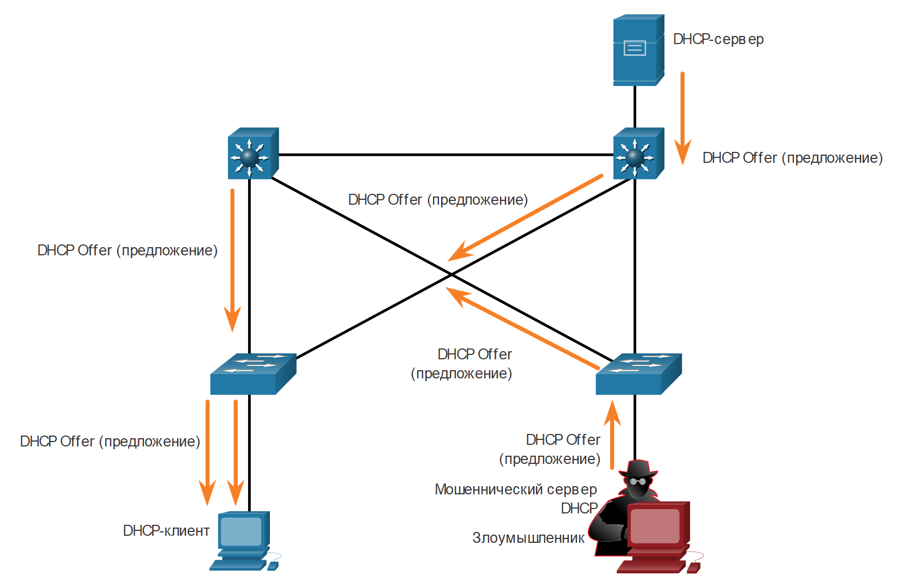
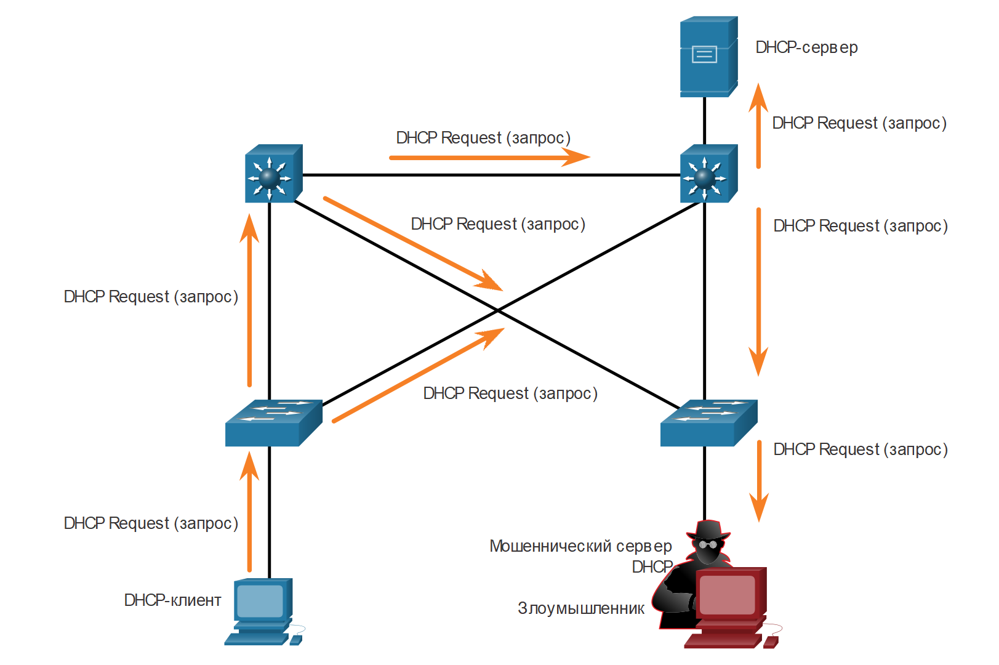
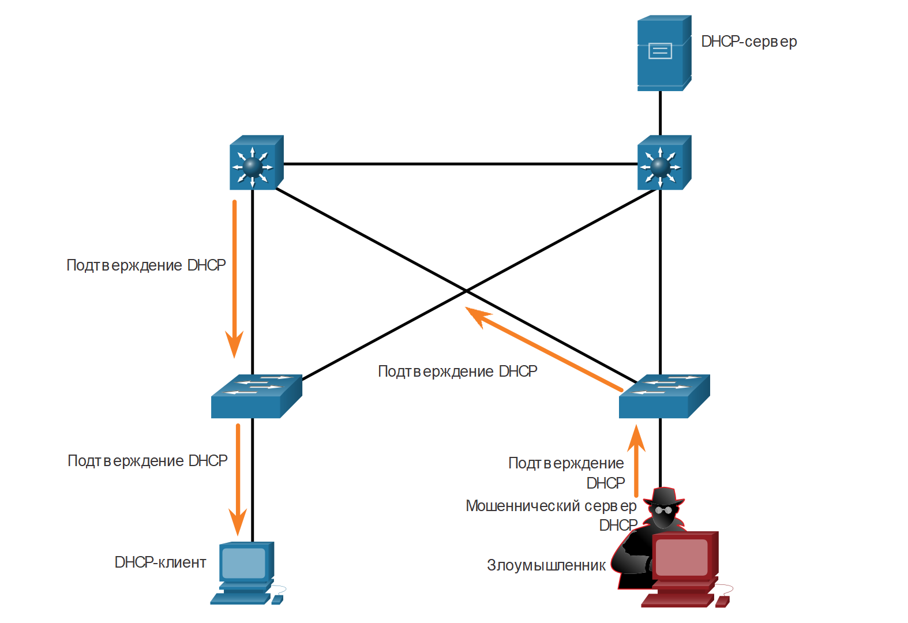

<!-- 3.8.1 -->
## Уязвимости ARP

Ранее в этом модуле мы рассматривали уязвимости, связанные с IP, TCP и UDP. Стек протоколов TCP/IP никогда не создавался для безопасности. Поэтому службы, которые IP использует для адресации, такие как ARP, DNS и DHCP, также не являются безопасными, как вы узнаете в этой теме.

Хосты передают ARP-запрос в широковещательном режиме другим хостам в сегменте, чтобы определить MAC-адрес хоста с конкретным IP-адресом. Все хосты в подсети получают и обрабатывают этот ARP-запрос. Хост с IP-адресом, соответствующим ARP-запросу, отправляет ARP-ответ.

Нажмите кнопку Воспроизведение на рисунке, чтобы посмотреть демонстрацию процесса ARP.

**Процесс ARP**

Любой клиент может отправить незапрашиваемый ARP-ответ, который называется gratuitous ARP (самообращенный ARP). Обычно это происходит при первой загрузке устройства для передачи всем остальным устройствам в локальной сети MAC-адреса нового устройства. Когда хост отправляет самообращенный ARP, другие хосты в подсети сохраняют в своих ARP-таблицах MAC-адрес и IP-адрес, содержащиеся в этом ответе.

Эта функция ARP также означает, что любой хост может объявить себя владельцем любого выбранного IP или MAC-адреса. Злоумышленник может подделать записи кеша ARP устройств в локальной сети, организуя атаку через посредника для перенаправления трафика. Цель состоит в том, чтобы заставить хост-жертву изменить свой шлюз по умолчанию на устройство злоумышленника. Таким образом, злоумышленник размещается между жертвой и другими системами, находящимися за пределами локальной подсети.

<!-- 3.8.2 -->
## Подделка записей кеша ARP

Подделка записей кеша ARP может использоваться для запуска различных атак «через посредника».

**ARP-запрос**

Рисунок демонстрирует процесс подделки записей кеша ARP. Компьютер PC-A запрашивает MAC-адрес своего шлюза по умолчанию (R1), отправляя ARP-запрос на получение MAC-адреса для IP-адреса 192.168.10.1.

<!-- /courses/ensa-dl/ae8e8c80-34fd-11eb-ba19-f1886492e0e4/aeb3eed8-34fd-11eb-ba19-f1886492e0e4/assets/c5e9e532-1c46-11ea-af56-e368b99e9723.svg -->

<!--
Сетевая топология показывает, что хост PC-A с IP 192.168.10.10 и MAC AA:AA:AA:AA:AA:AA,подсоединен к коммутатору, который подсоединен к маршрутизатору с IP 192.168.10.1 и MAC A1:A1:A1:A1:A1:A1. К коммутатору также подключен хост злоумышленника с IP 192.168.10.254 и MAC EE:EE:EE:EE:EE:EE. ARP-кеш на PC-A не имеет записи для 192.168.10.1. ARP-кеш хоста злоумышленника имеет те же самые две записи; IP-адрес 192.168.10.10, связанный с MAC-адресом AA:AA:AA:AA:AA:AA, и IP-адрес 192.168.10.1, связанный с MAC-адресом A1:A1:A1:A1:A1:A1. PC-A посылает ARP-запрос с поиском MAC-адреса хоста 192.168.10.1.
-->

**ARP-ответ**

На этом рисунке 2 маршрутизатор R1 вносит в свой кеш ARP IP- и MAC-адрес компьютера PC-A и отправляет ARP-ответ компьютеру PC-A, который затем вносит в свой кеш ARP IP- и MAC-адрес маршрутизатора R1.

<!-- /courses/ensa-dl/ae8e8c80-34fd-11eb-ba19-f1886492e0e4/aeb3eed8-34fd-11eb-ba19-f1886492e0e4/assets/c5ea3352-1c46-11ea-af56-e368b99e9723.svg -->

<!--
Сетевая топология такая же как и в 3.8.2-1. R1 посылает ARP-ответ, который гласит, что 192.168.10.1 имеет A1:A1:A1:A1:A1:A1. Теперь ARP-кеш на хосте PC-A имеет запись IP-адрес 192.168.10.1 с MAC-адрес A1:A1:A1:A1:A1:A1. Теперь ARP-кеш на хосте PC-A имеет запись IP-адрес 192.168.10.10 с MAC-адрес AA:AA:AA:AA:AA:AA. ARP-кеш хоста злоумышленника имеет те же самые две записи; IP-адрес 192.168.10.10, связанный с MAC-адресом AA:AA:AA:AA:AA:AA, и IP-адрес 192.168.10.1, связанный с MAC-адресом A1:A1:A1:A1:A1:A1.
-->

**Поддельные ARP-ответы**

На рисунке злоумышленник отправляет два поддельных самообращенных ARP-ответа, используя свой собственный MAC-адрес для указанных IP-адресов назначения. Компьютер PC-A обновляет сведения о шлюзе по умолчанию в своем кеше ARP, которые теперь указывают на MAC-адрес хоста злоумышленника. Маршрутизатор R1 также обновляет свой кеш ARP, внося в него IP-адрес компьютера PC-A, указывающий на MAC-адрес злоумышленника.

Теперь хост злоумышленника проводит атаку с подделкой записей кеша ARP. Атаки с подделкой записей кеша ARP могут быть пассивными или активными. Пассивные - когда злоумышленники крадут конфиденциальную информацию. Активные - злоумышленники изменяют передаваемые данные или внедряют вредоносные данные.

<!-- /courses/ensa-dl/ae8e8c80-34fd-11eb-ba19-f1886492e0e4/aeb3eed8-34fd-11eb-ba19-f1886492e0e4/assets/c5ea8170-1c46-11ea-af56-e368b99e9723.svg -->

<!--
Сетевая топология такая же как и в 3.8.2-1. Она показывает, что хост злоумышленника послал два ARP-ответа. Один ARP-ответ: 192.168.10.1 имеет EE:EE:EE:EE:EE:EE Второй ARP-ответ: 192.168.10.10 имеет EE:EE:EE:EE:EE:EE. Это приводит к тому, что PC-A меняет запись в ARP-кеш для IP-адреса 192.168.10.1 с MAC-адресом EE:EE:EE:EE:EE:EE и R1 меняет запись в ARP-кеше для IP-адреса 192.168.10.10 с MAC-адресом EE:EE:EE:EE:EE:EE. ARP-кеш хоста злоумышленника имеет теже самые две записи; IP-адрес 192.168.10.10, связанный с MAC-адресом AA:AA:AA:AA:AA:AA, и IP-адрес 192.168.10.1, связанный с MAC-адресом A1:A1:A1:A1:A1:A1.
-->

**Примечание**: В Интернете доступно множество инструментов для организации атак "через посредника" с использованием ARP, включая dsniff, Cain & Abel, ettercap, Yersinia и другие.

<!-- 3.8.3 -->
## Видео - Спуфинг ARP

Нажмите Воспроизведение на рисунке, чтобы просмотреть видео Спуфинг ARP

<!-- 3.8.4 -->
## Атаки DNS

Протокол системы доменных имен (Domain Name Service, DNS) определяет автоматизированную службу, которая сопоставляет имена ресурсов с соответствующими числовыми сетевыми адресами, такими как IPv4 или IPv6. Он включает в себя формат для запросов, ответов и самих данных и использует записи ресурсов (RR), чтобы определить тип DNS-ответа.

Обеспечением безопасности DNS часто пренебрегают. Однако этот протокол имеет решающее значение для работы сети и должен быть соответствующим образом защищен.

DNS атаки включают в себя:

* Открытые преобразователи имен DNS
* Скрытые атаки DNS
* Атаки с теневым управлением DNS
* Атаки туннелирования DNS

**Открытые преобразователи имен DNS**

Для предоставления ответов на запросы во многих организациях используются сервисы общедоступных открытых DNS-серверов, например GoogleDNS (8.8.8.8). DNS-сервер такого типа называется открытым преобразователем имен. Открытый преобразователь имен DNS отвечает на запросы от клиентов, находящихся за пределами его административного домена. Открытые преобразователи имен DNS уязвимы для различных вредоносных действий, включая следующие.

| **Уязвимости преобразователей DNS** | **Описание** |
| --- | --- |
| **Подделка записей кеша DNS.**  | Злоумышленники отправляют поддельную информацию записей ресурсов (RR) в преобразователь имен DNS, чтобы перенаправить пользователей с законных на вредоносные сайты. DNS атаки с подделкой записей кеша DNS могут использоваться, чтобы заставить преобразователь имен DNS использовать вредоносный сервер имен, который предоставляет информацию о записях ресурсов (RR) для выполнения вредоносных действий. |
| **Атаки по методу умножения и отражения на основе DNS.**  | Злоумышленники при DoS- или DDoS-атаках используют открытые преобразователи имен DNS, чтобы увеличить объем атаки и скрыть настоящий источник атаки. Злоумышленники отправляют DNS-сообщения открытым преобразователям имен, используя IP-адрес целевого хоста (жертвы). Эти атаки возможны, поскольку открытый преобразователь имен будет отвечать на запросы от любого объекта. |
| **Атаки с использованием ресурсов DNS.**  | DoS-атака, использующая ресурсы открытых преобразователей DNS-имен. Эта DoS-атака потребляет все доступные ресурсы, отрицательно влияя на работу преобразователя имен DNS. В результате этой DoS-атаки может потребоваться перезапуск преобразователя имен DNS или остановка и перезапуск служб. |

**Скрытые атаки DNS**

Для того чтобы скрыть информацию, по которой их можно определить, хакеры применяют для проведения атак следующие скрытые методы использования DNS.

| **Техники скрытых атак DNS** | **Описание** |
| --- | --- |
| **Метод Fast flux**  | Злоумышленники используют этот метод, чтобы скрыть фишинговые сайты и сайты, распространяющие вредоносное ПО, внутри быстро меняющейся сети взломанных DNS хостов. IP-адреса DNS постоянно изменяются в течение считанных минут. Ботнеты часто используют методы Fast Flux, чтобы эффективно скрыть (т. е. замаскировать) от обнаружения вредоносные серверы. |
| **Метод Double IP Flux**  | Злоумышленники используют этот метод, чтобы быстро изменять сопоставления имен хостов и IP-адресов, а также изменять доверенный сервер имен. В результате повышается сложность определения источника атаки. |
| **Алгоритмы создания доменов**  | Злоумышленники используют этот метод во вредоносном ПО, чтобы случайным образом генерировать доменные имена, которые можно использовать как точки встречи для серверов управления и контроля (C&C). |

**Атаки с теневым управлением DNS**

При теневом копировании доменов злоумышленник взламывает родительский домен и создает несколько субдоменов для использования во время атаки. Эти субдомены обычно указывают на вредоносные серверы без предупреждения фактического владельца родительского домена.

<!-- 3.8.5 -->
## Туннелирование DNS

Хакеры, использующие туннелирование DNS, помещают в трафик DNS не относящийся к DNS трафик. Этот метод часто позволяет обойти решения по обеспечению безопасности, когда злоумышленник хочет связаться с ботами внутри защищенной сети или отфильтровать данные из организации, такие как база паролей. Для использования хакером туннелирования DNS изменяются различные типы записей DNS. Вот как работает туннелирование DNS для команд CnC, отправляемых в ботнет:

1.  Данные разбиваются на несколько закодированных фрагментов.
2.  Каждый фрагмент помещается в метку доменного имени нижнего уровня в DNS-запросе.
3.  Так как ответ локального или сетевого DNS-сервера на этот запрос отсутствует, запрос отправляется на рекурсивные DNS-серверы интернет-провайдера.
4.  Рекурсивная служба DNS перенаправляет запрос на доверенный сервер доменных имен злоумышленника.
5.  Этот процесс повторяется, пока не будут отправлены все запросы, содержащие фрагменты данных.
6.  Когда доверенный сервер доменных имен злоумышленника получает DNS-запросы от зараженных устройств, он отправляет ответ на каждый запрос, содержащий инкапсулированные, зашифрованные команды.
7.  Вредоносное ПО, находящееся на скомпрометированном хосте, собирает фрагменты данных и выполняет скрытые в них команды.

Для того чтобы иметь возможность остановить туннелирование DNS, необходимо использовать фильтр, который проверяет DNS-трафик. Обратите особое внимание на DNS-запросы, длина которых превышает среднее значение, а также запросы, содержащие подозрительное доменное имя. Кроме того, решения DNS, такие как Cisco OpenDNS, блокируют значительную часть трафика туннелирования DNS, выявляя подозрительные домены.

<!-- 3.8.6 -->
## DHCP

Серверы DHCP предоставляют клиентским устройствам сведения о конфигурации динамических IP-адресов. На рисунке показана стандартная последовательность обмена DHCP-сообщениями между клиентом и сервером.

**Нормальная работа DHCP**

<!-- /courses/ensa-dl/ae8e8c80-34fd-11eb-ba19-f1886492e0e4/aeb3eed8-34fd-11eb-ba19-f1886492e0e4/assets/c5ec0813-1c46-11ea-af56-e368b99e9723.svg -->

На рисунке клиент делает широковещательную рассылку сообщений об обнаружении DHCP. Сервер DHCP отвечает одноадресной рассылкой с предложением адреса, который клиент может использовать. Клиент широковещательной рассылкой сообщает DHCP серверу, что клиент принимает предложенное. Сервер отвечает одноадресной рассылкой, что он подтверждает прием  клиентом адреса.

<!--
На рисунке показан обмен сообщениями между клиентом и сервером DHCP во время нормальной работы DHCP. Сначала клиент отправляет широковещательный запрос DHCPDISCOVER на сервер, указывая, что он хотел бы запросить адрес. Сервер отвечает одноадресной рассылкой DHCPOFFER сообщения, которое гласит: Я - DHCPsvr1. Вот адрес, который я могу предложить. Сообщение включает в себя IP-адрес 192.168.10.15, маску подсети 255.255.255.0, шлюз по умолчанию 192.168.10.1 и срок аренды 3 дня. Клиент отвечает сообщением DHCPREQUEST, указывающим, что он принимает предложение IP-адреса. Сервер отвечает одноадресной передачей DHCPACK, указывающей, что подтверждение принято.
-->

<!-- 3.8.7 -->
## Атаки, связанные с DHCP

**DHCP-спуфинг**

Атака типа «DHCP-спуфинг» состоит в том, что к сети подключается мошеннический DHCP-сервер и предоставляет ложные параметры настройки IP легитимным клиентам. Подставной сервер может предоставлять различные неправильные сведения.

* **Неправильный шлюз по умолчанию** - злоумышленник предоставляет неправильный шлюз или IP-адрес своего хоста для создания атаки через посредника. Это может пройти полностью незамеченным, поскольку злоумышленник перехватывает поток данных в сети.
* **Неправильный DNS-сервер** - злоумышленник предоставляет неправильный адрес DNS-сервера, направляя пользователя на вредоносный веб-сайт.
* **Неправильный IP-адрес** - злоумышленник предоставляет неправильный IP-адрес и/или IP-адрес шлюза по умолчанию. Затем злоумышленник создает DoS-атаку на DHCP-клиента.

Предположим, что злоумышленник уже успешно подключил мошеннический сервер DHCP к порту коммутатора в той же подсети, в которой находятся целевые клиенты. Цель подставного сервера — предоставить клиентам неправильную информацию о настройке IP.

**1. Клиент делает широковещательную рассылку сообщений об обнаружении DHCP**

На рисунке легитимный клиент подключается к сети и запрашивает параметры настройки IP. Для этого клиент отправляет широковещательный запрос обнаружения DHCP, ожидая ответа от DHCP-сервера. Оба сервера получают сообщение.

<!-- /courses/ensa-dl/ae8e8c80-34fd-11eb-ba19-f1886492e0e4/aeb3eed8-34fd-11eb-ba19-f1886492e0e4/assets/c5eca453-1c46-11ea-af56-e368b99e9723.svg -->

**2. Сервер DHCP отвечает с предложениями**

На рисунке показано, как законный и подставной DHCP-серверы отправляют ответ с допустимыми параметрами настройки IP. Клиент ответит на первое полученное предложение.

<!-- /courses/ensa-dl/ae8e8c80-34fd-11eb-ba19-f1886492e0e4/aeb3eed8-34fd-11eb-ba19-f1886492e0e4/assets/c5ed1982-1c46-11ea-af56-e368b99e9723.svg -->

**3. Клиент принимает мошенническое предложение DHCP**

В этом сценарии клиент первым получает предложение от подставного сервера. Он выполняет широковещательную рассылку DHCP-запроса, принимая параметры от подставного сервера, как показано на рисунке. Запрос получат и законный и подставной серверы.

<!-- /courses/ensa-dl/ae8e8c80-34fd-11eb-ba19-f1886492e0e4/aeb3eed8-34fd-11eb-ba19-f1886492e0e4/assets/c5eea020-1c46-11ea-af56-e368b99e9723.svg -->

**4. Мошеннические подтверждения**

Однако, как показано на рисунке, только подставной сервер выполнит одноадресную рассылку ответа клиенту, чтобы подтвердить запрос. Законный сервер прекращает общение с клиентом, потому что запрос был уже подтвержден.

<!-- /courses/ensa-dl/ae8e8c80-34fd-11eb-ba19-f1886492e0e4/aeb3eed8-34fd-11eb-ba19-f1886492e0e4/assets/c5ef3c62-1c46-11ea-af56-e368b99e9723.svg -->

<!-- 3.8.8 -->
## Лабораторная работа. Исследование трафика DNS

В этой лабораторной работе вы выполните следующие задачи:

* Перехват трафика DNS
* Изучение трафика DNS-запроса
* Изучение трафика DNS-ответа

[Исследование трафика DNS (lab)](./assets/3.8.8-lab---explore-dns-traffic_ru-RU.pdf)

