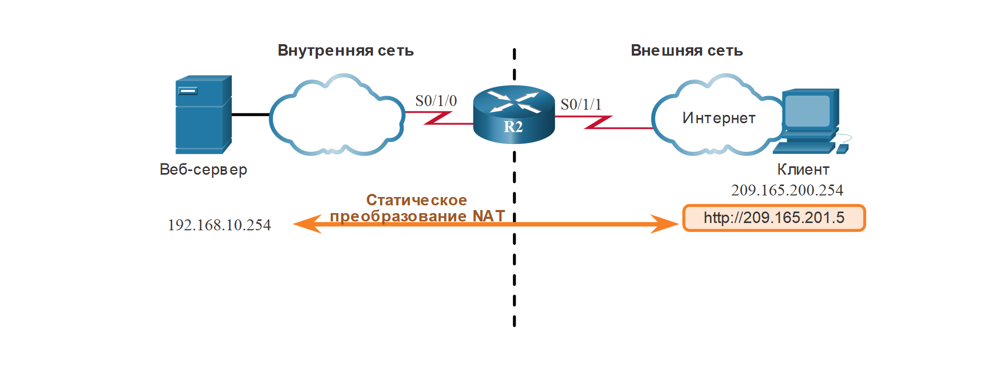
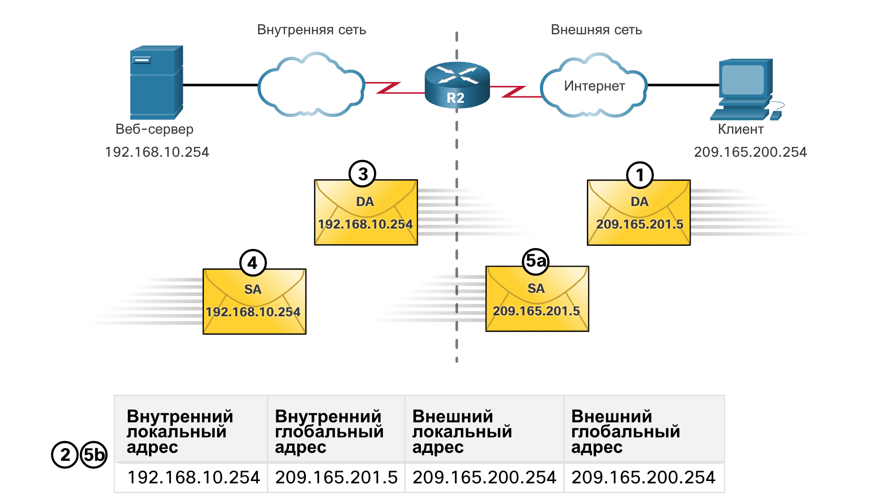

<!-- 6.4.1 -->
## Статический сценарий NAT

В этом разделе вы узнаете, как настроить и проверить статический NAT. Он включает задание в Packet Tracer для проверки ваших навыков и знаний. Статическое преобразование NAT — это взаимно-однозначное сопоставление внутреннего и внешнего адресов. Статический NAT позволяет внешним устройствам инициировать подключение к внутренним устройствам с помощью статически назначенного публичного адреса. Например, внутреннему веб-серверу может быть сопоставлен внутренний глобальный адрес, определенный таким образом, чтобы он был доступен из внешних сетей.

На рисунке показана внутренняя сеть, имеющая веб-сервер с частным IPv4-адресом. На маршрутизаторе R2 настроен статический NAT, чтобы предоставить доступ к веб-серверу устройствам из внешней сети (Интернет). Клиент из внешней сети обращается к веб-серверу, используя публичный IPv4-адрес. Статический NAT преобразует публичный IPv4-адрес в частный IPv4-адрес.


<!-- /courses/ensa-dl/ae8e8c86-34fd-11eb-ba19-f1886492e0e4/aeb54e60-34fd-11eb-ba19-f1886492e0e4/assets/c636f3c0-1c46-11ea-af56-e368b99e9723.svg -->

<!--
На рисунке изображен веб-сервер во внутренней сети, подключенный к маршрутизатору 2 через последовательное соединение S0/1/0 с IP-адресом 192.168.10.154. Внешней сетью маршрутизатора R2 является последовательное соединение S0/1/1, подключенное к клиентскому ПК с адресом 209.165.200.254. Статическое преобразование NAT выполняется маршрутизатором R2 с веб-сервером 192.168.10.254, сопоставленным с 209.165.201.5 при выполнении HTTP.
-->

<!-- 6.4.2 -->
## Настройка статического преобразования NAT

Настройка статического NAT сопряжена с двумя основными задачами.

**Шаг 1**. Первой задачей является создание соответствия между внутренним локальным и внутренним глобальным адресами. Например, на рисунке в качестве статического преобразования NAT настроены внутренний локальный адрес 192.168.10.254 и внутренний глобальный адрес 209.165.201.5.

```
R2(config)# ip nat inside source static 192.168.10.254 209.165.201.5
```

**Шаг 2**. После настройки соответствия интерфейсы, участвующие в преобразовании, настраиваются как внутренние или внешние относительно NAT. В этом примере интерфейс Serial 0/1/0 маршрутизатора R2 является внутренним, а Serial 0/1/1 — внешним интерфейсом.

```
R2(config)# interface serial 0/1/0
R2(config-if)# ip address 192.168.1.2 255.255.255.252
R2(config-if)# ip nat inside
R2(config-if)# exit
R2(config)# interface serial 0/1/1
R2(config-if)# ip address 209.165.200.1 255.255.255.252
R2(config-if)# ip nat outside
```

При такой конфигурации пакеты, поступающие на внутренний интерфейс маршрутизатора R2 (Serial 0/1/0) от настроенного внутреннего локального IPv4-адреса (192.168.10.254), преобразуются, а затем передаются во внешнюю сеть. Пакеты, поступающие на внешний интерфейс маршрутизатора R2 (Serial 0/1/1), адресованные настроенному внутреннему глобальному IPv4-адресу (209.165.201.5), преобразуются для передачи внутреннему локальному адресу (192.168.10.254) и затем передаются во внутреннюю сеть.

<!-- 6.4.3 -->
## Анализ статического преобразования NAT

На этом рисунке показан процесс статического преобразования NAT между клиентом и веб-сервером с использованием предыдущей настройки. Статические преобразования обычно используются, когда клиентам из внешней сети (Интернет) нужно обратиться к серверам внутренней сети.


<!-- /courses/ensa-dl/ae8e8c86-34fd-11eb-ba19-f1886492e0e4/aeb54e60-34fd-11eb-ba19-f1886492e0e4/assets/c6380530-1c46-11ea-af56-e368b99e9723.svg -->

1.  Клиенту нужно подключиться к веб-серверу. Клиент отправляет пакет на веб-сервер, используя публичный IPv4-адрес назначения 209.165.201.5. Это внутренний глобальный адрес веб-сервера.
2.  Первый пакет, полученный маршрутизатором R2 от клиента на внешнем интерфейсе NAT, заставляет R2 проверить свою таблицу NAT. IPv4-адрес назначения 209.165.201.5 находится в таблице NAT, и маршрутизатор выполняет соответствующее преобразование на 192.168.10.254.
3.  R2 заменяет внутренний глобальный адрес 209.165.201.5 внутренним локальным адресом 192.168.10.254. Затем R2 пересылает пакет веб-серверу.
4.  Веб-сервер получает пакет и отвечает клиенту, используя внутренний локальный адрес 192.168.10.254 в качестве исходного адреса ответного пакета.
5.  (a) R2 получает пакет от веб-сервера на свой внутренний интерфейс NAT с адресом источника, соответствующим внутреннему локальному адресу веб-сервера, 192.168.10.254.  
    (b) R2 проверяет таблицу NAT на предмет наличия преобразования для внутреннего локального адреса. Этот адрес присутствует в таблице NAT. R2 выполняет преобразование адреса источника 192.168.10.254 во внутренний глобальный адрес 209.165.201.5 и пересылает пакет клиенту.
6.  (Не показано) Клиент получает пакет и продолжает диалог. Маршрутизатор NAT выполняет шаги 2-5b для каждого пакета

<!--
На рисунке изображен веб-сервер с IP-адресом 192.168.10.254 во внутренней сети, подключенной к маршрутизатору (R2). R2 имеет внешнюю сеть, подключенную к Интернету с клиентом 209.165.200.254. На рисунке изображен процесс анализа статического NAT.
-->

<!-- 6.4.4 -->
## Проверка статического NAT

Чтобы проверить операцию NAT, выполните команду **show ip nat translations**. Эта команда отображает активные преобразования NAT. Поскольку в примере приводится статическая настройка, преобразование всегда присутствует в таблице NAT независимо от активных взаимодействий.

```
R2# show ip nat translations
Pro  Inside global       Inside local       Outside local     Outside global
---  209.165.201.5       192.168.10.254     ---               ---
Total number of translations: 1
```

Если команда вводится во время активного сеанса, выходные данные будут также содержать адрес внешнего устройства, как показано в промере.

```
R2# show ip nat translations
Pro  Inside global       Inside local        Outside local         Outside global
tcp  209.165.201.5       192.168.10.254      209.165.200.254       209.165.200.254
---  209.165.201.5       192.168.10.254        ---                   ---
Total number of translations: 2
```

Еще одна полезная команда **show ip nat statistics**, которая выводит сведения о суммарном количестве активных преобразований, параметрах настройки NAT, числе адресов в пуле и числе выделенных адресов.

Чтобы убедиться в правильности работы преобразования NAT, перед тестированием рекомендуется очистить статистику всех предыдущих преобразований с помощью команды **clear ip nat statistics**.

```
R2# show ip nat statistics
Total active translations: 1 (1 static, 0 dynamic; 0 extended)
Outside interfaces:
  Serial0/1/1
Inside interfaces:
  Serial0/1/0
Hits: 0  Misses: 0
(output omitted)
```

После установки клиентом сеанса связи с веб-сервером в выходных данных команды **show ip nat statistics** количество совпадений во внутреннем интерфейсе увеличивается до 4 (Serial0/1/0). Этим подтверждается выполнение статического преобразования NAT на R2.

```
R2# show ip nat statistics
Total active translations: 1 (1 static, 0 dynamic; 0 extended)
Outside interfaces:
  Serial0/1/1
Inside interfaces:
  Serial0/1/0
Hits: 4  Misses: 1
(output omitted)
```

<!-- 6.4.5 -->
## Packet Tracer - Настройка статического преобразования (NAT)

В сетях, настроенных по протоколу IPv4, для клиентов и серверов используется частная адресация. Перед выходом из сети в Интернет пакеты с частной адресацией должны быть преобразованы в пакеты с публичной адресацией. Серверам, доступным за пределами сети компании, обычно назначают как общедоступные, так и частные статические IP-адреса. В рамках задания необходимо настроить статический NAT таким образом, чтобы внешние устройства могли получать доступ к внутреннему серверу по публичному адресу.

В этом упражнении Packet Tracer вы будете:

* Проверка доступа без использования NAT
* Настройка статического преобразования NAT
* Проверка доступа с использованием NAT

[Настройка статического преобразования (NAT) (pdf)](./assets/6.4.5-packet-tracer---configure-static-nat_ru-RU.pdf)

[Настройка статического преобразования (NAT) (pka)](./assets/6.4.5-packet-tracer---configure-static-nat_ru-RU.pka)

