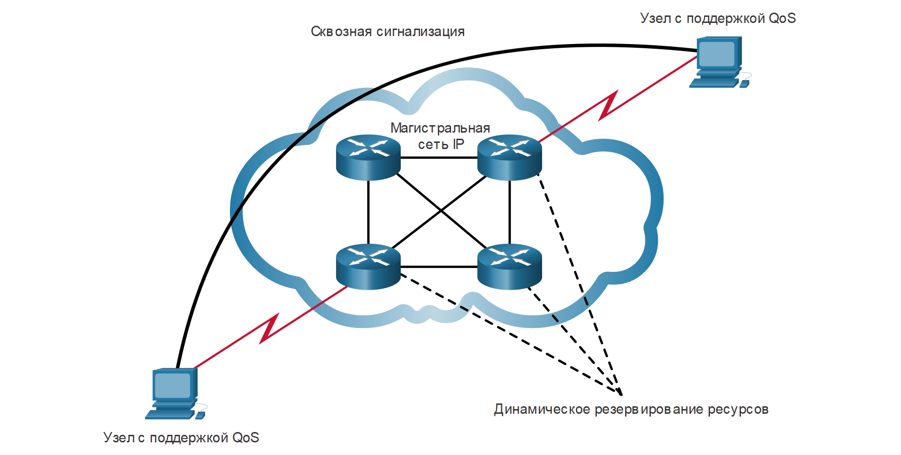
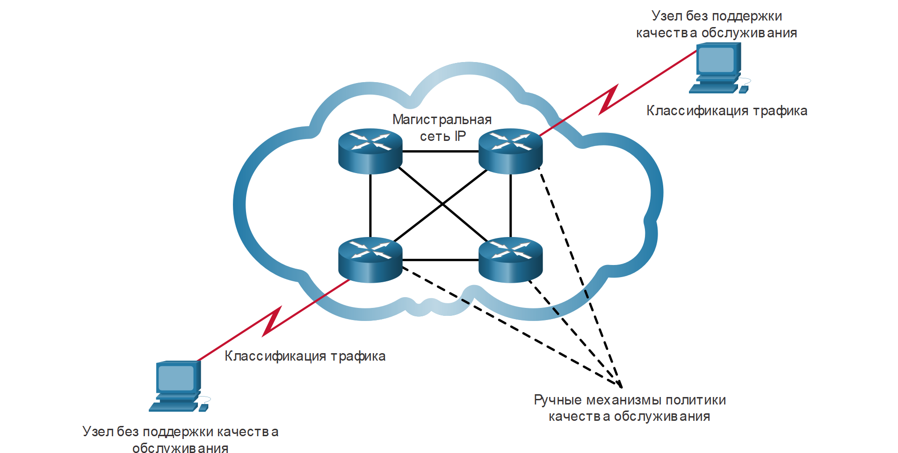

<!-- 9.4.1 -->
## Обучающее видео. Модели QoS

Нажмите кнопку «Воспроизведение», чтобы просмотреть краткое объяснение назначения качества обслуживания.

<!-- 9.4.2 -->
## Выбор подходящей модели политики качества обслуживания

Как можно реализовать политику качества обслуживания в сети? Существует три модели реализации политики качества обслуживания.

* Модель негарантированной доставки
* Интегрированные сервисы (IntServ)
* Дифференцированные услуги (DiffServ)

В таблице  представлены эти модели. На самом деле, качество обслуживания (QoS) в сети реализуется с помощью моделей IntServ или DiffServ. Модель IntServ обеспечивает максимальную гарантированную полосу пропускания, однако очень требовательна к ресурсам и, следовательно, ограничивает масштабируемость. Модель DiffServ, напротив, требует меньше ресурсов и является более масштабируемой. Иногда эти модели реализуются вместе для обеспечения необходимого уровня качества обслуживания.

**Models for Implementing QoS**

| **Модель** | **Описание** |
| --- | --- |
| Модель без гарантированной доставки | <ul><li>По сути, не является реализацией, поскольку явная настройка качества обслуживания отсутствует.</li><li>Используется, когда гарантированная полоса пропускания не требуется.</li></ul> |
| Интегрированные сервисы (IntServ) | <ul><li>Обеспечивает очень высокое качество обслуживания для IP-пакетов с гарантированной доставкой.</li><li>Она определяет процесс сигнализации для приложений, чтобы сигнализировать сети, что они требуют специального QoS в течение определенного периода и что полоса пропускания должна быть зарезервирована.</li><li>Однако модель IntServ может серьезно ограничивать масштабируемость сети.</li></ul> |
| Дифференцированные услуги (DiffServ) | <ul><li>Предоставляет высокую масштабируемость и адаптивность в реализации качества обслуживания.</li><li>Сетевые устройства распознают классы трафика и предоставляют различные уровни качества обслуживания для разных классов трафика.</li></ul> |

<!-- 9.4.3 -->
## Негарантированная доставка

Базовая модель для Интернета обеспечивает негарантированную доставку пакетов. Такой подход по-прежнему преобладает в Интернете и подходит для большинства целей. Модель без гарантированной доставки обращается со всеми сетевыми пакетами одинаковым образом, поэтому экстренное голосовое сообщение обрабатывается так же, как и цифровая фотография во вложении электронного сообщения. Без заданной политики качества обслуживания сеть не видит разницы между пакетами и поэтому не может обрабатывать их в соответствии с разными приоритетами.

Модель без гарантированной доставки аналогична отправке письма по обычной почте. Все письма обрабатываются одинаково. При использовании модели без гарантированной доставки письмо может никогда не дойти до адресата, и если у вас нет отдельного соглашения об уведомлениях с получателем, вы можете не узнать, что письмо не дошло.

В таблице перечислены преимущества и недостатки модели без гарантированной доставки.

**Benefits and Drawbacks of Best-Effort Model**

| **Преимущества**  | **Недостатки** |
| --- | --- |
| Это самая масштабируемая модель. | Нет гарантии доставки. |
| Масштабируемость ограничена только доступной пропускной способностью, при таком ограничении воздействие на весь трафик в равной степени одинаково. | Пакеты прибывают, когда могут, и в любом порядке (если прибывают вообще). |
| Никакие специальные механизмы QoS не требуются. | Приоритетная обработка пакетов не предусмотрена. |
| Это самая простая и быстрая в развертывании модель. | Критически важные данные обрабатываются так же, как и обычные письма. |

<!-- 9.4.4 -->
## Интегрированные сервисы

Потребности приложений реального времени, таких как потоковая видеопередача, мультимедийные конференции, визуализация и виртуальная реальность, явились стимулом к разработке модели архитектуры IntServ, осуществленной в 1994 г. (RFC 1633, 2211 и 2212). Модель IntServ — это модель, обеспечивающая несколько уровней качества обслуживания.

IntServ обеспечивает сквозное качество обслуживания, которое требуется приложениям реального времени. IntServ явно управляет сетевыми ресурсами для обеспечения качества обслуживания отдельных потоков или потоков, иногда называемых микропотоками. В этой модели в качестве базовых компонентов используются механизмы резервирования ресурсов и контроля доступа, которые позволяют определять политику качества обслуживания и обеспечивать ее выполнение. Эта модель аналогична концепции «строгого качества обслуживания» (hard QoS). При строгом качестве обслуживания гарантируются некоторые характеристики трафика, в том числе пропускная способность, задержка и уровень потери пакетов на всем пути трафика. Строгое качество обслуживания задает предсказуемые и гарантированные уровни обслуживания для критически важных приложений.

На рисунке  показан простой пример модели IntServ.

**Простой пример модели интегрированных сервисов**

<!-- /courses/ensa-dl/ae8eb390-34fd-11eb-ba19-f1886492e0e4/aeb5c392-34fd-11eb-ba19-f1886492e0e4/assets/c68ba371-1c46-11ea-af56-e368b99e9723.svg -->

<!--
На рисунке показан простой пример модели IntServ. Два ПК с надписью QoS Aware узел соединены на противоположных сторонах через последовательные соединения с IP-магистралью в cloud.Theres выстраивая линия, идущая от одного ПК к другому с надписью, End-to-End Signal. Облако IP Backbone состоит из четырех маршрутизаторов, которые имеют резернвые каналы  друг до друга. Три из четырех маршрутизаторов помечены как динамическое резервирование ресурсов.
-->

Модель IntServ использует подход, ориентированный на соединения, унаследованный от архитектуры телефонных сетей. Каждое отдельное сообщение должно явно объявлять в сети свой дескриптор трафика и запрошенные ресурсы. Пограничный маршрутизатор осуществляет контроль допуска, чтобы убедиться, что в сети имеются достаточные ресурсы. Стандарт IntServ предполагает, что маршрутизаторы на пути следования трафика устанавливают и сохраняют состояние каждого отдельного сообщения.

В модели IntServ приложение запрашивает конкретный тип обслуживания у сети перед отправкой данных. Приложение сообщает сети свой профиль трафика и запрашивает конкретный тип обслуживания, который может включать требования к пропускной способности и задержкам. Модель IntServ использует протокол RSVP для уведомления устройств на всем пути следования трафика по сети о потребностях приложения в качестве обслуживания. Если сетевые устройства на пути следования трафика способны зарезервировать необходимую пропускную способность, исходное приложение может начать передачу. Если запрошенное резервирование на всем пути недоступно, исходное приложение не отправляет данные.

Граничный маршрутизатор осуществляет контроль доступа на основе информации от приложения и доступных сетевых ресурсов. Сеть гарантирует соответствие требованиям качества обслуживания для приложения, пока его трафик соответствует заявленным характеристикам. Сеть выполняет свои гарантии, отслеживая состояние потоков и осуществляя классификацию пакетов, полисинг и интеллектуальную обработку очередей на основании этого состояния.

В таблице  перечислены преимущества и недостатки модели IntServ.

**Benefits and Drawbacks of IntServ Model**

| **Преимущества** | **Недостатки** |
| --- | --- |
| <ul><li>Явное сквозное управление доступом к ресурсам.</li><li>Контроль доступа для каждого запроса.</li><li>Сигнальная передача динамических номеров портов.</li></ul> | <ul><li>Высокая нагрузка на ресурсы из-за необходимости архитектуры с сохранением состояния, обусловленной непрерывной сигнализацией.</li><li>Подход, ориентированный на потоки, плохо реализуется в масштабных развертываниях, таких как Интернет.</li></ul> |

<!-- 9.4.5 -->
## Дифференцированные услуги

Модель дифференцированных сервисов (DiffServ) определяет простой и масштабируемый механизм для классификации и управления сетевым трафиком и гарантии качества обслуживания в современных IP-сетях. Например, DiffServ может обеспечивать гарантированное обслуживание с низкой задержкой для критически важного сетевого трафика, такого как голосовая связь или видео, и обслуживание без гарантии доставки для трафика других типов, например интернет-трафика или передачи файлов.

Модель DiffServ лишена тех ограничений, которые свойственны модели без гарантированной доставки и IntServ. Описание модели DiffServ приведено в серии документов: RFC 2474, 2597, 2598, 3246 и 4594. Модель DiffServ предоставляет «почти гарантированное» качество обслуживания и при этом является недорогой и масштабируемой.

Модель DiffServ по сути аналогична отправке пакета курьерской службой. При отправке пакета вы запрашиваете (и оплачиваете) обслуживание на определенном уровне. Сеть передачи пакета распознает оплаченный уровень обслуживания, и ваш пакет получает либо привилегированное, либо обычное обслуживание, в зависимости от того, что вам требуется.

Модель DiffServ не является сквозной стратегией качества обслуживания, поскольку не предоставляет сквозных гарантий. Однако DiffServ представляет собой более масштабируемый подход к реализации политики качества обслуживания. В отличие от модели IntServ и строгого качества обслуживания, в которых конечные узлы сигнализируют о своих потребностях в качестве обслуживания по всей сети, в DiffServ сигнализация не используется. Вместо этого в DiffServ реализован подход «мягкого качества обслуживания» (soft QoS). Этот подход заключается в использовании предоставленного качества обслуживания, когда сетевые элементы настроены на обслуживание разных классов трафика с разными требованиям к качеству обслуживания.

На рисунке показан простой пример модели DiffServ.

**Простой пример модели дифференцированных услуг (DiffServ)**

<!-- /courses/ensa-dl/ae8eb390-34fd-11eb-ba19-f1886492e0e4/aeb5c392-34fd-11eb-ba19-f1886492e0e4/assets/c68c3fb0-1c46-11ea-af56-e368b99e9723.svg -->

<!--
На рисунке показана простая иллюстрация модели QoS дифференцированных услуг (DiffServ). Два ПК с надписью QoS Unaware узел соединены на противоположных сторонах через последовательные соединения с IP-магистралью в cloud.Theres выстраивая линия, идущая от одного ПК к другому с надписью, End-to-End Signal. Последовательные соединения помечены, классификация трафика. Облако IP Backbone состоит из четырех маршрутизаторов, которые имеют резернвые каналы  друг до друга. Три из четырех маршрутизаторов обозначены как ручные механизмы политики QoS.
-->

По мере того как узел пересылает трафик на маршрутизатор, маршрутизатор объединяет потоки в классы и применяет соответствующую политику качества обслуживания для классов. В модели DiffServ механизмы качества обслуживания применяются на уровне переходов, когда каждому классу трафика единообразно присваивается глобальное значение, что обеспечивает и гибкость, и масштабируемость. Например, с помощью DiffServ можно сгруппировать все потоки TCP в один класс и выделить пропускную способность для этого класса, а не для отдельных потоков, как происходит в модели IntServ. Помимо классификации трафика, DiffServ сводит к минимуму требования к передаче сигналов и сохранению состояний на каждом сетевом узле.

В частности, DiffServ делит сетевой трафик на классы, основываясь на требованиях бизнеса. После этого каждому классу можно назначить свой уровень обслуживания. При прохождении пакетов по сети каждое сетевое устройство определяет класс пакета и обрабатывает этот пакет в соответствии с требованиями для данного класса. Модель DiffServ предусматривает выбор из нескольких уровней обслуживания. Например, голосовой трафик с IP-телефонов обычно получает более высокий приоритет по сравнению с любым другим трафиком приложений. Почте обычно назначают уровень обслуживания без гарантированной доставки, а нерабочему трафику могут предоставлять очень низкое качество обслуживания или вообще блокировать такой трафик.

На риcунке перечислены преимущества и недостатки модели DiffServ.

**Примечание**: В современных сетях в основном используется модель DiffServ. Однако из-за увеличения объема трафика, чувствительного к задержкам и джиттеру, иногда параллельно внедряются модели IntServ и RSVP.

**Benefits and Drawbacks of DiffServ Model**

| **Преимущества** | **Недостатки** |
| --- | --- |
| <ul><li>Высокий уровень масштабирования.</li><li>Разнообразие уровней качества.</li></ul> | <ul><li>Нет полной гарантии качества предоставления услуг.</li><li>Необходимость слаженной работы комплекса сложных механизмов во всей сети.</li></ul> |

<!-- 9.4.6 -->
<!-- quiz -->

