# learn-ccna3
Корпоративные сети, безопасность и автоматизация сети v7.2 (ENSA)

## Scope and sequence

1.	Принципы OSPFv2 для одной области
2.	Настройка OSPFv2 для одной области
3.	Принципы обеспечения безопасности сети
4.	Принципы создания списков контроля доступа
5.	Списки контроля доступа в конфигурациях IPv4
6.	NAT для IPv4
7.	Принципы работы WAN
8.	Принципы работы VPN и IPsec
9.	Принципы работы QoS
10.	Управление сетями
11.	Проектирование сетей
12.	Поиск и устранение неполадок в сети; отладка сети
13.	Виртуализация сети
14.	Автоматизация сети

Именование лекций (тем внутри каждго модуля) осуществляется согласно [оригинальному scope & sequence](./readme-assets/ensa-v7-scope-and-sequence.pdf)

## Инструкция по переносу материалов с иcпользовнием разметки Markdown

### Структура файлов

Каждый модуль должен лежать в отдельной папке и оформляется как отдельная лекция

Именование папок осуществляется по следующей маске:

```
xx.yy-lowercase-without-spaces
```

Структура файлов для каждой лекции\модуля:
- learn-metadata.json - файл с метаданными
- README.md - файл с лекциями
- assets - папка для хранения файлов, связанных с лекцией

В файле learn-metadata.json указывается название лекции (модуля) и продолжительность

```json
{
    "title": "Основные типы сетей", <-- меняется для каждой лекции\модуля
    "materialType": "lecture",  <-- не меняется
    "description": "", <-- не меняется
    "difficulty": 3, <-- не меняется
    "duration": "PT0H10M", <-- не меняется, считается автоматически
    "tags": ["Network", "Cisco"], <-- не меняется
    "skills": {}, <-- не меняется
    "testProjectPath": "./README.md", <-- не меняется
    "assetsPath": "assets" <-- не меняется
}
```

### Заголовки
- Заголовок модуля помечается как H1 (#) - только для заголовка лекции модуля, не указывается в тексте лекции, указывается только в learn-metadata.json
- Заголовки тем помечаются как H2 (##)
- Все остальные подзаголовки помечаются как H3 (###), если подходят по структуре

Пример: оригинал лекции из Netacad


Файл 12.08-subnet-an-ipv6-network\README.md:

```
<!-- 12.8.1 -->
## Разделение на подсети с использованием идентификатора подсети

Во введении к этому модулю упоминается подсеть сети IPv6. Также сказано, что вы можете обнаружить, что это немного проще, чем подсеть сети IPv4. Вы скоро узнаете!

Напомним, что с IPv4 мы должны заимствовать биты из части хоста для создания подсетей. Это связано с тем, что подсеть была задним числом с IPv4. Однако IPv6 был разработан с учетом подсетей. Для создания подсетей используется отдельное поле ID подсети в GUA IPv6. Как показано на рисунке, поле ID подсети — это область между префиксом глобальной маршрутизации и идентификатором интерфейса.


<!-- /courses/itn-dl/aeed55b2-34fa-11eb-ad9a-f74babed41a6/af2380e0-34fa-11eb-ad9a-f74babed41a6/assets/2e4e42f1-1c25-11ea-81a0-ffc2c49b96bc.svg -->

Преимущество 128-битного адреса заключается в том, что он может поддерживать более чем достаточное количество подсетей и узлов в каждой подсети для каждой сети. Решение проблемы сохранения не является проблемой. Например, если префикс глобальной маршрутизации имеет значение /48 и использует типичные 64 бита для идентификатора интерфейса, это создаст 16-битный идентификатор подсети:
...
```

Файл 12.08-subnet-an-ipv6-network\learn-metadata.json

```
{
    "title": "Разделение на подсети в IPv6",
    "materialType": "lecture",
    "description": "",
    "difficulty": 3,
    "duration": "PT0H4M",
    "tags": [
        "Network",
        "Cisco"
    ],
    "skills": {},
    "testProjectPath": "./README.md",
    "assetsPath": "assets"
}
```

### Нумерация тем

В файлах с лекциями нужно оставлять отбивку по номерам тем в виде комментариев, чтобы было не видно при рендеринге, но чтобы сохранять ориентировку с оригиналом

```
<!-- 1.2.5 -->
## Средства сетевого подключения
Коммуникация передается по среде передачи данных. Среда передачи данных предоставляет собой канал, по которому сообщение передается от источника к адресату.
```

### Рисунки

- По умолчанию все объекты (рисунки, видео, файлы PKA, PDF и прочее) сохраняется в папку assets по маске номера темы, например:
  - 1.4.1.png
  - 1.5.2.mp4
- Если под одним номером темы несколько объектов:
  - 1.4.1-1.png
  - 1.4.1-2.png и тд.
- Большинство схем хранятся в курсах в виде svg файлов. Для скорости нужно разворачивать эти схемы на весь экран и встроенными средствами капчи экрана сохранять в png, при этом сохраняя в комментах ссылку на оригинальный svg файл:
```

<!-- /courses/itn-dl/aeec9260-34fa-11eb-ad9a-f74babed41a6/af1e50c0-34fa-11eb-ad9a-f74babed41a6/assets/2d8cc7b3-1c25-11ea-81a0-ffc2c49b96bc.svg -->
```
- Найти ссылку на оригинальный svg файл можно провалившись в исходный код страницы как показано ниже:


### Скрытый текст

Если при переносе текста выделять его вместе с рисунками, часто захватывается скрытый текст с описанием того, что изображено на схеме, как показано ниже:

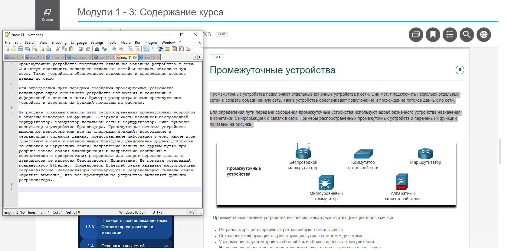

- Если там написано что-нибудь внятное - такой текст лучше оставлять и помещать его под схему.
- Если там совсем очевидное описание, то такой текст лучше сразу удалять - так как подсчет времени прохождения лекции считается по количеству слов в md файале

### Видео

Нужно выкачать утилитой [ffmpeg](https://1drv.ms/u/s!At1RfXB5mNd79FouXrqLgHRRkUgd?e=W0K1lF) используя следующую команды

```
ffmpeg -i https://example.org/master.m3u8 -c copy -bsf:a aac_adtstoasc C:\downloads\output.mp4
```

Найти ссылку на m3u8 файл можно во вкладке Network в режиме разработчика как показано ниже:

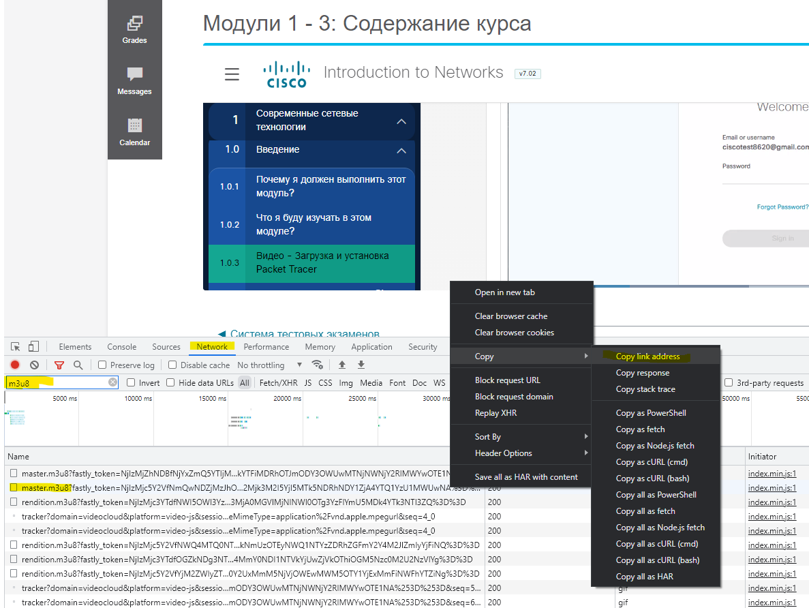

Все видео будут загружены на YouTube, но до этого момента нужно сохранять их в виде следующего тега:

```

```

Где ``1.2.3`` порядковый номер темы. Позже данный номер будет заменет на ID видео на YouTube.

### Файлы PKA и PDF

Аналогино сохраняем в папку assets, вставляем ссылки как в примере ниже

```
[Открыть описание в PDF](./assets/1.0.5-packet-tracer---logical-and-physical-mode-exploration_ru-RU.pdf)

[Скачать файл для Packet Tracer](./assets/1.0.5-packet-tracer---logical-and-physical-mode-exploration_ru-RU.pka)
```

### Анимации

Делаем из анимации gif-файл при помощи [Recordit](https://recordit.co/)
 
1. Выделяем область захвата, нажимаем Record, запускаем анимацию.
 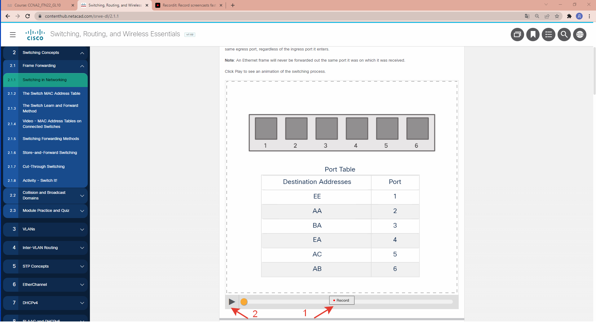
 
2. Ждем окончания анимации, нажимаем Stop.
  
  
3. Переходим на сайт.
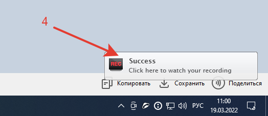

4. Жмем на Play и затем на кнопку GIF.
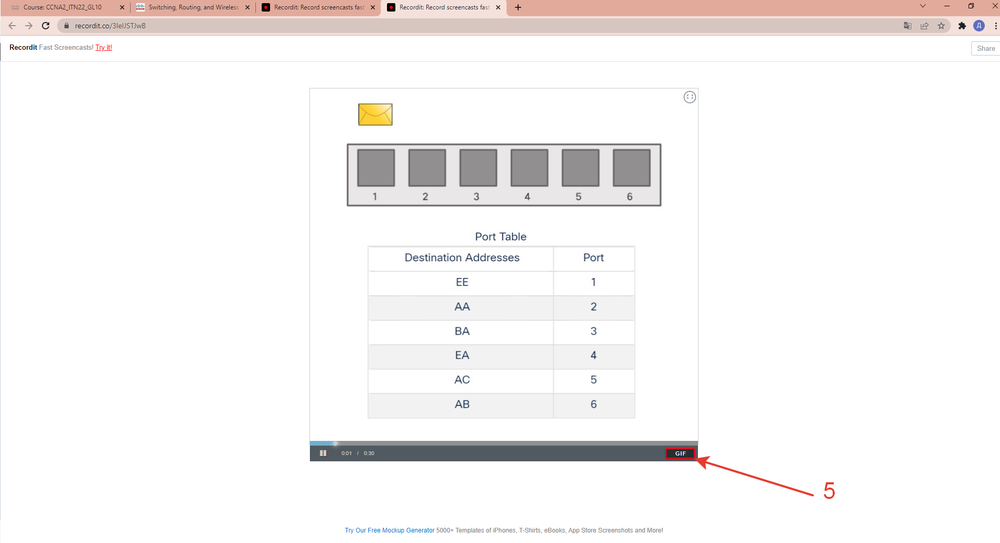

5. Сохраняем gif файл.
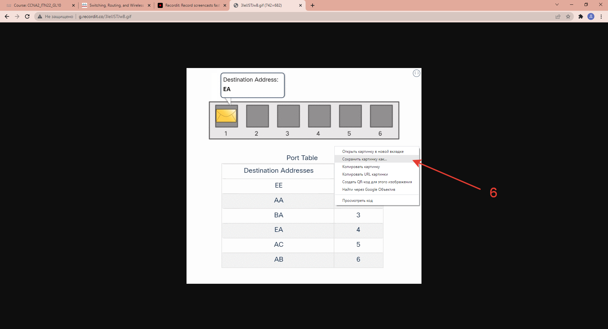

## Перенос описания лабораторных работ в Markdown

### Big picture

В курсах CCNA1-3 встречаются лабораторные работы для Packet Tracer и для работы на физичском оборудовании. На текущей стадии все лабораторные для физического оборудования удалены из курса, т.к. практически все они дублируются сценариями в Packet Tracer.

В текущем формате лабораторные работы встречаются в основном в конце текста лекций по ходу модуля или перед кратким изложением (summary) в конце модуля.

Необходимо отделить каждую лабораторную работу от лекции и оформить как отдельный материал типа *lab* встроив этот материал в сквозную нумерацию модуля. 

При прохождении каждой лабораторной работы будет опция развернуть Packet Tracer в облаке (и последующей выгрузки результатов в систему оценки Learn) или скачать PKA файл для локального запуска.

### Что переносить

На примере лекции из [CCNA1](https://github.com/nsalab-tmn/learn-ccna1/blob/main/README.md#%D0%BF%D1%80%D0%B8%D0%BC%D0%B5%D1%80%D1%8B) - ``02.07-configure-ip-addressing/README.md``

Для каждой лабораторной работы в Packet Tracer есть дублирующий файл с описанием в PDF. Для каждого PDF файла есть оригинальный файл ``docx``, все файлы лежат в папке ``packet-tracer-source-files``.

```
<!-- 2.7.6 -->
## Работа в симуляторе: настройка базовых подключений

В этом упражнении вы сначала настроите основные параметры коммутатора. Затем вы создадите основные подключения, настроив IP-адреса на коммутаторах и ПК. Завершив настройку IP-адресации, вы будете использовать различные команды **show**, чтобы проверить настройки, а также команду **ping** для проверки основных подключений между устройствами.

[Настройка базовых подключений (pdf)](./assets/2.7.6-packet-tracer---implement-basic-connectivity.pdf)

[Настройка базовых подключений (pka)](./assets/2.7.6-packet-tracer---implement-basic-connectivity.pka)
```

Создаем отдельную директорию для лабораторной работы со следующей структурой:

```bash
02.07.06-lab-implement-basic-connectivity/ <--- [номер раздела в оригинальной лекции] + lab + [название лабораторной работы]
├── README.md <--- сюда пойдет описание лабораторной работы из PDF/PKA/DOCX
├── assets    <--- папка для asset'ов
│   ├── 2.7.6-packet-tracer---implement-basic-connectivity.pka <--- сюда копируем PKA файл из оригинальной лекции
│   └── topology.png <--- рисунок с топологией из Packet Tracer
└── learn-metadata.json <--- файл метаданных
```

Структура файла ``learn-metadata.json``

```json
{
    "title": "Работа в симуляторе: создание основных подключений", <--- заголовок лабораторной работы из оригинальной лекции
	"shortName": "lab-2.7.6",           <--- меняется на имя по маске
    "materialType": "lab",              <--- не меняется
    "description": "В этом упражнении вы сначала настроите основные параметры коммутатора. Затем вы создадите основные подключения, настроив IP-адреса на коммутаторах и ПК. Завершив настройку IP-адресации, вы будете использовать различные команды **show**, чтобы проверить настройки, а также команду **ping** для проверки основных подключений между устройствами.",  <--- сюда вставляем описание лабораторной работы из лекции
    "difficulty": 1,                    <--- не меняется
    "duration": "PT0H22M",              <--- не меняется, расчитывается автоматически
    "tags": [                           <--- не меняется
        "Cisco",
        "Packet Tracer"
    ],
    "credentialsSchema": {              <--- не меняется
        "userName": {
            "title": "Имя пользователя",
            "source": "learn_user"
        },
        "password": {
            "title": "Пароль",
            "source": "learn_password"
        },
        "consoleURL": {
            "title": "Адрес портала",
            "value": "https://portal.skillscloud.company"
        }
    },
    "skills": {},                        <--- не меняется
    "testProjectPath": "./README.md",    <--- не меняется, имя файла с описанием лабораторной работы
	"deploymentPath": "deploy",          <--- не меняется, имя директории для манифестов terraform (да, но потом)
    "assetsPath": "assets"               <--- не меняется, имя директории для хранения asset'ов

}
```
### Как переносить

На текущий момент не найдено как быстро и чисто можно конвертировать DOCX в MD с сохранением форматирования. Более менее приличную конверсию из DOCX в MD можно получить [здесь](https://products.aspose.app/words/conversion/docx-to-md). При этом придется вычищать колонтитулы и руками возвращать стили.

Поэтому проще всего переносить оригинальный текст из описания в Packet Tracer с использованием Microsoft Word и плагином [Writage](https://www.writage.com/Writage-2.9.msi) - устанавливается как расширение Word и позволяет работать со стилями MD.

Ставим Packet Tracer:

* [для Microsoft Windows](https://onedrive.live.com/download?cid=7BD79879707D51DD&resid=7bd79879707d51dd%2125487&authkey=AM3dyIxrY7pRXX8)
 * [для MacOS](https://onedrive.live.com/download?cid=7BD79879707D51DD&resid=7bd79879707d51dd%2125232&authkey=ACKt_L68GAbq2To)
 * [для Ubuntu\Debian](https://onedrive.live.com/download?cid=7BD79879707D51DD&resid=7bd79879707d51dd%2125233&authkey=ANGAvnMRTs6PL5M)

Скачиваем PKA-файл из оригинальной лекции, к примеру ``02.07-configure-ip-addressin/assets/2.7.6-packet-tracer---implement-basic-connectivity.pka``, открываем его в Packet Tracer.

При первом входе Packet Trcer просит войти в свою учетную запись на Netacad или SkillsForAll. Делаем следующим образом: 

* Выбираем "запомнить меня на 3 месяца"
* Выбираем SkillsForAll, откроется страница входа в браузере
* Выбираем вход с помощью учетной записи Google
* Входим под своей гугловой учеткой
* PROFIT

После того как лабораторная работа открылась в Packet Tracer, увеличиваем масштаб, скриншотим топологию и сохраняем её в assets/topology.png. Желательно, чтобы были видны все обозначения и aspect ration был как можно ближе к 16:9 (горизонтальным). 

Например, при открытии файла топология была такой:

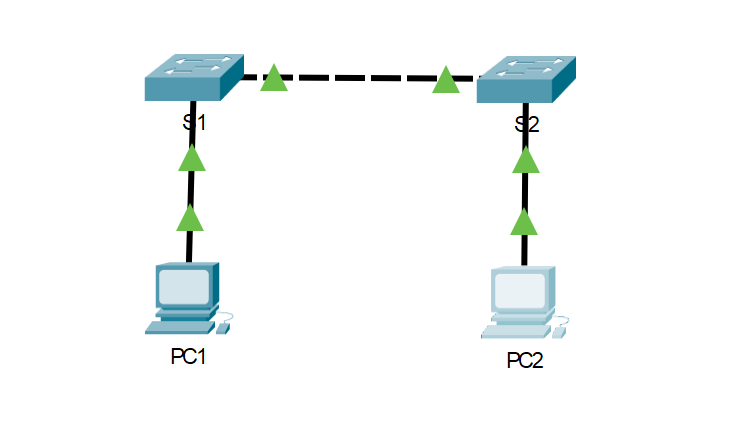

Делаем так, чтобы она смотрелась лучше:


Открываем оригинальный ``docx`` файл, например ``./packet-tracer-source-files/2.7.6 Packet Tracer - Implement Basic Connectivity.docx``. Переходим во вкладку Writage. Здесь остается только убрать логотип и колонтитулы, и прощелкать MD стили.

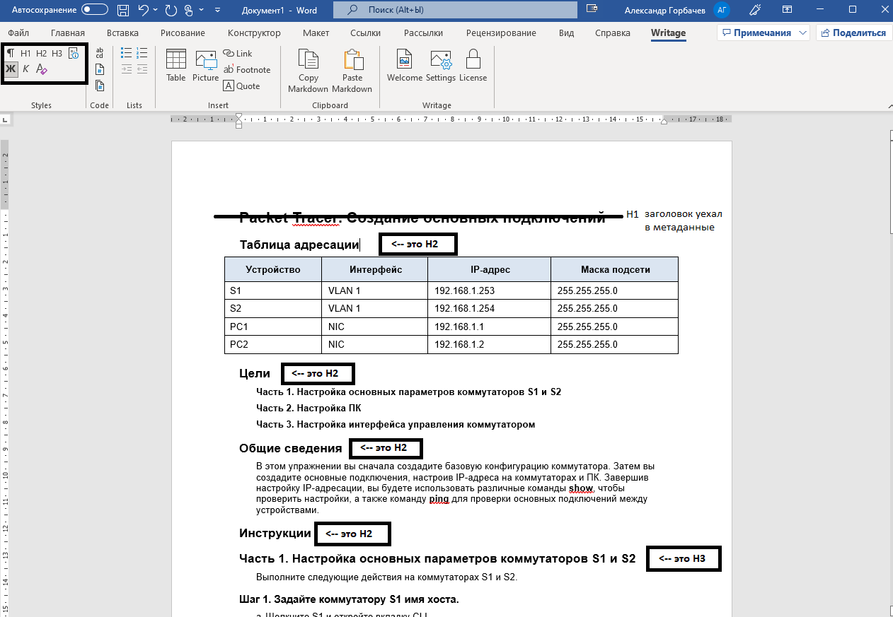

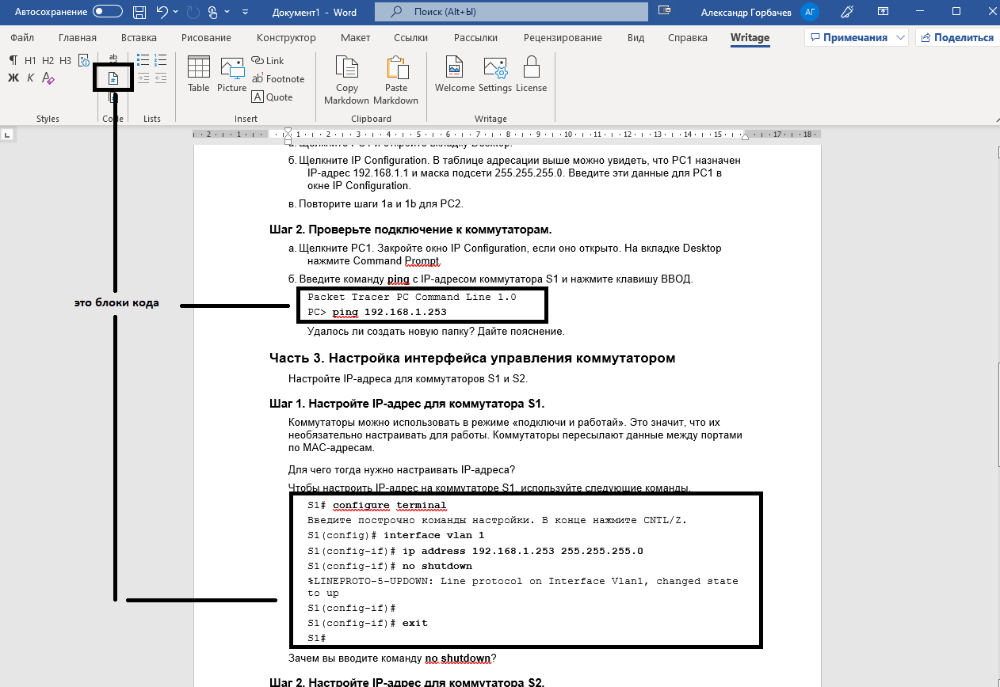

В начале файла вставляем H2 заголовок Топология и ссылку на файл с топологией.

```
## Топология


```

В конце файла вставляем ссылку на оригинальный файл Packet Tracer.

```
[Скачать файл Packet Tracer для локального запуска](./assets/2.7.6-packet-tracer---implement-basic-connectivity.pka)
```

Сохраняем размеченный файл в ``./README.md``.

## Квизы и контрольные работы

В каждом модуле есть 2 типа материалов для проверки знаний - квизы на понимание конкретной темы и контрольные работы в конце каждого модуля.

### Структура

На примере квиза [1.2.6 в CCNA1](https://github.com/nsalab-tmn/learn-ccna1/blob/main/01.02.06-network-components-quiz/learn-metadata.json).

Создаем отдельную директорию для квиза или контрольной работы со следующей структурой:

```bash
01.02.06-network-components-quiz/ <--- [номер раздела в оригинальной лекции] + [название лекции] + quiz
├── assets    <--- папка для asset'ов
│   └── пикчи.жпг <--- картинки, если присутствуют
└── learn-metadata.json <--- файл метаданных
```

В каждом квизе нужно нажать **Показать**, затем нажать **Проверка** и далее составить файл ``learn-metadata.json`` на основе данных, как показано на примере:

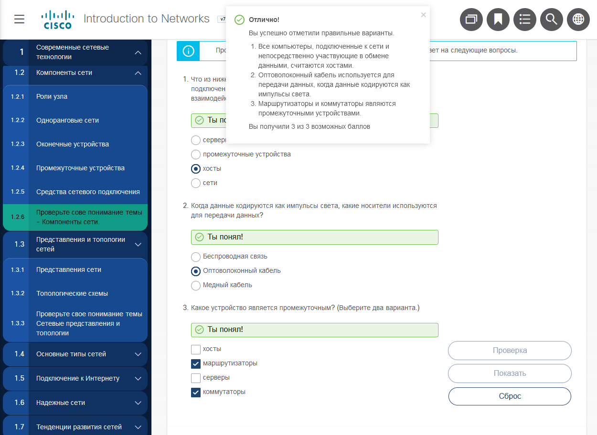

```json
{
    "title": "Тест на понимание темы: компоненты сети", <--- сюда ставим заголовок квиза
    "materialType": "test", <--- тип материала, не меняется
    "description": "Нажмите ``Начать прохождение`` для отображения вопросов и выберите самый подходящий ответ", <--- не меняется
    "difficulty": 1, <--- не меняется
    "duration": "PT0H30M", <--- не меняется, будет считаться автоматически
    "tags": ["Cisco", "Network"], <--- не меняется
    "skills": {}, <--- не меняется
    "passingScore": 100, <--- не меняется
    "assetsPath": "assets", <--- не меняется
    "questions": [ <--- сюда переносим вопросы и ответы
        {
            "question": "Что из нижеследующего является именем для всех компьютеров, подключенных к сети, которые непосредственно участвуют в сетевом взаимодействии?",
            "answerType": "singleChoice", <--- вопрос с одним вариантом ответа
            "answers": [
                {
                    "answer": "Серверы",    <--- ответ
                    "correct": false,       <--- не правильный
                    "comment": "Все компьютеры, подключенные к сети и непосредственно участвующие в обмене данными, считаются хостами" <--- сюда вставляем комментарий из плашки, которая вылезает после проверки
                },
                {
                    "answer": "Промежуточные устройства", <--- ответ
                    "correct": false,                     <--- не правильный
                    "comment": "Все компьютеры, подключенные к сети и непосредственно участвующие в обмене данными, считаются хостами" <--- сюда вставляем комментарий из плашки, которая вылезает после проверки
                },
                {
                    "answer": "Хосты",      <--- ответ
                    "correct": true         <--- правильный    
                                            <--- к правильному ответу комментарий не вставляем
                },
				{
                    "answer": "Сети",   <--- ответ
                    "correct": false,   <--- не правильный
                    "comment": "Все компьютеры, подключенные к сети и непосредственно участвующие в обмене данными, считаются хостами" <--- сюда вставляем комментарий из плашки, которая вылезает после проверки
                }
            ]
        },
        {
            "question": "Когда данные кодируются как импульсы света, какие носители используются для передачи данных?",
            "answerType": "singleChoice",
            "answers": [
                {
                    "answer": "Беспроводная связь",
                    "correct": false,
                    "comment": "Оптоволоконный кабель используется для передачи данных, когда данные кодируются как импульсы света"
                },
                {
                    "answer": "Оптоволоконный кабель",
                    "correct": true					
                },
				{
                    "answer": "Медный кабель",
                    "correct": false,
                    "comment": "Оптоволоконный кабель используется для передачи данных, когда данные кодируются как импульсы света"
                }
            ]
        },
        {
            "question": "Какое устройство является промежуточным? (Выберите два варианта)",
            "answerType": "multiChoice", <--- вопрос с несколькими вариантами ответов
            "answers": [
                {
                    "answer": "Хосты",
                    "correct": false,
                    "comment": "Маршрутизаторы и коммутаторы являются промежуточными устройствами" <--- сюда вставляем комментарий из плашки, которая вылезает после проверки
                },
                {
                    "answer": "Маршрутизаторы",
                    "correct": true                    
                },
				{
                    "answer": "Серверы",
                    "correct": false,
                    "comment": "Маршрутизаторы и коммутаторы являются промежуточными устройствами"<--- сюда вставляем комментарий из плашки, которая вылезает после проверки
                },
                {
                    "answer": "Коммутаторы",
                    "correct": true                    
                }
            ]
        }
    ]
}
```

Аналогичная структура применяется и для контрольных работ. Плашки с комментариями появляются для каждого вопроса и переносятся как ``comment`` для неправильных ответов:

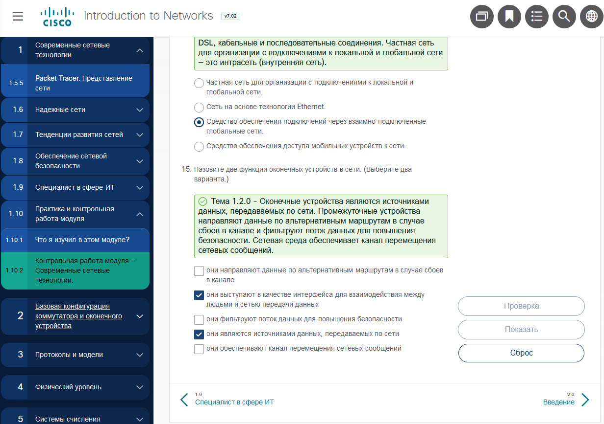